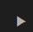

# Bug 017 — Play / pause icon button glyph not centered

**Status**: Fixed

## Description

The play / pause `cui-icon-button` in the review scrubber renders its 20×20
`mat-icon` glyph noticeably below and slightly to the right of the centre of
the 36×36 round button. The button looks like an empty circle with a small
"play_arrow" sticking out toward the bottom-right.

This shows up everywhere `cui-icon-button` is used (the bug is in the shared
component), but it is most visible on the review-scrubber controls (Previous /
Play / Next).

## Reproduction

1. Open the dashboard.
2. Switch the mode toggle from **Live** to **Review** to reveal the
   `review-scrubber` strip below the dashboard heading.
3. Look at the **Play auto-scrub** button between the chevrons.
4. Observe the `play_arrow` glyph is not centred in its circular button — it
   sits low and slightly right of the visual centre.

## Measured offset

Computed in DevTools with `getBoundingClientRect()`:

| element                | width | height | centre x | centre y |
|------------------------|------:|-------:|---------:|---------:|
| `<button mat-icon-button>` (.icon-button) | 36 | 36 | 422.5 | 174 |
| `<mat-icon class="icon-button__glyph">`   | 20 | 20 | 426.5 | 180 |

Offset of glyph centre from button centre: **dx = +4px, dy = +6px**.

## Visual evidence



## Root cause

`frontend/projects/commitments-ui/src/lib/icon-button/icon-button.component.scss`
shrinks `.icon-button` (a `mat-icon-button`) from Material's default 40×40 to
36×36, and forces the inner glyph to 20×20:

```scss
.icon-button {
  width: 36px;
  height: 36px;
  /* … */
}

.icon-button__glyph {
  font-size: 20px;
  width: 20px;
  height: 20px;
}
```

But Material's `mat-icon-button` keeps its default `padding: 12px` on the
underlying `<button>`, so the content box becomes 12×12 — far smaller than the
20×20 glyph it must contain. Combined with `mat-icon`'s default
`display: inline-block; vertical-align: baseline`, the glyph is positioned by
the text baseline of a 1-line line-box and ends up roughly 6px below and 4px
right of the geometric centre.

This is the same family of issue as bug-016 (Material wraps the projected
content in its own internal layout that does not honour our outer dimensions).

## Affected files

- `frontend/projects/commitments-ui/src/lib/icon-button/icon-button.component.scss`
  — neutralise Material's 12px default padding on the host button and centre
  the projected glyph (display: flex on the button, or
  `padding: 0` + `line-height: 0` on the host plus
  `display: block; margin: auto` on `.icon-button__glyph`).

## Suggested fix

In `icon-button.component.scss`:

```scss
.icon-button.mat-mdc-icon-button {
  width: 36px;
  height: 36px;
  padding: 0;          // override Material's 12px default
  line-height: 1;
}

.icon-button.mat-mdc-icon-button ::ng-deep .mat-mdc-button-touch-target {
  width: 36px;
  height: 36px;
}

.icon-button__glyph {
  display: flex;
  align-items: center;
  justify-content: center;
  font-size: 20px;
  width: 20px;
  height: 20px;
  line-height: 1;
  margin: auto;        // centre in flex/grid parent if any
}
```

Plus, on the host button itself, ensure flex centering:

```scss
.icon-button.mat-mdc-icon-button {
  display: inline-flex;
  align-items: center;
  justify-content: center;
}
```

After the fix, the bounding-box centre of `.icon-button__glyph` should match
the bounding-box centre of `.icon-button` within ±0.5px in both axes.

## Verification

- Visual check in the browser at the dashboard route, in **Review** mode, on
  the Previous / Play / Next scrubber controls.
- Add a unit/component spec under
  `frontend/projects/commitments-ui/src/lib/icon-button/` (alongside
  `icon-button.component.spec.ts`) asserting the glyph rect centre matches
  the host button rect centre within ±0.5px.
- The play / pause and chevron icons in the scrubber should look optically
  centred inside their circles, matching `ui-design.pen` →
  primary header → review scrubber controls.
