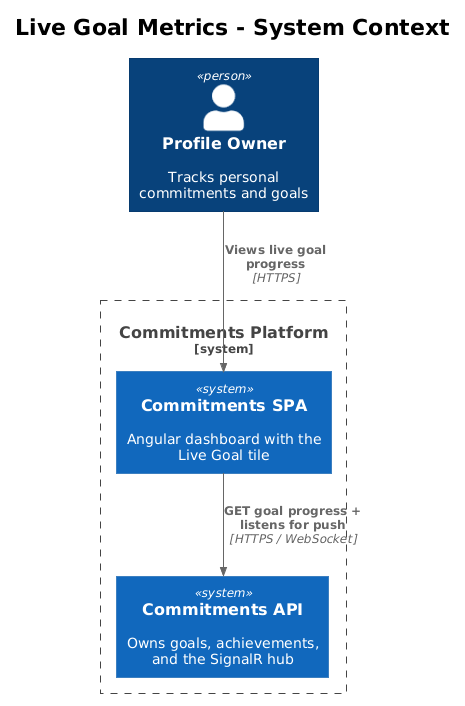
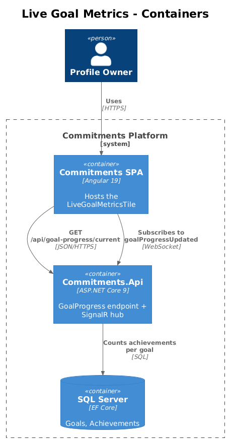
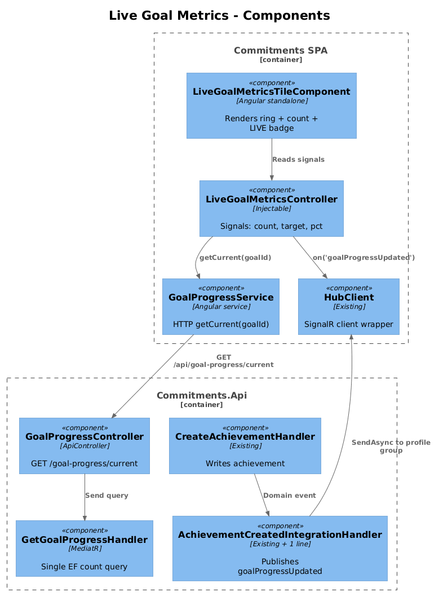
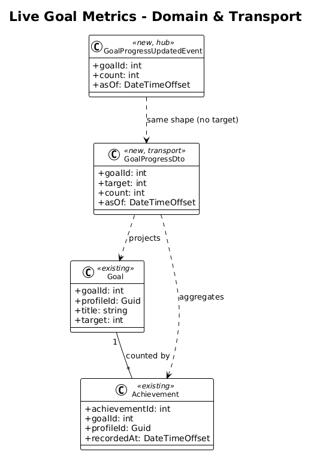
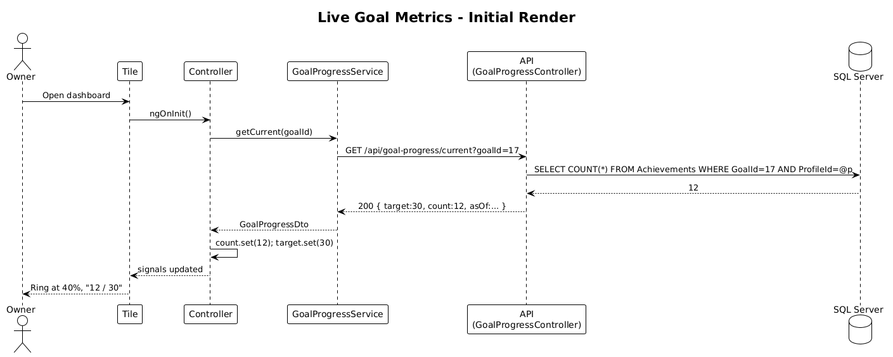
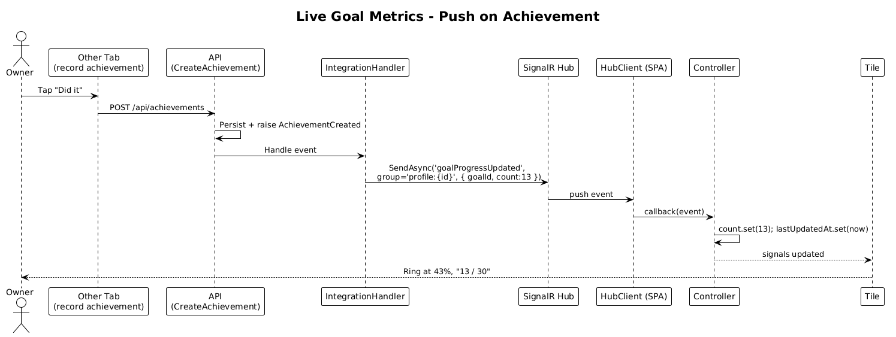

# Live Goal Metrics Tile — Detailed Design

## 1. Overview

This feature shows a single dashboard tile that tracks **real-time progress against one goal**. As the user (or anyone on the same profile) records achievements toward that goal, the tile updates immediately — no refresh, no polling visible to the user.

It is the *Live* half of a Live/Review pair. Feature 02 (Review Goal History) is the matching scrub view.

**Actors**

- **Profile owner** — the signed-in user who set the goal and is tracking achievements against it.

**Scope boundary**

- Displays *one* goal at a time, chosen by `goalId` from tile config. Multi-goal aggregation is out of scope.
- Push transport is SignalR over the existing `HubClient` already in `frontend/projects/commitments-app/src/app/core/hub-client.ts`.
- Backend endpoint lives in `Commitments.Api` (the service that owns goals + achievements).

**Radically simple**: one read endpoint, one push event, one Angular component, one controller. No new database tables, no new aggregation service.

## 2. Architecture

### 2.1 C4 Context



The Live tile is consumed by the Profile Owner inside the Commitments SPA. It reads from the Commitments API and listens for push notifications on the SignalR hub the API already exposes.

### 2.2 C4 Container



Three containers participate: the Angular SPA (the tile lives here), `Commitments.Api` (the read endpoint + the hub), and SQL Server (existing `Achievements` and `Goals` tables).

### 2.3 C4 Component



Within the SPA: `LiveGoalMetricsTileComponent` ⟶ `LiveGoalMetricsController` ⟶ `GoalProgressService` (HTTP) and `HubClient` (push).
Within the API: `GoalProgressController` ⟶ `GetGoalProgressHandler` ⟶ EF Core / `CommitmentsDbContext`. `AchievementCreatedHandler` (existing) gains one extra side-effect: publish `goalProgressUpdated` on the hub.

## 3. Component Details

### 3.1 LiveGoalMetricsTileComponent (Angular, standalone)

- **Path**: `frontend/projects/commitments-app/src/app/components/live-goal-metrics-tile/live-goal-metrics-tile.component.ts`
- **Responsibility**: Render the tile chrome (title, target, current count, progress ring, LIVE badge). No business logic.
- **Inputs**: `goalId: number` (from tile config).
- **Template-only signals**: `count()`, `target()`, `pct()`, `lastUpdatedAt()` — all delegated to the controller.
- **Why a controller?** A component/controller split keeps the component untestable-but-trivial and lets the controller carry the tested logic.

### 3.2 LiveGoalMetricsController (Angular, `@Injectable`)

- **Path**: same folder as the component.
- **Responsibility**: Hold tile state as Angular signals; subscribe to hub events; call `GoalProgressService.getCurrent(goalId)` once on init.
- **Public signals**: `count: Signal<number>`, `target: Signal<number>`, `pct: Signal<number>` (computed: `count / target * 100`, clamped to 0–100), `lastUpdatedAt: Signal<Date | null>`.
- **Lifecycle**: Subscribes to `hubClient.on<GoalProgressUpdated>('goalProgressUpdated')` filtered by `goalId`. Each event mutates `count` and `lastUpdatedAt`.
- **No mode switching here** — Live and Review are *separate tiles* in this design. Each tile stays small and demonstrable on its own.

### 3.3 GoalProgressService (Angular)

- **Path**: `frontend/projects/commitments-app/src/app/services/goal-progress.service.ts`
- **Responsibility**: Single HTTP method `getCurrent(goalId): Observable<GoalProgress>`. Uses the existing typed-client conventions in the `services/` folder.

### 3.4 GoalProgressController (ASP.NET Core)

- **Path**: `src/Commitments.Api/Features/GoalProgress/GoalProgressController.cs`
- **Endpoint**: `GET /api/goal-progress/current?goalId={id}` ⟶ `200 GoalProgressDto { goalId, target, count, asOf }`.
- **Auth**: existing JWT + `ProfileId` header (see `HttpContextAccessorExtensions.GetProfileId()` in Shared).

### 3.5 GetGoalProgressHandler (MediatR)

- **Path**: `src/Commitments.Api/Features/GoalProgress/GetGoalProgress.cs`
- **Responsibility**: Project `Achievements.Count(a => a.GoalId == goalId && a.ProfileId == currentProfile)` against `Goals.Target`. Single EF query, returned as DTO.

### 3.6 Hub side-effect (existing handler, one-line addition)

The existing `CreateAchievementHandler` already publishes a domain event when an achievement is recorded. Add one line to the existing `AchievementCreatedIntegrationHandler` (or equivalent) so it also calls `hub.Clients.Group($"profile:{profileId}").SendAsync("goalProgressUpdated", new { goalId, count, asOf })`.

If no integration handler exists for achievement created, add a thin one — but the feature's *vertical slice* still fits a single PR.

## 4. Data Model

### 4.1 Class Diagram



### 4.2 Entity Descriptions

- **Goal** (existing) — gains no new fields. `Target` is read.
- **Achievement** (existing) — read-only for this feature.
- **GoalProgressDto** (new, transport only) — `{ goalId: int, target: int, count: int, asOf: DateTimeOffset }`.
- **GoalProgressUpdatedEvent** (new, hub message) — same shape as the DTO.

No migrations.

## 5. Key Workflows

### 5.1 Initial render



1. Tile mounts, controller calls `goalProgressService.getCurrent(goalId)`.
2. API runs the count query, returns `{ count, target, asOf }`.
3. Controller sets signals; component renders ring + numbers.

### 5.2 Live update on new achievement



1. User (in another tab, or anywhere) records an achievement.
2. `CreateAchievementHandler` persists, then the integration handler publishes `goalProgressUpdated` to the profile group.
3. Tile's controller receives the event, updates `count` and `lastUpdatedAt`.
4. Component re-renders the ring; LIVE badge pulses (CSS animation).

## 6. API Contracts

```
GET /api/goal-progress/current?goalId={int}
Headers: Authorization: Bearer …, ProfileId: {guid}
200 OK
{
  "goalId": 17,
  "target": 30,
  "count": 12,
  "asOf": "2026-04-26T18:42:11Z"
}
404 — goal not found / not owned by profile
```

Hub event:

```
event: "goalProgressUpdated"
payload: { goalId: 17, count: 13, asOf: "2026-04-26T18:43:02Z" }
```

## 7. Security Considerations

- The endpoint MUST validate that `goalId` belongs to the `ProfileId` from the header. Use the existing `BaseDbContext` global query filter for `ProfileId` to inherit this for free.
- Hub messages are sent to the per-profile group (`profile:{profileId}`), not broadcast — same pattern already used elsewhere in `HubClient`.
- No PII in the payload beyond what the user already owns.

## 8. Vertical Slice Definition (for the implementing PR)

A single PR delivers:

1. `GoalProgressController` + `GetGoalProgress` handler + DTO.
2. Hub publish call inside the existing achievement-created flow.
3. `GoalProgressService` (Angular).
4. `LiveGoalMetricsController` + `LiveGoalMetricsTileComponent` + SCSS.
5. Tile registration in the dashboard tile catalog.
6. One Jest spec for the controller (signals + hub subscription).
7. One xUnit test for the handler.

**Screenshot proof of done**: open the app, drop the tile on a dashboard, record an achievement in a second browser tab, watch the count increment without refresh.

## 9. Open Questions

- **Hub group naming** — confirm the existing convention is `profile:{guid}` vs `profile-{guid}`. Code search before implementing.
- **Multiple achievements per second** — debounce the controller's signal writes? Probably unnecessary for v1; revisit only if profiling shows churn.
- **Goal with `target = 0`** — current proposal renders "no target set" instead of dividing by zero; confirm this matches product intent.
