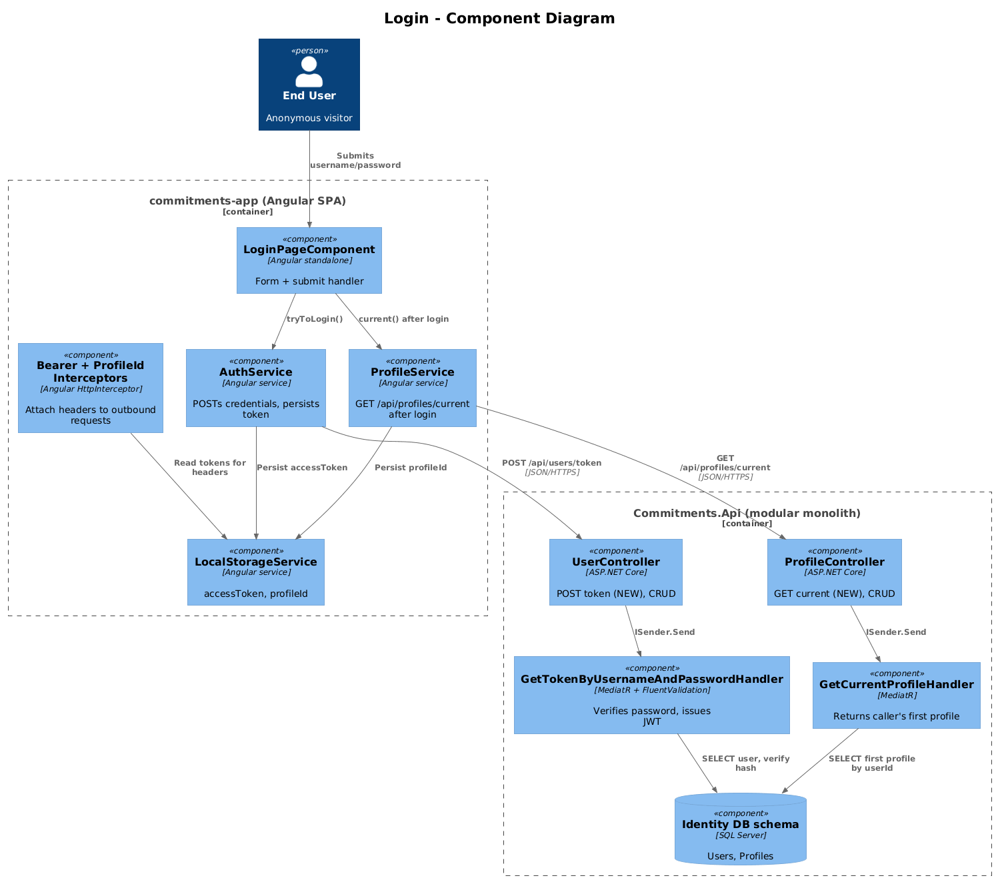
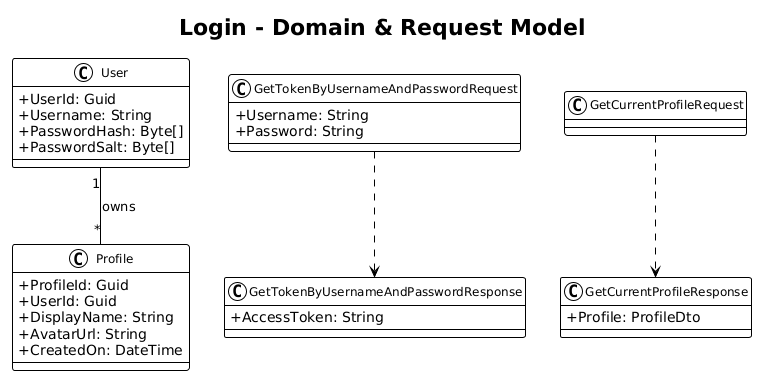
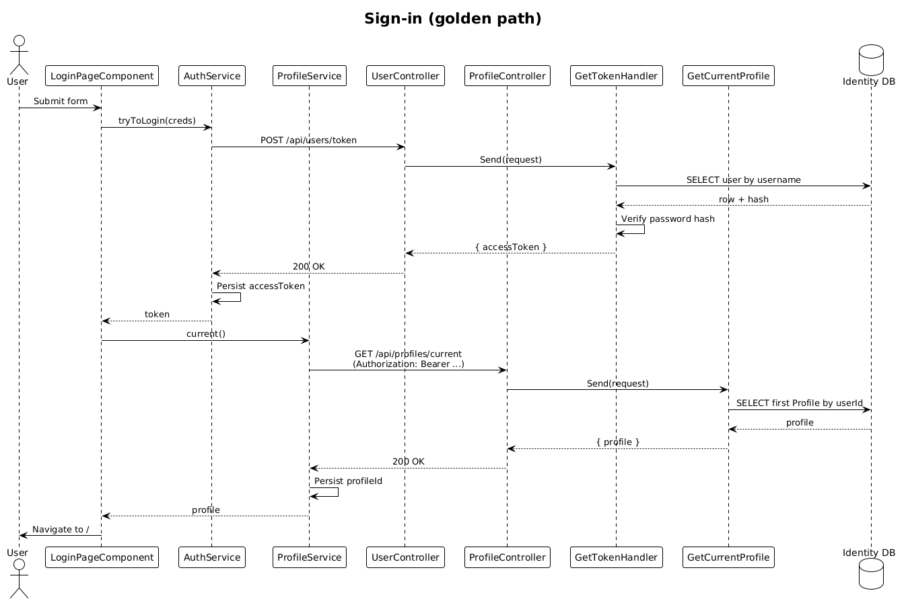

# Login — Detailed Design

**Status:** Accepted

**Traces to:** L1-001, L1-002, L1-013, L1-022 · L2-001, L2-002, L2-003, L2-038, L2-063

## 1. Overview

The Login page (`pages/login`, route `/login`) is the only anonymous route. It collects username + password, posts to the auth endpoint, persists an access token and the user's current profile id, and redirects to the dashboard or the captured pre-login destination.

**Actors:** unauthenticated end user, the seeded development user (`quinntynebrown@gmail.com` / `password`, L2-063).

**Scope boundary:** this slice ends the moment the dashboard route is reachable with both `Authorization: Bearer …` and `ProfileId: <guid>` headers in flight. Profile-management UI is covered by design `02-profiles`.

## 2. Architecture

### 2.1 C4 Component

The page lives in `commitments-app`; the new endpoint is added inside the existing `Identity` module of `Commitments.Api`. No new module or container is introduced.

## 3. Component Details

### 3.1 LoginPageComponent (frontend, exists)
- Already present at `frontend/.../pages/login/login-page/login-page.component.ts` with reactive form for `username` / `password`.
- Calls `AuthService.tryToLogin({ username, password })` and routes to `/` on success.
- **Delta:** wire snackbar for `Login Failed` on 401 (L2-001 AC #3); subscribe to `ProfileService.current()` after login and store `profileId` under `currentProfileIdKey` (L2-003 AC #1).

### 3.2 AuthService (frontend, exists)
- POSTs to `${baseUrl}api/users/token` (note: relies on `AssumeDefaultVersionWhenUnspecified = true`, see L2-052).
- **Delta:** none.

### 3.3 GetTokenByUsernameAndPassword (backend, **new**)
- New vertical slice in `Identity.Features.User`:
  - `GetTokenByUsernameAndPasswordRequest { string Username; string Password; } : IRequest<GetTokenByUsernameAndPasswordResponse>`
  - `GetTokenByUsernameAndPasswordResponse { string AccessToken; }`
  - Validator: `.NotEmpty()` on both fields.
  - Handler: `IdentityDbContext.Users` lookup by username, verifies `PasswordHash` via the same hashing path as `CreateUser`, signs a JWT (HS256) with claims `sub = userId`, `username`, expiry 8 h.
- **Controller:** add `[HttpPost("token")] [AllowAnonymous]` to `UserController`. Route is `POST /api/v1.0/users/token`.
- **Auth middleware:** `Commitments.Api/Program.cs` adds `AddAuthentication(JwtBearer)` reading the same `Jwt:Issuer/Audience/Key` config block; middleware order is `UseAuthentication → UseAuthorization`.

### 3.4 GetCurrentProfile (backend, **new** — minimal)
- New query `Identity.Features.Profile.GetCurrentProfile`:
  - Reads `userId` from `User` claim (`HttpContextAccessorExtensions.GetUserId()` — *new* helper that mirrors `GetProfileId()` but reads from `ClaimsPrincipal.FindFirst("sub")`).
  - Returns the user's first non-deleted profile (deterministic order by `CreatedOn`).
- **Controller:** `[HttpGet("current")]` on `ProfileController`. Route is `GET /api/v1.0/profile/current`.

## 4. Data Model

### 4.1 Class Diagram

### 4.2 Entities
- `User` — already present in `Identity.Domain`. Fields used: `UserId`, `Username`, `PasswordHash`, `PasswordSalt`.
- `Profile` — already present. Fields used: `ProfileId`, `UserId`, `IsDeleted`.

No schema migrations.

## 5. Key Workflows

### 5.1 Successful sign-in (golden path)

1. User enters credentials and submits.
2. `AuthService.tryToLogin` → `POST /api/users/token`.
3. `GetTokenByUsernameAndPasswordHandler` validates the password hash and issues a JWT.
4. Frontend persists `accessToken`; `BearerAuthInterceptor` (existing) attaches it to all subsequent requests.
5. `LoginPageComponent` calls `ProfileService.current()` → `GET /api/profiles/current` → handler returns the user's first profile.
6. Frontend persists `profileId` under `currentProfileIdKey`; `ProfileIdInterceptor` (existing) attaches `ProfileId` header.
7. Router navigates to the captured pre-login URL or `/`.

### 5.2 401 path (AC #3)
- API returns 401 → snackbar `Login Failed` → form remains editable, no redirect.

## 6. API Contracts

| Method | Route | Body | Response | Auth |
|--------|-------|------|----------|------|
| POST | `/api/v1.0/users/token` | `{ username, password }` | `200 { accessToken }` / `401` | Anonymous |
| GET | `/api/v1.0/profile/current` | — | `200 { profile }` / `404` | Bearer |

## 7. Security Considerations

- Password is hashed with the **existing** salting algorithm in `CreateUser` to satisfy L2-063 AC #1 (seeded user authenticates without special-cased login code).
- JWT secret is read from configuration; never logged. JWT carries `sub` only; no PII in the token.
- 401 responses do not distinguish "user not found" from "password mismatch" to avoid user-enumeration.
- ProfileId comes from a header, not the JWT (per existing `HttpContextAccessorExtensions.GetProfileId()`); the new `current` endpoint serves only the **caller's** profile after JWT verification, so a stolen JWT cannot escalate across users.

## 8. ATDD Slices

Implement in this order (one PR each):

1. **Slice A — token endpoint:** `GetTokenByUsernameAndPassword` handler + validator + controller + JWT middleware. Spec: login with seeded creds returns 200 + JWT; bad creds return 401.
2. **Slice B — current-profile endpoint:** `GetCurrentProfile` handler + controller + `GetUserId()` helper. Spec: bearer-authenticated request returns the caller's profile; missing JWT returns 401.
3. **Slice C — frontend wiring:** add snackbar on 401, persist `profileId` after `current()`, redirect to pre-login destination. Playwright spec covers L2-001 AC #1–4 and L2-003 AC #1.

## 9. Open Questions

- Refresh-token flow is **out of scope** for this slice (8 h expiry is acceptable for development). Worth a follow-up design before production.
- Does the seeded user need a default `Profile` row? Yes — per L2-063 AC #1, "has at least one associated profile". Seeding is owned by L2-051 / L2-063, not this slice.
