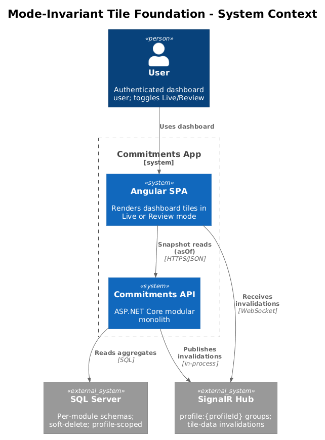
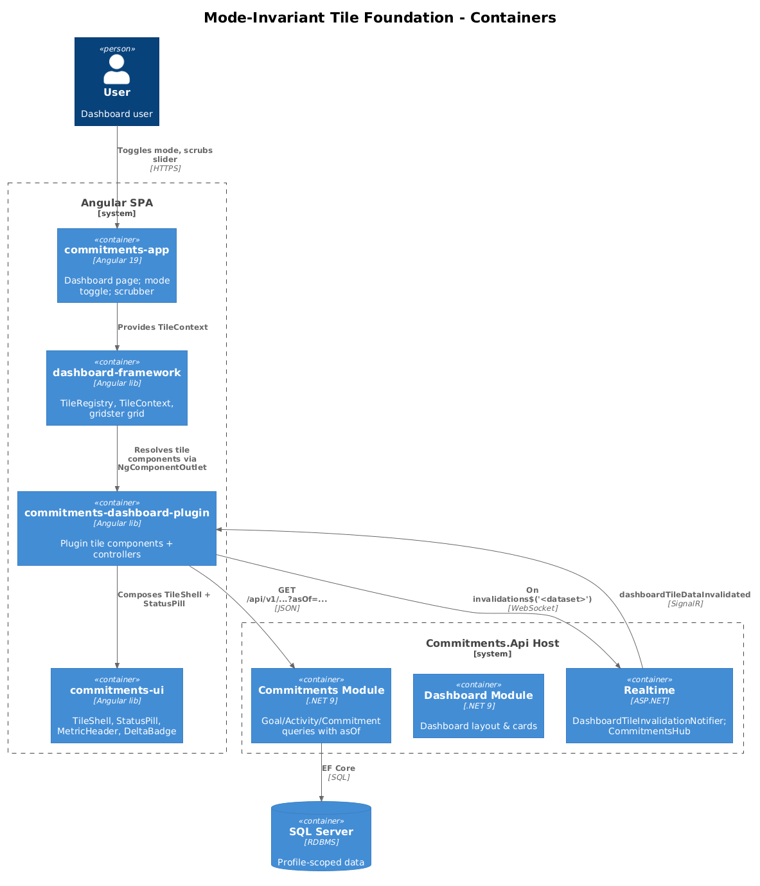
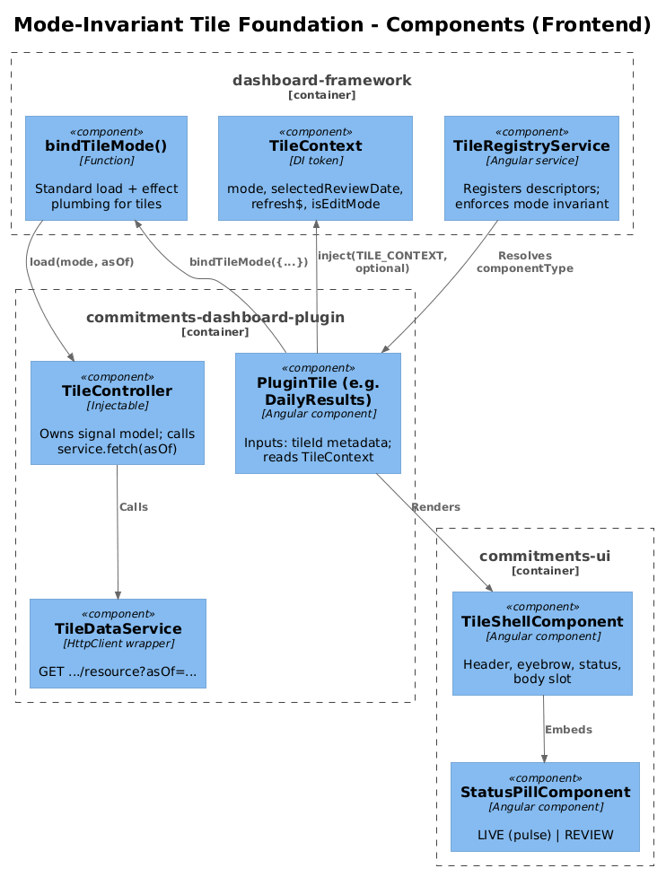
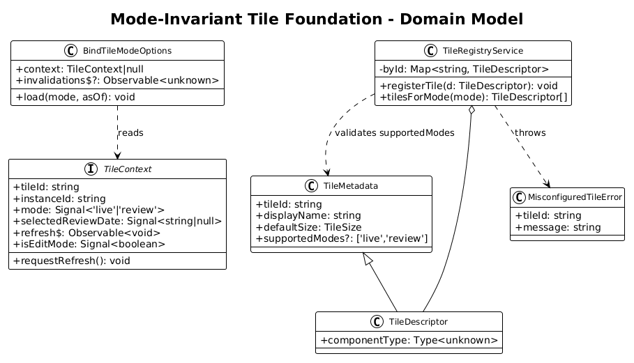
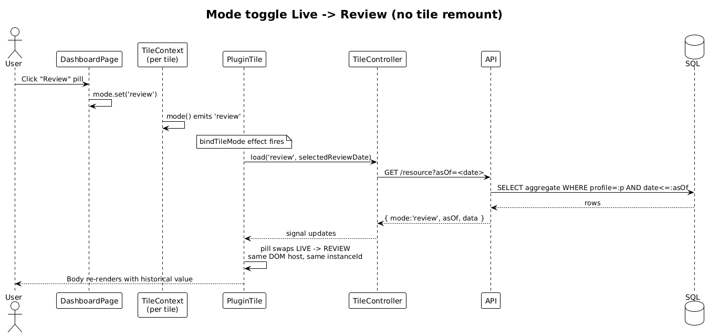
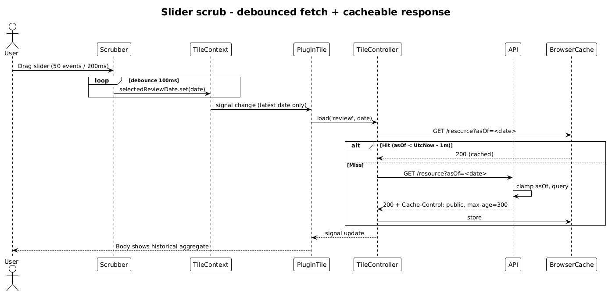

# Mode-Invariant Tile Foundation — Detailed Design

**Status:** Implemented — 2026-04-27
**Traces to:** L1-010, L1-011, L1-012, **L1-012a**, L1-018; L2-027, L2-028, L2-029, L2-030, **L2-031a**, L2-045.

## 1. Overview

Today only the **Consistency Trend** tile fully implements the Live/Review hybrid pattern. Every other plugin tile (`DailyResults`, `WeeklyFocus`, `MonthlyProgress`, `OutstandingTodos`, `Relations`) is a static visual stub, and the legacy goal tile is split into two mode-specific components (`LiveGoalMetricsTileComponent` and `ReviewGoalHistoryTileComponent`) — exactly the chrome-swap pattern that **L2-030** forbids.

This foundation design specifies the cross-cutting framework changes that *all* per-tile designs (02–07) build on:

- **`TileContext`** — already exists in `dashboard-framework`; this design constrains how tiles must consume `mode` and `selectedReviewDate`.
- **`TileRegistryService`** — must enforce that every registered descriptor either omits `supportedModes` or sets it to exactly `['live','review']`. Any other value fails registration.
- **Snapshot-with-`asOf` endpoint contract** — every tile-backing query endpoint must accept an optional `asOf` parameter, must clamp it to `(min, UtcNow]`, must default to `UtcNow` when absent, and must set `Cache-Control` per `CacheControlPolicy.For(asOf, utcNow)`.
- **Indicator swap, not chrome swap** — the `LIVE` / `REVIEW` pill is rendered inside the *same* `TileShellComponent`; a tile's host element must not unmount on mode toggle.
- **SignalR invalidation already exists** — `DashboardTileInvalidationNotifier` and the `DashboardTileDataset` constants are reused as-is. Only Live mode acts on invalidations; Review mode ignores them.

### Scope

In scope:
- `TileRegistryService` validation rule.
- A small framework helper (`bindTileMode<TVm>`) standardising the per-tile load + refresh + mode-effect pattern.
- The `asOf`-aware endpoint contract (request shape, response shape, cache headers, error semantics).
- Indicator (`LIVE`/`REVIEW`) rendering rules.

Out of scope (covered per tile in 02–07):
- Per-tile data shapes, controllers, and SQL/EF queries.
- The `LiveGoalMetricsTileComponent` ↔ `ReviewGoalHistoryTileComponent` merge (07).

### Actors

- **Authenticated user on `/dashboard`** — toggles between Live and Review, scrubs the date slider, optionally enters Edit mode.
- **Dashboard framework** — `dashboard-framework` lib renders tiles, owns mode/scrub state, and provides `TileContext`.
- **Plugin tiles** — `commitments-dashboard-plugin` lib registers tile descriptors; each tile component consumes `TileContext`.
- **Backend feature modules** — `Commitments` and `Identity` modules expose snapshot endpoints with `asOf` parameters.

## 2. Architecture

### 2.1 C4 Context



### 2.2 C4 Container



### 2.3 C4 Component (Dashboard Framework + Plugin)



## 3. Component Details

### 3.1 `TileRegistryService` (validation)

- **Responsibility**: register tile descriptors, expose listings, **enforce mode-invariant rule** (new).
- **Path**: `frontend/projects/dashboard-framework/src/lib/tile-registration/tile-registry.service.ts`.
- **Change**: in `registerTile(descriptor)`, after the duplicate check, validate `supportedModes`:
  - If `supportedModes` is set and not exactly the multiset `{'live','review'}` (any order, length 2, no other values), throw a `MisconfiguredTileError` whose message names the offending `tileId`.
  - This converts L2-031a from a convention into a runtime invariant: a developer cannot ship a single-mode tile.
- **Side effect**: `tilesForMode('live')` and `tilesForMode('review')` now provably return the same descriptor list — so the existing `supports(...)` filter becomes a defensive identity, not a correctness gate. Tests must assert the equality.

### 3.2 `bindTileMode` helper (new, framework-level)

- **Responsibility**: standardise the per-tile boilerplate of "load on mount, refresh on mode/scrub change, refresh on `refresh$`, refresh on dataset invalidation".
- **Path** (new): `frontend/projects/dashboard-framework/src/lib/tile-registration/bind-tile-mode.ts`.
- **Signature**:
  ```ts
  export interface BindTileModeOptions {
    readonly context: TileContext | null;
    readonly invalidations$?: Observable<unknown>;
    readonly load: (mode: DashboardMode, asOf: string | null) => void;
  }
  export function bindTileMode(opts: BindTileModeOptions): void;
  ```
- **Behaviour**:
  1. Calls `load(mode, asOf)` once on first invocation (mount).
  2. Sets up an `effect()` watching `context.mode()` and `context.selectedReviewDate()`; calls `load(...)` on each change.
  3. Subscribes to `context.refresh$` and to the optional `invalidations$`; both call `load(...)` with current values. Subscriptions are tied to the calling injection context (use `takeUntilDestroyed()`).
- **Why a helper, not a base class**: tiles vary in data shape and chart wiring. A function lets each tile keep its own `Controller` while removing the 30 lines of effect-plumbing duplicated everywhere.

### 3.3 `TileContext` consumption rules

- A tile component **must** inject `TILE_CONTEXT` via `inject(TILE_CONTEXT, { optional: true })` and **must** treat a `null` context as "live mode, no review date" (renders standalone in tests / Storybook).
- A tile component **must not** create or mutate the mode signal itself. The framework owns the source of truth.
- The tile's status pill must read `context.mode()` directly; do not cache it in a local signal.

### 3.4 Snapshot Endpoint Contract

Every tile-backing query endpoint must:

| Concern              | Rule                                                                                                                                                            |
| -------------------- | --------------------------------------------------------------------------------------------------------------------------------------------------------------- |
| URL                  | `GET /api/v{N}/<feature>` (existing) — does **not** branch by mode.                                                                                              |
| `asOf` parameter     | Optional `string?` in ISO-8601 (`yyyy-MM-ddTHH:mm:ssZ`). Bound from query string. Absent → server uses `DateTimeOffset.UtcNow`.                                  |
| Validation           | If supplied and not parseable → 400. If parseable but `> UtcNow`, clamp silently to `UtcNow`. Lower bound is feature-specific (e.g., goal creation date for goal-progress, profile creation date for everything else). |
| Profile scoping      | All reads continue to honour `HttpContextAccessorExtensions.GetProfileId()` (per L2-038). No new claim path.                                                     |
| Response             | Tile-specific DTO with at minimum: `mode: 'live'\|'review'`, `asOf: string` (the *effective* asOf after clamping), and the tile's payload. The client uses `mode` only for telemetry/logging — UI mode is owned by `TileContext`. |
| Cache-Control        | Set via `CacheControlPolicy.For(effectiveAsOf, utcNow)` (already exists at `Modules/Commitments/Features/GoalProgress/CacheControlPolicy.cs`). Reuse, do not duplicate.                                                 |
| Errors               | 401 (unauth), 400 (bad `asOf`), 403/404 (cross-profile or missing resource).                                                                                     |

The contract is documented once here; per-tile designs (02–07) reuse it without restating.

### 3.5 Indicator Rendering

- The `TileShellComponent` already accepts a `status` input. Tiles must pass `mode.toUpperCase()` (`'LIVE'` / `'REVIEW'`) into the existing `StatusPillComponent` next to the eyebrow.
- The pulse animation only runs when `mode === 'live'`. The `StatusPillComponent` already supports a `'live' | 'review'` variant input.
- **No tile renders both indicators simultaneously**, and **no tile branches its template's structural shape on mode** beyond the indicator and the mode-specific extras (e.g., delta badge in Review). Layout, header, body, and grid footprint are mode-invariant.

## 4. Data Model

### 4.1 Class Diagram



### 4.2 Entity Notes

- **`TileMetadata.supportedModes`** stays in the model as a soft-deprecated field; the new validator enforces that any non-omitted value is exactly `['live','review']`. After two release cycles, drop the field entirely.
- **`MisconfiguredTileError`** is a new class in `tile-registration/`; it is not exported from the public barrel — registry callers throw it, tests catch it.

## 5. Key Workflows

### 5.1 Mode toggle (Live → Review) does not remount tiles



The dashboard mode signal flips. Each mounted tile's `effect()` (set up by `bindTileMode`) fires once, calls its controller's `load(...)`, swaps `LIVE` for `REVIEW` in the pill, and re-renders body content with the new `asOf`. The host DOM element, gridster cell, and `instanceId` are unchanged. This is the L2-030 acceptance path.

### 5.2 Scrub debounce reaches the server once per settled position




The framework already debounces the scrubber's `selectedReviewDate` updates to ≤100 ms (L2-044). Tiles see at most one signal change per debounce window and fire one HTTP call. Per L2-045, responses where `asOf < UtcNow - 1m` are publicly cacheable for 5 minutes, so repeated scrubs to the same historical instant are served from the browser cache.

## 6. API Contracts

This design defines the contract; per-tile designs supply the concrete DTO and route.

### Request shape

```
GET /api/v{N}/<resource>?asOf=2026-04-15T18:30:00Z
Headers: Authorization: Bearer <token>, ProfileId: <guid>
```

### Response envelope (every tile-backing endpoint)

```jsonc
{
  "mode": "live",                    // echoes effective mode
  "asOf": "2026-04-27T17:00:00Z",    // effective, post-clamp
  "data": { /* tile-specific */ }
}
```

Per-tile designs are free to inline `data` (e.g., `GoalTrendDto` already does — `mode` and `asOf` sit next to its `points` array); the wrapper is illustrative, not mandatory. The two **required** fields are `mode` and `asOf`.

### Error responses

| Code | Condition                                                |
| ---- | -------------------------------------------------------- |
| 400  | `asOf` not parseable; missing `ProfileId` header.        |
| 401  | No `Authorization` header / invalid token.               |
| 403  | Token's user does not own `ProfileId`.                   |
| 404  | Resource not found or owned by another profile.          |

## 7. Security Considerations

- **No new endpoints** are introduced by this design; only an `asOf` parameter is added to existing or future routes. All scoping continues via `ProfileId` header (L2-038).
- **`asOf` is not authority-bearing** — it is a read-only date filter. There is no path where a manipulated `asOf` lets a profile see another profile's data.
- **Cache-Control: public** — endpoints that emit `public, max-age=300` for historical reads should not include user-identifying data in the response body beyond the requested aggregate. Existing implementations comply (`GetGoalProgressAt` returns counts only); per-tile designs must preserve this invariant.
- **Clock skew** — server-side clamping uses `DateTimeOffset.UtcNow`. Clients never send `asOf` greater than `now()` because the scrubber's max is bounded by the dashboard's review window end; even if a malformed client sent a future date, server clamps it.

## 8. Open Questions

1. **Fallback for `null` `TileContext`**: today, tiles use a private `signal('live')` fallback when context is missing (testing, Storybook). Should the framework expose a `provideStubTileContext()` helper instead, so tests don't reach into internals? Defer until a tile actually needs it for spec setup beyond Consistency Trend.
2. **Cache-Control on tile DTOs that aren't strictly counts** (e.g., `WeeklyFocus`, `Relations`): the 5-min historical TTL is safe for *aggregates over closed time windows*. If a tile's payload includes user-mutable text that could be edited retroactively (e.g., a focus area's name), the TTL must be reduced. Each per-tile design is responsible for confirming this.
3. **Should `TileMetadata.supportedModes` be removed entirely now or after a deprecation cycle?** Dropping it now eliminates a source of drift; keeping it preserves third-party plugin compatibility. Recommendation: keep the field, enforce the validator, drop after the next major.
