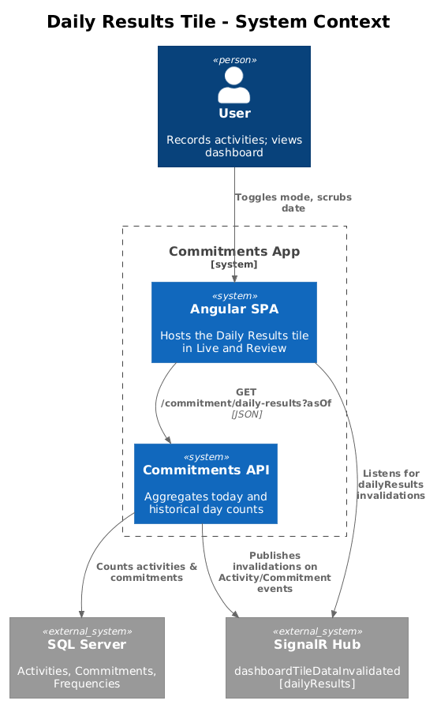
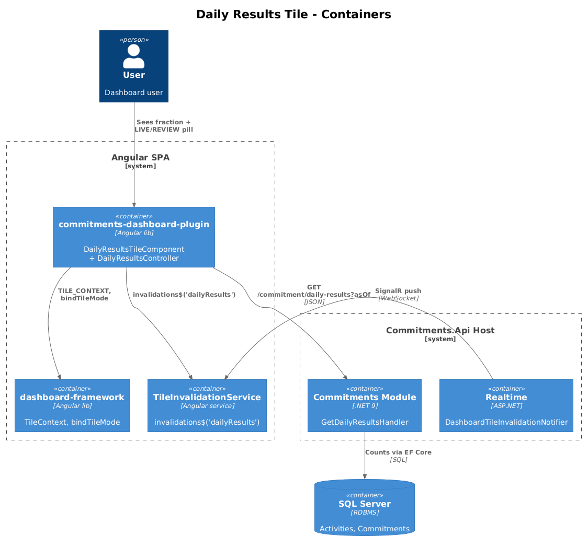
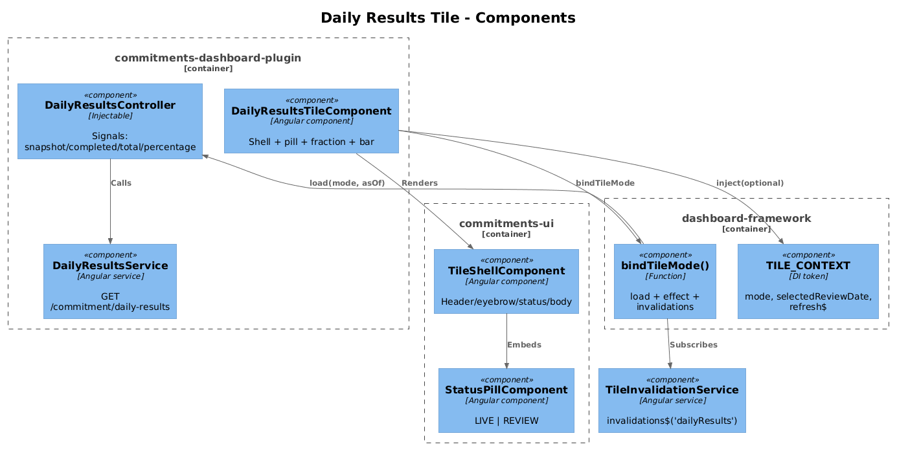
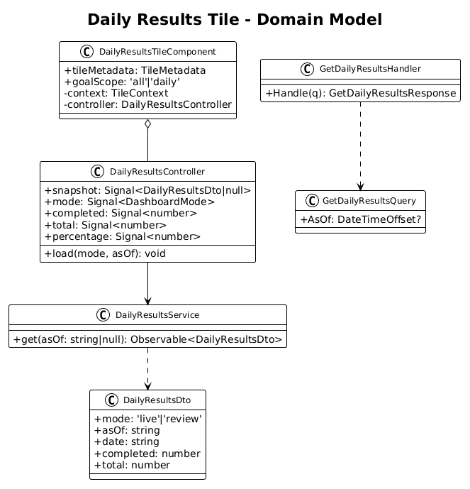
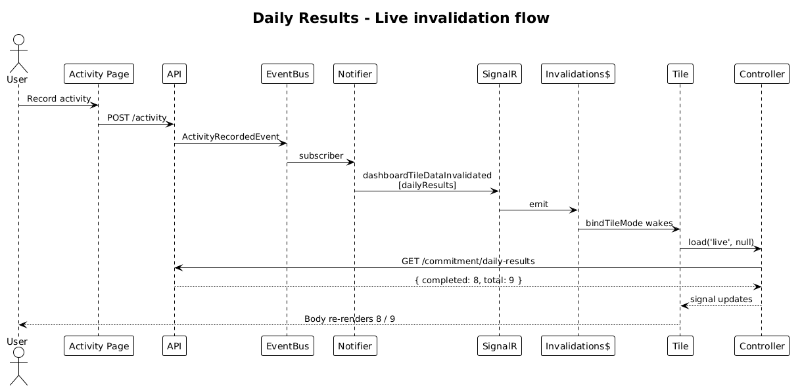
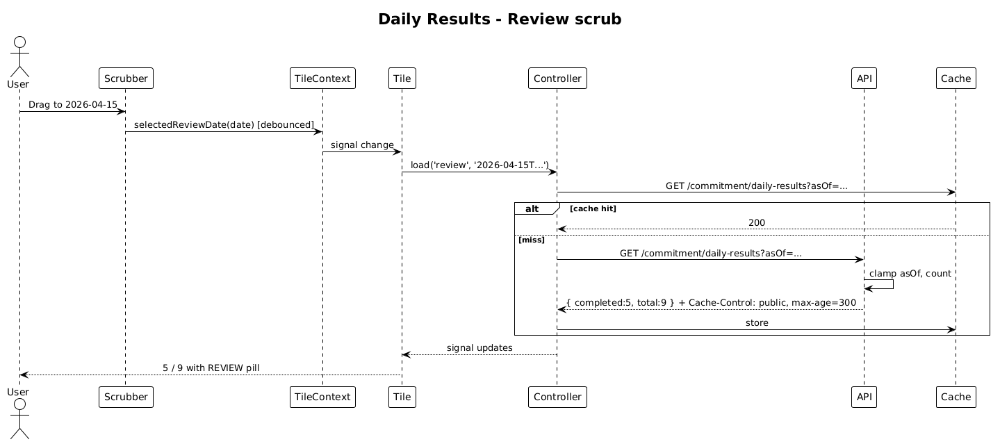

# Daily Results Tile — Dual-Mode Design

**Status:** Accepted — 2026-04-27
**Tile ID:** `commitments.daily-results`
**Traces to:** L1-010, L1-011, L1-012, **L1-012a**; L2-018, **L2-031a**, L2-038, L2-045.

## 1. Overview

The Daily Results tile answers *"how am I doing today?"* with a fraction (`completed / total`) and a progress bar. Today the component is a **visual stub** — the `7 / 9` and `78%` values are hard-coded; there is no controller, no service, no `TileContext` consumption.

This design wires the tile to live and historical data per the foundation contract (design 01). In **Live mode** it renders today's running fraction and re-fetches on the `dailyResults` SignalR invalidation. In **Review mode** it renders the same fraction *as it stood at the close of the selected review date* and re-fetches on `selectedReviewDate` change. The tile's host element does not unmount across mode toggles; only the indicator pill and bound numbers change.

### Out of scope

- Adding/editing/completing to-dos or commitments (existing pages handle these).
- Per-commitment drill-down — the tile remains a glanceable counter.

## 2. Architecture

### 2.1 C4 Context



### 2.2 C4 Container



### 2.3 C4 Component



## 3. Component Details

### 3.1 `DailyResultsTileComponent` (modified)

- **Path**: `frontend/projects/commitments-dashboard-plugin/src/lib/tiles/daily-results-tile/daily-results-tile.component.ts`
- **Responsibility**: render shell + status pill + numerator/denominator + progress bar.
- **Changes from current**:
  - Add `@Input() goalScope?: 'all' | 'daily' = 'daily'` (forward-looking; default preserves today's behaviour).
  - Inject `TILE_CONTEXT` (optional) and instantiate `DailyResultsController`.
  - Wire `bindTileMode({ context, invalidations$: tileInvalidationService.invalidations$('dailyResults'), load: (mode, asOf) => controller.load(mode, asOf) })`.
  - Replace literal template values with bindings to `controller.completed()`, `controller.total()`, `controller.percentage()`, `controller.mode()`.
  - Pass the `LIVE`/`REVIEW` pill via `<commitments-status-pill [variant]="controller.mode()">`.
  - Keep `tileMetadata` static; set `supportedModes: ['live', 'review']` (or omit per registry rule).

### 3.2 `DailyResultsController` (new)

- **Path** (new): `frontend/projects/commitments-dashboard-plugin/src/lib/tiles/daily-results-tile/daily-results.controller.ts`
- **Pattern**: mirrors `ConsistencyTrendController` — Angular signals, no NgRx.
- **State**:
  ```ts
  readonly snapshot = signal<DailyResultsDto | null>(null);
  readonly mode = signal<DashboardMode>('live');
  readonly completed = computed(() => this.snapshot()?.completed ?? 0);
  readonly total = computed(() => this.snapshot()?.total ?? 0);
  readonly percentage = computed(() => {
    const t = this.total(); return t > 0 ? Math.round((this.completed() / t) * 100) : 0;
  });
  ```
- **Methods**:
  - `load(mode: DashboardMode, asOf: string | null): void` — sets `this.mode`, calls `service.get(asOf)`, populates `snapshot`.
  - `refresh()` (used by ad-hoc invalidations) — re-issues with current mode/asOf.

### 3.3 `DailyResultsService` (new, frontend)

- **Path** (new): `frontend/projects/commitments-dashboard-plugin/src/lib/data/daily-results.service.ts`
- **Responsibility**: typed `HttpClient` wrapper over `GET /api/v1.0/commitment/daily?asOf=...`.
- **Signature**:
  ```ts
  get(asOf: string | null): Observable<DailyResultsDto>;
  ```
- **Notes**: the existing `GET /api/v1.0/commitment/daily` endpoint already returns the user's per-day commitments (`GetDailyCommitments`), but it returns the *list*, not a `{ completed, total }` aggregate. This design adds a new query specialised for the tile rather than overloading the list endpoint.

### 3.4 `GetDailyResultsHandler` (new, backend)

- **Path** (new): `backend/src/Modules/Commitments/Features/Commitment/Queries/GetDailyResults.cs`
- **Pattern**: vertical slice — `GetDailyResultsQuery : IRequest<GetDailyResultsResponse>`, FluentValidation validator, MediatR handler.
- **Query** (single round-trip, EF Core, profile-scoped):
  1. Compute window: `asOf` clamped to `(profileCreatedAt, UtcNow]`. If absent, use `UtcNow`. The "day" is the calendar day containing `asOf` in UTC (M1: UTC; future: per-profile timezone — see Open Questions).
  2. `total = Commitments.Count(c => c.ProfileId == p && c.Frequency.IsDaily)` at `asOf` (i.e., excludes commitments soft-deleted before `asOf`).
  3. `completed = Activities.Count(a => a.ProfileId == p && a.PerformedOn >= dayStart && a.PerformedOn <= asOf && a.Commitment.Frequency.IsDaily)`.
- **Cache-Control**: via `CacheControlPolicy.For(asOf, utcNow)`.

### 3.5 `CommitmentController` (modified)

- **Path**: `backend/src/Modules/Commitments/Controllers/CommitmentController.cs`
- **Add**: `GET api/v1.0/commitment/daily-results?asOf=...` action that dispatches `GetDailyResultsQuery`.
- The existing `GET .../daily` (list) endpoint is left untouched.

### 3.6 Realtime (no change required)

- `DashboardTileInvalidationNotifier` already publishes `dashboardTileDataInvalidated` with the `dailyResults` dataset on activity, commitment, and frequency changes. The tile subscribes via `TileInvalidationService.invalidations$('dailyResults')` — no backend code is added here.

## 4. Data Model

### 4.1 Class Diagram



### 4.2 DTO

```ts
interface DailyResultsDto {
  mode: 'live' | 'review';
  asOf: string;            // ISO datetime, post-clamp
  date: string;            // YYYY-MM-DD (calendar day of asOf)
  completed: number;       // Activities count for daily commitments at/before asOf within that day
  total: number;           // Active per-day commitments at asOf
}
```

## 5. Key Workflows

### 5.1 Live update via SignalR invalidation



1. User records an activity elsewhere in the app.
2. Backend's `ActivityRecordedEvent` handler triggers `DashboardTileInvalidationNotifier`, which pushes `dashboardTileDataInvalidated` to `profile:{profileId}` tagged with `dailyResults`.
3. Frontend `TileInvalidationService` filters and emits.
4. `bindTileMode` wakes the tile; `controller.load('live', null)` re-fetches the aggregate.
5. Pill remains `LIVE`; numerator updates.

### 5.2 Review-mode scrub



1. User toggles to Review and drags the scrubber.
2. Framework debounces `selectedReviewDate` updates.
3. Tile's `bindTileMode` effect fires once per settled position.
4. `controller.load('review', '<date>')` calls the same endpoint with `asOf=<date>`.
5. Response carries `Cache-Control: public, max-age=300` (per L2-045) so re-scrubs to the same instant are free.

## 6. API Contracts

### `GET /api/v1.0/commitment/daily-results`

| Param  | Type      | Required | Notes                                                        |
| ------ | --------- | -------- | ------------------------------------------------------------ |
| `asOf` | ISO 8601  | No       | Defaults to `UtcNow`. Clamped to `(profileCreatedAt, UtcNow]`. |

**200 response**:
```json
{ "mode": "live", "asOf": "2026-04-27T17:00:00Z", "date": "2026-04-27", "completed": 7, "total": 9 }
```

**Errors**: 400 (bad `asOf`), 401, 403/404 (per L2-038).

## 7. Security Considerations

- All scoping continues via `ProfileId` header (L2-038). The handler queries the active profile only; cross-profile leaks are prevented by the existing `BaseDbContext` global query filter (L2-039).
- The historical response is *not* user-identifying beyond the count itself; the public cache header (L2-045) is safe.

## 8. Open Questions

1. **Calendar-day timezone**: M1 uses UTC for the "day" boundary. Most users will see the same day. A future per-profile timezone setting is tracked in the Profile module backlog and is out of scope here.
2. **What counts as `completed`?** Today the convention is *at least one activity per daily commitment per day*. A stricter rule (e.g., per-frequency-target) would change the numerator semantics. Recommendation: keep "≥1 activity" for parity with the existing `GetDailyCommitments` page; revisit when commitments grow per-day quantitative targets.
3. **Should we reuse the existing `GET /commitment/daily` list endpoint and aggregate client-side?** Listed and rejected: the tile does not want the full payload, the list endpoint already eagerly loads `Behaviour` + `Frequency`, and `asOf` semantics on the *list* would conflict with the pagination contract on the Commitments page.
