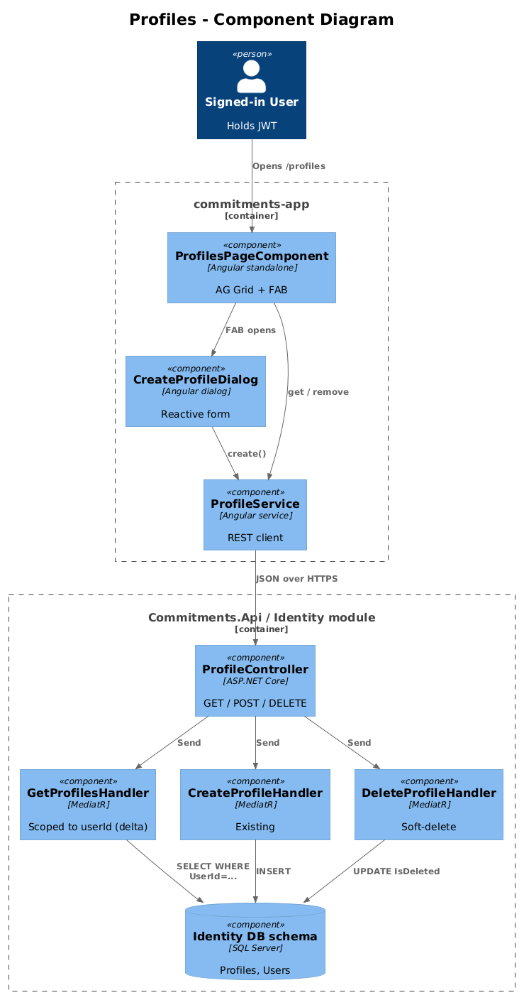
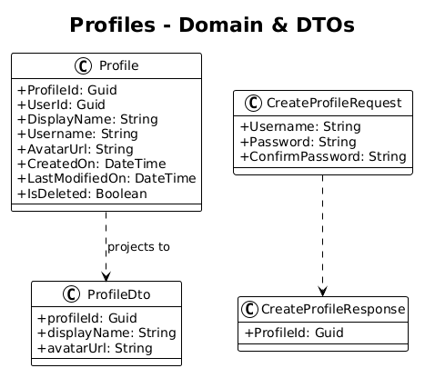
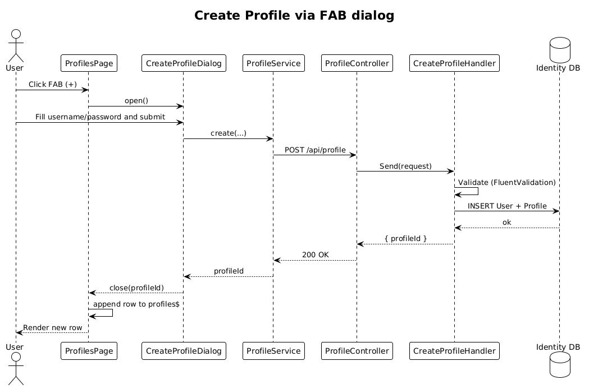

# Profiles — Detailed Design

**Status:** Accepted

**Traces to:** L1-002, L1-013, L1-017 · L2-003, L2-004, L2-038

## 1. Overview

The Profiles page (`pages/profiles`, route `/profiles`) lists the signed-in user's profiles, lets the user create a new profile via `CreateProfileDialog`, and lets the user delete a profile. The "current" profile is the one whose `profileId` is persisted in `LocalStorageService` and emitted in the `ProfileId` request header for every subsequent API call.

**Actors:** signed-in end user.

**Scope boundary:** this slice ends when the page can list, create, and delete profiles. Avatar editing and rename live in design `03-my-profile`.

## 2. Architecture

### 2.1 C4 Component

## 3. Component Details

### 3.1 ProfilesPageComponent (frontend, exists)
- Located at `frontend/.../pages/profiles/profiles-page/profiles-page.component.ts` (placeholder).
- **Delta:** flesh out the page — call `ProfileService.get()` on init, render an AG Grid with name + actions, FAB opens `CreateProfileDialog`, delete cell calls `ProfileService.remove`.
- **Routing delta:** `app.routes.ts` currently maps `profiles` to `PlaceholderPageComponent`; replace that route entry with `ProfilesPageComponent`.

### 3.2 CreateProfileDialog (frontend, exists)
- Reactive form (`username`, `password`, `confirmPassword`) — already implemented.
- **Delta:** none beyond surfacing through the new page entry point.

### 3.3 ProfileController (backend, exists)
- `POST`, `GET`, `GET /{id}`, `DELETE /{id}` already exist (see `backend/.../Identity/Controllers/ProfileController.cs`).
- **Delta:** add `[HttpGet("current")]` (covered in design `01-login`); no other server changes for this slice.

### 3.4 GetProfilesHandler scoping (backend)
- Existing `GetProfiles` returns all profiles. **Delta:** scope to the caller's `userId` — read `userId` claim from JWT and filter (L2-004 AC #1).

## 4. Data Model

### 4.1 Class Diagram

### 4.2 Entities
- `Profile` — fields used: `ProfileId`, `UserId`, `DisplayName`, `Username`, `AvatarUrl`, `CreatedOn`, `IsDeleted`.

## 5. Key Workflows

### 5.1 Create profile from FAB

### 5.2 Delete a profile
The delete cell triggers `ProfileService.remove(profile)`; on success the row is spliced from the local `profiles$` BehaviorSubject. Per L2-004 AC #3 the dashboard must still load if a deleted profileId is referenced — the existing global query filter on `IsDeleted` handles this.

## 6. API Contracts

| Method | Route | Body | Response | Auth |
|--------|-------|------|----------|------|
| GET | `/api/v1.0/profile` | — | `200 { profiles: ProfileDto[] }` | Bearer |
| POST | `/api/v1.0/profile` | `{ username, password, confirmPassword }` | `200 { profileId }` | Bearer |
| DELETE | `/api/v1.0/profile/{profileId:guid}` | — | `200` | Bearer |

## 7. Security Considerations

- **L2-004 AC #1** — list scoping: handler must filter by `caller.userId`. Without this, a logged-in user could enumerate all profiles in the system.
- `CreateProfile` reuses the existing password-hashing path (consistent with `CreateUser`).

## 8. ATDD Slices

1. **Slice A — list scoping:** add `userId` filter to `GetProfilesHandler`. Spec: a second user's seeded profile is not in the response.
2. **Slice B — page wiring:** replace placeholder route, render grid, wire FAB → `CreateProfileDialog`. Spec: opening `/profiles` lists the seeded profile; submitting the dialog adds a row without page refresh.
3. **Slice C — delete:** wire delete cell + soft-delete server-side. Spec: deleted row disappears, dashboard still loads.

## 9. Open Questions

- `CreateProfile` currently provisions a new **user** (username + password). Verify if a profile is allowed to belong to an existing user without password — if so, add an alternate `CreateProfileForCurrentUser` command (small follow-up).
