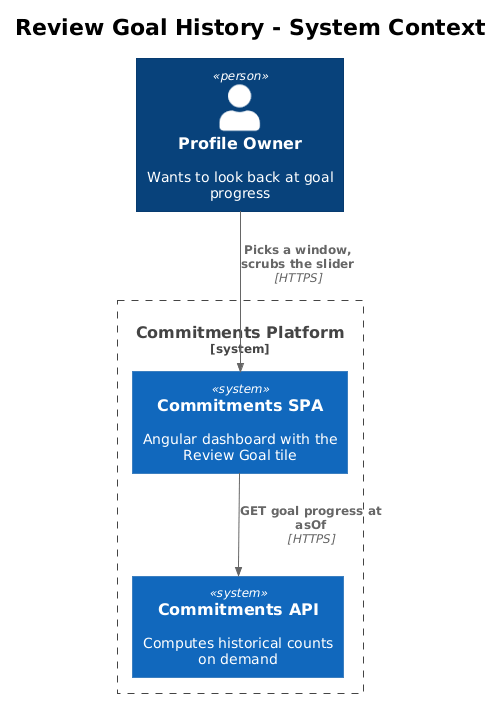
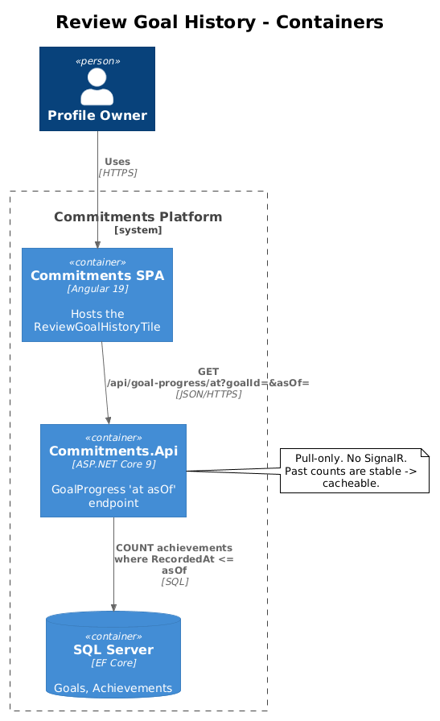
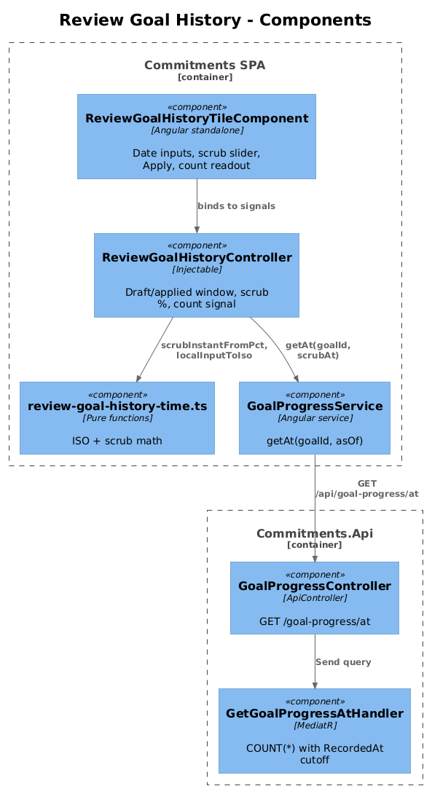
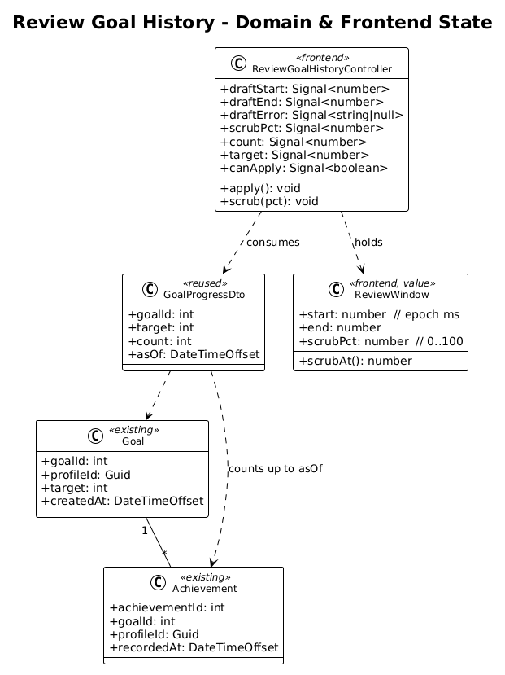
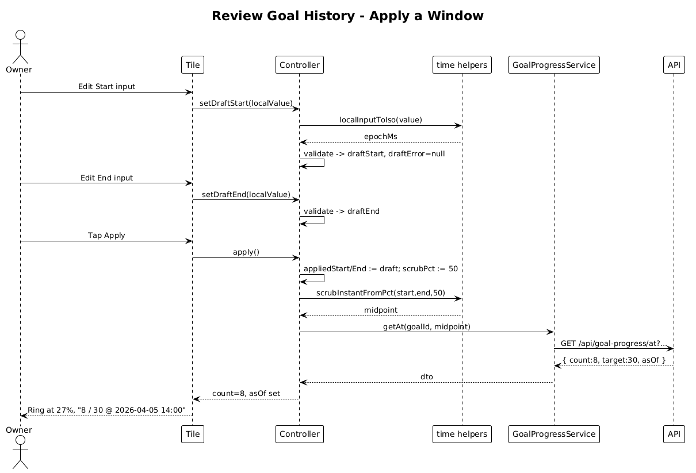
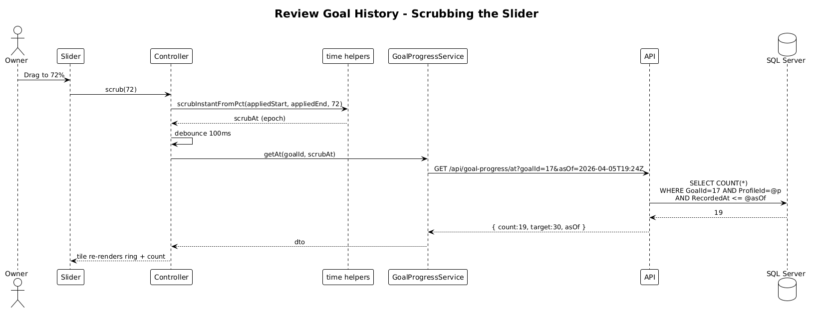

# Review Goal History Tile — Detailed Design

## 1. Overview

This feature shows a dashboard tile that lets the user **scrub through history** for a single goal — picking a date window and dragging a slider to see how far along the goal was at any moment in that window.

It is the *Review* counterpart to Feature 01 (Live Goal Metrics): same tile chrome conventions, but scrubbing achievement counts instead of streaming live updates.

**Actors**

- **Profile owner** — wants to look back and see "where was I on this goal three weeks ago?".

**Scope boundary**

- One goal per tile (set via tile config).
- Window granularity: minutes (matches the `datetime-local` inputs in the reference).
- No editing of past achievements — strictly read-only review.
- Backend computes the count at the *scrub instant* server-side (single query) — the SPA does not load every achievement.

**Radically simple**: one new endpoint, one new tile, one shared time-math file, no new tables.

## 2. Architecture

### 2.1 C4 Context



### 2.2 C4 Container



The Review tile lives in the same SPA as the Live tile and talks to the same `Commitments.Api`. No SignalR — review is pull-only.

### 2.3 C4 Component



`ReviewGoalHistoryTileComponent` ⟶ `ReviewGoalHistoryController` ⟶ `GoalProgressService.getAt(goalId, asOf)`. The controller also owns the draft start/end/scrub signals and a `canApply` derived signal — the same shape as `ReviewTelemetryTileController` in the reference.

## 3. Component Details

### 3.1 ReviewGoalHistoryTileComponent (Angular, standalone)

- **Path**: `frontend/projects/commitments-app/src/app/components/review-goal-history-tile/review-goal-history-tile.component.ts`
- **Template**: header + REVIEW badge, two `<input type="datetime-local">` (start/end), a Material slider for scrub %, an "Apply" button, and a result row showing `count / target` at the scrub instant plus the resolved `asOf`.
- **Inputs**: `goalId: number`.
- **Almost a port** of `review-telemetry-tile.component.ts` lines 30–102 — same DOM shape, different fields.

### 3.2 ReviewGoalHistoryController (Angular, `@Injectable`)

- **Path**: same folder.
- **State (signals)**:
  - `draftStart: number` (epoch ms), `draftEnd: number`, `draftError: string | null`
  - `appliedStart: number | null`, `appliedEnd: number | null`
  - `scrubPct: number` (0–100), derived `scrubAt: number = appliedStart + (appliedEnd - appliedStart) * pct/100`
  - `count: number`, `target: number`, `asOf: Date | null`
- **Derived**:
  - `canApply = computed(() => draftError() === null && draftStart() < draftEnd())`
  - `pctDisplay = computed(() => clamp(count() / target() * 100, 0, 100))`
- **Methods**: `setDraftStart(iso)`, `setDraftEnd(iso)`, `apply()`, `scrub(pct)`. On `scrub`, debounce 100 ms then call `goalProgressService.getAt(goalId, scrubAt)`.

### 3.3 review-goal-history-time.ts (pure helpers)

- **Path**: same folder.
- **Functions**: `localInputToIso(value)`, `scrubInstantFromPct(start, end, pct)`. Kept pure so they can be unit-tested without TestBed.

### 3.4 GoalProgressService (Angular) — extended

The same service introduced in Feature 01 gains one method:

```ts
getAt(goalId: number, asOf: Date): Observable<GoalProgressDto>
```

### 3.5 GoalProgressController (ASP.NET Core) — extended

- **New endpoint**: `GET /api/goal-progress/at?goalId={id}&asOf={iso}` ⟶ `200 GoalProgressDto`.
- Reuses `GoalProgressDto` from Feature 01.

### 3.6 GetGoalProgressAtHandler (MediatR)

- **Path**: `src/Commitments.Api/Features/GoalProgress/GetGoalProgressAt.cs`
- **Query**: `Achievements.Count(a => a.GoalId == goalId && a.ProfileId == p && a.RecordedAt <= asOf)`. One round-trip.
- **Validation**: `asOf` not in the future (clamp to `DateTimeOffset.UtcNow`); `asOf` not before `Goal.CreatedAt` (clamp).

## 4. Data Model

### 4.1 Class Diagram



### 4.2 Entity Descriptions

- **Goal**, **Achievement**, **GoalProgressDto** — all exactly as in Feature 01. No new fields.
- **ReviewWindow** (frontend value object) — `{ start: number, end: number, scrubPct: number }`. Held inside the controller; never persisted.

No migrations.

## 5. Key Workflows

### 5.1 Apply a review window



1. User edits start + end inputs. Each change goes through `setDraftStart` / `setDraftEnd` ⟶ validates ISO ⟶ updates draft state.
2. User taps "Apply". `appliedStart` / `appliedEnd` set from draft. Slider becomes active. An initial `getAt(goalId, midpoint)` runs.

### 5.2 Scrub the slider



1. User drags slider, controller computes `scrubAt = start + (end - start) * pct/100`.
2. Debounced 100 ms call to `GET /api/goal-progress/at?goalId=…&asOf=…`.
3. Handler runs the count-with-cutoff query, returns DTO.
4. Tile updates `count`, `asOf`; the ring + readout reflect the historical moment.

## 6. API Contracts

```
GET /api/goal-progress/at?goalId={int}&asOf={iso8601}
Headers: Authorization: Bearer …, ProfileId: {guid}
200 OK
{
  "goalId": 17,
  "target": 30,
  "count": 8,
  "asOf": "2026-04-05T14:00:00Z"
}
400 — asOf not parseable
404 — goal not found / not owned by profile
```

The endpoint is **idempotent and cacheable** by `(goalId, asOf)` — historical counts never change once `asOf` is in the past. Add `Cache-Control: public, max-age=300` for `asOf` older than 1 minute. (Optional polish — note in PR.)

## 7. Security Considerations

- Same as Feature 01: rely on the `BaseDbContext` `ProfileId` query filter so no goal/achievement leaks across profiles.
- Reject `asOf` more than e.g. 100 years in the past or any value in the future — pure input hardening to prevent silly query plans.

## 8. Vertical Slice Definition (for the implementing PR)

Single PR delivers:

1. `GetGoalProgressAt` handler + `GoalProgressController` action (sits next to the action from Feature 01).
2. `GoalProgressService.getAt()` method.
3. `review-goal-history-time.ts` pure helpers.
4. `ReviewGoalHistoryController` + `ReviewGoalHistoryTileComponent` + SCSS.
5. Tile registration in the dashboard tile catalog.
6. Jest specs: pure helpers (full coverage) + controller (apply, scrub, validation).
7. xUnit test for the handler.

**Screenshot proof of done**: open the app, drop the Review tile on a dashboard, set a window covering yesterday, drag the slider — the count visibly steps up as the slider passes each historical achievement timestamp.

## 9. Open Questions

- **Debounce window**: 100 ms feels right for a slider; if users complain about lag, drop to 50 ms or switch to "scrub-on-release". Ship with 100 and iterate.
- **Empty window** (start == end) — Apply is disabled by `canApply`.
- **Cross-profile shared goals** — out of scope for now; revisit when (if) the platform adds shared goals.
- **Live + Review on same tile?** Deliberately rejected. Two tiles keeps each one trivial and individually screenshot-able. A future "combined" tile can compose the two controllers if needed.
