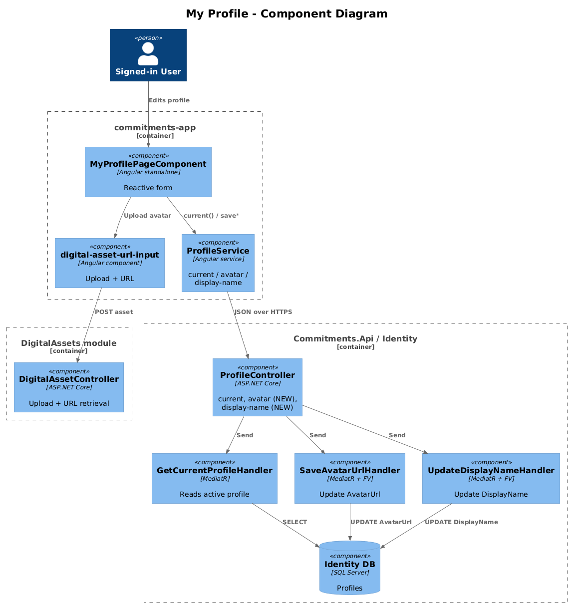
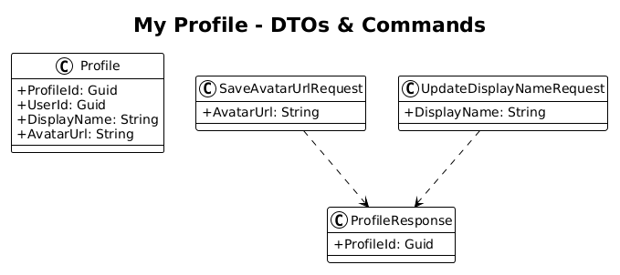
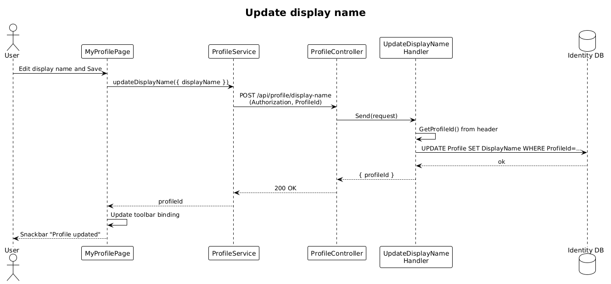

# My Profile — Detailed Design

**Status:** Accepted

**Traces to:** L1-002, L1-013 · L2-003, L2-004, L2-038

## 1. Overview

The My Profile page (`pages/my-profile`, route `/my-profile`) is the self-service editor for the **currently active** profile. The user can change their display name, upload an avatar via `digital-asset-url-input`, and persist changes without leaving the page.

**Actors:** signed-in end user editing their own profile.

**Scope boundary:** the page never lists other profiles (that is design `02`). It always operates on the profile identified by the current `ProfileId` header.

## 2. Architecture

### 2.1 C4 Component

## 3. Component Details

### 3.1 MyProfilePageComponent (frontend, exists as placeholder)
- Replace the placeholder route entry in `app.routes.ts` with `MyProfilePageComponent`.
- Loads via `ProfileService.current()` on init, binds a reactive form `{ displayName, avatarUrl }`, persists with `ProfileService.saveAvatarUrl(...)` and a new `ProfileService.updateDisplayName(...)`.

### 3.2 ProfileController (backend, exists)
- **Delta:** add two endpoints (vertical slices):
  - `POST /avatar` — `SaveAvatarUrl` command (the frontend already calls this URL).
  - `POST /display-name` — `UpdateDisplayName` command (new frontend service method).
- Both commands operate **only** on the profile matching the `ProfileId` header — they never accept a `profileId` body parameter.

## 4. Data Model

### 4.1 Class Diagram

The `Profile` entity is unchanged (`DisplayName`, `AvatarUrl` already exist). No migration required.

## 5. Key Workflows

### 5.1 Update display name

## 6. API Contracts

| Method | Route | Body | Response | Auth |
|--------|-------|------|----------|------|
| POST | `/api/v1.0/profile/avatar` | `{ avatarUrl }` | `200 { profileId }` | Bearer + ProfileId |
| POST | `/api/v1.0/profile/display-name` | `{ displayName }` | `200 { profileId }` | Bearer + ProfileId |

## 7. Security Considerations

- The route prefix is `profile`; commands resolve the active profile via `HttpContextAccessorExtensions.GetProfileId()`. There is **no path or body parameter** that could be used to mutate another profile.

## 8. ATDD Slices

1. **Slice A — page wiring:** route + form + initial GET `/current`. Spec: opening `/my-profile` shows the seeded user's display name.
2. **Slice B — avatar save:** add `SaveAvatarUrl` command, replace placeholder in service. Spec: uploading an asset persists the URL and reloads the avatar on refresh.
3. **Slice C — display-name save:** add `UpdateDisplayName` command + frontend service method. Spec: changing the name persists and reflects in the toolbar's user chip.

## 9. Open Questions

- The toolbar shows `@quinntynebrown` (per the .pen design); is that the **profile display name** or the **user username**? Recommendation: derive from the active profile's `DisplayName` so editing it updates the toolbar. Confirm with UX.
