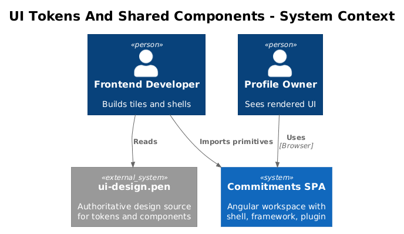
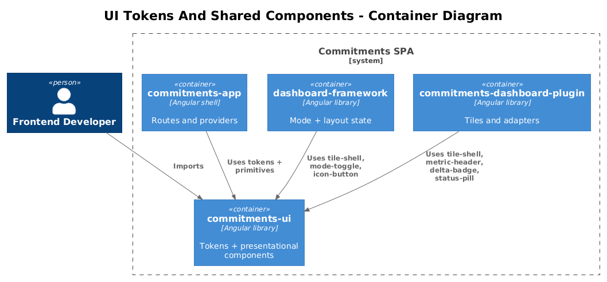
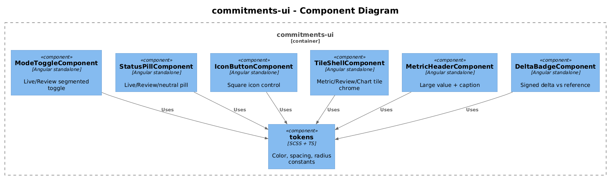
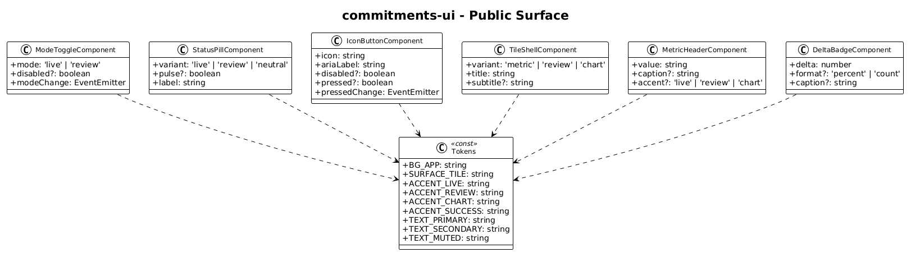
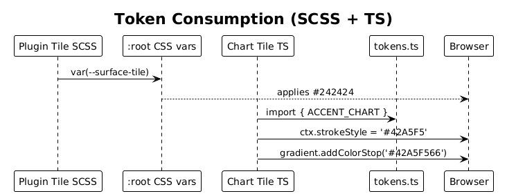
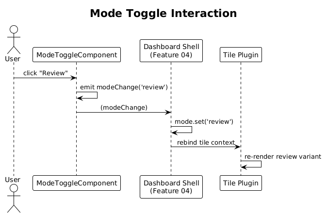

# 03 — UI Tokens And Shared Components — Detailed Design

## 1. Overview

Extract the dark-theme tokens and reusable visual primitives implied by `docs/ui-design.pen` into the `commitments-ui` library plus global theme tokens, so both the dashboard framework shell and plugin tiles render against a single, named design system.

This is the foundation slice for every subsequent design (04–12). Every screen and tile in the live-review-chartjs-alignment-plan consumes these tokens and components.

**Actors**

- **Frontend developer** consuming primitives from `commitments-ui`.
- **Profile owner** (end user) — only consumes via downstream tiles, not directly.

**Scope boundary**

- Only adds tokens + presentational components. No state, no HTTP, no Chart.js, no Gridster.
- Primitives are mode-agnostic: the *value* of `mode` is provided by the dashboard framework (Feature 04), not by these components.
- Source visual references: `A1yim`, `WFYHQ`, `nAfUX`, `o0BgI`, `9IpBQ`, `zNLnf` — the rendered exports under `docs/exports/`.

## 2. Architecture

### 2.1 C4 Context



The token + primitive set is consumed by `commitments-app`, `dashboard-framework`, and `commitments-dashboard-plugin`. Profile owner sees the result via every tile in the SPA.

### 2.2 C4 Container



Three Angular libraries depend on `commitments-ui`. Tokens live in a global SCSS partial loaded by the SPA. Components are exported via `public-api.ts`.

### 2.3 C4 Component



`commitments-ui/src/lib/` gains six primitives: `mode-toggle`, `status-pill`, `icon-button`, `tile-shell` (with `metric` / `review` / `chart` variants), `metric-header`, and `delta-badge`. Tokens live in `commitments-ui/src/lib/tokens/_tokens.scss` and are re-exported from `public-api.ts` as TypeScript constants for canvas drawing (Chart.js gradients).

## 3. Component Details

### 3.1 Theme tokens

- **Path**: `frontend/projects/commitments-ui/src/lib/tokens/_tokens.scss` and `tokens.ts`.
- **SCSS** exposes CSS custom properties on `:root` so any consumer can use `var(--surface-tile)`.
- **TypeScript** mirror is needed for canvas-drawn artefacts (Chart.js line/gradient colors) where SCSS variables are not reachable.

| Token | SCSS var | TS const | Hex |
| --- | --- | --- | --- |
| App background | `--bg-app` | `BG_APP` | `#121212` |
| Toolbar | `--bg-toolbar` | `BG_TOOLBAR` | `#1F2233` |
| Sidebar | `--bg-sidebar` | `BG_SIDEBAR` | `#181A24` |
| Tile surface | `--surface-tile` | `SURFACE_TILE` | `#242424` |
| Raised panel / scrubber | `--surface-raised` | `SURFACE_RAISED` | `#1E1E1E` |
| Divider | `--divider` | `DIVIDER` | `#3A3A3A` |
| Live accent | `--accent-live` | `ACCENT_LIVE` | `#FF4081` |
| Review accent | `--accent-review` | `ACCENT_REVIEW` | `#9FA8DA` |
| Chart accent | `--accent-chart` | `ACCENT_CHART` | `#42A5F5` |
| Success delta | `--accent-success` | `ACCENT_SUCCESS` | `#66BB6A` |
| Text primary | `--text-primary` | `TEXT_PRIMARY` | `#FFFFFF` |
| Text secondary | `--text-secondary` | `TEXT_SECONDARY` | `#B0B0B0` |
| Text muted | `--text-muted` | `TEXT_MUTED` | `#666666` |

Spacing, radius, and elevation tokens (`--radius-tile: 12px`, `--space-tile-pad: 20px`, `--shadow-tile: 0 1px 2px rgba(0,0,0,0.6)`) round out the set; values are derived from the `.pen` frames.

### 3.2 ModeToggleComponent

- **Path**: `commitments-ui/src/lib/mode-toggle/mode-toggle.component.ts`
- **Refs**: `A1yim` (live active), `WFYHQ` (review active).
- **Inputs**: `mode: 'live' | 'review'`, `disabled?: boolean`.
- **Outputs**: `modeChange: EventEmitter<'live' | 'review'>`.
- **Keyboard**: `ArrowLeft` / `ArrowRight` swap segments; `Space` / `Enter` activates; `role="tablist"` with two `role="tab"` buttons.
- **A11y**: `aria-pressed` on each segment, focus ring uses `--accent-live` or `--accent-review` based on selection.

### 3.3 StatusPillComponent

- **Path**: `commitments-ui/src/lib/status-pill/status-pill.component.ts`
- **Inputs**: `variant: 'live' | 'review' | 'neutral'`, `pulse?: boolean` (drives the live "heartbeat" animation), `label: string`.
- **Outputs**: none — pure presentational.
- **Visual**: rounded pill, dot prefix, accent-coloured text. `pulse=true` adds a CSS keyframe scale on the dot.

### 3.4 IconButtonComponent

- **Path**: `commitments-ui/src/lib/icon-button/icon-button.component.ts`
- **Used by**: scrubber prev / play-pause / next / jump-to-today (Feature 06) and any tile-level controls.
- **Inputs**: `icon: string` (Material symbol name), `ariaLabel: string`, `disabled?: boolean`, `pressed?: boolean` (for play/pause toggle).
- **Outputs**: `pressedChange: EventEmitter<boolean>` when `pressed` is bound; otherwise click is propagated by the host.
- **States**: default, hover, active, focus-visible, disabled.

### 3.5 TileShellComponent (with `variant`)

- **Path**: `commitments-ui/src/lib/tile-shell/tile-shell.component.ts`
- **Refs**: `o0BgI` (metric variant), `nAfUX` (review variant), `9IpBQ` (chart variant).
- **Inputs**: `variant: 'metric' | 'review' | 'chart'`, `title: string`, `subtitle?: string`.
- **Slots** (content projection): `[slot=status]` for the right-hand status pill; default slot for body content.
- **Layout**: header row (title + subtitle + status), divider, body. CSS grid with `grid-template-rows: auto auto 1fr`; min-height differs by variant (`metric` ~ 200 px, `review` ~ 220 px, `chart` ~ 340 px).

### 3.6 MetricHeaderComponent

- **Path**: `commitments-ui/src/lib/metric-header/metric-header.component.ts`
- **Refs**: top of `o0BgI` and metric strip in `9IpBQ`.
- **Inputs**: `value: string` (preformatted, e.g. `"42%"`), `caption?: string`, `accent?: 'live' | 'review' | 'chart'`.
- **Visual**: large weight-300 numeral on the left, optional caption (e.g. `"of 30 done today"`) underneath.

### 3.7 DeltaBadgeComponent

- **Path**: `commitments-ui/src/lib/delta-badge/delta-badge.component.ts`
- **Refs**: trend row in `o0BgI`, `nAfUX`, and `9IpBQ`.
- **Inputs**: `delta: number` (signed), `format?: 'percent' | 'count'`, `caption?: string` (e.g. `"vs today"`, `"vs prior 14d"`).
- **Logic**: positive → `--accent-success`, negative → `--accent-live`, zero → `--text-muted`. Always shows a leading `+` / `-` / `±`.

## 4. Data Model

### 4.1 Class Diagram



### 4.2 Entity Descriptions

There is no persistent data model in this slice. The class diagram shows the public TypeScript surface: token consts + the input/output shape of each component.

## 5. Key Workflows

### 5.1 Consuming a token in SCSS and TypeScript



1. Plugin tile imports `@commitments/ui` and writes `background: var(--surface-tile);` in its SCSS.
2. Chart tile imports `ACCENT_CHART` from the same library to set `dataset.borderColor` and to build a canvas gradient — these need a literal hex, not a CSS var.

### 5.2 Mode toggle interaction



1. User clicks the "Review" segment of `mode-toggle`.
2. Component emits `modeChange.emit('review')`.
3. Host (Feature 04 — Dashboard Mode Shell) updates its `mode` signal and re-binds the input.

## 6. API Contracts

This slice exposes **TypeScript and SCSS APIs only**, no HTTP. Every primitive's selector follows the pattern `cui-<name>` (e.g. `<cui-mode-toggle>`). Each is exported from `commitments-ui/src/public-api.ts`.

```ts
export type { DashboardMode } from './lib/types';
export * from './lib/tokens/tokens';
export * from './lib/mode-toggle/mode-toggle.component';
export * from './lib/status-pill/status-pill.component';
export * from './lib/icon-button/icon-button.component';
export * from './lib/tile-shell/tile-shell.component';
export * from './lib/metric-header/metric-header.component';
export * from './lib/delta-badge/delta-badge.component';
```

> Note: the `DashboardMode` *type* is co-owned here only because tokens (`--accent-live` / `--accent-review`) reference it. The mode *state* is owned by the dashboard framework (Feature 04). To avoid a circular dependency, the type literal is a string union, not a class.

## 7. Security Considerations

None — pure presentation. The components must not accept innerHTML inputs; all user-supplied strings are rendered as text content.

## 8. Acceptance

- Storybook (or a single `commitments-ui-demo` route added later) renders every primitive in default + active + disabled states against the dark theme.
- `commitments-app`, `dashboard-framework`, and `commitments-dashboard-plugin` can all consume the primitives via the public API without a circular import.
- Visual diff against `docs/exports/A1yim.png`, `WFYHQ.png`, `o0BgI.png`, `nAfUX.png`, `9IpBQ.png` is within tolerance for color, spacing, and radius.

## 9. Open Questions

- **Where do Material symbols live?** If the SPA already pulls Material icons globally, `IconButtonComponent` accepts a string name; otherwise the component must accept `<ng-content>` with the icon SVG.
- **Storybook vs minimal demo route** — Storybook is heavier; a single demo route in `commitments-app` may be enough to validate visually for v1.
- **Token re-export to SCSS partial in dashboard-framework** — confirm that `dashboard-framework` already imports `commitments-ui` styles, or add a one-line `@use` in its global stylesheet.
