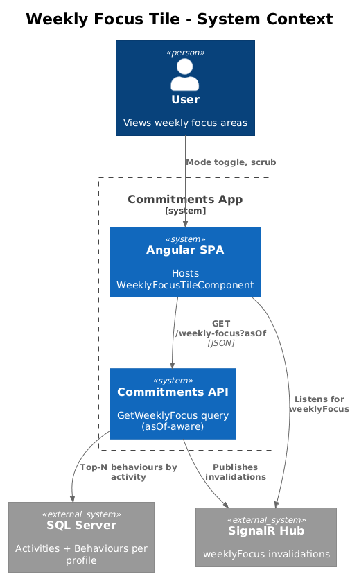
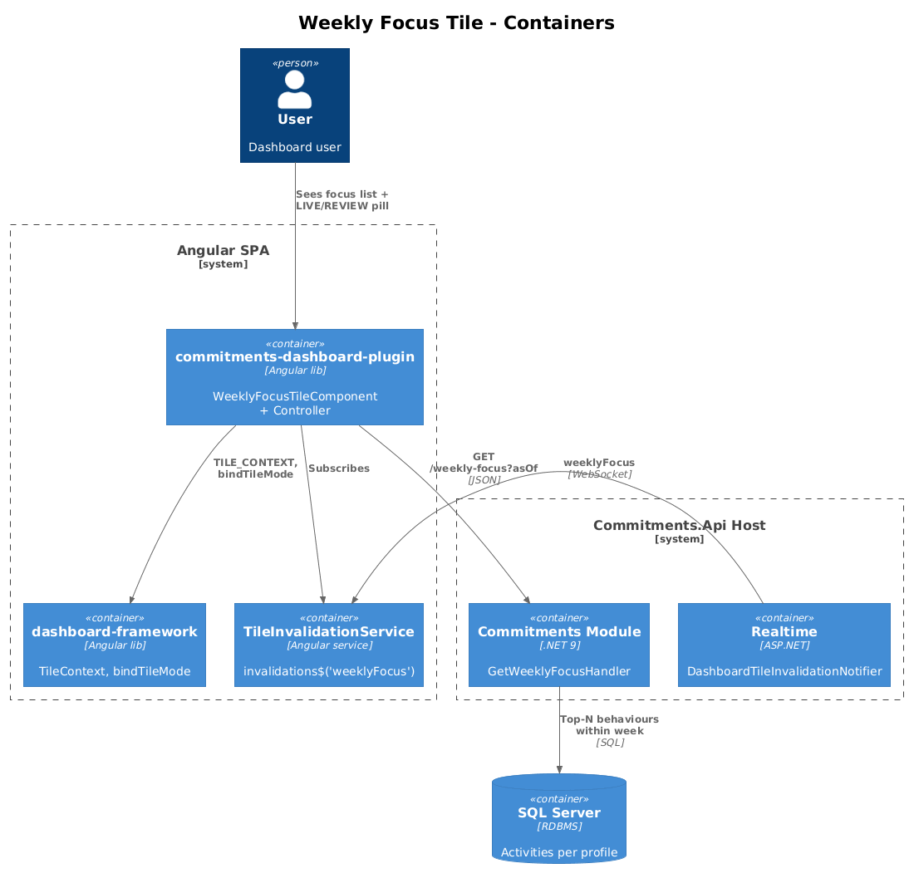
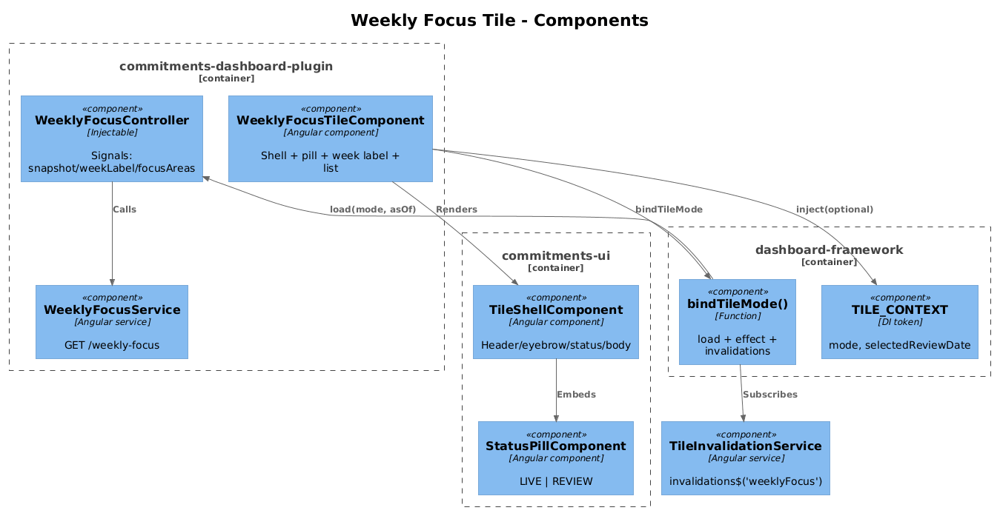
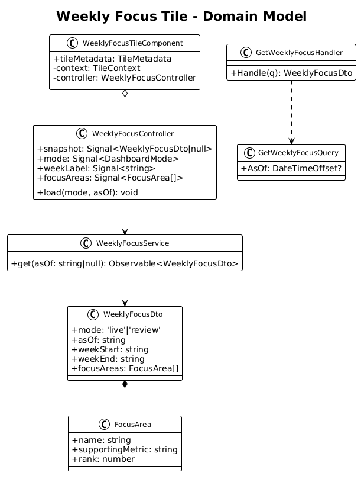
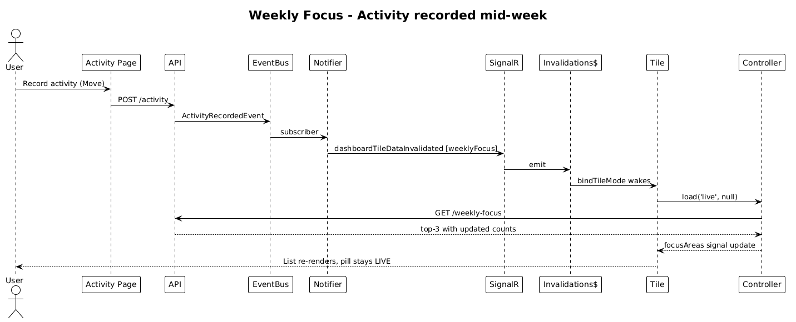
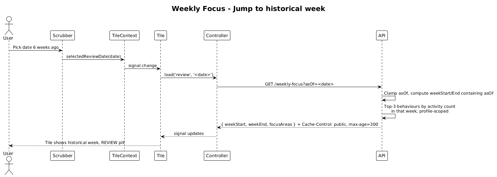

# Weekly Focus Tile — Dual-Mode Design

**Status:** Accepted — 2026-04-27
**Tile ID:** `commitments.weekly-focus`
**Traces to:** L1-010, L1-011, L1-012, **L1-012a**; L2-018, **L2-031a**, L2-038, L2-045.

## 1. Overview

The Weekly Focus tile lists the user's chosen focus areas for the current calendar week, each with a supporting metric (e.g. `Move — 5 sessions planned`). Today the component renders three hard-coded items, has no controller, and does not consume `TileContext`.

This design wires the tile to live and historical data per the foundation contract (design 01). The week shown is **the calendar week containing `asOf`**:

- **Live** — `asOf = UtcNow` → current week.
- **Review** — `asOf = selectedReviewDate` → the historical week containing that date, with each focus area's supporting metric reflecting that week's *recorded* engagement (e.g., `Move — 5 sessions logged`).

The tile's host element does not unmount on mode toggles; only the indicator pill, week label, and rows update.

### Out of scope

- Adding/editing/removing focus areas. Per the existing tile README, those interactions live elsewhere; this tile is read-only.
- Per-row drill-down navigation.

## 2. Architecture

### 2.1 C4 Context



### 2.2 C4 Container



### 2.3 C4 Component



## 3. Component Details

### 3.1 `WeeklyFocusTileComponent` (modified)

- **Path**: `frontend/projects/commitments-dashboard-plugin/src/lib/tiles/weekly-focus-tile/weekly-focus-tile.component.ts`
- **Responsibility**: render shell + status pill + week label (`Apr 21 – Apr 27`) + focus list.
- **Changes**:
  - Inject `TILE_CONTEXT` (optional). Instantiate `WeeklyFocusController`.
  - `bindTileMode({ context, invalidations$: tileInvalidationService.invalidations$('weeklyFocus'), load: (m, a) => controller.load(m, a) })`.
  - Replace literal `<li>` items with `@for(item of controller.focusAreas())`.
  - Bind status pill to `controller.mode()`.
  - Set `tileMetadata.supportedModes = ['live', 'review']` (or omit per the registry rule).

### 3.2 `WeeklyFocusController` (new)

- **Path** (new): `frontend/projects/commitments-dashboard-plugin/src/lib/tiles/weekly-focus-tile/weekly-focus.controller.ts`
- **State**:
  ```ts
  readonly snapshot = signal<WeeklyFocusDto | null>(null);
  readonly mode = signal<DashboardMode>('live');
  readonly weekLabel = computed(() => fmtWeek(this.snapshot()));
  readonly focusAreas = computed(() => this.snapshot()?.focusAreas ?? []);
  ```
- **Methods**: `load(mode, asOf)` → `service.get(asOf)` → `snapshot.set(...)`.
- **Demo fallback**: if no profile or no focus areas exist for the queried week, return a synthesized empty list (`focusAreas = []`) and let the template render a "No focus set for this week" placeholder rather than a stale stub.

### 3.3 `WeeklyFocusService` (new, frontend)

- **Path** (new): `frontend/projects/commitments-dashboard-plugin/src/lib/data/weekly-focus.service.ts`
- **Signature**: `get(asOf: string | null): Observable<WeeklyFocusDto>`.

### 3.4 `GetWeeklyFocusHandler` (new, backend)

- **Path** (new): `backend/src/Modules/Commitments/Features/WeeklyFocus/GetWeeklyFocus.cs`
- **Pattern**: vertical slice — query DTO + MediatR handler.
- **Behaviour**:
  1. Resolve `asOf` (default `UtcNow`; clamp to `(profileCreatedAt, UtcNow]`).
  2. Compute `weekStart, weekEnd` containing `asOf` (Monday–Sunday in UTC; locale-customisable later).
  3. Resolve focus areas:
     - **M1 (no schema change)**: derive focus areas as the **top 3 distinct behaviours by activity count** within the week, profile-scoped. Supporting metric is the count of recorded activities (`"5 sessions logged"`).
     - **M2 (future)**: introduce a `WeeklyFocus` entity (per-user-curated rows per week) and replace the derivation. The DTO contract is stable across M1 → M2.
- **Cache-Control**: `CacheControlPolicy.For(asOf, utcNow)`.

### 3.5 New module sub-feature folder

- `Modules/Commitments/Features/WeeklyFocus/` is created to host `GetWeeklyFocus.cs`. The route lives on a new `WeeklyFocusController` (or reuses `CommitmentController`'s versioned route prefix — see Open Questions).

### 3.6 Realtime (no change required)

- `DashboardTileSnapshotEvent.WeeklyFocusUpdated` and `DashboardTileDataset.WeeklyFocus` already exist. `DashboardTileInvalidationNotifier` already publishes `weeklyFocus` invalidations on Activity/Commitment events.

## 4. Data Model

### 4.1 Class Diagram



### 4.2 DTO

```ts
interface WeeklyFocusDto {
  mode: 'live' | 'review';
  asOf: string;                    // ISO datetime
  weekStart: string;               // YYYY-MM-DD
  weekEnd: string;                 // YYYY-MM-DD
  focusAreas: Array<{
    name: string;                  // behaviour or curated focus name
    supportingMetric: string;      // pre-formatted, e.g. "5 sessions logged"
    rank?: number;                 // 1..N for stable ordering
  }>;                              // length: 0..3 in M1
}
```

## 5. Key Workflows

### 5.1 Live mode + activity recorded mid-week



A new activity nudges that behaviour up the top-3 list, the notifier invalidates `weeklyFocus`, the tile re-fetches and re-renders. No DOM remount.

### 5.2 Review mode jumps to a prior week



The user picks a date six weeks ago. The tile fetches the same endpoint with `asOf` set; the server-side window is `weekStart..weekEnd` containing that date. Counts reflect activities recorded *up to and including* `asOf`. Cache-Control: 5-minute public TTL because `asOf` is older than 1 minute.

## 6. API Contracts

### `GET /api/v1.0/weekly-focus`

| Param  | Type     | Required | Notes                                                        |
| ------ | -------- | -------- | ------------------------------------------------------------ |
| `asOf` | ISO 8601 | No       | Defaults to `UtcNow`. Clamped to `(profileCreatedAt, UtcNow]`. |

**200**:
```json
{
  "mode": "live",
  "asOf": "2026-04-27T17:00:00Z",
  "weekStart": "2026-04-20",
  "weekEnd": "2026-04-26",
  "focusAreas": [
    { "name": "Move",    "supportingMetric": "5 sessions logged", "rank": 1 },
    { "name": "Read",    "supportingMetric": "3 sessions logged", "rank": 2 },
    { "name": "Reflect", "supportingMetric": "2 notes logged",    "rank": 3 }
  ]
}
```

**Errors**: 400 (bad `asOf`), 401, 403/404 per L2-038.

## 7. Security Considerations

- Profile scoping enforced via `BaseDbContext` query filter and `ProfileId` header (L2-038, L2-039).
- M1 derives focus areas from activity counts; the response *does* expose behaviour names. These are user-owned strings and pose no cross-profile leak. The 5-minute public cache TTL is acceptable for historical reads.
- Future M2 (curated focus rows) must apply the same profile filter on the new entity's DbSet.

## 8. Open Questions

1. **Weekday boundary**: Monday–Sunday in UTC for M1. A locale-aware boundary (and a per-profile timezone) is deferred; the tile description currently says "locale-dependent week start" so the contract leaves room.
2. **Top-N count**: M1 fixes N=3 to match the existing visual layout. If the visual evolves to a scrollable list, the handler should accept `?top=N` (capped server-side).
3. **Endpoint location**: `WeeklyFocusController` (new) vs. `CommitmentController` (existing). Recommendation: new controller — Weekly Focus is conceptually a derived read, not a Commitments-resource sub-route.
4. **Curated rows vs. derivation**: M2 (curated `WeeklyFocus` entity) is a behaviour change visible to users; track separately as its own L2 + design before scheduling.
