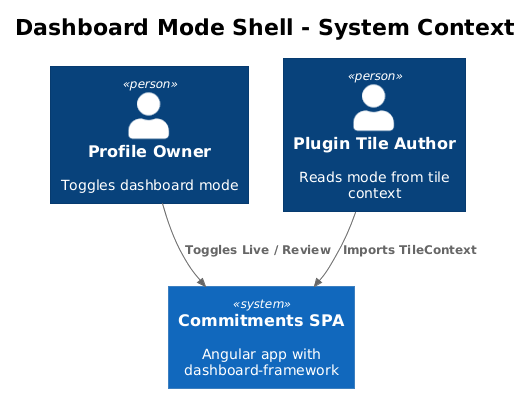
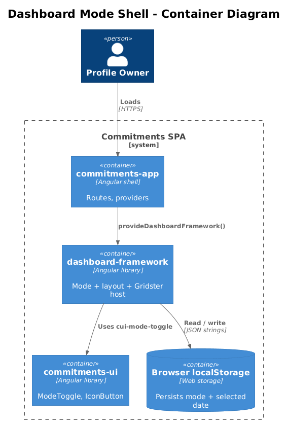
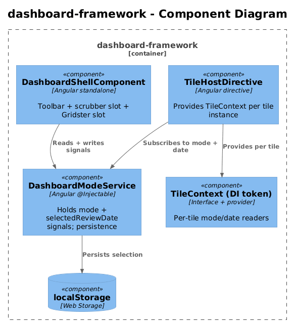
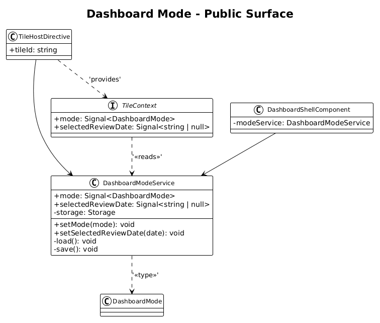
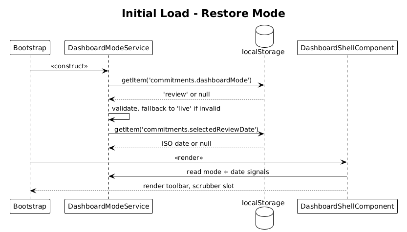
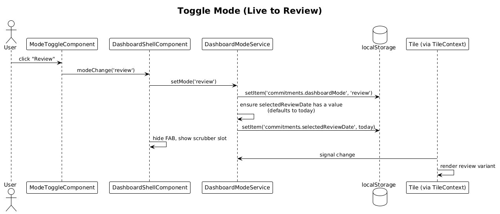

# 04 — Dashboard Mode Shell — Detailed Design

## 1. Overview

Add first-class **dashboard mode** state to `dashboard-framework`: a single `live | review` value that drives which Gridster layout is shown, which controls render, and what context plugin tiles receive. The application shell (`commitments-app`) stays a thin provider/bootstrap host.

**Actors**

- **Profile owner** — toggles between Live and Review on the dashboard.
- **Plugin tile author** — reads the current mode (and selected review date in review mode) from injected context.

**Scope boundary**

- Mode state, persistence, and provider only. Layout structure ships in Feature 05; scrubber ships in Feature 06; tile context contracts ship in Feature 10. This slice produces the *signal*, the *toggle*, and the *context skeleton*.
- No HTTP calls. No tile catalog filtering yet (Feature 10).

## 2. Architecture

### 2.1 C4 Context



### 2.2 C4 Container



`commitments-app` provides `dashboard-framework`'s mode service at app bootstrap. The framework renders the dashboard shell, the mode toggle (from `commitments-ui`), and the slot where Gridster mounts.

### 2.3 C4 Component



Inside `dashboard-framework`: `DashboardShellComponent` ⟶ `DashboardModeService` (signals + persistence) ⟶ `localStorage`. `TileHostDirective` injects a per-tile `TileContext` derived from the mode signal.

## 3. Component Details

### 3.1 DashboardModeService

- **Path**: `frontend/projects/dashboard-framework/src/lib/dashboard/dashboard-mode.service.ts`
- **Provided in**: root (via `provideDashboardFramework()` in `provide-dashboard-framework.ts`).
- **Public signals**:
  - `mode: Signal<DashboardMode>` — `'live'` or `'review'`.
  - `selectedReviewDate: Signal<string | null>` — ISO date `'YYYY-MM-DD'`, only meaningful when `mode === 'review'`. Defaults to today on first switch.
- **Public methods**:
  - `setMode(mode: DashboardMode): void`
  - `setSelectedReviewDate(date: string): void`
- **Persistence**: writes `commitments.dashboardMode` and `commitments.selectedReviewDate` to `localStorage` on every set, reads on construction. Live is the default if storage is empty or invalid.
- **Default**: `live`. Switching to review without a date previously stored sets `selectedReviewDate` to today (UTC date string).

### 3.2 DashboardShellComponent

- **Path**: `frontend/projects/dashboard-framework/src/lib/dashboard/dashboard-shell.component.ts`
- **Responsibility**: Render the toolbar (title + `cui-mode-toggle` + add-tile FAB), the optional scrubber slot (Feature 06 fills it), and the Gridster slot.
- **Template binding**:
  - Mode toggle two-way binds to `modeService.mode`.
  - Add-tile FAB visibility: `*ngIf="modeService.mode() === 'live'"`.
  - Scrubber slot: `*ngIf="modeService.mode() === 'review'"`. The actual scrubber is provided by Feature 06; this slice exposes the projection point.
- **No business logic** — orchestration only.

### 3.3 TileContext (skeleton)

- **Path**: `frontend/projects/dashboard-framework/src/lib/tile-registration/tile-context.ts`
- **Purpose**: An interface tiles inject (via DI) to read mode + review date.
- **Shape (this slice)**:

```ts
export interface TileContext {
  readonly mode: Signal<DashboardMode>;
  readonly selectedReviewDate: Signal<string | null>;
}
```

Feature 10 extends this with `refresh()` and `supportedModes`. This slice ships only the read-side mode signals so plugin tiles can be authored against the contract incrementally.

### 3.4 commitments-app wiring

- **Path**: `frontend/projects/commitments-app/src/app/app.config.ts`
- **Change**: register `provideDashboardFramework()` once. No new app-level state. The shell continues to host routes only; the dashboard route projects `<df-dashboard-shell>`.

## 4. Data Model

### 4.1 Class Diagram



### 4.2 Entity Descriptions

- **DashboardMode** (`'live' | 'review'`) — string literal type.
- **DashboardModeService** — singleton holding the signals and `localStorage` adapter.
- **TileContext** — DI token + interface. No implementation lives in tiles; it's provided per-tile by `TileHostDirective` (Feature 10 finishes this).

No backend changes. No migrations.

## 5. Key Workflows

### 5.1 Initial load



1. App bootstraps. `DashboardModeService` constructor reads `localStorage`.
2. If found and valid, `mode` is restored; otherwise defaults to `live`.
3. `DashboardShellComponent` renders with the appropriate toggle state, FAB visibility, and scrubber slot.

### 5.2 Mode toggle without route reload



1. User taps the Review segment.
2. Shell calls `modeService.setMode('review')`.
3. Service writes signal + localStorage.
4. Shell template re-renders: toggle reflects review, FAB hides, scrubber slot becomes visible.
5. Tile context emits the new mode to subscribed tiles.

## 6. API Contracts

No HTTP. The framework adds two public symbols:

```ts
export type DashboardMode = 'live' | 'review';

export class DashboardModeService {
  readonly mode: Signal<DashboardMode>;
  readonly selectedReviewDate: Signal<string | null>;
  setMode(mode: DashboardMode): void;
  setSelectedReviewDate(date: string): void;
}
```

Both are exported via `dashboard-framework/src/public-api.ts`.

## 7. Security Considerations

- `localStorage` is per-origin, per-profile (browser session). No PII stored — only `'live'`, `'review'`, and an ISO date string.
- Service must validate the persisted mode value on read; unknown values fall back to `'live'`.

## 8. Acceptance

- Toggling between live and review changes mode without route navigation or full re-render of unrelated parts of the app.
- Mode is observable via `TileContext` from any tile registered through the framework.
- The app shell adds nothing more than `provideDashboardFramework()`; no mode logic leaks to `commitments-app`.
- Refreshing the browser keeps the previously selected mode and review date.

## 9. Open Questions

- **Per-profile persistence** — current proposal stores per origin only. If the user has multiple profiles in the same browser, mode is shared across them; is that desired? If not, scope the storage key with `ProfileId`.
- **Selected review date default** — today vs "last selected"? Spec leans toward "today on first ever switch" then "last selected" thereafter; this design follows that.
- **Route binding** — keep mode out of the URL for now (no `?mode=review`)? The toggle owns the source of truth; URL coupling is a future enhancement.
