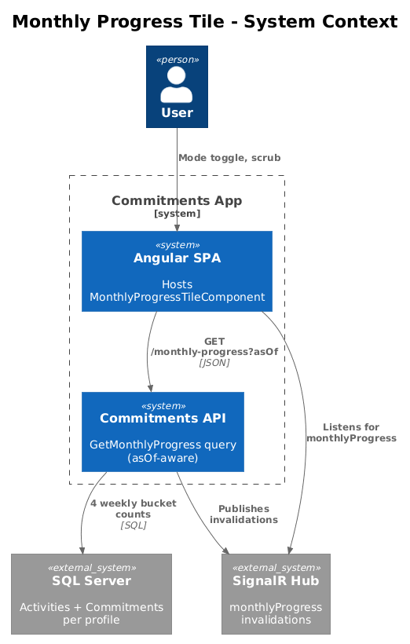
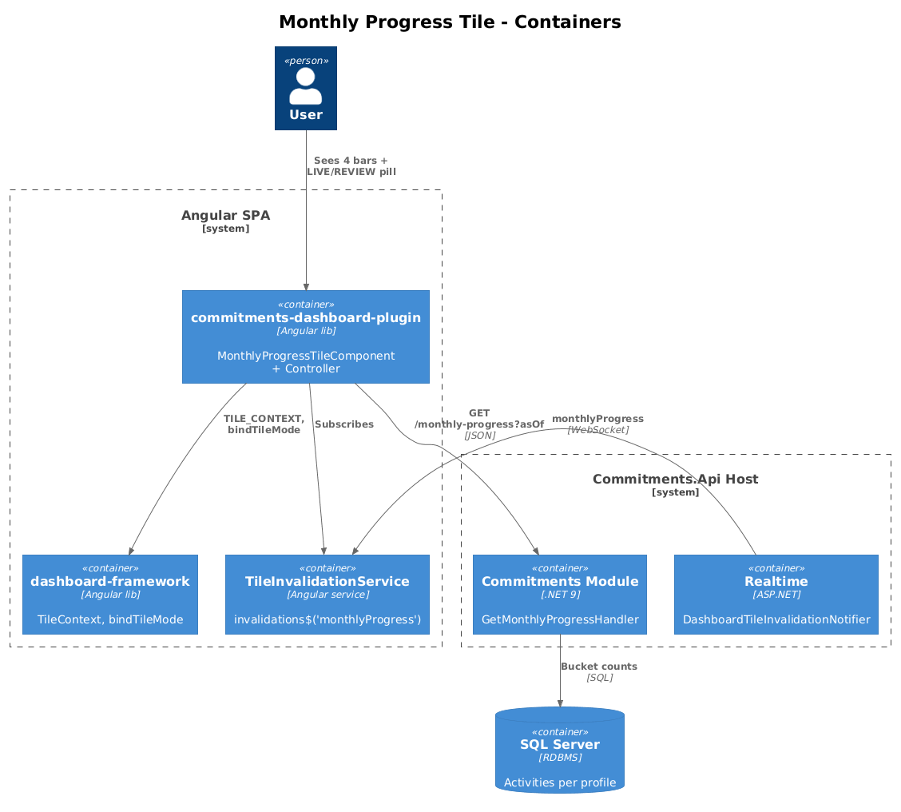
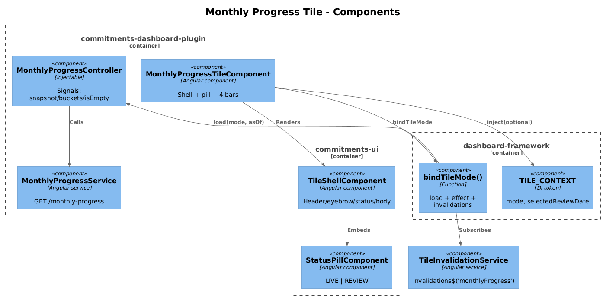
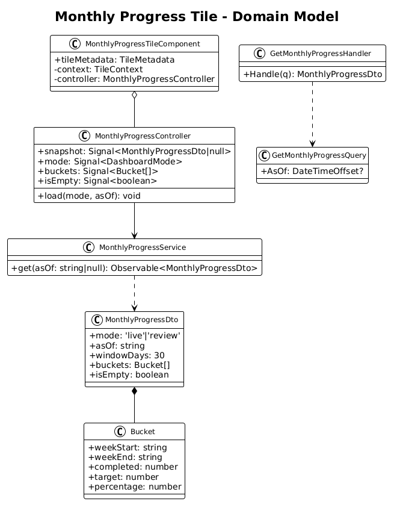
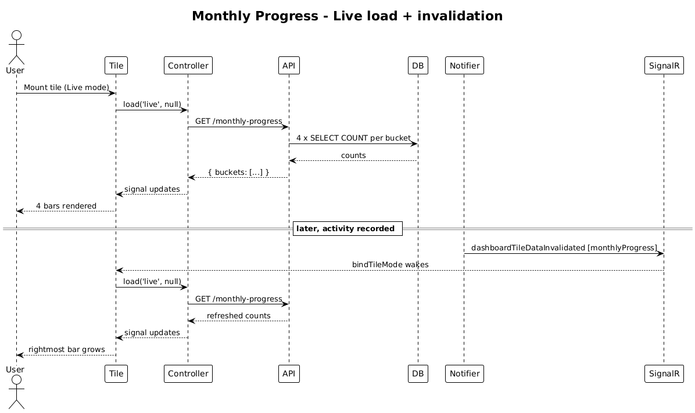
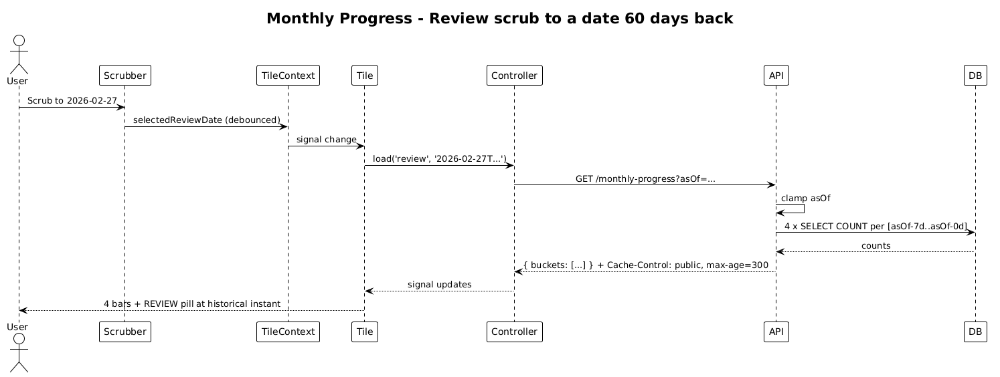

# Monthly Progress Tile — Dual-Mode Design

**Status:** Implemented — 2026-04-27
**Tile ID:** `commitments.monthly-progress`
**Traces to:** L1-010, L1-011, L1-012, **L1-012a**; L2-018, **L2-031a**, L2-038, L2-045.

> Implementation note: SignalR `monthlyProgress` invalidation wiring deferred (cross-lib coupling — same as designs 02/03). Live refresh works via `TileContext.refresh\$`.

## 1. Overview

The Monthly Progress tile renders a **30-day completion trend bucketed into four weekly bars**. Today the four bars are inline-styled at literal heights (35%, 72%, 58%, 86%) — there is no controller, no service, and no API endpoint.

This design gives the tile its first real data layer and makes it dual-mode in a single pass:

- **Live** — `asOf = UtcNow`. Bars represent the four 7-day buckets ending today, with the rightmost bucket including the in-progress week.
- **Review** — `asOf = selectedReviewDate`. Bars represent the four 7-day buckets ending at `asOf`, anchoring the historical view at that instant.

Tile host element does not unmount on mode toggle; bar percentages and the indicator pill are the only things that change.

### Out of scope

- Drilling into a bucket to view per-day breakdown (Consistency Trend covers that).
- Configurable window length (locked at 30 days / 4 buckets in M1).

## 2. Architecture

### 2.1 C4 Context



### 2.2 C4 Container



### 2.3 C4 Component



## 3. Component Details

### 3.1 `MonthlyProgressTileComponent` (modified)

- **Path**: `frontend/projects/commitments-dashboard-plugin/src/lib/tiles/monthly-progress-tile/monthly-progress-tile.component.ts`
- **Responsibility**: render shell + status pill + 4 vertical bars + axis labels.
- **Changes**:
  - Inject `TILE_CONTEXT` (optional). Instantiate `MonthlyProgressController`.
  - `bindTileMode({ context, invalidations$: tileInvalidationService.invalidations$('monthlyProgress'), load })`.
  - Replace literal style attributes with `[style.height.%]="bucket.percentage"` per bar (template `@for(bucket of controller.buckets())`).
  - Add an aria label `"Week N: M% complete"` per bar for screen readers.
  - Bind the `LIVE`/`REVIEW` pill to `controller.mode()`.

### 3.2 `MonthlyProgressController` (new)

- **Path** (new): `frontend/projects/commitments-dashboard-plugin/src/lib/tiles/monthly-progress-tile/monthly-progress.controller.ts`
- **State**:
  ```ts
  readonly snapshot = signal<MonthlyProgressDto | null>(null);
  readonly mode = signal<DashboardMode>('live');
  readonly buckets = computed(() => this.snapshot()?.buckets ?? []);
  ```
- **Methods**: `load(mode, asOf)` → `service.get(asOf)`.
- **Empty-state rule**: if every bucket is 0% (no activities in the window, no commitments), the controller emits a flag (`isEmpty = true`) so the template renders a "no activity in this 30-day window" message instead of four invisible bars.

### 3.3 `MonthlyProgressService` (new, frontend)

- **Path** (new): `frontend/projects/commitments-dashboard-plugin/src/lib/data/monthly-progress.service.ts`
- **Signature**: `get(asOf: string | null): Observable<MonthlyProgressDto>`.

### 3.4 `GetMonthlyProgressHandler` (new, backend)

- **Path** (new): `backend/src/Modules/Commitments/Features/MonthlyProgress/GetMonthlyProgress.cs`
- **Pattern**: vertical slice (request + handler + validator).
- **Behaviour** (single round-trip, EF, profile-scoped):
  1. Resolve `asOf` (default `UtcNow`; clamp to `(profileCreatedAt, UtcNow]`).
  2. Compute four buckets `[asOf - 28d, asOf - 21d), [asOf - 21d, asOf - 14d), [asOf - 14d, asOf - 7d), [asOf - 7d, asOf]`.
  3. For each bucket: `completed = Activities.Count(a => ProfileId == p && a.PerformedOn >= bucketStart && a.PerformedOn < bucketEnd && a.Commitment.Frequency.IsDaily)`, `target = (bucket length in days) * (active per-day commitment count at asOf)`.
  4. `percentage = target > 0 ? clamp(completed / target * 100, 0, 100) : 0`.
- **Cache-Control**: `CacheControlPolicy.For(asOf, utcNow)`.

### 3.5 New module sub-feature folder + controller

- `Modules/Commitments/Features/MonthlyProgress/` is created.
- New `MonthlyProgressController` exposes `GET api/v1.0/monthly-progress?asOf=...`. Uses `[ApiVersion]` per L2-052.

### 3.6 Realtime (no change required)

- `DashboardTileSnapshotEvent.MonthlyProgressUpdated` and `DashboardTileDataset.MonthlyProgress` already exist. The notifier already publishes on Activity/Commitment events.

## 4. Data Model

### 4.1 Class Diagram



### 4.2 DTO

```ts
interface MonthlyProgressDto {
  mode: 'live' | 'review';
  asOf: string;            // ISO datetime
  windowDays: 30;
  buckets: Array<{
    weekStart: string;     // YYYY-MM-DD
    weekEnd: string;       // YYYY-MM-DD (exclusive)
    completed: number;
    target: number;
    percentage: number;    // 0..100
  }>;                      // length === 4
  isEmpty: boolean;
}
```

## 5. Key Workflows

### 5.1 Live load & invalidation



### 5.2 Review scrub



## 6. API Contracts

### `GET /api/v1.0/monthly-progress`

| Param  | Type     | Required | Notes                                                        |
| ------ | -------- | -------- | ------------------------------------------------------------ |
| `asOf` | ISO 8601 | No       | Defaults to `UtcNow`. Clamped to `(profileCreatedAt, UtcNow]`. |

**200**:
```json
{
  "mode": "live",
  "asOf": "2026-04-27T17:00:00Z",
  "windowDays": 30,
  "buckets": [
    { "weekStart": "2026-03-30", "weekEnd": "2026-04-06", "completed": 21, "target": 60, "percentage": 35 },
    { "weekStart": "2026-04-06", "weekEnd": "2026-04-13", "completed": 43, "target": 60, "percentage": 72 },
    { "weekStart": "2026-04-13", "weekEnd": "2026-04-20", "completed": 35, "target": 60, "percentage": 58 },
    { "weekStart": "2026-04-20", "weekEnd": "2026-04-27", "completed": 52, "target": 60, "percentage": 86 }
  ],
  "isEmpty": false
}
```

**Errors**: 400 (bad `asOf`), 401, 403/404 per L2-038.

## 7. Security Considerations

- All scoping continues via `ProfileId` header (L2-038).
- The handler returns counts only — no user-identifying strings — so the L2-045 public cache header is safe for historical responses.
- Per-bucket `target` depends on the *current* count of active per-day commitments at `asOf`, not on a future snapshot. This is intentional: review-mode targets reflect the historical configuration.

## 8. Open Questions

1. **Bucket boundary**: M1 uses `asOf` as the rightmost edge and walks back 7 days at a time. Calendar-aligned weeks (Mon–Sun) would be a behaviour change visible to users (e.g., the rightmost bar would be partial); decide before shipping. Recommendation: keep `asOf`-anchored 7-day buckets — simpler explanation, matches the "30 days back from now" eyebrow copy.
2. **`target` semantics**: M1 uses `(bucket length) × (active per-day commitments at asOf)`. If commitments get a per-frequency target field in the future (e.g., 3x/week), the formula must move to summing per-commitment per-week targets; the DTO is forward-compatible.
3. **Sparkline replacement**: at higher tile widths (XL), four bars feel sparse. Out of scope — visual evolution is tracked separately.
