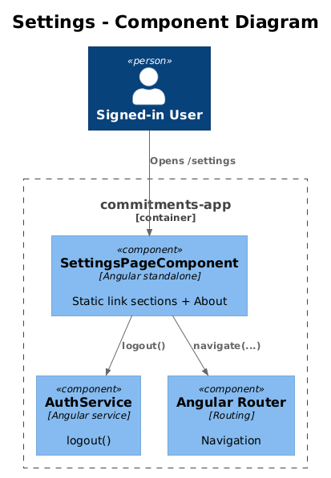
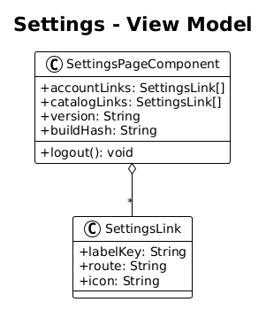
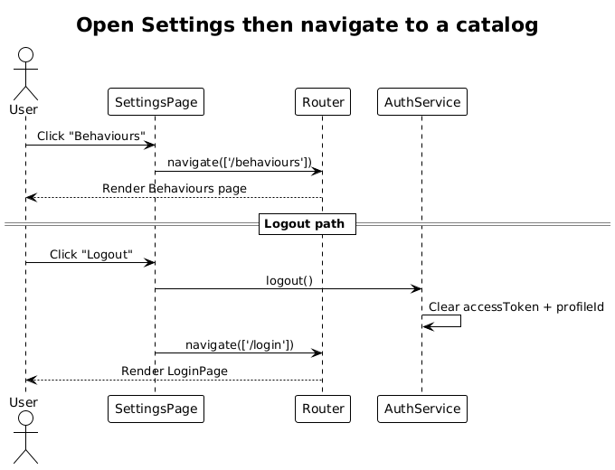

# Settings — Detailed Design

**Traces to:** L1-013, L1-014, L1-035 · L2-035, L2-037

## 1. Overview

The Settings page (`pages/settings`, route `/settings`) is a single-pane summary that links the user to the other admin surfaces and reports app-level state. Per L2-035 the app ships in a single dark theme — Settings does **not** offer a theme toggle. This page is intentionally read-mostly to keep the slice small.

**Actors:** signed-in end user.

**Scope boundary:** no new entities. The page is a curated list of links + an "About" panel. No backend delta is required for the initial slice.

## 2. Architecture

### 2.1 C4 Component

## 3. Component Details

### 3.1 SettingsPageComponent (frontend, exists as placeholder)
- Replace placeholder route with `SettingsPageComponent`.
- Renders three sections:
  1. **Account** — links to `/my-profile`, `/profiles`, and a `Logout` button (calls `AuthService.logout()` and navigates to `/login`).
  2. **Catalogs** — links to `/behaviour-types`, `/behaviours`, `/frequencies`, `/cards`, `/card-layouts`.
  3. **About** — static `version` + build hash from `environment.ts`; pings `GET /api/users/whoami` for liveness (optional follow-up).
- All section content uses the `translate` pipe to satisfy L2-037.

### 3.2 No backend delta
- Existing endpoints are sufficient. The optional `/whoami` endpoint is **deferred** to a follow-up slice.

## 4. Data Model

### 4.1 Class Diagram

The page is essentially a static composition; the only data shape is a small `SettingsLink` view model.

## 5. Key Workflows

### 5.1 Open Settings → navigate to a catalog

## 6. API Contracts

None added in this slice.

## 7. Security Considerations

- `Logout` must call `AuthService.logout()` and navigate to `/login` so the captured pre-login URL is **not** the previous Settings route (prevents an authenticated bounce-back).

## 8. ATDD Slices

1. **Slice A — page wiring:** route + sections + i18n keys. Spec: opening `/settings` shows three sections with translated labels; clicking each link navigates correctly.
2. **Slice B — logout:** Spec: clicking Logout clears `accessToken` and `currentProfileId`, then routes to `/login`.

## 9. Open Questions

- Future settings (locale toggle, density, telemetry opt-out) belong in a separate design once those features exist. Don't add them here.
