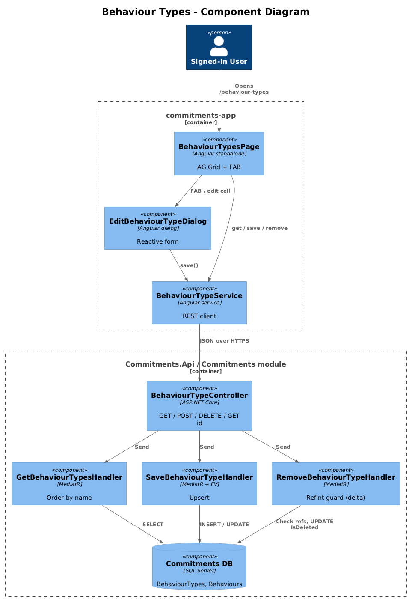
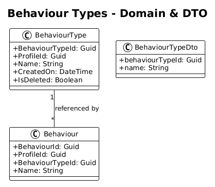
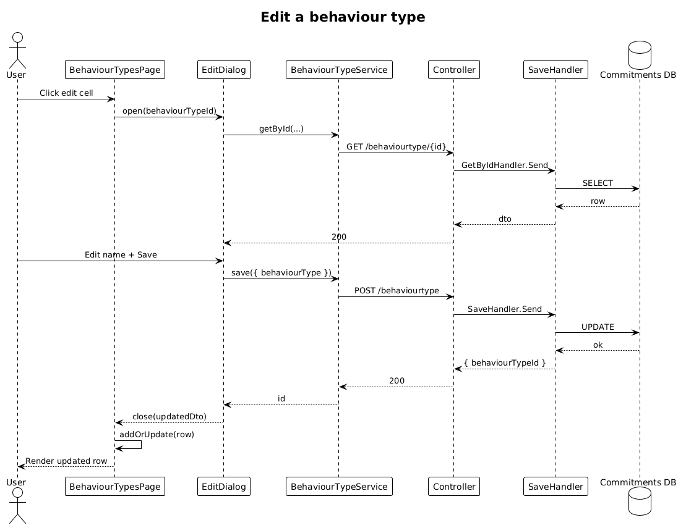

# Behaviour Types — Detailed Design

**Traces to:** L1-003 · L2-006

## 1. Overview

The Behaviour Types page (`pages/behaviour-types`, route `/behaviour-types`) lists, creates, edits, and deletes the catalog of behaviour types referenced by `Behaviour.BehaviourTypeId`. CRUD is performed via `EditBehaviourTypeDialog` (FAB to create, edit cell to update). Deletion is rejected when at least one `Behaviour` references the type.

**Actors:** signed-in end user maintaining the behaviour-type catalog.

## 2. Architecture

### 2.1 C4 Component

## 3. Component Details

### 3.1 BehaviourTypesPageComponent (frontend, exists)
- Already contains AG Grid wiring. **Delta:** replace placeholder route with this component in `app.routes.ts`.

### 3.2 EditBehaviourTypeDialog (frontend, exists)
- Already implemented. No delta.

### 3.3 BehaviourTypeController (backend, exists)
- Full CRUD already implemented (`Save`, `Remove`, `GetById`, `Get`).
- **Delta:** `RemoveBehaviourTypeHandler` currently soft-deletes unconditionally. Add a referential-integrity guard: reject (return `400` with message `Cannot delete: referenced by N behaviour(s)`) when any `Behaviour.BehaviourTypeId == id` and `IsDeleted = false`.

## 4. Data Model

### 4.1 Class Diagram

## 5. Key Workflows

### 5.1 Edit a behaviour type

## 6. API Contracts (existing, route prefix `/api/v1.0`)

| Method | Route | Body / Params | Response |
|--------|-------|----------------|----------|
| GET | `/behaviourtype` | — | `200 { behaviourTypes: BehaviourTypeDto[] }` |
| GET | `/behaviourtype/{behaviourTypeId}` | — | `200 { behaviourType }` / `404` |
| POST | `/behaviourtype` | `{ behaviourType }` | `200 { behaviourTypeId }` |
| DELETE | `/behaviourtype/{behaviourTypeId}` | — | `200` / `400` if referenced |

All routes carry `Authorize` + `ProfileId` header per L2-038.

## 7. Security Considerations

- Behaviour types are profile-scoped (per `BaseDbContext` query filter on `ProfileId`).
- Referential-integrity check is a service-level guard (not a DB FK) because the existing schema does not enforce FK between `Behaviour.BehaviourTypeId` and `BehaviourType.BehaviourTypeId`. A follow-up migration may add the FK; out of scope for this slice.

## 8. ATDD Slices

1. **Slice A — route wiring + spec:** replace placeholder with real component. Spec: list loads ordered by name; FAB opens dialog; saving appends/updates a row.
2. **Slice B — referential integrity:** add guard in `RemoveBehaviourTypeHandler`. Spec: deleting a type used by at least one behaviour returns 400 and the row remains.

## 9. Open Questions

- Should rows display the count of behaviours per type? Keep out of this slice; add a `usageCount` projection later if UX asks.
