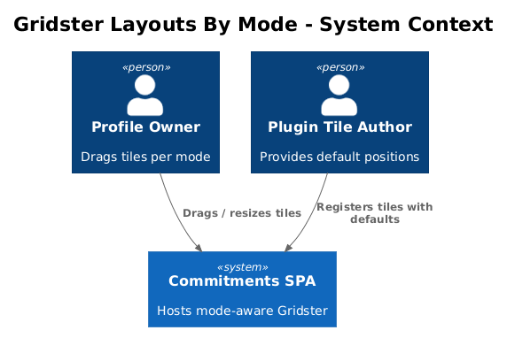
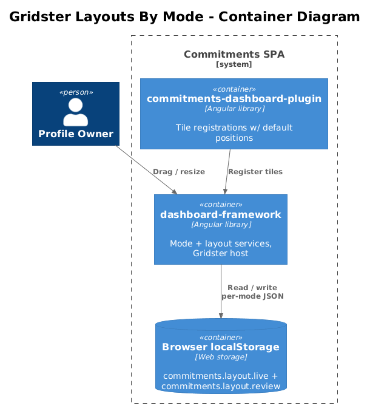
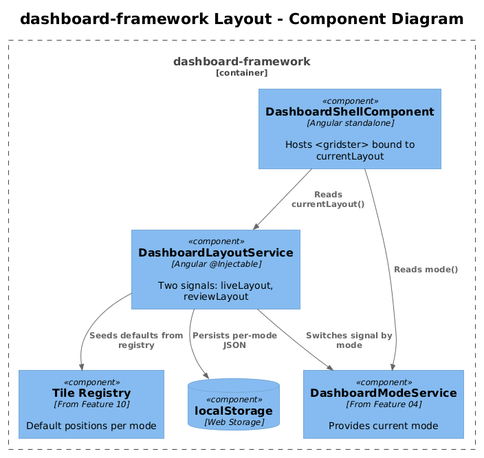
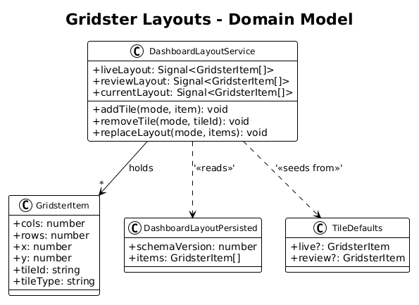
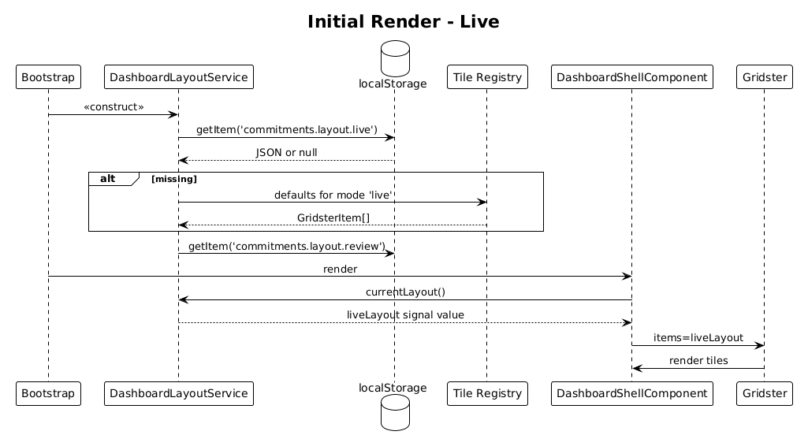
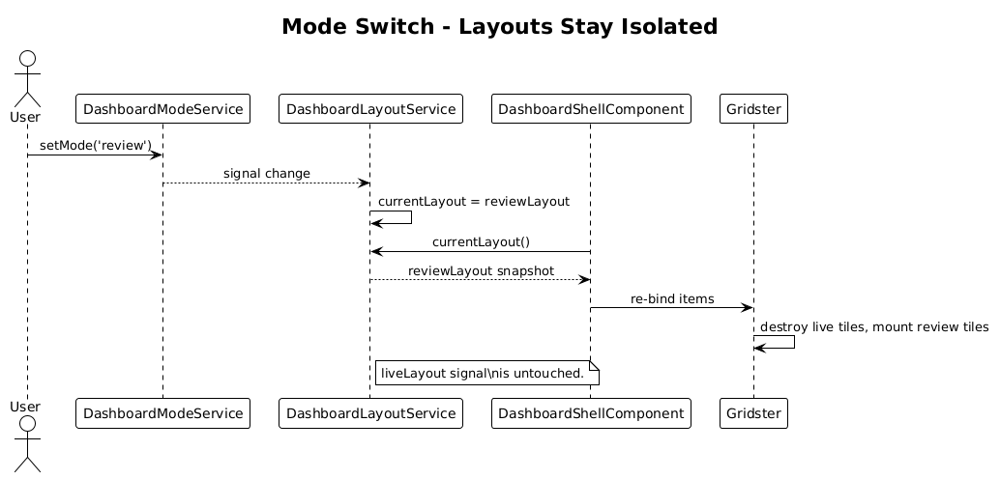
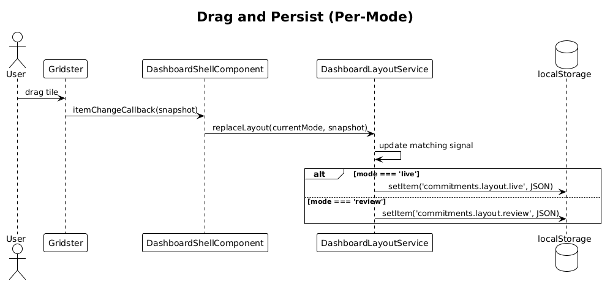

# 05 — Gridster Layouts By Mode — Detailed Design

## 1. Overview

Define **separate Gridster layouts for live and review** so the two dashboards can evolve independently and never overwrite each other's persisted positions. Live uses `39pLD` (LG) / `yZqDW` (XL); review uses `TFRTa` (LG) / `wk1pH` (XL).

This is the structural layer on top of Feature 04 (mode signal): the framework now keeps two `GridsterItem[]` arrays and shows whichever matches the current mode.

**Actors**

- **Profile owner** — drags tiles and persists the layout per mode.
- **Plugin tile author** — provides default positions in *each* mode where the tile is supported.

**Scope boundary**

- Layout structure, persistence, and per-mode default positions.
- Does not touch tile rendering internals (Features 07–09) or the mode-aware tile contract (Feature 10) beyond reading the existing `tileId`/`type` from registration metadata.
- No backend.

## 2. Architecture

### 2.1 C4 Context



### 2.2 C4 Container



`DashboardShellComponent` mounts a `<gridster>` and feeds it the layout array selected by the current mode. Persistence reads/writes two distinct localStorage keys.

### 2.3 C4 Component



`DashboardLayoutService` keeps one `WritableSignal<GridsterItem[]>` per mode plus a default catalog (per-mode default positions seeded from tile registration metadata). `DashboardShellComponent` binds Gridster to whichever signal matches the current mode.

## 3. Component Details

### 3.1 DashboardLayoutService

- **Path**: `frontend/projects/dashboard-framework/src/lib/dashboard/dashboard-layout.service.ts`
- **State (signals)**:
  - `liveLayout: WritableSignal<GridsterItem[]>`
  - `reviewLayout: WritableSignal<GridsterItem[]>`
  - `currentLayout = computed(() => mode() === 'live' ? liveLayout() : reviewLayout())`
- **Persistence**:
  - `commitments.layout.live` → JSON of `liveLayout`.
  - `commitments.layout.review` → JSON of `reviewLayout`.
  - Validate on read; fall back to defaults if shape is wrong.
- **Public methods**:
  - `addTile(mode, item: GridsterItem): void`
  - `removeTile(mode, tileId: string): void`
  - `replaceLayout(mode, items: GridsterItem[]): void` — called by Gridster's change event, writes signal + storage.
- **Constructor**: reads both keys; if either is missing, seeds defaults from the tile registry (Feature 10 finalises the registry; this slice consumes whatever shape is present today plus a mode hint).

### 3.2 DashboardShellComponent (extended from Feature 04)

- **Template change**:
  ```html
  <gridster [options]="gridsterOptions" >
    @for (item of layoutService.currentLayout(); track item.tileId) {
      <gridster-item [item]="item">
        <ng-container [tileHost]="item.tileId" />
      </gridster-item>
    }
  </gridster>
  ```
- **Add-tile FAB**: only shown in live mode (already wired in Feature 04).
- **No layout logic in this component** — every mutation goes through the service.

### 3.3 Gridster options

- **`gridType: 'fit'`** with breakpoint-aware column counts:
  - LG (≥ 1280 px): 12 cols, matching `39pLD` / `TFRTa`.
  - XL (≥ 1920 px): 16 cols, matching `yZqDW` / `wk1pH`.
  - MD (≥ 768 px): 8 cols, fallback for tablet — derived from L2-034 / L2-036 responsive requirements.
- **`displayGrid: 'onDrag'`**, **`pushItems: true`**, **`disablePushOnDrag: false`**.
- **`itemChangeCallback`** + **`itemResizeCallback`** call `layoutService.replaceLayout(mode, snapshot)`.

### 3.4 Default position metadata (per-mode)

Tile registrations (extended in Feature 10) include `defaultPositions: { live?: GridsterItem; review?: GridsterItem }`. This slice:

- Reads whatever default the registration exposes (single `defaultPosition` today + the new optional `defaultPositions` map).
- Seeds the `live` layout from `defaultPositions.live ?? defaultPosition`.
- Seeds the `review` layout from `defaultPositions.review` only — if a tile has no review default, it is omitted from the review layout.

### 3.5 commitments-app

No changes. The dashboard route still mounts `<df-dashboard-shell>`.

## 4. Data Model

### 4.1 Class Diagram



### 4.2 Entity Descriptions

- **GridsterItem** — `angular-gridster2`'s shape, extended with `tileId: string` and `tileType: string` so tile host knows which plugin to render.
- **DashboardLayoutPersisted** — `{ items: GridsterItem[], schemaVersion: number }`. Schema version guards against breaking shape changes.
- **TileDefaults** — registration-side metadata: `{ live?: GridsterItem; review?: GridsterItem }`.

No backend, no migrations.

## 5. Key Workflows

### 5.1 Initial render in live mode



1. `DashboardLayoutService` constructor reads both storage keys.
2. If `live` key missing, seeds from tile registry defaults.
3. Shell binds Gridster to `currentLayout()` (= `liveLayout`).
4. Tiles render in their default or persisted positions.

### 5.2 Mode switch — review layout shown without overwriting live



1. User toggles to review (Feature 04 updates `mode` signal).
2. Shell's `currentLayout` computed switches to `reviewLayout()`.
3. Gridster destroys and re-creates items for the review set.
4. Subsequent drag events write to `commitments.layout.review` only.

### 5.3 Drag and persist



1. User drags a tile.
2. Gridster `itemChangeCallback` fires.
3. Shell calls `layoutService.replaceLayout(currentMode, gridster.snapshot)`.
4. Service updates the matching signal and writes its localStorage key.

## 6. API Contracts

No HTTP. New public surface:

```ts
export class DashboardLayoutService {
  readonly liveLayout: Signal<GridsterItem[]>;
  readonly reviewLayout: Signal<GridsterItem[]>;
  readonly currentLayout: Signal<GridsterItem[]>;
  addTile(mode: DashboardMode, item: GridsterItem): void;
  removeTile(mode: DashboardMode, tileId: string): void;
  replaceLayout(mode: DashboardMode, items: GridsterItem[]): void;
}
```

## 7. Security Considerations

- Same as Feature 04: localStorage holds positions only, no PII.
- Persisted JSON is validated against a schema before being applied; corrupt data falls back to defaults rather than crashing the dashboard.

## 8. Acceptance

- Dragging a tile in live mode does **not** affect the persisted review layout (and vice versa).
- Review mode does not show the add-tile FAB.
- LG and XL viewports match the design exports for both live (`39pLD`, `yZqDW`) and review (`TFRTa`, `wk1pH`) within tolerance.
- Removing a tile only removes it from the current mode's layout.
- Clearing both storage keys returns the dashboard to the seeded defaults for the current mode.

## 9. Open Questions

- **Tile present in live but not in review** — current proposal: omit from review layout entirely. Alternative: render disabled with a "live-only" hint. Pick on review of Feature 10.
- **Schema migrations** — the persisted JSON includes `schemaVersion: 1`. If the shape ever changes, do we silently reset or migrate? Lean toward "reset with toast notification" for v1.
- **Add-tile from review mode** — the spec says the FAB is hidden, but does the user need a way to add review-only tiles? Open until Feature 10.
