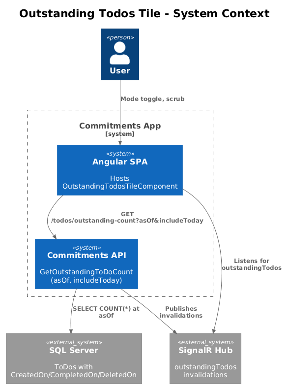
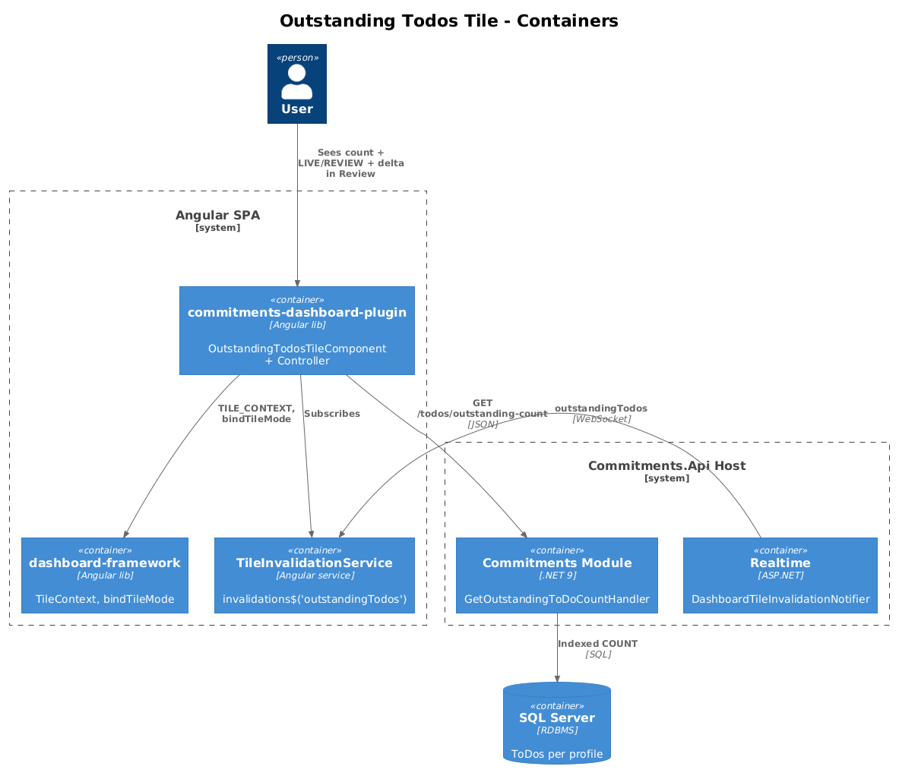
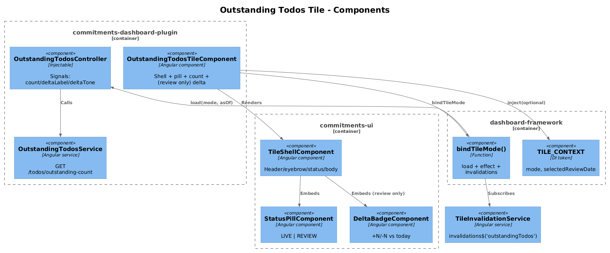
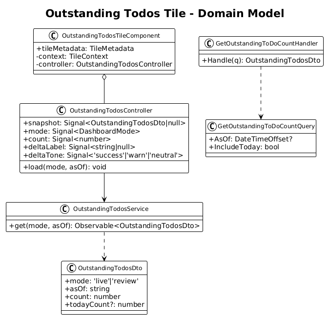
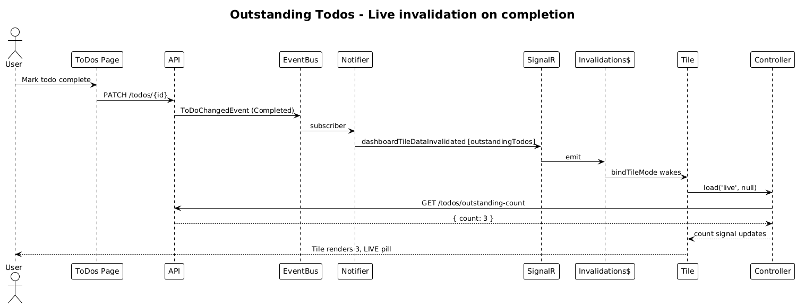
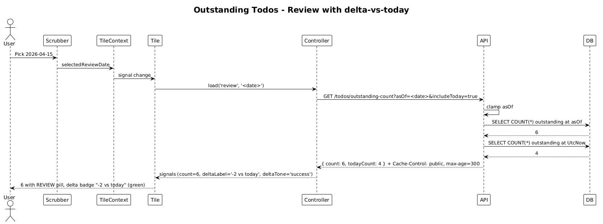

# Outstanding Todos Tile — Dual-Mode Design

**Status:** Accepted — 2026-04-27
**Tile ID:** `commitments.outstanding-todos`
**Traces to:** L1-010, L1-011, L1-012, **L1-012a**; L2-016, L2-018, **L2-031a**, L2-031, L2-038, L2-045.

## 1. Overview

The Outstanding Todos tile shows a single, glanceable count of to-dos waiting on the user. Today the literal value `4` is hard-coded in the template; the backend already emits `ToDoChangedEvent` and `dashboardTileDataInvalidated [outstandingTodos]` payloads, but there is no count endpoint and no controller.

This design wires the tile to a count endpoint and makes it dual-mode:

- **Live** — shows the count of currently-outstanding to-dos (`Created ∧ ¬Completed ∧ ¬Removed`) for the active profile, refreshed on every `outstandingTodos` invalidation.
- **Review** — shows what the same outstanding count *was* at `selectedReviewDate`, plus an L2-031-style `±N vs today` delta indicator (warn colour when historical was lower / today is worse, success when historical was higher / today is better).

The host element does not unmount on mode toggle; only the indicator pill, count, and (in Review) the delta caption update.

### Out of scope

- Per-item drill-down or per-item completion UI; these live elsewhere.
- "Outstanding by tag" or per-list filtering — M1 is a single profile-wide count.

## 2. Architecture

### 2.1 C4 Context



### 2.2 C4 Container



### 2.3 C4 Component



## 3. Component Details

### 3.1 `OutstandingTodosTileComponent` (modified)

- **Path**: `frontend/projects/commitments-dashboard-plugin/src/lib/tiles/outstanding-todos-tile/outstanding-todos-tile.component.ts`
- **Responsibility**: shell + status pill + large warning-coloured count + supporting copy + (Review only) delta badge.
- **Changes**:
  - Inject `TILE_CONTEXT` (optional). Instantiate `OutstandingTodosController`.
  - `bindTileMode({ context, invalidations$: tileInvalidationService.invalidations$('outstandingTodos'), load })`.
  - Replace literal `4` with `[textContent]="controller.count()"`.
  - Conditionally render `<commitments-delta-badge>` (existing) when `controller.mode() === 'review' && controller.deltaLabel() != null`.
  - Bind status pill to `controller.mode()`.

### 3.2 `OutstandingTodosController` (new)

- **Path** (new): `frontend/projects/commitments-dashboard-plugin/src/lib/tiles/outstanding-todos-tile/outstanding-todos.controller.ts`
- **State**:
  ```ts
  readonly snapshot = signal<OutstandingTodosDto | null>(null);
  readonly mode = signal<DashboardMode>('live');
  readonly count = computed(() => this.snapshot()?.count ?? 0);
  readonly deltaLabel = computed(() => {
    const s = this.snapshot();
    if (!s || this.mode() !== 'review' || s.todayCount == null) return null;
    const d = s.count - s.todayCount;
    if (d === 0) return '±0 vs today';
    return `${d > 0 ? '+' : ''}${d} vs today`;
  });
  readonly deltaTone = computed(() => {
    // This is an inverted metric: lower is better.
    const s = this.snapshot();
    if (!s || this.mode() !== 'review' || s.todayCount == null) return 'neutral';
    if (s.count > s.todayCount) return 'success';      // historical was worse → today is better
    if (s.count < s.todayCount) return 'warn';         // historical was better → today is worse
    return 'neutral';
  });
  ```
- **Methods**: `load(mode, asOf)` — single fetch returns `count` plus, when `mode === 'review'`, `todayCount` as well so the delta is computed without a second round-trip.

### 3.3 `OutstandingTodosService` (new, frontend)

- **Path** (new): `frontend/projects/commitments-dashboard-plugin/src/lib/data/outstanding-todos.service.ts`
- **Signature**: `get(mode: DashboardMode, asOf: string | null): Observable<OutstandingTodosDto>`.
  - Live mode: `GET /api/v1.0/todos/outstanding-count`.
  - Review mode: `GET /api/v1.0/todos/outstanding-count?asOf=<date>&includeToday=true`.

### 3.4 Backend handler (new)

- **Path** (new): `backend/src/Modules/Commitments/Features/ToDo/Queries/GetOutstandingToDoCount.cs` (location depends on which module owns to-dos — see Open Questions; today, `ToDoChangedEvent` is in `Commitments.Shared`, indicating the Commitments module).
- **Pattern**: vertical slice — `GetOutstandingToDoCountQuery { AsOf: DateTimeOffset?; IncludeToday: bool }` + handler.
- **Definition of "outstanding"** (per the existing tile README and L2-016):
  - `IsCreated == true ∧ IsCompleted == false ∧ IsDeleted == false` *and* (`asOf == null || (CreatedOn <= asOf ∧ (CompletedOn == null || CompletedOn > asOf) ∧ (DeletedOn == null || DeletedOn > asOf))`).
  - In other words: a to-do is "outstanding at `asOf`" if it had been created by `asOf` and had not yet been completed or removed by `asOf`.
- **Behaviour**:
  1. Resolve `asOf` (default `UtcNow`; clamp to `(profileCreatedAt, UtcNow]`).
  2. Query: `count = Todos.Count(predicate(asOf))`.
  3. If `IncludeToday`: `todayCount = Todos.Count(predicate(UtcNow))` (a second SELECT COUNT, both indexed).
- **Cache-Control**: `CacheControlPolicy.For(asOf, utcNow)`.

### 3.5 `ToDoController` (modified or new)

- Add `GET api/v1.0/todos/outstanding-count?asOf=&includeToday=` action that dispatches the query.
- If a `ToDoController` does not exist yet under the Commitments module, create one; respect L2-052 versioning.

### 3.6 Realtime (no change required)

- `ToDoChangedEvent` already fires on Created/Updated/Removed/Completed. `DashboardTileInvalidationNotifier` already emits the `outstandingTodos` dataset on these events.

## 4. Data Model

### 4.1 Class Diagram



### 4.2 DTO

```ts
interface OutstandingTodosDto {
  mode: 'live' | 'review';
  asOf: string;            // ISO datetime
  count: number;           // outstanding count at asOf
  todayCount?: number;     // populated only when mode === 'review' && includeToday
}
```

## 5. Key Workflows

### 5.1 Live invalidation on to-do completion



### 5.2 Review with delta-vs-today



The historical count and today's count come back in the same response so the delta caption renders without a second round-trip and survives offline cache replays.

## 6. API Contracts

### `GET /api/v1.0/todos/outstanding-count`

| Param          | Type     | Required | Notes                                                        |
| -------------- | -------- | -------- | ------------------------------------------------------------ |
| `asOf`         | ISO 8601 | No       | Defaults to `UtcNow`. Clamped.                               |
| `includeToday` | bool     | No       | Default `false`. When `true` the response also carries `todayCount`. |

**200**:
```json
{ "mode": "live", "asOf": "2026-04-27T17:00:00Z", "count": 4 }
```

```json
{ "mode": "review", "asOf": "2026-04-15T18:30:00Z", "count": 6, "todayCount": 4 }
```

**Errors**: 400 (bad `asOf`), 401, 403/404 per L2-038.

## 7. Security Considerations

- Profile scoping per L2-038. The query never crosses profiles.
- The historical count carries no user-identifying text. Cacheable per L2-045.
- `includeToday` does **not** allow leaking another profile's data; both queries run within the active profile filter.

## 8. Open Questions

1. **Module ownership of To-Dos**: today the `ToDoChangedEvent` lives in `Commitments.Shared`, suggesting the Commitments module owns to-dos. Confirm before placing the new query path. If To-Dos is its own bounded context (deferred), this design's path moves but the contract is unchanged.
2. **Soft-delete semantics for `asOf`**: this design assumes the `Todos` table preserves `CompletedOn` and `DeletedOn` timestamps. If only `IsCompleted` and `IsDeleted` flags exist (no timestamp), historical reconstruction is impossible — a small migration is required (`CompletedOn DATETIMEOFFSET NULL`, `DeletedOn DATETIMEOFFSET NULL` populated by `BaseDbContext.SavingChanges`). Confirm during implementation kickoff.
3. **Delta tone polarity**: this design treats Outstanding as inverted (more = worse). The `<commitments-delta-badge>` will need a `[invertColours]` flag or the controller will need to pass an explicit `tone` rather than letting the badge derive it from the sign of the number. Recommendation: pass explicit `tone` from the controller — keeps the badge dumb.
