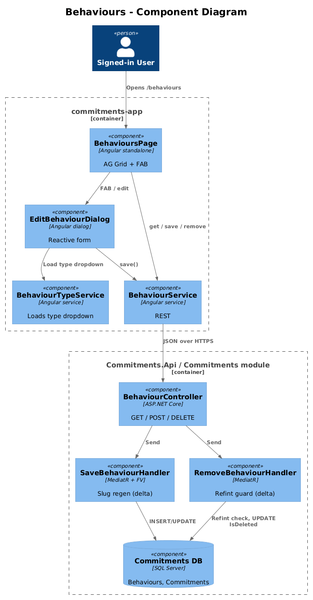
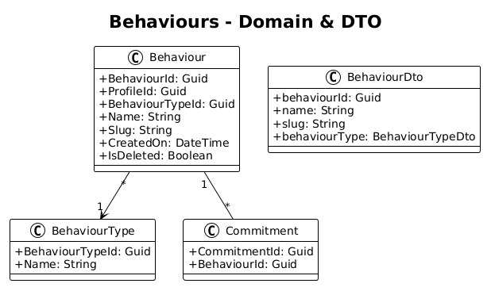
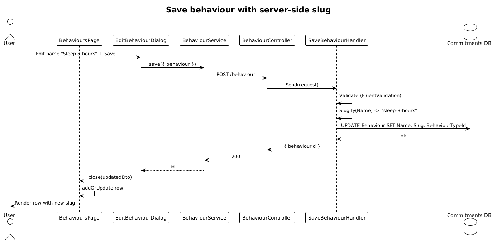

# Behaviours — Detailed Design

**Status:** Accepted

**Traces to:** L1-003 · L2-005

## 1. Overview

The Behaviours page (`pages/behaviours`, route `/behaviours`) lists all behaviours for the active profile and lets the user create, edit, and delete them via `EditBehaviourDialog`. Each row shows name, slug, and behaviour-type name. Slug is regenerated server-side on every save (L2-005 AC #2). Deletion is rejected when at least one `Commitment` references the behaviour (L2-005 AC #3).

## 2. Architecture

### 2.1 C4 Component

## 3. Component Details

### 3.1 BehavioursPageComponent (frontend, exists)
- Replace placeholder route with this component.
- Columns: name, slug, behaviour-type name, edit, delete.

### 3.2 EditBehaviourDialog (frontend, exists)
- Already loads the behaviour-type list for the type dropdown.

### 3.3 BehaviourController (backend, exists)
- Save / Remove / GetById / Get already implemented.
- **Delta — slug:** `SaveBehaviourHandler` must compute `Slug` from `Name` (`name → trim → lowercase → replace non-alphanumeric with -`) on every insert and update, ignoring any client-supplied slug.
- **Delta — referential integrity:** `RemoveBehaviourHandler` rejects when any non-deleted `Commitment.BehaviourId == id`.

## 4. Data Model

### 4.1 Class Diagram

## 5. Key Workflows

### 5.1 Save behaviour with slug regeneration

## 6. API Contracts (existing routes, prefix `/api/v1.0/behaviour`)

| Method | Route | Body / Params | Response |
|--------|-------|----------------|----------|
| GET | `/behaviour` | — | `200 { behaviours: BehaviourDto[] }` |
| POST | `/behaviour` | `{ behaviour }` | `200 { behaviourId }` |
| DELETE | `/behaviour/{behaviourId}` | — | `200` / `400 (referenced)` |

## 7. Security Considerations

- Profile-scoped via global query filter; the handler also asserts `request.Behaviour.ProfileId = httpContextAccessor.GetProfileId()` (existing pattern in `ActivityController`).
- Slug regeneration server-side prevents the client from spoofing a duplicate or reserved slug.

## 8. ATDD Slices

1. **Slice A — route wiring + list spec.** Spec: list shows correct columns; FAB opens dialog; saving adds a row.
2. **Slice B — slug regen.** Spec: changing name from "Drink Water" to "Sleep 8 hours" updates `slug` to `sleep-8-hours` regardless of client value.
3. **Slice C — refint on delete.** Spec: a behaviour referenced by a commitment cannot be deleted.

## 9. Open Questions

- Should slugs be unique per profile? Recommendation: yes — index `(ProfileId, Slug)` + return 409 on conflict in a follow-up slice.
