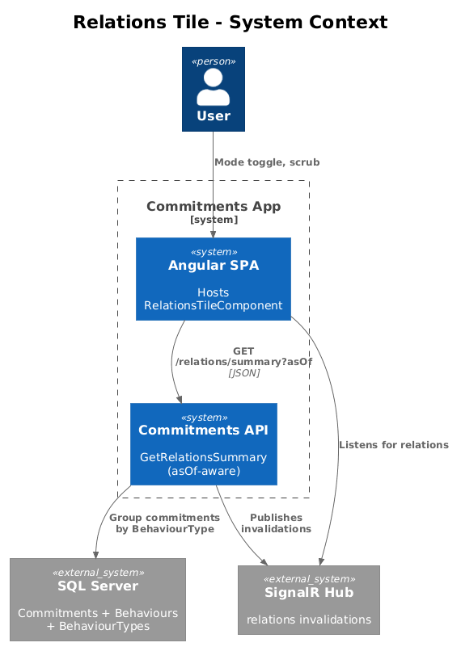
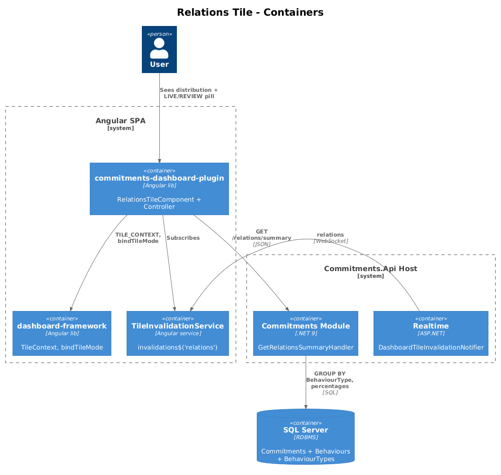
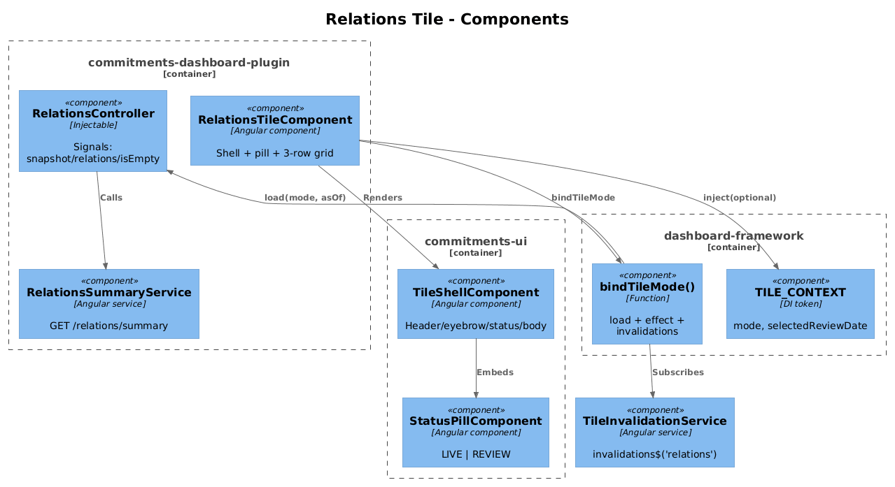
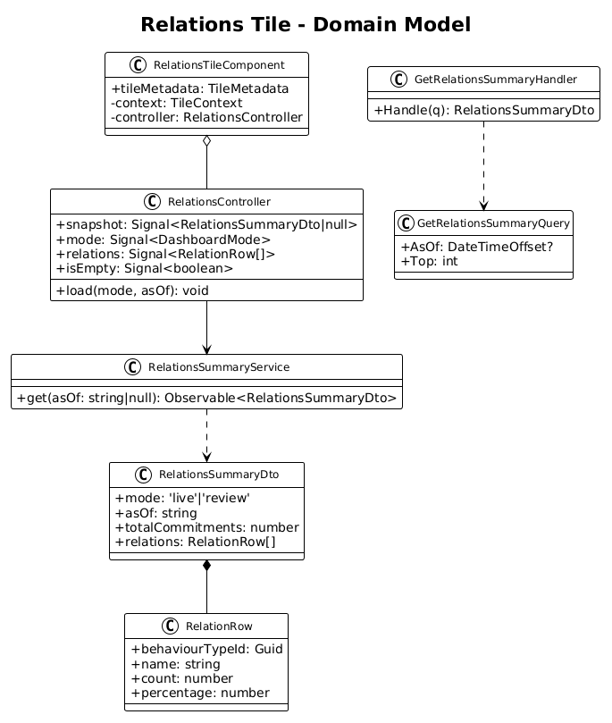
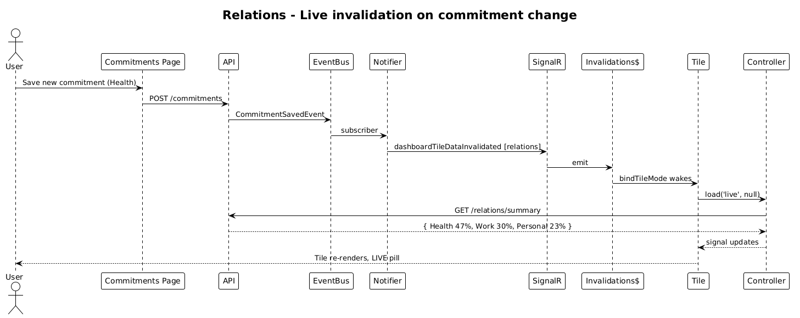
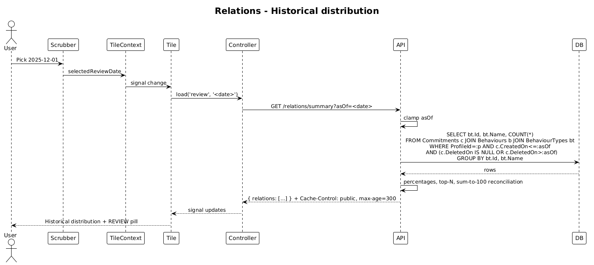

# Relations Tile — Dual-Mode Design

**Status:** Implemented — 2026-04-27
**Tile ID:** `commitments.relations`
**Traces to:** L1-010, L1-011, L1-012, **L1-012a**; L2-018, **L2-031a**, L2-038, L2-045.

> Implementation notes:
> - **Largest-remainder rounding** ensures percentages sum to exactly 100 even when raw fractions don't divide evenly.
> - **Top capping** server-side: 1..10 (default 3 per `RelationsController`).
> - **`Commitments.DeletedOn` not yet on the schema** — the M1 query uses `CreatedOn <= asOf` and relies on the `BaseDbContext` global soft-delete filter (which excludes currently-deleted rows). Strict historical reconstruction across deletions is deferred until `DeletedOn` lands on `BaseEntity`.
> - **SignalR `relations` invalidation** wiring deferred (cross-lib coupling — same as designs 02-05). Live refresh works via `TileContext.refresh\$`.

## 1. Overview

The Relations tile renders the **distribution of a user's commitments across life domains** (e.g. Health 42% / Work 33% / Personal 25%). Today the tile is a static placeholder — there is no controller, no service, and no API endpoint.

This design wires the tile to a snapshot endpoint and makes it dual-mode in a single pass:

- **Live** — `asOf = UtcNow`. Shows the current category distribution of *active* commitments.
- **Review** — `asOf = selectedReviewDate`. Shows the distribution **as it stood at the selected instant** — i.e., counting commitments created on or before `asOf` and not soft-deleted by `asOf`.

The host element does not unmount on mode toggle; only the indicator pill and per-row percentages update.

### Out of scope

- Per-row drill-down navigation.
- User-curated category names — M1 derives categories from `BehaviourType`. A dedicated "category" entity is deferred.

## 2. Architecture

### 2.1 C4 Context



### 2.2 C4 Container



### 2.3 C4 Component



## 3. Component Details

### 3.1 `RelationsTileComponent` (modified)

- **Path**: `frontend/projects/commitments-dashboard-plugin/src/lib/tiles/relations-tile/relations-tile.component.ts`
- **Responsibility**: shell + status pill + 3-row CSS grid (label, percentage).
- **Changes**:
  - Inject `TILE_CONTEXT` (optional). Instantiate `RelationsController`.
  - `bindTileMode({ context, invalidations$: tileInvalidationService.invalidations$('relations'), load })`.
  - Replace literal rows with `@for(r of controller.relations())` rendering `r.name` / `r.percentage`.
  - Bind status pill to `controller.mode()`.

### 3.2 `RelationsController` (new)

- **Path** (new): `frontend/projects/commitments-dashboard-plugin/src/lib/tiles/relations-tile/relations.controller.ts`
- **State**:
  ```ts
  readonly snapshot = signal<RelationsSummaryDto | null>(null);
  readonly mode = signal<DashboardMode>('live');
  readonly relations = computed(() => this.snapshot()?.relations ?? []);
  readonly isEmpty = computed(() => this.relations().length === 0);
  ```
- **Methods**: `load(mode, asOf)` → `service.get(asOf)`.
- **Empty rule**: if the active profile has no commitments, `relations` is `[]`; the template renders a "no commitments yet" placeholder.

### 3.3 `RelationsSummaryService` (new, frontend)

- **Path** (new): `frontend/projects/commitments-dashboard-plugin/src/lib/data/relations-summary.service.ts`
- **Signature**: `get(asOf: string | null): Observable<RelationsSummaryDto>`.

### 3.4 `GetRelationsSummaryHandler` (new, backend)

- **Path** (new): `backend/src/Modules/Commitments/Features/Relations/GetRelationsSummary.cs`
- **Behaviour**:
  1. Resolve `asOf` (default `UtcNow`; clamp to `(profileCreatedAt, UtcNow]`).
  2. Determine the active commitment population at `asOf`:
     ```sql
     FROM Commitments c
     JOIN Behaviours b ON b.Id = c.BehaviourId
     JOIN BehaviourTypes bt ON bt.Id = b.BehaviourTypeId
     WHERE c.ProfileId = :p
       AND c.CreatedOn <= :asOf
       AND (c.DeletedOn IS NULL OR c.DeletedOn > :asOf)
     ```
  3. Group by `bt.Id, bt.Name`, count, divide by total to get percentages, round to whole numbers; reconcile rounding so percentages sum to exactly 100.
  4. Sort by percentage desc; cap at top-N (default 3 to fit the existing 3-row visual; configurable via `?top=N`, capped server-side).
- **Cache-Control**: `CacheControlPolicy.For(asOf, utcNow)`.

### 3.5 `RelationsController` (new, backend) — note name collision

- The Angular component class is `RelationsController`; the backend C# controller class is also conventionally named `RelationsController`. They live in different namespaces and there is no actual collision, but reviewers occasionally find it confusing — call this out in the PR description.
- Exposes `GET api/v1.0/relations/summary?asOf=&top=`.

### 3.6 Realtime (no change required)

- `DashboardTileSnapshotEvent.RelationsSummaryUpdated` and `DashboardTileDataset.Relations` already exist; the existing notifier already publishes on Commitment changes.

## 4. Data Model

### 4.1 Class Diagram



### 4.2 DTO

```ts
interface RelationsSummaryDto {
  mode: 'live' | 'review';
  asOf: string;
  totalCommitments: number;
  relations: Array<{
    behaviourTypeId: string;       // Guid
    name: string;                  // BehaviourType name (e.g. "Health")
    count: number;
    percentage: number;            // 0..100, summed to 100 across the array
  }>;
}
```

## 5. Key Workflows

### 5.1 Live load + commitment created elsewhere



### 5.2 Review-mode historical distribution



## 6. API Contracts

### `GET /api/v1.0/relations/summary`

| Param  | Type     | Required | Notes                                                        |
| ------ | -------- | -------- | ------------------------------------------------------------ |
| `asOf` | ISO 8601 | No       | Defaults to `UtcNow`. Clamped to `(profileCreatedAt, UtcNow]`. |
| `top`  | int      | No       | Default 3. Server caps at 10.                                |

**200**:
```json
{
  "mode": "live",
  "asOf": "2026-04-27T17:00:00Z",
  "totalCommitments": 12,
  "relations": [
    { "behaviourTypeId": "...", "name": "Health",   "count": 5, "percentage": 42 },
    { "behaviourTypeId": "...", "name": "Work",     "count": 4, "percentage": 33 },
    { "behaviourTypeId": "...", "name": "Personal", "count": 3, "percentage": 25 }
  ]
}
```

**Errors**: 400 (bad `asOf`), 401, 403/404 per L2-038.

## 7. Security Considerations

- Profile scoping per L2-038. The handler joins through `Commitments` only — `BehaviourType` itself is global reference data, but the *count* of behaviours assigned to a category is profile-private.
- `BehaviourType.Name` is user-editable (per L2-006). Cache-Control: 5-minute public TTL is acceptable when `asOf < UtcNow - 1m`; if a user renames a behaviour type, the historical response served from cache may be stale by name. The L2-045 boundary is acceptable for a 5-minute window — accept this as an explicit tradeoff (low surprise, easy to refresh by re-scrubbing).
- The historical reconstruction depends on `Commitments.CreatedOn` and `Commitments.DeletedOn` already being populated by `BaseDbContext` (per L2-039). Verify both columns are indexed before this endpoint is called frequently.

## 8. Open Questions

1. **Categories vs. BehaviourTypes**: M1 reuses `BehaviourType` as the relation/category. If the product wants a distinct "life domain" axis (Health vs Work vs Personal) separate from behaviour-type taxonomy (Habit vs Avoidance vs Goal), introduce a new `LifeDomain` entity in M2. Contract is forward-compatible if we keep returning `name` + `id`.
2. **Category colour**: the existing template uses primary text only (no per-row colour). If the design later wants a coloured swatch per category, add `colour: string` to the DTO. Out of scope for M1.
3. **Top-N vs full list**: visual layout assumes 3 rows. M1 fixes default at top-3 with a remainder bucket implicit (omitted from the response). If the visual evolves to a scrollable list, change the default and add an "Other" row server-side.
