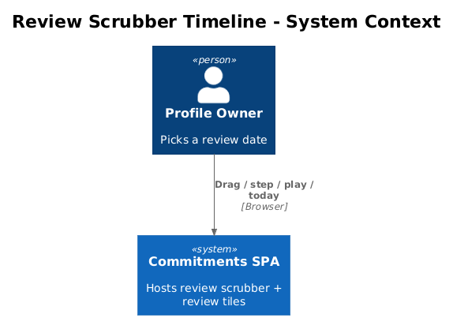
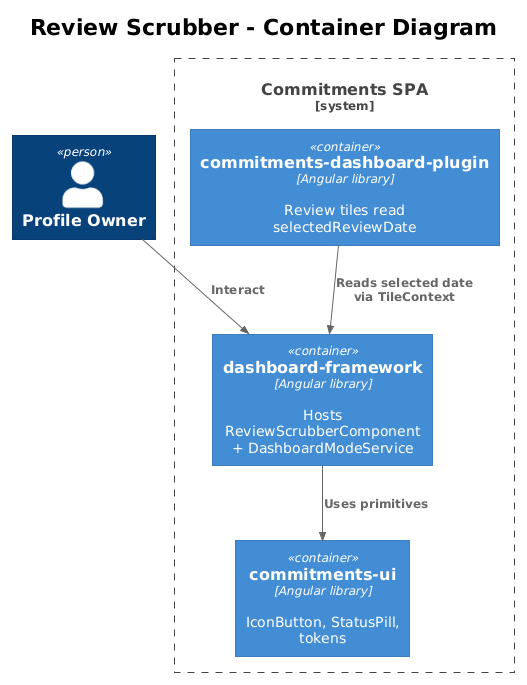
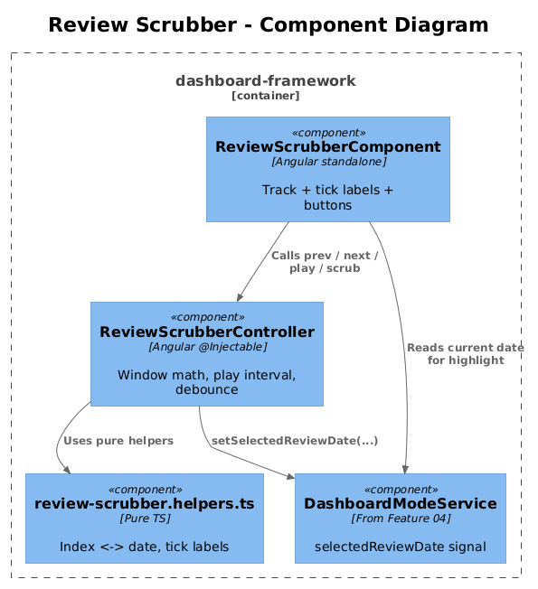
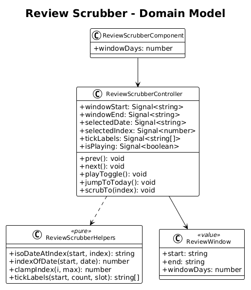
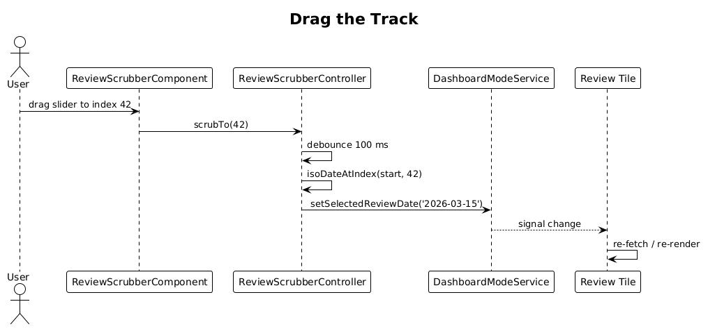
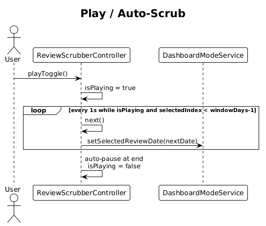
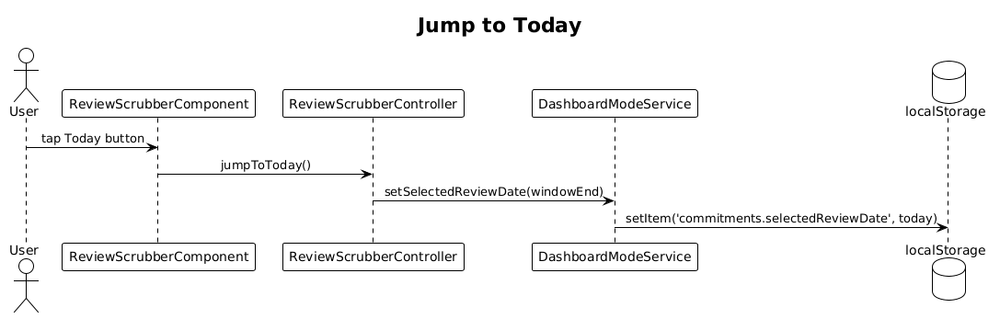

# 06 — Review Scrubber Timeline — Detailed Design

## 1. Overview

Implement the dark scrubber bar (`zNLnf`) that appears above the dashboard grid only in review mode. It owns the **selected review date**: the user picks a date by dragging the track, stepping with prev/next, auto-scrubbing with play/pause, or jumping to today. Every review-aware tile listens to this single source of truth.

**Actors**

- **Profile owner** — moves through time on the dashboard.

**Scope boundary**

- One day at a time. Sub-day granularity (hours/minutes) is *not* in scope here — review tiles in this slice consume `selectedReviewDate: 'YYYY-MM-DD'`. Feature 02's minute-level scrub stays inside the goal-history tile and is not the global scrubber.
- Scrubber publishes the date into `DashboardModeService.selectedReviewDate` (introduced in Feature 04).
- Hides the add-tile FAB cooperation already lives in Feature 04. This slice only adds the scrubber control.

## 2. Architecture

### 2.1 C4 Context



### 2.2 C4 Container



The scrubber is a `dashboard-framework` component that uses `commitments-ui` primitives (`IconButton`, `StatusPill`). It writes to the framework's mode service; review tiles read from it.

### 2.3 C4 Component



`ReviewScrubberComponent` ⟶ `ReviewScrubberController` (signals + debounced auto-play interval) ⟶ `DashboardModeService.setSelectedReviewDate()`. Tiles subscribe via `TileContext.selectedReviewDate`.

## 3. Component Details

### 3.1 ReviewScrubberComponent (Angular, standalone)

- **Path**: `frontend/projects/dashboard-framework/src/lib/dashboard/review-scrubber/review-scrubber.component.ts`
- **Refs**: `zNLnf`.
- **Layout** (left → right):
  1. Prev day `cui-icon-button` (icon `chevron_left`).
  2. Play/Pause `cui-icon-button` toggling auto-scrub at 1 step/sec.
  3. Next day `cui-icon-button` (icon `chevron_right`).
  4. Track: range slider styled to match the `.pen` (filled review-accent, unfilled divider). Width grows to fill remaining space.
  5. Date tick labels along the track (every Nth day, N derived from track width / `windowDays`).
  6. Highlighted current selection tick (review accent dot, larger).
  7. Selected date label on the right (e.g. `Apr 12, 2026`).
  8. Jump-to-today `cui-icon-button` (icon `today`).
- **Inputs**: `windowDays?: number` (default 90). The track represents `[today - windowDays + 1, today]`.
- **Outputs**: none — writes through the controller.

### 3.2 ReviewScrubberController (Angular, `@Injectable`)

- **Path**: same folder.
- **Public signals**:
  - `windowStart: Signal<string>` — `YYYY-MM-DD`, derived from `windowDays`.
  - `windowEnd: Signal<string>` — today.
  - `selectedDate: Signal<string>` — mirrors `DashboardModeService.selectedReviewDate`.
  - `isPlaying: Signal<boolean>`.
- **Computed**:
  - `selectedIndex: Signal<number>` — `0..windowDays-1`, used to position the slider.
  - `tickLabels: Signal<string[]>` — sparse formatted labels.
- **Methods**:
  - `prev()`, `next()` — clamped to window.
  - `playToggle()` — flips `isPlaying`; when on, sets a `setInterval` that calls `next()` until end of window, then auto-pauses.
  - `jumpToToday()` — sets `selectedDate` to `windowEnd()`.
  - `scrubTo(index: number)` — debounced 100 ms write of the date back into `DashboardModeService`.
- **Debounce**: drag events are buffered through a `takeLatest` (Angular signals + `effect` with `setTimeout`) so we publish at most one date per 100 ms.
- **Cleanup**: clears the play interval on destroy.

### 3.3 ReviewScrubberHelpers (pure)

- **Path**: same folder, `review-scrubber.helpers.ts`.
- **Exports**:
  - `isoDateAtIndex(start: string, index: number): string`
  - `indexOfDate(start: string, date: string): number`
  - `clampIndex(index: number, max: number): number`
  - `tickLabels(start: string, count: number, slotWidthPx: number): string[]`
- All pure → unit-testable without TestBed.

### 3.4 Mounting

The scrubber is projected into the slot exposed by `DashboardShellComponent` in Feature 04 (`*ngIf="mode === 'review'"`). No new app-shell wiring required.

### 3.5 Keyboard interaction

- Slider track has `role="slider"`, `aria-valuemin=0`, `aria-valuemax=windowDays-1`, `aria-valuenow=selectedIndex`.
- `ArrowLeft` / `ArrowRight` step by 1 day.
- `PageUp` / `PageDown` step by 7 days.
- `Home` jumps to `windowStart`; `End` (and the explicit Today button) jumps to `windowEnd`.
- `Space` toggles play/pause when the play button is focused.

## 4. Data Model

### 4.1 Class Diagram



### 4.2 Entity Descriptions

- No persisted entities. `selectedDate` reuses the `DashboardModeService` storage from Feature 04.
- `ReviewWindow` (transient): `{ start: 'YYYY-MM-DD', end: 'YYYY-MM-DD', windowDays: number }`.

## 5. Key Workflows

### 5.1 Drag the track



1. User drags the slider to index 42.
2. Component calls `controller.scrubTo(42)`.
3. Controller debounces 100 ms, computes ISO date.
4. Controller calls `dashboardModeService.setSelectedReviewDate('2026-03-15')`.
5. Tiles read the new date and re-fetch.

### 5.2 Play / auto-scrub



1. User taps Play. `isPlaying` flips to true.
2. Controller starts a 1 s interval, each tick calls `next()`.
3. `next()` increments index, calls `setSelectedReviewDate` (debounced).
4. When `selectedIndex >= windowDays - 1`, controller auto-pauses.

### 5.3 Jump to today



1. User taps Today.
2. Controller sets `selectedDate` to `windowEnd`.
3. Service writes both signal and localStorage.

## 6. API Contracts

No HTTP. Public exports (added to `dashboard-framework/public-api.ts`):

```ts
export class ReviewScrubberComponent { /* selector: df-review-scrubber */ }
```

Inputs: `windowDays?: number`. No outputs — the scrubber publishes through `DashboardModeService`.

## 7. Security Considerations

- `selectedReviewDate` is clamped to `[windowStart, windowEnd]` on every set; rejecting future dates protects backend handlers from "nonsense `asOf`" inputs.
- Helpers reject invalid ISO strings and fall back to `windowEnd`.

## 8. Acceptance

- Dragging the track updates the selected date label and the highlighted tick simultaneously.
- Reading `selectedReviewDate` from any tile yields the date most recently published by the scrubber, with at most 100 ms of debounce lag.
- Keyboard navigation (`Arrow`/`PageUp`/`PageDown`/`Home`/`End`) moves selection; play/pause works with Space.
- Pressing Today snaps selection to today regardless of where the slider was.
- Component renders only when `mode === 'review'`.

## 9. Open Questions

- **Auto-scrub speed** — 1 step/sec is a guess. Configurable via input later if users find it too fast/slow.
- **Window length default** — 90 days. The scrubber should be agnostic; tile-specific windows (e.g. trend chart's 14 days) stay inside the tile.
- **Date formatting / locale** — current proposal uses Angular `DatePipe` with locale `en-US`. Open until the project sets a locale strategy.
- **Touch / mobile interaction** — track must support touch drag; verify on mobile breakpoint when Feature 12 e2e adds tablet coverage.
