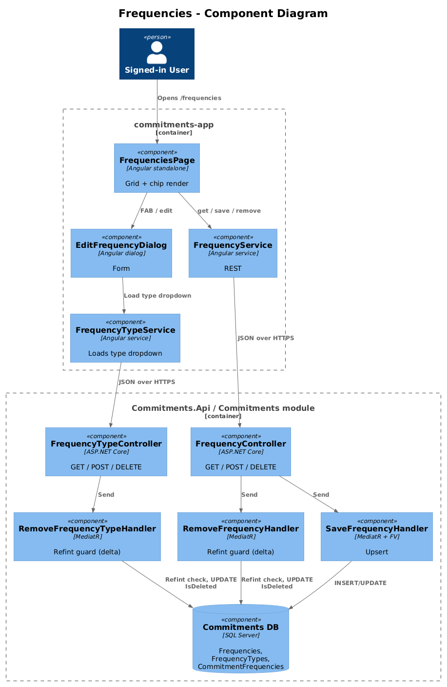
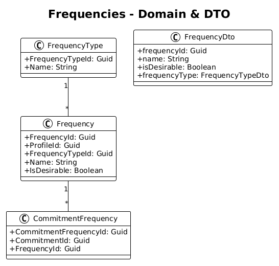
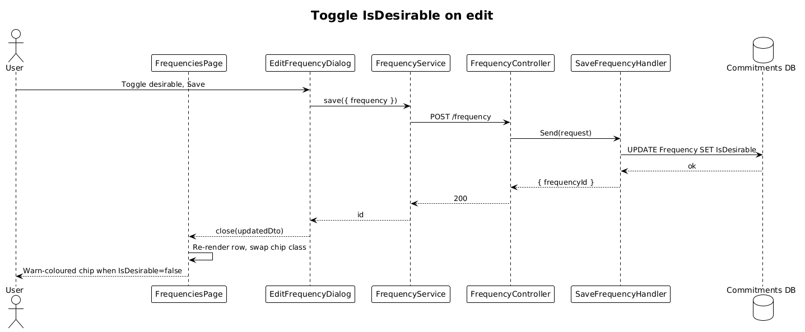

# Frequencies — Detailed Design

**Status:** Implemented

**Traces to:** L1-004 · L2-007, L2-008

## 1. Overview

The Frequencies page (`pages/frequencies`, route `/frequencies`) lets the user CRUD `Frequency` rows. Each frequency carries a `FrequencyTypeId` (e.g., Daily, Weekly, Monthly) and a boolean `IsDesirable` flag — desirable frequencies are visually distinct from undesirable ones so the user can tell "do this" from "avoid this" at a glance.

The page also surfaces the **list** of frequency types with a small inline "Manage types" button — but type CRUD itself is its own slice (covered in this same design as a sub-slice; no separate page is required).

## 2. Architecture

### 2.1 C4 Component

## 3. Component Details

### 3.1 FrequenciesPageComponent (frontend, exists)
- Replace placeholder route with this component.
- Columns: name, frequency type, desirable (chip — accent if true, warn if false).

### 3.2 EditFrequencyDialog (frontend, exists)
- Already has a checkbox for `IsDesirable` and a dropdown for `FrequencyTypeId`. **Delta:** none beyond using it as the FAB target.
- (See design `08-edit-frequency` for the dedicated route variant.)

### 3.3 FrequencyController + FrequencyTypeController (backend, exist)
- Save / Remove / Get / GetById exist for both. **Delta:**
  - `RemoveFrequencyTypeHandler` rejects when at least one `Frequency` references the type (L2-008 AC #2).
  - `RemoveFrequencyHandler` rejects when at least one `CommitmentFrequency` references the frequency.

## 4. Data Model

### 4.1 Class Diagram

## 5. Key Workflows

### 5.1 Toggle desirable on edit

## 6. API Contracts

| Method | Route | Body / Params | Response |
|--------|-------|----------------|----------|
| GET | `/frequency` | — | `200 { frequencies: FrequencyDto[] }` |
| POST | `/frequency` | `{ frequency }` | `200 { frequencyId }` |
| DELETE | `/frequency/{frequencyId}` | — | `200` / `400 (referenced)` |
| GET | `/frequencytype` | — | `200 { frequencyTypes: FrequencyTypeDto[] }` |
| POST | `/frequencytype` | `{ frequencyType }` | `200 { frequencyTypeId }` |
| DELETE | `/frequencytype/{frequencyTypeId}` | — | `200` / `400 (referenced)` |

## 7. Security Considerations

- All requests scoped to active profile (L2-038).
- The visual distinction for `IsDesirable` is **purely cosmetic** — never used for authorization; nothing additional is required.

## 8. ATDD Slices

1. **Slice A — list/route + chip rendering.** Spec: undesirable frequency renders with `warn` chip. **Status: Implemented.**
2. **Slice B — edit toggles `IsDesirable`.** Spec: toggling and saving persists the new value and re-renders the chip. **Status: Implemented** — `SaveFrequency` and `EditFrequencyDialog` already round-trip the boolean.
3. **Slice C — refint on type delete.** Spec: deleting a type used by ≥1 frequency returns 400. **Status: Implemented.**
4. **Slice D — refint on frequency delete.** Spec: deleting a frequency used by ≥1 commitment-frequency returns 400. **Status: Implemented.**

## 10. Implementation Notes

- Both new guards reuse the four-line "count + `throw new BadHttpRequestException(message, 400)`" pattern established by designs 05 (BehaviourType) and 06 (Behaviour). Symmetry across catalogs lowers cognitive load: a junior dev who reads one understands them all.

## 9. Open Questions

- The .pen design lays out a "frequencies-editor" component reused inside `EditCommitmentDialog`. Confirm chip colour is the same in both contexts. (Reuse the existing `frequency-editor` component — no fork.)
