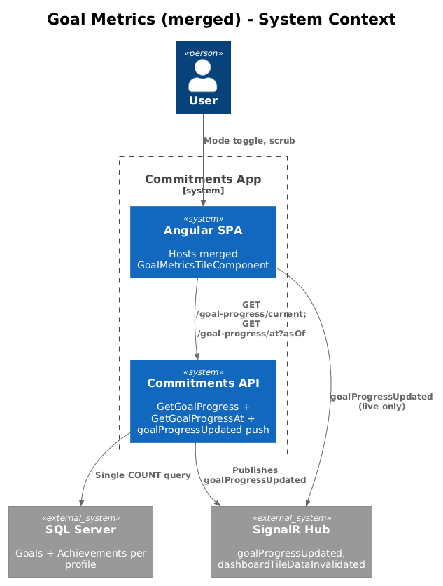
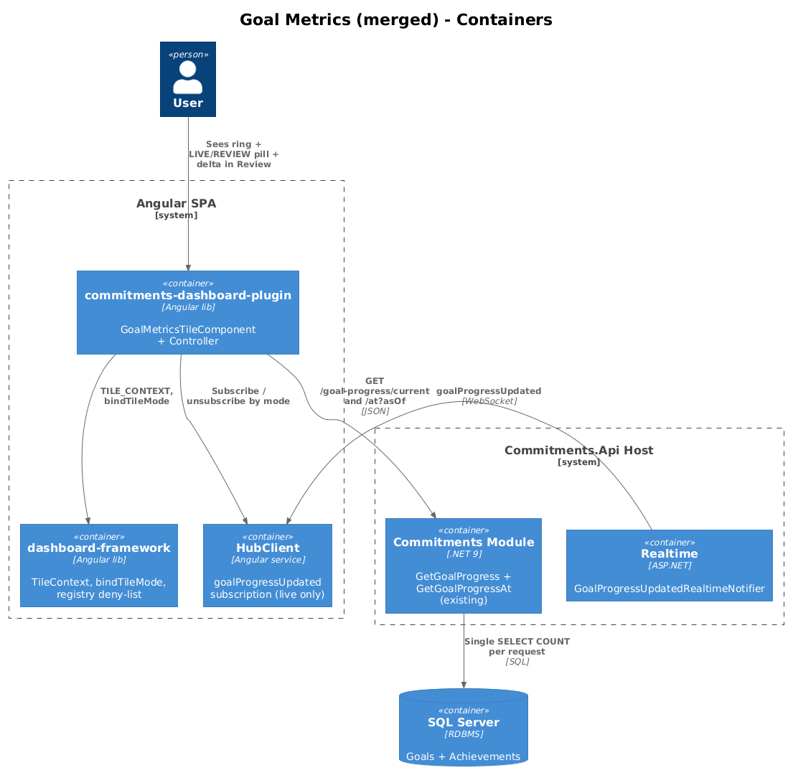
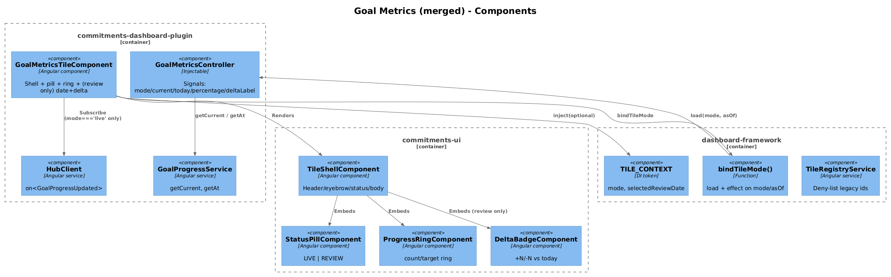
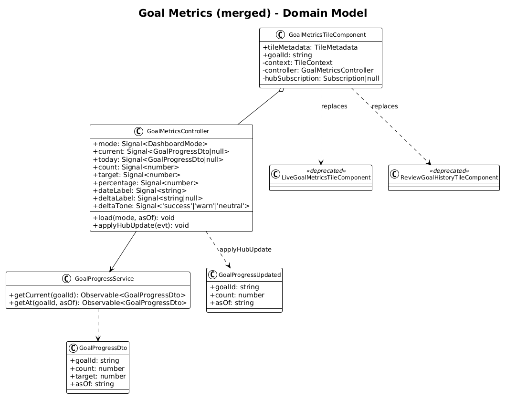
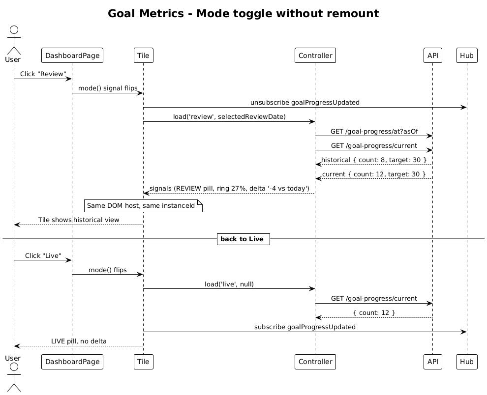
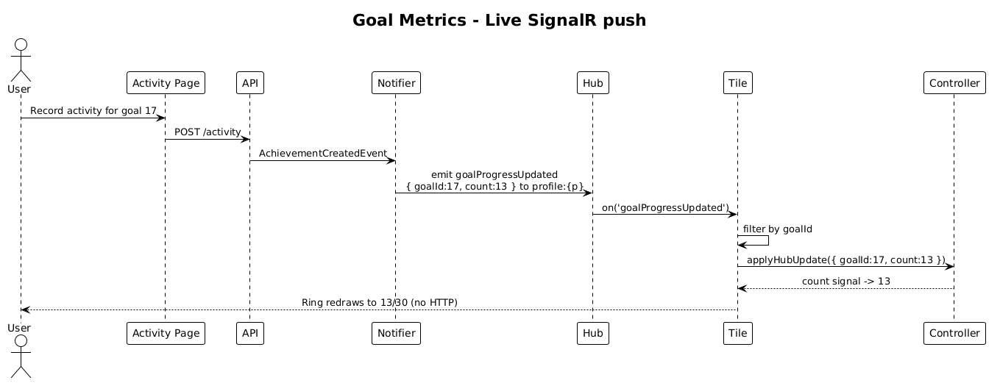
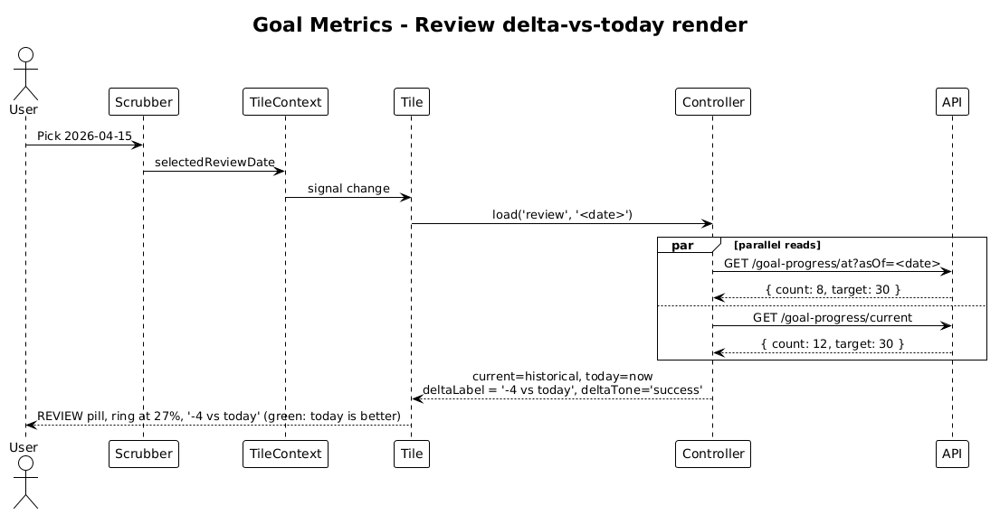

# Goal Metrics Tile — Dual-Mode Merge

**Status:** Accepted — 2026-04-27
**Tile ID (post-merge):** `commitments.goal-metrics`
**Traces to:** L1-011, L1-012, **L1-012a**; L2-023, L2-024, L2-025, L2-026, L2-027, L2-028, L2-029, L2-030, **L2-031a**, L2-043, L2-044, L2-045.

## 1. Overview

The legacy goal tile is split into two single-mode components:

- `LiveGoalMetricsTileComponent` — renders the goal progress ring, target, count, and `LIVE` badge; subscribes to `goalProgressUpdated` SignalR pushes.
- `ReviewGoalHistoryTileComponent` — renders the same ring + count + a delta-vs-today caption; reads `GET /goal-progress/at?asOf=...` and the date-window controls (start/end + slider).

Per **L2-030** ("legacy chrome-swap pattern is disallowed") and **L2-031a** ("mode-specific tile components must be merged into a single dual-mode component"), these two tiles must be merged into a single `GoalMetricsTileComponent` that branches its **data binding and indicator** on `TileContext.mode` while keeping its layout, host element, and grid footprint **identical** across modes.

This design covers the merge and the deprecation path for the two legacy tiles.

### Out of scope

- Changes to `goalProgressUpdated` SignalR payload (existing) or `GET /goal-progress/at` (existing).
- The dashboard-level scrubber or date-window controls — those live on the dashboard page, not on the tile (L2-030 places the scrubber above the grid).

## 2. Architecture

### 2.1 C4 Context



### 2.2 C4 Container



### 2.3 C4 Component



## 3. Component Details

### 3.1 `GoalMetricsTileComponent` (new, replaces both legacy tiles)

- **Path** (new): `frontend/projects/commitments-dashboard-plugin/src/lib/tiles/goal-metrics-tile/goal-metrics-tile.component.ts`
- **Responsibility**: render the single mode-invariant goal tile — header, eyebrow, status pill (`LIVE`/`REVIEW`), progress ring, count `N / target`, and (Review only) date badge + delta-vs-today caption.
- **Inputs**: `@Input() goalId!: string;` (required, like the legacy review tile; the live tile takes the same input).
- **Wiring**:
  - Inject `TILE_CONTEXT`. Instantiate `GoalMetricsController`.
  - `bindTileMode({ context, load: (m, a) => controller.load(m, a) })`.
  - In addition to the standard load, **Live mode** subscribes to `hubClient.on<GoalProgressUpdated>('goalProgressUpdated')` and filters by `goalId` (per L2-024). The subscription is gated by `mode() === 'live'` and is torn down when the tile switches to Review.
- **Layout**: identical across modes — same template, same SCSS, same gridster footprint. The only template branching is:
  - `<commitments-status-pill [variant]="controller.mode()">` (always present).
  - `@if (controller.mode() === 'review') { ...date badge..., ...delta badge... }`.

### 3.2 `GoalMetricsController` (new)

- **Path** (new): `frontend/projects/commitments-dashboard-plugin/src/lib/tiles/goal-metrics-tile/goal-metrics.controller.ts`
- **State**:
  ```ts
  readonly mode = signal<DashboardMode>('live');
  readonly current = signal<GoalProgressDto | null>(null);     // populated in either mode
  readonly today = signal<GoalProgressDto | null>(null);       // populated in review mode only
  readonly count = computed(() => this.current()?.count ?? 0);
  readonly target = computed(() => this.current()?.target ?? 0);
  readonly percentage = computed(() => {
    const t = this.target(); return t > 0 ? Math.round((this.count() / t) * 100) : 0;
  });
  readonly dateLabel = computed(() => fmtAsOf(this.current()?.asOf));
  readonly deltaLabel = computed(() => {
    if (this.mode() !== 'review') return null;
    const c = this.current(), today = this.today();
    if (!c || !today) return null;
    const d = c.count - today.count;
    if (d === 0) return '±0 vs today';
    return `${d > 0 ? '+' : ''}${d} vs today`;
  });
  readonly deltaTone = computed(() => {
    // Goal-progress is a positive metric: more = better.
    if (this.mode() !== 'review') return 'neutral';
    const c = this.current(), today = this.today();
    if (!c || !today) return 'neutral';
    if (c.count < today.count) return 'success';   // historical was lower → today is better
    if (c.count > today.count) return 'warn';      // historical was higher → today is worse
    return 'neutral';
  });
  ```
- **Methods**:
  - `load(mode, asOf)`:
    - Live: `service.getCurrent(goalId)` → `current.set(...)`; clear `today`.
    - Review: parallel `forkJoin([service.getAt(goalId, asOf), service.getCurrent(goalId)])` → `current.set(historical)`, `today.set(now)`.
  - `applyHubUpdate(evt: GoalProgressUpdated)`:
    - Only honoured when `mode() === 'live'` and `evt.goalId === this.goalId`. Updates `current.count` and `current.asOf`.
- **Why hold both `current` and `today`?** L2-031 requires the Review tile to render `±N vs today`. Computing it client-side (rather than asking the server for both in one call) keeps the existing `GET /goal-progress/current` and `GET /goal-progress/at` endpoints unchanged.

### 3.3 `GoalProgressService` (modified)

- **Path**: existing `frontend/projects/commitments-dashboard-plugin/src/lib/data/goal-progress.service.ts` (or wherever the legacy live/review services live; consolidate to a single service).
- **Responsibility** (post-merge): expose `getCurrent(goalId)` and `getAt(goalId, asOf)`; both backed by the existing endpoints.

### 3.4 Legacy components — deprecation

- `LiveGoalMetricsTileComponent` and `ReviewGoalHistoryTileComponent` are **removed** in the same change set as the new `GoalMetricsTileComponent`. There is no parallel-run period:
  - The plugin registration switches from registering both legacy descriptors to registering only `commitments.goal-metrics`.
  - A migration step in the Dashboard module rewrites any persisted `dashboardCards` rows that reference `commitments.goal-metrics-live` or `commitments.goal-metrics-review` to `commitments.goal-metrics`. This is a one-shot data migration (idempotent SQL `UPDATE ... WHERE tileId IN ('...live','...review')`).
- After the migration ships, the legacy `tileId`s must be added to a deny-list in `TileRegistryService` so that any plugin attempting to re-register them fails fast with a clear message.

### 3.5 Backend — no changes required

- `GET /goal-progress/current` (`GetGoalProgress.cs`), `GET /goal-progress/at` (`GetGoalProgressAt.cs`), and the `goalProgressUpdated` SignalR event (`GoalProgressUpdatedRealtimeNotifier`) all already exist and already meet the dual-mode contract: `current` is the live snapshot; `at?asOf=...` is the historical snapshot with `Cache-Control: public, max-age=300` per L2-045.

## 4. Data Model

### 4.1 Class Diagram



### 4.2 DTO (existing — included for completeness)

```ts
interface GoalProgressDto {
  goalId: string;
  count: number;
  target: number;
  asOf: string;             // ISO datetime
}

interface GoalProgressUpdated {
  goalId: string;
  count: number;
  asOf: string;             // ISO datetime
}
```

## 5. Key Workflows

### 5.1 Mode toggle without remount (the L2-030 acceptance path)



The dashboard mode flips. The tile's `bindTileMode` effect fires once: in Live → Review, the controller dispatches both `getAt` and `getCurrent`; in Review → Live, it tears down `today` and reissues `getCurrent`. The host element's `instanceId` and gridster cell are unchanged. The hub subscription is gated by `mode() === 'live'`.

### 5.2 Live SignalR push



`goalProgressUpdated` arrives, the controller filters by `goalId`, and the `current.count` signal updates without an HTTP call (per L2-024).

### 5.3 Review-mode delta render



Two parallel reads (`getAt(asOf)` + `getCurrent`) populate `current` and `today`; the delta caption derives client-side. The `getAt` response is publicly cacheable when `asOf < UtcNow - 1m`.

## 6. API Contracts

No changes. Existing routes:

- `GET /api/v1.0/goal-progress/current?goalId=...` → `{ goalId, count, target, asOf }`.
- `GET /api/v1.0/goal-progress/at?goalId=...&asOf=...` → same shape, server-side `asOf` clamping per L2-029.
- SignalR: `goalProgressUpdated` on group `profile:{profileId}` (L2-025).

## 7. Security Considerations

- All scoping continues via `ProfileId` header (L2-038). Both endpoints already 404 when the goal belongs to another profile (L2-029#3).
- The Live hub subscription is profile-scoped via group membership; an event for another profile's goal cannot reach the wrong client (L2-025).
- The merge does not introduce any new endpoint or auth surface.

## 8. Open Questions

1. **Tile `tileId`**: this design proposes `commitments.goal-metrics`. Confirm before shipping to avoid breaking existing dashboards beyond the one-shot migration. If a different name is preferred for clarity (e.g. `commitments.goal`), bump the migration accordingly.
2. **Hub subscription teardown timing**: today's `LiveGoalMetricsTileComponent` likely subscribes in `ngOnInit` and unsubscribes in `ngOnDestroy`. Post-merge the subscription must be **mode-gated** (live: subscribe; review: unsubscribe), not lifecycle-gated. Use an `effect()` in the component constructor reading `controller.mode()`, with `takeUntilDestroyed()` plus a manual subscription handle.
3. **Defaultness**: should the merged tile be `includeByDefault: true`? Recommendation: keep whichever flag the live tile had (so dashboards that already include "live goal metrics" continue to do so). Verify in the plugin registration.
4. **One-shot migration vs feature flag**: the plan above is a hard cutover with a SQL migration. If a phased rollout is required (dual-tile parallel-run for a release cycle), introduce a feature flag in the registry. Recommendation: hard cutover — the legacy split violates L2-030 and a parallel-run extends the regression.
