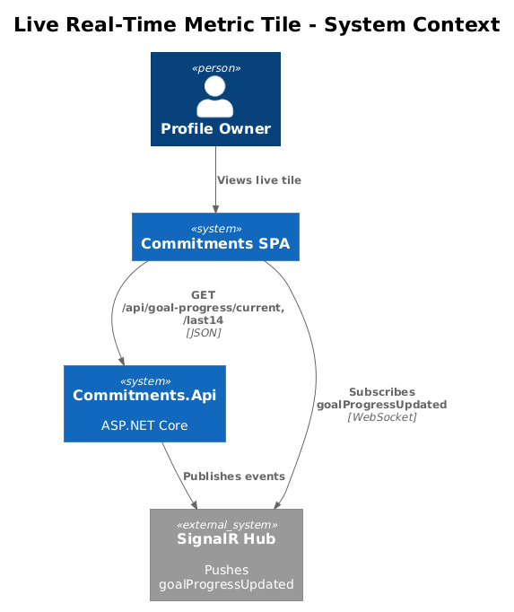
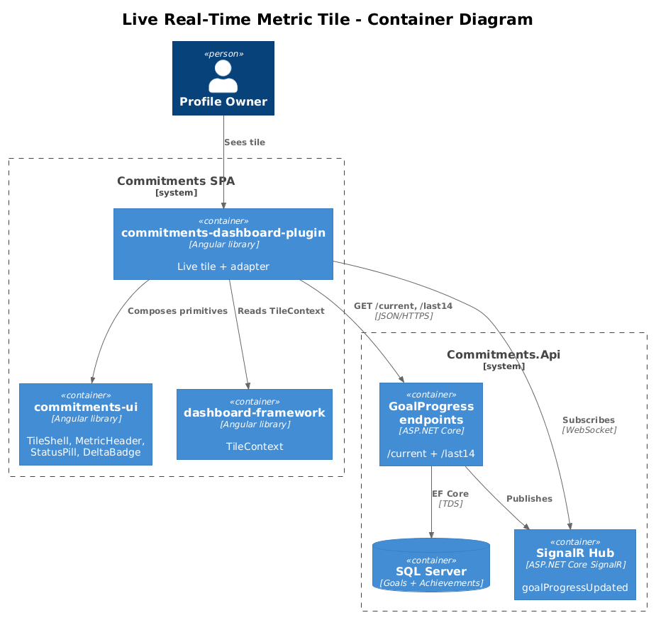
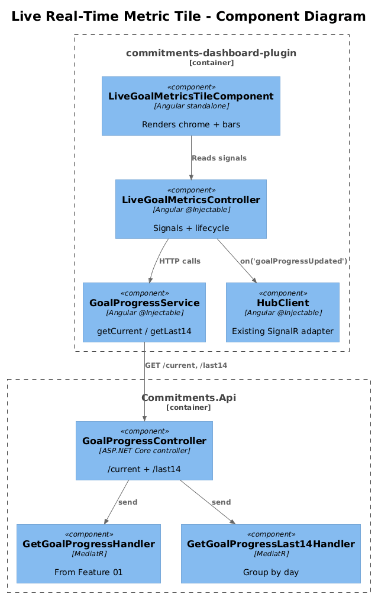
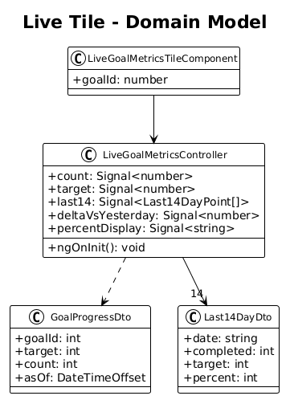
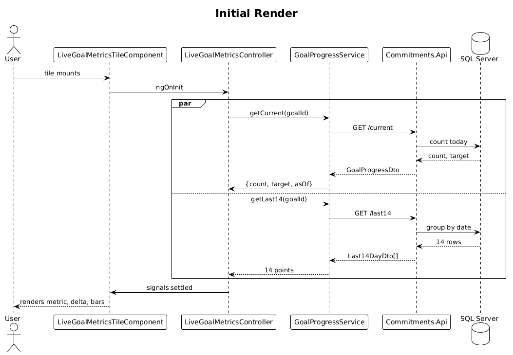
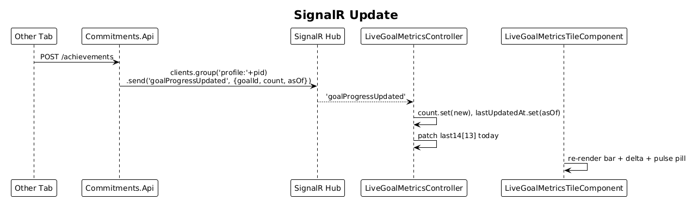

# 07 — Live Real-Time Metric Tile — Detailed Design

## 1. Overview

Polish Feature 01's Live Goal Metrics tile to match the `o0BgI` design: large current percentage, trend row with delta vs. yesterday, and a 14-day mini bar chart with today highlighted. Continues to push updates via SignalR.

This slice does **not** introduce Chart.js (that is Feature 08) — the 14-day bars are CSS divs, not a chart canvas. Chart-canvas tiles ship in Feature 08.

**Actors**

- **Profile owner** — sees today's progress live with light historical context.

**Scope boundary**

- Single-goal tile, registered as a plugin in `commitments-dashboard-plugin`.
- Reuses `GET /api/goal-progress/current` (Feature 01) and SignalR `goalProgressUpdated`. Adds one new endpoint: `GET /api/goal-progress/last14` (or extends `current` — see Open Questions).
- No review behavior here; the tile registers as live-only via Feature 10 metadata. Review users see the Feature 09 review tile instead.

## 2. Architecture

### 2.1 C4 Context



### 2.2 C4 Container



### 2.3 C4 Component



`LiveGoalMetricsTileComponent` ⟶ `LiveGoalMetricsController` ⟶ `GoalProgressService.getCurrent()` and `getLast14()` and `HubClient.on('goalProgressUpdated')`. The 14-day visualization is a CSS-only `<div>` grid; today's bar gets the live accent.

## 3. Component Details

### 3.1 LiveGoalMetricsTileComponent (extended)

- **Path**: `frontend/projects/commitments-dashboard-plugin/src/lib/tiles/live-goal-metrics/live-goal-metrics-tile.component.ts`
- **Refs**: `o0BgI`.
- **Layout**:
  1. `cui-tile-shell variant="metric"` chrome.
  2. `<cui-status-pill variant="live" pulse>LIVE</cui-status-pill>` in the header status slot.
  3. `cui-metric-header` with `value = controller.percentDisplay()` and caption like `"4 of 30 done today"`.
  4. Trend row: `cui-delta-badge` showing change vs. yesterday, plus a small caption `vs yesterday`.
  5. 14-day bar strip — see 3.4.
- **Inputs**: `goalId: number`. `mode` is read from `TileContext` (always `'live'` in this tile's manifests).
- **Migration from Feature 01**: header/value piece refactored to consume `cui-metric-header` and `cui-delta-badge` from Feature 03.

### 3.2 LiveGoalMetricsController (extended)

- **Path**: same folder.
- **State (signals)**:
  - From Feature 01: `count`, `target`, `lastUpdatedAt`.
  - New: `last14: Last14DayPoint[]` — array length 14, oldest first.
  - New: `deltaVsYesterday: Signal<number>` — `today.completed - yesterday.completed` (signed integer).
- **Computed**:
  - `percentDisplay = clamp(count() / target() * 100, 0, 100).toFixed(0) + '%'`.
  - `todayBarHeight(percent) = clamp(percent, 4, 100)` — minimum 4 px so a zero day still shows a stub.
- **Lifecycle**:
  - `ngOnInit`: parallel `getCurrent(goalId)` and `getLast14(goalId)`.
  - SignalR `goalProgressUpdated` (filtered by `goalId`): updates `count`, `lastUpdatedAt`, and patches the last entry of `last14` (today).

### 3.3 GoalProgressService (extended)

- **New method**: `getLast14(goalId): Observable<Last14DayPoint[]>` → `GET /api/goal-progress/last14?goalId=…`.
- Existing `getCurrent` from Feature 01 unchanged.

### 3.4 14-day bar strip (CSS-only)

- 14 `<div class="bar">`, each width = `(100/14)% - gap`, height = `controller.last14()[i].percent` clamped to [4, 100].
- Today's bar has class `is-today`, accent `--accent-live`, height pulsed via the same animation as the LIVE badge.
- Other bars use `--text-muted` at 60% alpha.
- Tooltip on hover (native `title`): `"{date}: {completed}/{target}"`.

### 3.5 Backend — `GetGoalProgressLast14` handler

- **Path**: `backend/src/Modules/Commitments/Features/GoalProgress/GetGoalProgressLast14.cs`
- **Endpoint**: `GET /api/goal-progress/last14?goalId={int}` ⟶ `200 Last14DayDto[]`.
- **Query**: 14 days ending today, `Achievements.GroupBy(date)` ⟶ count per day. One bounded query per request.
- **Index hint**: relies on `(ProfileId, GoalId, RecordedAt)` index.
- This endpoint can be subsumed by Feature 11's trend endpoint with `windowDays=14`. Until that lands, this slice ships its own dedicated handler.

## 4. Data Model

### 4.1 Class Diagram



### 4.2 Entity Descriptions

- **Goal** / **Achievement** — existing, unchanged.
- **Last14DayPoint** (DTO + frontend interface) — `{ date: 'YYYY-MM-DD', completed: number, target: number, percent: number }`.
- **GoalProgressDto** — already defined in Feature 01.

No migrations.

## 5. Key Workflows

### 5.1 Initial render



1. Tile mounts.
2. Controller fires `getCurrent(goalId)` and `getLast14(goalId)` in parallel.
3. Signals settle; component renders the metric, delta badge, and 14 bars.

### 5.2 SignalR update



1. Achievement created elsewhere → `goalProgressUpdated` event.
2. Controller updates `count`, `lastUpdatedAt`.
3. Today's entry in `last14` patched with new `completed` and `percent`.
4. Today's bar animates to its new height; LIVE pill pulses.

## 6. API Contracts

```
GET /api/goal-progress/current?goalId={int}
  -> 200 GoalProgressDto  (from Feature 01)

GET /api/goal-progress/last14?goalId={int}
  -> 200 Last14DayDto[]
[
  { "date": "2026-04-13", "completed": 18, "target": 30, "percent": 60 },
  ...
  { "date": "2026-04-26", "completed": 12, "target": 30, "percent": 40 }
]
```

Hub event (unchanged from Feature 01):

```
event: "goalProgressUpdated"
payload: { goalId, count, asOf }
```

## 7. Security Considerations

- Same as Feature 01: rely on `BaseDbContext` `ProfileId` global query filter.
- Last14 endpoint must reject `goalId` not owned by the caller's profile.

## 8. Acceptance

- Initial render shows percent, caption, delta badge, and 14 bars from REST data.
- A new achievement in another tab updates the visible count, delta, and today's bar without page refresh.
- LIVE pill pulses subtly while the connection is active.
- Tile renders only in live mode (registry from Feature 10 enforces this).
- Tile is a plugin registration in `commitments-dashboard-plugin` and imports nothing from `commitments-app`.

## 9. Open Questions

- **Subsume `last14` into trend endpoint** — Feature 11 introduces `/trend?windowDays=14`. If Feature 11 lands first, drop the dedicated `last14` action. If 07 lands first, plan to delete the dedicated action when 11 ships.
- **Delta vs. yesterday vs. delta vs. prior 14d average** — ux preference. Going with "vs yesterday" (simpler, matches `o0BgI` caption). Revisit on review.
- **What if today's target is 0?** — render `--%` and skip the delta badge; mirror Feature 01's open question handling.
