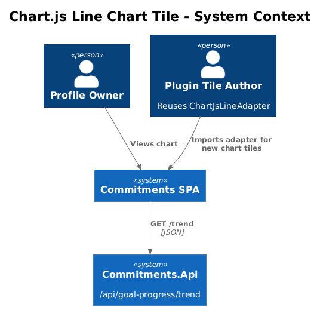
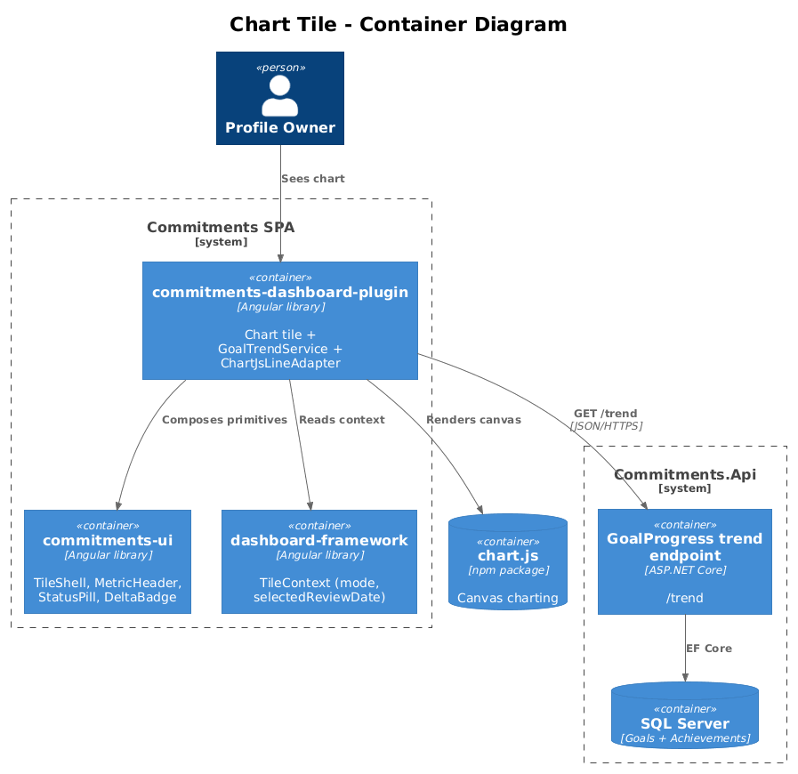
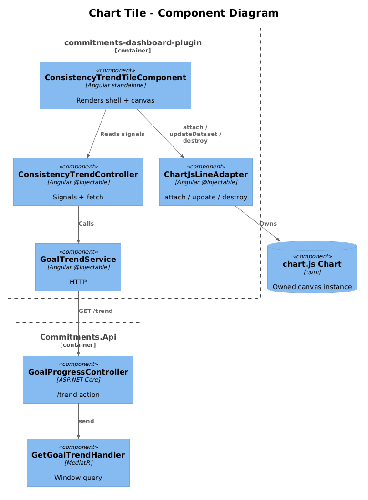
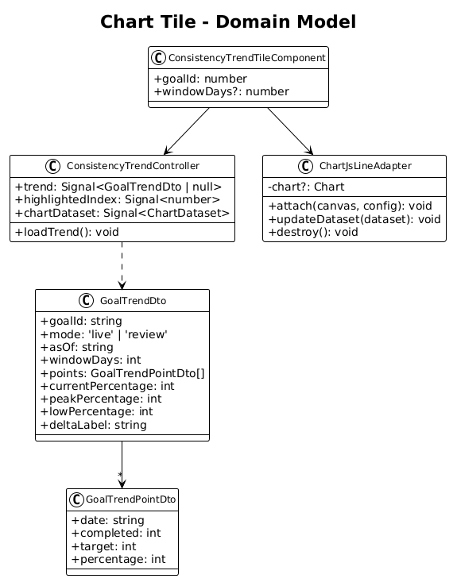
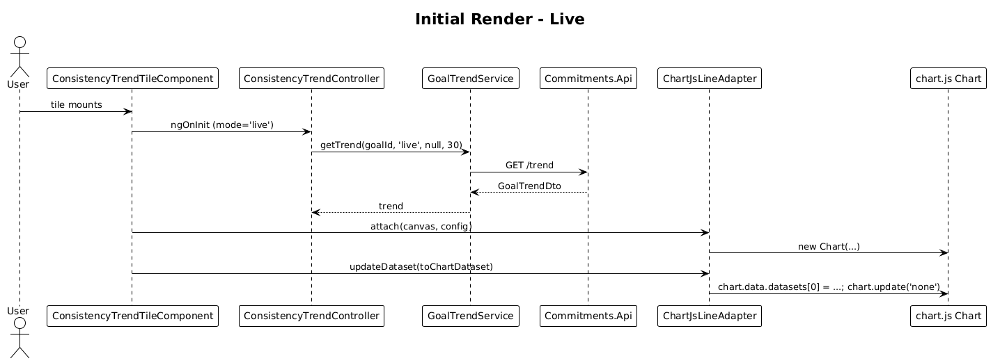
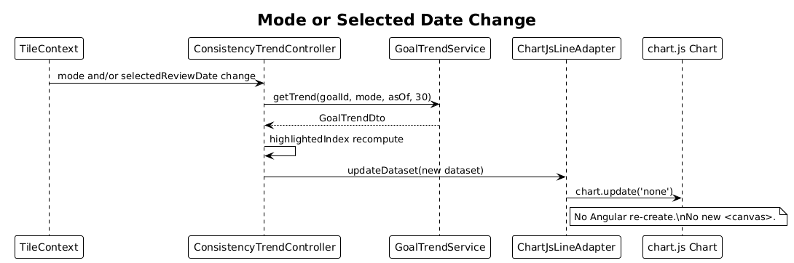
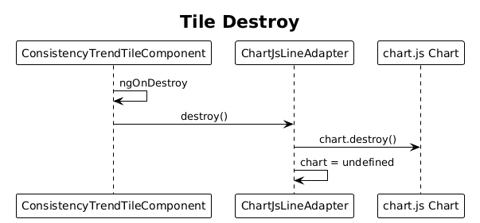

# 08 — Chart.js Line Chart Tile — Detailed Design

## 1. Overview

Implement the `9IpBQ` "Consistency Trend" tile as a real Chart.js line chart on a `<canvas>`. The tile is mode-aware: in live mode it highlights "now" (the latest point); in review mode it highlights the date currently selected by the scrubber (Feature 06).

Chart.js is already a dependency. This tile is the first place we render to canvas; subsequent chart-style tiles can reuse the adapter shipped here.

**Actors**

- **Profile owner** — sees a smooth line chart of percentage over time.
- **Plugin tile author** — reuses `ChartJsLineAdapter` for future chart tiles.

**Scope boundary**

- One chart per tile, one dataset per chart, line type only.
- Data shape is the `GoalTrendDto` proposed in `live-review-chartjs-alignment-plan.md`.
- Endpoint is the trend endpoint defined in Feature 11. If 11 has not landed, this tile falls back to client-side downsampling of the 14-day endpoint from Feature 07.
- No Chart.js wrapper library — we use `chart.js` directly via a thin adapter service.

## 2. Architecture

### 2.1 C4 Context



### 2.2 C4 Container



### 2.3 C4 Component



`ConsistencyTrendTileComponent` ⟶ `ConsistencyTrendController` ⟶ `GoalTrendService` (HTTP). The chart instance is owned by `ChartJsLineAdapter`, a small stateful service injected per-tile; it creates the `Chart` on `attach(canvas)`, calls `chart.update()` on each new dataset, and `destroy()` on detach.

## 3. Component Details

### 3.1 ConsistencyTrendTileComponent (Angular, standalone)

- **Path**: `frontend/projects/commitments-dashboard-plugin/src/lib/tiles/consistency-trend/consistency-trend-tile.component.ts`
- **Refs**: `9IpBQ`.
- **Layout**:
  1. `cui-tile-shell variant="chart"` chrome (height target ~340 px).
  2. Header row (in shell): `show_chart` icon (left), title `Consistency Trend`, subtitle `30-day goal completion rate`.
  3. Status pill in header status slot — variant follows `tileContext.mode()` (live or review).
  4. Metric row: `cui-metric-header` value = `currentPercentage%`, caption with peak/low summary.
  5. Trend caption `+5% vs prior 14d` via `cui-delta-badge`.
  6. Plot area with `<canvas #plot>` filling the remaining tile height.
- **Inputs**: `goalId: number`, `windowDays?: number = 30`.
- **Lifecycle**:
  - `ngAfterViewInit`: call `chartAdapter.attach(canvasRef, controller.chartConfig())`.
  - `ngOnDestroy`: `chartAdapter.destroy()`.
  - On any `controller.trend()` change: `chartAdapter.updateDataset(controller.toChartDataset())`.

### 3.2 ConsistencyTrendController (Angular, `@Injectable`)

- **Path**: same folder.
- **Public signals**:
  - `trend: Signal<GoalTrendDto | null>`.
  - `currentPercentage: Signal<number>`.
  - `peakPercentage: Signal<number>`.
  - `lowPercentage: Signal<number>`.
  - `deltaLabel: Signal<string>`.
- **Computed**:
  - `chartDataset = computed(() => this.toChartDataset(trend(), highlightedIndex()))`.
  - `highlightedIndex` — derived from `tileContext.mode()` and `tileContext.selectedReviewDate()`:
    - Live: last index of `points`.
    - Review: index of point with matching date; `-1` if no exact match.
- **Lifecycle**: subscribes to:
  - `tileContext.mode()` and `tileContext.selectedReviewDate()` — re-fetches when either changes.
  - `tileContext.refresh$` (Feature 10) — triggers a refetch.
- **Methods**: `loadTrend()` calls `goalTrendService.getTrend(goalId, mode, selectedReviewDate, windowDays)`.

### 3.3 GoalTrendService (Angular)

- **Path**: `frontend/projects/commitments-dashboard-plugin/src/lib/data/goal-trend.service.ts`
- **Public**: `getTrend(goalId, mode, asOf?, windowDays?): Observable<GoalTrendDto>`.
- **Endpoint**:
  - Live: `GET /api/goal-progress/trend?goalId={id}&windowDays={n}`.
  - Review: `GET /api/goal-progress/trend?goalId={id}&asOf={iso}&windowDays={n}`.

### 3.4 ChartJsLineAdapter (Angular `@Injectable`, per-component)

- **Path**: `frontend/projects/commitments-dashboard-plugin/src/lib/data/chart-js-line.adapter.ts`
- **Responsibility**: Create, update, and destroy a `Chart` instance for one canvas. Owns the imperative side; the controller stays declarative.
- **API**:
  - `attach(canvas: ElementRef<HTMLCanvasElement>, config: ChartConfiguration<'line'>): void`
  - `updateDataset(dataset: ChartDataset<'line'>): void`
  - `destroy(): void`
- **Default config** (composed by the controller, applied by the adapter):

```ts
{
  type: 'line',
  data: { labels: [], datasets: [/* one dataset */] },
  options: {
    responsive: true,
    maintainAspectRatio: false,
    plugins: {
      legend: { display: false },
      tooltip: {
        backgroundColor: SURFACE_RAISED,
        titleColor: TEXT_PRIMARY,
        bodyColor: TEXT_SECONDARY,
        borderColor: DIVIDER, borderWidth: 1,
        padding: 8, displayColors: false,
      },
    },
    scales: {
      x: {
        type: 'category',
        ticks: { color: TEXT_MUTED, autoSkip: true, maxTicksLimit: 6 },
        grid: { display: false },
      },
      y: {
        min: 0, max: 100,
        ticks: { display: false },
        grid: { color: DIVIDER, drawTicks: false },
      },
    },
    interaction: { mode: 'nearest', intersect: false, axis: 'x' },
  },
}
```

- **Dataset shape** (derived from `GoalTrendDto.points`):

```ts
{
  data: points.map(p => p.percentage),
  borderColor: ACCENT_CHART,
  borderWidth: 2.5,
  tension: 0.35,
  fill: true,
  backgroundColor: ctx => buildVerticalGradient(ctx, ACCENT_CHART + '66'),
  pointRadius: points.map((_, i) => i === highlightedIndex ? 7 : 3),
  pointBorderColor: SURFACE_TILE,
  pointBackgroundColor: ACCENT_CHART,
}
```

- **Gradient helper**: `buildVerticalGradient(ctx, fromColor)` creates a top-to-bottom canvas gradient from `fromColor` to transparent. Reused across chart tiles.

### 3.5 Why a separate adapter

Keeps Chart.js out of the component class so the component stays "Angular-ish" and the controller stays testable without mocking canvas. Future chart tiles import the same adapter shape, optionally extending with `'bar'` configs.

## 4. Data Model

### 4.1 Class Diagram



### 4.2 Entity Descriptions

- **GoalTrendDto** (proposed contract, see `live-review-chartjs-alignment-plan.md`):

```ts
interface GoalTrendDto {
  goalId: string;
  mode: 'live' | 'review';
  asOf: string;
  windowDays: number;
  points: GoalTrendPointDto[];
  currentPercentage: number;
  peakPercentage: number;
  lowPercentage: number;
  deltaLabel: string;
}

interface GoalTrendPointDto {
  date: string;
  completed: number;
  target: number;
  percentage: number;
}
```

- **ChartDataset / ChartConfiguration** — Chart.js types.

## 5. Key Workflows

### 5.1 Initial render (live)



1. Tile mounts; controller sees `mode='live'`.
2. Controller calls `goalTrendService.getTrend(goalId, 'live', null, 30)`.
3. API returns `GoalTrendDto`.
4. Controller stores trend; `chartDataset` recomputes; component calls `chartAdapter.updateDataset(...)`.
5. Adapter writes dataset, calls `chart.update('none')`.

### 5.2 Mode or selected-date change



1. Mode flips to review, or `selectedReviewDate` changes.
2. Controller re-fetches with new `asOf`.
3. New dataset → `chartAdapter.updateDataset()` → no Angular re-create.
4. `highlightedIndex` recomputes; the highlighted point ring jumps to the new date.

### 5.3 Tile destroyed



1. Tile removed from layout.
2. Component `ngOnDestroy` → `chartAdapter.destroy()` → `chart.destroy()`.
3. No memory leak, no orphaned canvas listeners.

## 6. API Contracts

```
GET /api/goal-progress/trend
  ?goalId={int}
  [&asOf={iso}]
  [&windowDays={int=30}]
  -> 200 GoalTrendDto

400 - bad windowDays / asOf
404 - goal not found / not owned by profile
```

(Endpoint owned by Feature 11. This tile is the first consumer.)

## 7. Security Considerations

- No new auth surface; relies on existing `ProfileId` filter and JWT.
- Canvas tooltips render escaped strings only (no innerHTML); the dataset contains numbers and pre-formatted date labels — neither path renders user-controlled HTML.
- `windowDays` is clamped server-side (Feature 11) to a sane max (e.g. 365) to avoid runaway queries.

## 8. Acceptance

- Tile renders a real `<canvas>` with a Chart.js line chart, not a static SVG or div-based chart.
- Updating the dataset (via mode or date change) does **not** recreate the Angular component or the canvas.
- Tile remains responsive across LG, XL, and tablet Gridster sizes without aspect-ratio jitter.
- Highlighted point in live mode = last point. Highlighted point in review mode = the matching date, or none if no match.
- Tests verify (a) `<canvas>` element exists in the rendered DOM, (b) controller's `chartDataset` produces a non-empty `data` array, and (c) `chart.update` is called on signal changes.

## 9. Open Questions

- **Move the adapter into `commitments-ui`?** — pulling Chart.js into the UI library expands its dependency surface. Keep it inside `commitments-dashboard-plugin` for now; revisit if a second chart tile arrives.
- **Tooltip date formatting** — match Material `medium` date formatting (`Apr 26, 2026`)? Picking yes for v1.
- **What if `points` is empty?** — render the chart with empty data and a "Not enough data yet" overlay; do not destroy the chart so a later refresh fills in.
- **Performance with `windowDays=365`** — 365 points + smooth curve runs fine in Chart.js; revisit if profiling shows otherwise.
