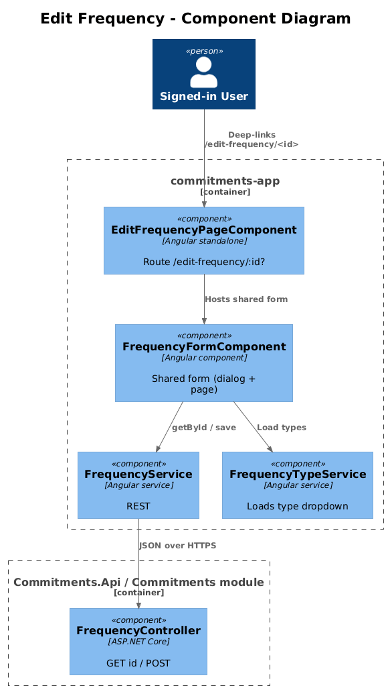
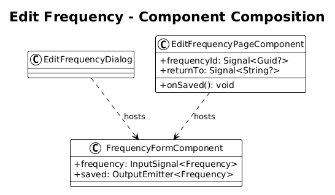
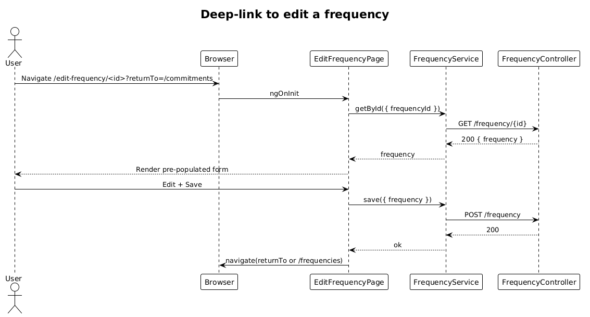

# Edit Frequency — Detailed Design

**Status:** Draft

**Traces to:** L1-004 · L2-007

## 1. Overview

The Edit Frequency page (`pages/edit-frequency`, route `/edit-frequency/:frequencyId?`) is a dedicated, deep-linkable host for editing a single frequency. It is the route counterpart to `EditFrequencyDialog` for cases where the user navigates from a `frequency-editor` chip on the Commitments page (or a deep link from notes/email) and the modal experience is undesirable (e.g., on XS / S where dialog overlays clip).

Because the dialog already exists, this design's delta is purely a wrapper page — no new endpoint, no new validator, no schema migration.

## 2. Architecture

### 2.1 C4 Component

## 3. Component Details

### 3.1 EditFrequencyPageComponent (frontend, exists as placeholder)
- New page that hosts the same form fields as `EditFrequencyDialog` (or, for radical simplicity, **mounts the dialog component inline** so there is exactly one form implementation).
- Reads `frequencyId` from the route params (optional). If absent, it operates as "create new". On save it navigates back to `/frequencies` (or to the route declared in `?returnTo=...`).
- Replace placeholder route with this component.

### 3.2 No backend delta
- Reuses `SaveFrequency`, `GetFrequencyById`, `GetFrequencyTypes`. No new endpoints.

## 4. Data Model

Same as design `07-frequencies`. See [class diagram there](../07-frequencies/diagrams/class_diagram.png).

### 4.1 Class Diagram

## 5. Key Workflows

### 5.1 Deep-link to edit, save, return

## 6. API Contracts

None added. Reuses the routes from design `07-frequencies`.

## 7. Security Considerations

- Route guard (existing `BearerAuthGuard`) ensures only signed-in users can hit `/edit-frequency/:id`.
- The handler scopes by `ProfileId` header so deep links to another user's `frequencyId` return 404 (L2-038).

## 8. ATDD Slices

1. **Slice A — wrap dialog form on a route.** Spec: `/edit-frequency/<id>` loads the form pre-populated; saving navigates to `/frequencies`.
2. **Slice B — `?returnTo=` query param.** Spec: navigating from `/commitments?edit=...` includes `returnTo=/commitments`; on save the user lands back at `/commitments`.

## 9. Open Questions

- Should the page-route share the exact component instance with the dialog, or duplicate the form? Recommendation: share, by extracting the form fields into a `FrequencyFormComponent` and using it inside both the dialog and this page.
