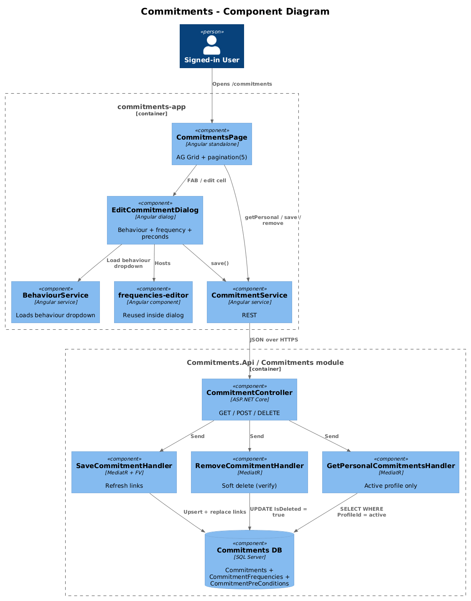
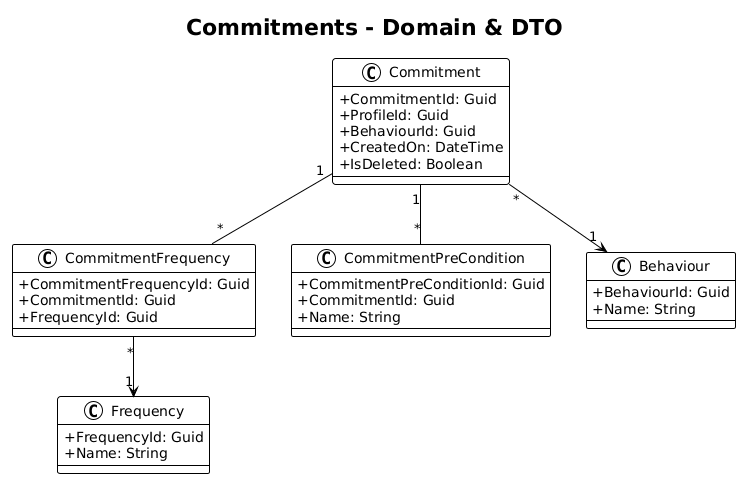
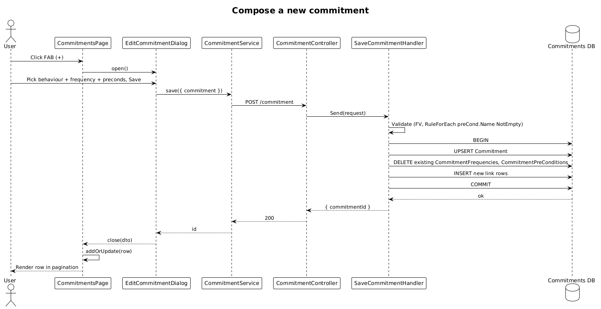

# Commitments — Detailed Design

**Status:** Accepted

**Traces to:** L1-005 · L2-009, L2-010, L2-011, L2-038

## 1. Overview

The Commitments page (`pages/commitments`, route `/commitments`) is the primary surface for the user's commitment catalog. Each commitment composes one `Behaviour` with zero-or-more `CommitmentFrequency` rows and zero-or-more `CommitmentPreCondition` rows. Listing is paginated 5 rows per page on LG/XL (per L2-010 AC #3); creation and edit go through `EditCommitmentDialog`. Deletion is **soft** (per L2-011).

## 2. Architecture

### 2.1 C4 Component

## 3. Component Details

### 3.1 CommitmentsPageComponent (frontend, exists as placeholder)
- Replace placeholder route with this component.
- Columns: Behaviour name, frequencies (chip list), edit, delete. AG Grid client-side pagination with `paginationPageSize = 5`, `pagination = true` (L2-010 AC #3).
- Loads via `CommitmentService.getPersonalCommitments()` (matches L2-010 AC #1 scoping).

### 3.2 EditCommitmentDialog (frontend, exists)
- Already composes behaviour dropdown + `frequencies-editor` + pre-condition list. **Delta:** none.

### 3.3 CommitmentController (backend, exists)
- All commands and queries already exist (`Save`, `Remove`, `GetById`, `Get`, `GetPersonal`, `GetDaily`, `GetDailyResults`).
- **Delta:** confirm `RemoveCommitmentHandler` is soft-delete (`base.SaveChanges()` should already trigger the interceptor — verify; if not, set `IsDeleted = true` explicitly per L2-011 AC #1).
- **Delta — pre-condition validation:** add a child validator on `SaveCommitmentRequestValidator.PreConditions` requiring `.NotEmpty()` on each `Name` (per L2-009 AC #2). Use `RuleForEach`.

## 4. Data Model

### 4.1 Class Diagram

## 5. Key Workflows

### 5.1 Compose a new commitment

## 6. API Contracts (existing routes, prefix `/api/v1.0`)

| Method | Route | Body / Params | Response |
|--------|-------|----------------|----------|
| GET | `/commitment/personal` | — | `200 { commitments }` (active profile only) |
| GET | `/commitment/{id}` | — | `200 { commitment }` |
| POST | `/commitment` | `{ commitment }` | `200 { commitmentId }` |
| DELETE | `/commitment/{id}` | — | `200` (soft) |

## 7. Security Considerations

- All queries are profile-scoped via the global query filter. Per L2-010 AC #1 a second profile's commitments are never in the response.
- Pre-condition free-text is HTML-escaped on render (per L2-041); never written into the DOM as `innerHTML`.

## 8. ATDD Slices

1. **Slice A — list + pagination.** Spec: 7 commitments render 5 rows + pagination control; flipping to page 2 shows the remaining 2.
2. **Slice B — compose flow.** Spec: opening the dialog, picking a behaviour + a frequency, saving, persists the link rows and the new commitment shows in the list without page refresh.
3. **Slice C — pre-condition empty-name validation.** Spec: submitting a pre-condition with empty `Name` fails with FluentValidation message.
4. **Slice D — soft-delete.** Spec: deleting a commitment sets `IsDeleted = true` and the row no longer appears via `GetCommitments` but still exists in the database.
5. **Slice E — cross-profile isolation.** Spec (server-side test): profile A cannot read profile B's commitments.

## 9. Open Questions

- The .pen design also shows `GetDailyCommitments` powering the dashboard's "Today" tile — that's covered by the dashboard tile design, not here.
- Should reactivation (un-soft-delete) be a feature? Out of scope; defer until requested.
