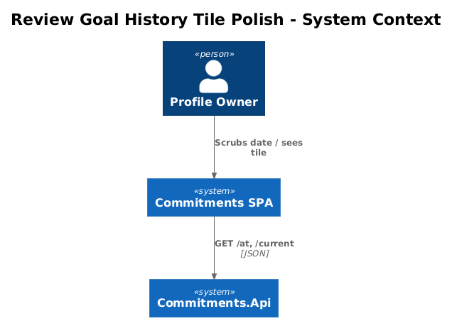
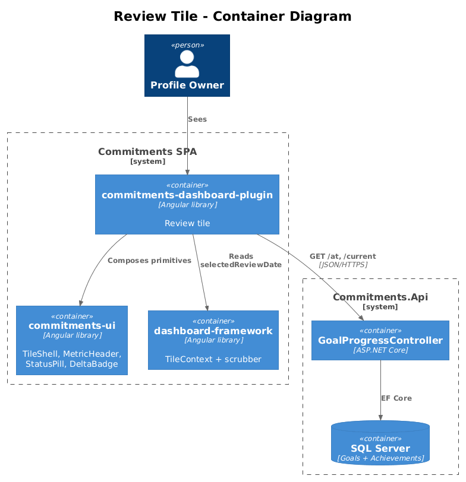
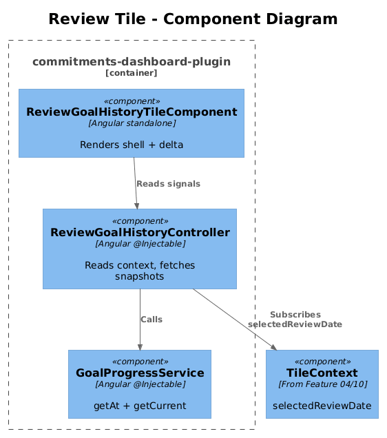
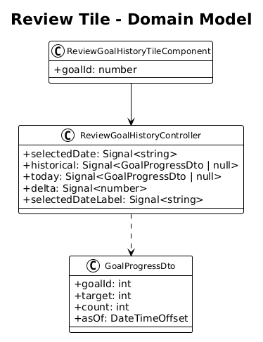
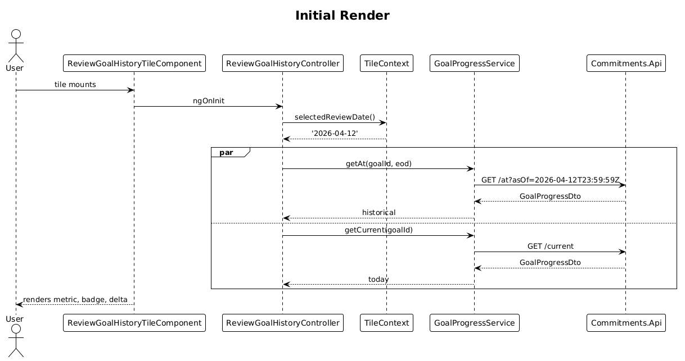
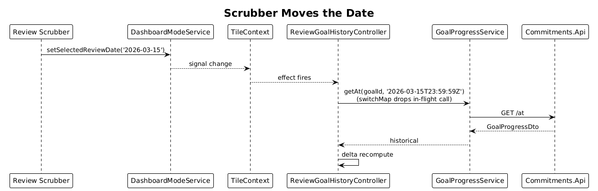
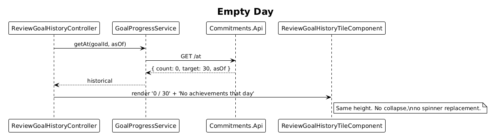

# 09 — Review Goal History Tile Polish — Detailed Design

## 1. Overview

Polish Feature 02's Review Goal History tile to match the `nAfUX` design and to consume the **global** selected review date from the dashboard scrubber (Feature 06) instead of the tile-local `datetime-local` inputs. The tile becomes a clean snapshot view: selected-date badge, historical value, snapshot label, and signed delta vs. today.

**Actors**

- **Profile owner** — looks back to a date picked by the scrubber and sees the goal's snapshot.

**Scope boundary**

- One goal per tile. Day granularity only — sub-day scrubbing is removed (the global scrubber publishes `YYYY-MM-DD`).
- Reuses `GET /api/goal-progress/at` from Feature 02. Uses `GET /api/goal-progress/current` to compute "vs today" delta.
- Drops the in-tile slider and `datetime-local` inputs introduced in Feature 02. They served their purpose as a vertical slice but the dashboard now owns time selection.

## 2. Architecture

### 2.1 C4 Context



### 2.2 C4 Container



### 2.3 C4 Component



`ReviewGoalHistoryTileComponent` ⟶ `ReviewGoalHistoryController` ⟶ `GoalProgressService.getAt(goalId, asOf)` and `getCurrent(goalId)`. Selected date comes from `TileContext.selectedReviewDate()`.

## 3. Component Details

### 3.1 ReviewGoalHistoryTileComponent (extended)

- **Path**: `frontend/projects/commitments-dashboard-plugin/src/lib/tiles/review-goal-history/review-goal-history-tile.component.ts`
- **Refs**: `nAfUX`.
- **Layout**:
  1. `cui-tile-shell variant="review"` chrome.
  2. `<cui-status-pill variant="review">REVIEW</cui-status-pill>` in header status slot.
  3. Selected-date badge in the top-right of the body — pill with text `Apr 12, 2026`.
  4. `cui-metric-header` value = `historical.count + ' / ' + historical.target`, caption `Snapshot at end of day`.
  5. `cui-delta-badge` showing `historical.count - today.count`, caption `vs today`.
  6. Optional thin underline / divider matching `--divider`.
- **Inputs**: `goalId: number`. The mode and date are read from `TileContext`.
- **Removed from Feature 02**: `<input type="datetime-local">`, in-tile slider, `Apply` button.

### 3.2 ReviewGoalHistoryController (extended)

- **Path**: same folder.
- **Public signals**:
  - `selectedDate: Signal<string>` — proxies `tileContext.selectedReviewDate()`; if null, falls back to today.
  - `historical: Signal<GoalProgressDto | null>`.
  - `today: Signal<GoalProgressDto | null>`.
- **Computed**:
  - `delta = computed(() => (historical()?.count ?? 0) - (today()?.count ?? 0))`.
  - `selectedDateLabel = computed(() => format(selectedDate()))` — locale-formatted.
- **Lifecycle**:
  - On init and on every `selectedDate` change: clamp date, compute end-of-day ISO, call `getAt(goalId, asOfIso)`. Use `switchMap` so older requests are dropped.
  - In parallel on init: `getCurrent(goalId)` to populate `today`.
  - Optional: refresh `today` every N minutes to keep the delta accurate (or via `tileContext.refresh$`).
- **Empty / zero handling**: when `historical.count === 0`, render the metric as `0 / target` with caption `No achievements that day` — no special collapsed state.

### 3.3 GoalProgressService

Already extended in Feature 02 with `getAt`. No new methods.

### 3.4 Backend

No new endpoints. Reuses `/api/goal-progress/at` (Feature 02) and `/current` (Feature 01). Cache header from Feature 02 still applies for past dates.

## 4. Data Model

### 4.1 Class Diagram



### 4.2 Entity Descriptions

- **GoalProgressDto** — same as Features 01/02. No new fields.
- **No persistent additions.** The `ReviewWindow` value object from Feature 02 disappears — selection is owned by the scrubber.

## 5. Key Workflows

### 5.1 Initial render



1. Tile mounts; controller reads `selectedReviewDate` (or falls back to today).
2. Controller fetches `getAt(goalId, eod(selectedDate))` and `getCurrent(goalId)` in parallel.
3. Component renders metric, badge, delta.

### 5.2 Scrubber moves the date



1. Scrubber publishes a new `selectedReviewDate`.
2. Controller's effect fires; in-flight request cancelled (`switchMap`); new `getAt` call.
3. Tile updates value, badge label, and delta in one render pass.

### 5.3 Empty day



1. Selected date has no achievements.
2. Server returns `count: 0`.
3. Tile renders `0 / target` and caption `No achievements that day`. Layout height is unchanged (no spinner, no collapse).

## 6. API Contracts

```
GET /api/goal-progress/at?goalId={int}&asOf={iso}    -> GoalProgressDto  (Feature 02)
GET /api/goal-progress/current?goalId={int}          -> GoalProgressDto  (Feature 01)
```

## 7. Security Considerations

- Same as Features 01/02: `ProfileId` filter via `BaseDbContext`.
- Controller clamps `asOf`: never future, never older than `Goal.CreatedAt - 1 day`.

## 8. Acceptance

- Moving the scrubber visibly changes the tile value within ~150 ms (debounce 100 ms in scrubber + one HTTP round-trip).
- Delta caption renders positive (success), negative (live accent), or zero (muted) correctly.
- Empty day renders `0 / target` and the snapshot caption without collapsing the tile height.
- Tile imports nothing from `commitments-app`.
- Tile is registered as review-only via Feature 10 metadata.

## 9. Open Questions

- **Show "today" snapshot when scrubber is on today?** — proposal: `delta = 0` and caption `Today`. Confirms during PR review.
- **Multi-month display label** — plain `MMM d, yyyy`. Should we emphasize relative time ("yesterday", "5 days ago")? Skip for v1.
- **Should `today` auto-refresh on a timer?** — keeping it pure-on-init is simpler and matches the rest of the review surface (review is "as-of"). Re-fetch only when `tileContext.refresh$` fires.
