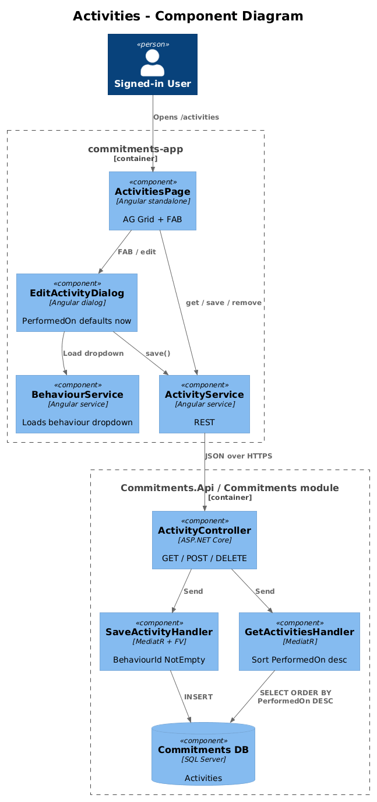
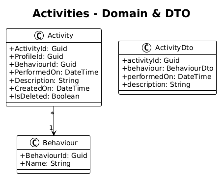
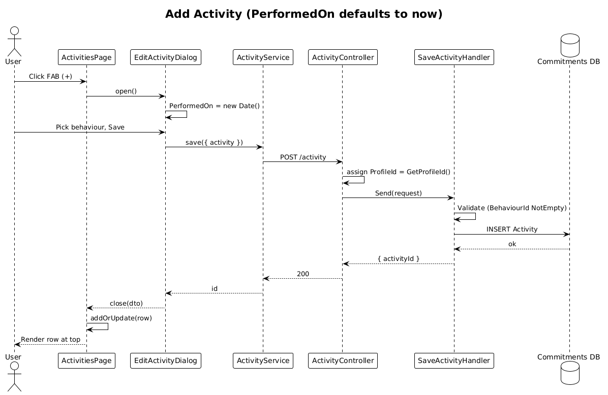

# Activities — Detailed Design

**Status:** Draft

**Traces to:** L1-006 · L2-012, L2-013

## 1. Overview

The Activities page (`pages/activities`, route `/activities`) records instances of a behaviour being performed at a point in time, scoped to the active profile. The page lists historical activities sorted by `PerformedOn` desc and supports add/edit/delete via `EditActivityDialog`.

## 2. Architecture

### 2.1 C4 Component

## 3. Component Details

### 3.1 ActivitiesPageComponent (frontend, exists)
- Already wired (see `frontend/.../activities-page/activities-page.component.ts`).
- **Delta:** replace placeholder route in `app.routes.ts` with this component.

### 3.2 EditActivityDialog (frontend, exists)
- Already implemented. **Delta:** initialise `PerformedOn` to `new Date()` when opening for create (per L2-012 AC #1). The form must NOT submit when no behaviour is selected (AC #2 — server-side validator already rejects, but client-side disables the Save button to short-circuit).

### 3.3 ActivityController (backend, exists)
- `Save` / `Remove` / `GetById` / `Get` already wired and assert `ProfileId` from header (see existing controller).
- **Delta — validator:** ensure `SaveActivityRequestValidator` has `RuleFor(x => x.Activity.BehaviourId).NotEmpty()` (per L2-040 — `.NotEmpty()` not `.NotNull()` for Guids).
- **Delta — sort:** `GetActivitiesHandler` returns `OrderByDescending(a => a.PerformedOn)`.

## 4. Data Model

### 4.1 Class Diagram

## 5. Key Workflows

### 5.1 Add an activity

## 6. API Contracts (existing routes, prefix `/api/v1.0/activity`)

| Method | Route | Body / Params | Response |
|--------|-------|----------------|----------|
| GET | `/activity` | — | `200 { activities }` (sorted desc by PerformedOn) |
| POST | `/activity` | `{ activity }` | `200 { activityId }` |
| DELETE | `/activity/{activityId}` | — | `200` |

## 7. Security Considerations

- Per L2-038 the active `ProfileId` is enforced on the server; the controller assigns `request.Activity.ProfileId = httpContextAccessor.GetProfileId()` before dispatch (existing code).
- The `Description` field (free text) is HTML-escaped on render to satisfy L2-041.

## 8. ATDD Slices

1. **Slice A — list + sort.** Spec: list returns activities ordered by PerformedOn desc.
2. **Slice B — add with default PerformedOn.** Spec: opening Add Activity defaults the date to "now"; saving without editing produces a row with `PerformedOn ≈ Date.now()`.
3. **Slice C — server validator on `BehaviourId`.** Spec: a request with empty `BehaviourId` returns 400 with the validator message.

## 9. Open Questions

- Achievement creation triggers `goalProgressUpdated` (L2-025). That belongs to the live-tile design, not this slice — but the test should *not* assert the absence of the SignalR event, only the activity record itself.
