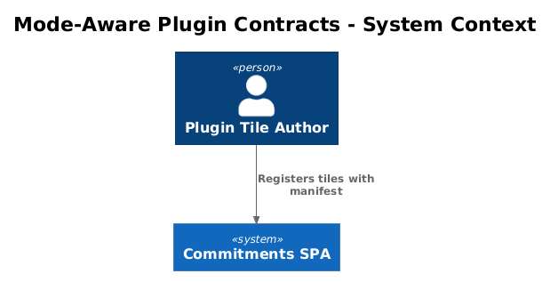
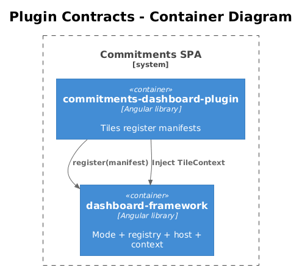
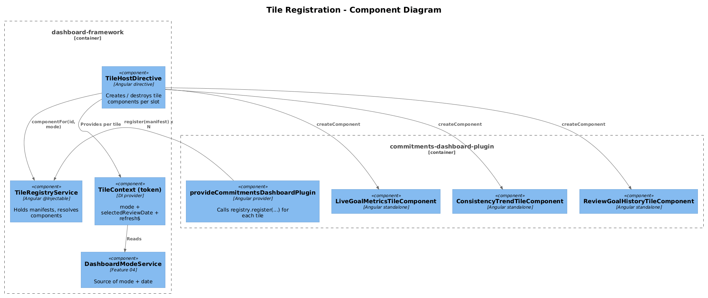
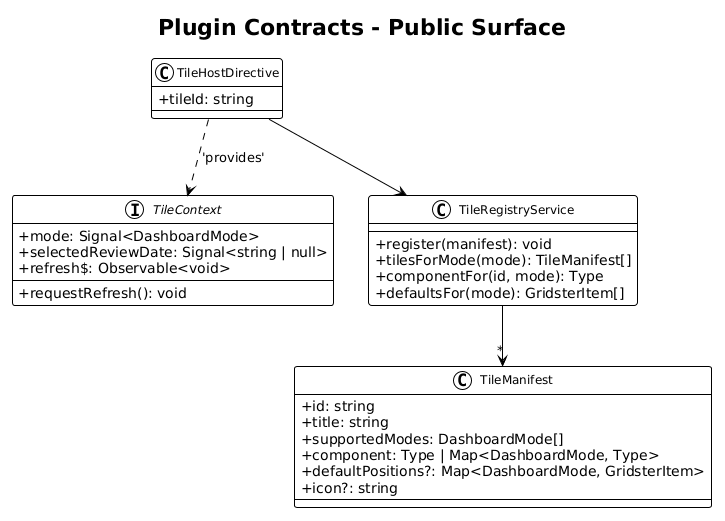
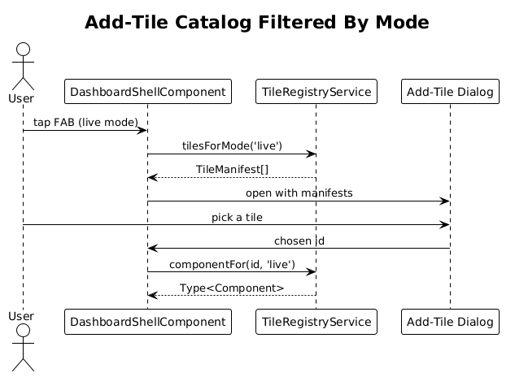
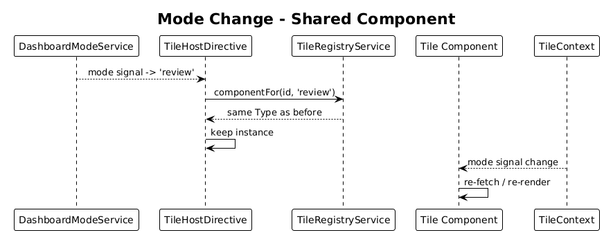
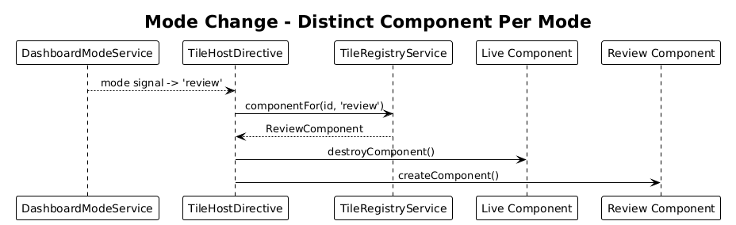

# 10 — Mode-Aware Plugin Contracts — Detailed Design

## 1. Overview

Extend `dashboard-framework`'s tile registration so plugins can declare **which modes a tile supports**, **separate live/review components for the same tile concept**, and so the framework can pass **mode**, **selectedReviewDate**, and a **refresh hook** to every tile via `TileContext`.

This is the contract that makes Features 07/08/09 cleanly mode-aware without each plugin re-implementing mode plumbing.

**Actors**

- **Plugin tile author** — declares supported modes, optionally provides separate components.
- **Framework** — filters the tile catalog by mode and resolves which component to render.

**Scope boundary**

- Registration metadata + per-tile DI context only.
- Does not introduce new tiles; reshapes the surface area used by Features 01, 02, 07, 08, 09 and any future tile.
- No backend.

## 2. Architecture

### 2.1 C4 Context



### 2.2 C4 Container



### 2.3 C4 Component



`TileRegistryService` (extended) resolves a tile id + mode → `Type<Component>`. `TileHostDirective` (extended) provides each tile's `TileContext` and bootstraps the component via `ViewContainerRef.createComponent`.

## 3. Component Details

### 3.1 TileManifest (extended)

- **Path**: `frontend/projects/dashboard-framework/src/lib/tile-registration/tile-manifest.ts`

```ts
export interface TileManifest {
  /** Unique id, e.g. 'live-goal-metrics'. */
  id: string;

  /** Human-readable title shown in the add-tile catalog. */
  title: string;

  /** Modes this tile is offered in. */
  supportedModes: ReadonlyArray<DashboardMode>;

  /**
   * One component shared across modes (default), OR
   * a per-mode component map (when live and review need very different visuals).
   */
  component: Type<unknown> | Partial<Record<DashboardMode, Type<unknown>>>;

  /** Default Gridster positions per mode. Both optional; missing mode = not seeded into that mode's layout. */
  defaultPositions?: Partial<Record<DashboardMode, GridsterItem>>;

  /** Optional: an icon name (Material symbol) for the catalog. */
  icon?: string;
}
```

`Partial<Record<DashboardMode, Type>>` is the *map* form; both keys are optional, but the framework rejects a manifest at registration time if `supportedModes` includes a mode not present in the component map (when the map form is used).

### 3.2 TileRegistryService (extended)

- **Path**: `frontend/projects/dashboard-framework/src/lib/tile-registration/tile-registry.service.ts`
- **Public methods**:
  - `register(manifest: TileManifest): void`
  - `tilesForMode(mode: DashboardMode): TileManifest[]`
  - `componentFor(id: string, mode: DashboardMode): Type<unknown>` — throws if id unknown or unsupported in mode.
  - `defaultsFor(mode: DashboardMode): GridsterItem[]` — used by Feature 05's layout service to seed defaults.
- **Validation at register**:
  - Reject duplicate ids.
  - Reject manifests whose `supportedModes` includes a mode missing from the component map (when map form).
  - Warn (not error) when `defaultPositions[mode]` is missing for a supported mode — useful in dev.

### 3.3 TileContext (final shape)

- **Path**: `frontend/projects/dashboard-framework/src/lib/tile-registration/tile-context.ts`

```ts
export interface TileContext {
  readonly mode: Signal<DashboardMode>;
  readonly selectedReviewDate: Signal<string | null>;
  /** Emits when the user (or system) requests an explicit refresh — eg. focus regain, scrubber play resume. */
  readonly refresh$: Observable<void>;
  /** Fire-and-forget request to refresh; the framework throttles. */
  requestRefresh(): void;
}
```

This finalises the skeleton from Feature 04 by adding `refresh$`/`requestRefresh()`. Plugin tiles inject `TileContext` via DI.

### 3.4 TileHostDirective (extended)

- **Path**: `frontend/projects/dashboard-framework/src/lib/tile-registration/tile-host.directive.ts`
- **Inputs**: `tileHost: { id: string }` (or `[tileId]="..."` two-way wrapper).
- **Behavior**:
  1. Read current mode from `DashboardModeService`.
  2. Ask `TileRegistryService.componentFor(id, mode)`.
  3. Provide a per-instance `TileContext` (a small adapter over the singleton mode service + the tile's own `Subject<void>` for `refresh$`).
  4. `viewContainerRef.createComponent(component, { injector })`.
  5. Re-create the component when `mode` changes *only if* the resolved component differs (i.e. tile uses the per-mode component map). Otherwise keep the same instance — the component reads the new mode from context and re-fetches itself.
- **Why not always re-create**: cheaper, preserves Chart.js instances (Feature 08), avoids flicker.

### 3.5 Plugin registration site

`commitments-dashboard-plugin` exposes `provideCommitmentsDashboardPlugin()` that registers all tiles. Each tile contributes its manifest, e.g.:

```ts
registry.register({
  id: 'live-goal-metrics',
  title: 'Live goal metric',
  supportedModes: ['live'],
  component: LiveGoalMetricsTileComponent,
  defaultPositions: { live: { cols: 4, rows: 4, x: 0, y: 0, tileId: 'live-goal-metrics', tileType: 'live-goal-metrics' } },
});
```

Or for the chart tile (both modes, same component):

```ts
registry.register({
  id: 'consistency-trend',
  title: 'Consistency trend',
  supportedModes: ['live', 'review'],
  component: ConsistencyTrendTileComponent,
  defaultPositions: {
    live:   { cols: 8, rows: 6, x: 4, y: 0, tileId: 'consistency-trend', tileType: 'consistency-trend' },
    review: { cols: 8, rows: 6, x: 4, y: 0, tileId: 'consistency-trend', tileType: 'consistency-trend' },
  },
});
```

Or for a tile that needs distinct components per mode:

```ts
registry.register({
  id: 'goal-metric',
  title: 'Goal metric',
  supportedModes: ['live', 'review'],
  component: {
    live: LiveGoalMetricsTileComponent,
    review: ReviewGoalHistoryTileComponent,
  },
  defaultPositions: {
    live:   { ... },
    review: { ... },
  },
});
```

### 3.6 Plugin code does not import `commitments-app`

Lint rule (eslint, repo-level): forbid `import .* from '.*commitments-app.*'` inside `commitments-dashboard-plugin`. Already implied by the workspace, but make it explicit.

## 4. Data Model

### 4.1 Class Diagram



### 4.2 Entity Descriptions

- **TileManifest** — pure value object, registered with the framework.
- **TileContext** — DI-provided per tile instance. Lives only as long as the tile.
- **GridsterItem** — same as Feature 05.

No backend, no persistence beyond what Feature 05 already does.

## 5. Key Workflows

### 5.1 Add-tile catalog filtering



1. User opens add-tile FAB (live mode only).
2. Framework asks `tileRegistry.tilesForMode('live')`.
3. Catalog UI shows only live-supporting tiles.

### 5.2 Mode change with shared component



1. Mode flips from live to review.
2. `TileHostDirective` resolves the same component class for both modes.
3. Component instance kept; `TileContext.mode` signal updates → component re-fetches.

### 5.3 Mode change with distinct components



1. Mode flips.
2. Resolved component differs.
3. Directive destroys old instance, creates new one in the same `<gridster-item>` slot.

## 6. API Contracts

No HTTP. Public exports added to `dashboard-framework/public-api.ts`:

```ts
export { TileManifest, TileRegistryService, TileContext, TileHostDirective };
```

`TileContext` is provided via the injection token `TILE_CONTEXT` for tiles that prefer functional injection.

## 7. Security Considerations

- Registry rejects malformed manifests at `register()` to fail fast in dev.
- No user-supplied data flows through the registry — every manifest is hardcoded by plugin authors.

## 8. Acceptance

- Calling `tilesForMode('review')` returns only tiles whose `supportedModes` includes `'review'`.
- A tile with `supportedModes: ['live', 'review']` and a single `component` keeps its instance across mode changes.
- A tile with the per-mode component map switches component instances on mode change.
- Adding a new mode-aware tile requires only `registry.register({...})` plus the component class — no edits to `commitments-app` or `dashboard-framework`.
- Registry rejects (with a clear error) a manifest that lists a mode without a corresponding entry in the component map.

## 9. Open Questions

- **Per-mode SCSS overrides** — should the manifest accept per-mode CSS classes? Probably not; the component variants handle it.
- **Async component resolution** — should `componentFor` support `() => import(...)` for code-split tiles? Defer until a tile actually warrants it.
- **Refresh throttle window** — `requestRefresh()` throttle default 1 s? Configurable per tile? Lean toward a fixed 1 s for v1.
