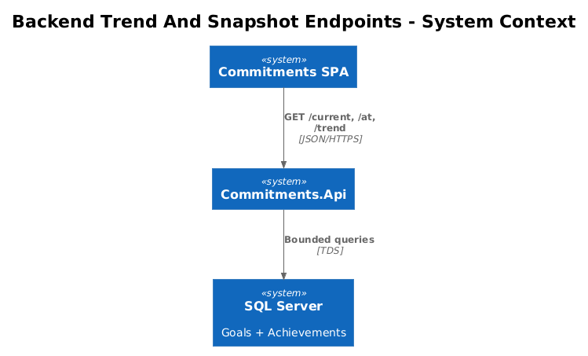
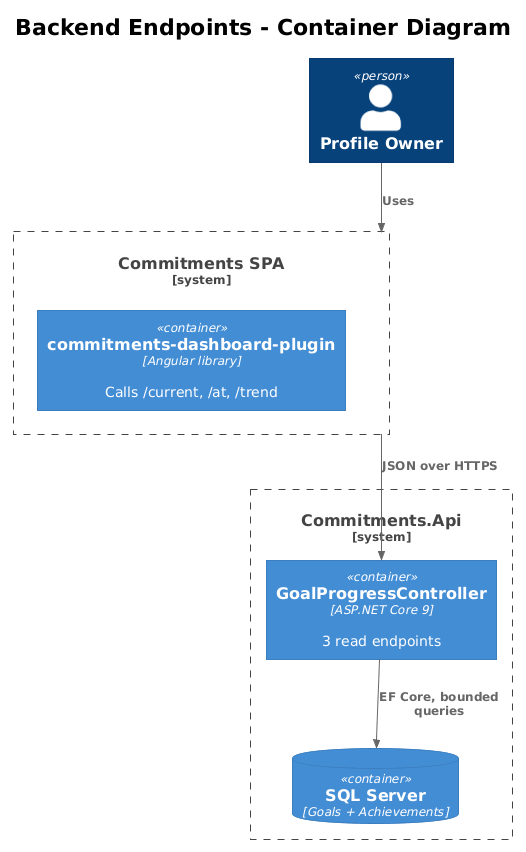
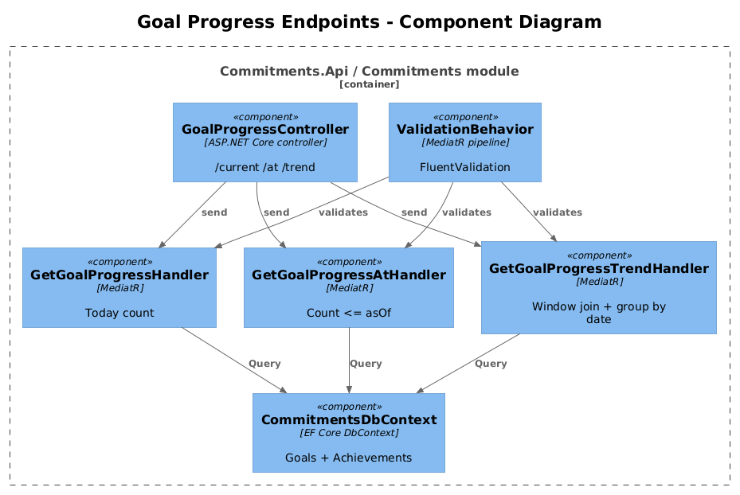
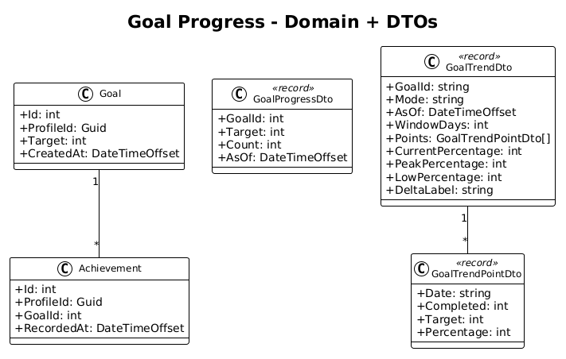
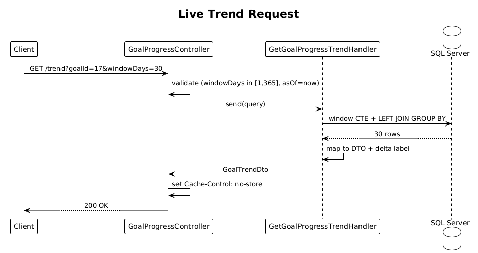
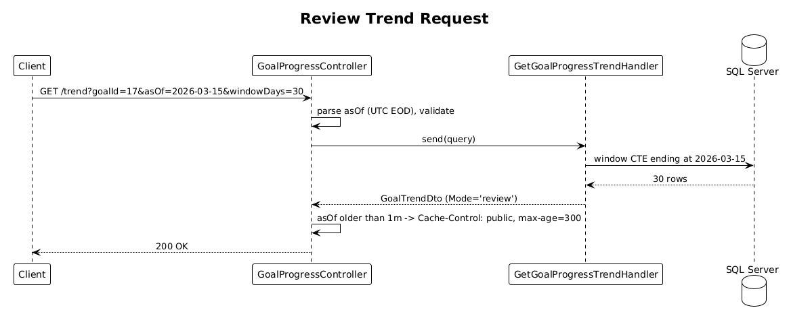
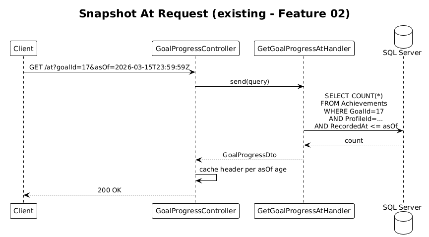

# 11 — Backend Trend And Snapshot Endpoints — Detailed Design

## 1. Overview

Consolidate goal-progress reads behind three endpoints that the live and review tiles depend on:

- `GET /api/goal-progress/current` (Feature 01) — kept as-is.
- `GET /api/goal-progress/at` (Feature 02) — kept as-is.
- `GET /api/goal-progress/trend` (new) — supplies windowed series for the Chart.js tile (Feature 08) and (optionally) replaces the dedicated 14-day endpoint from Feature 07.

This slice is the backend shape of the plan: query bounds, indexes, cache headers, and a single MediatR handler per endpoint.

**Actors**

- **Profile owner** — indirectly (every read).
- **Frontend tiles** — Features 07/08/09.

**Scope boundary**

- Lives in the `Commitments` module under `backend/src/Modules/Commitments/Features/GoalProgress/`.
- Read-only. No new writes, no integration events beyond what Feature 01 already publishes.
- One DbContext (`CommitmentsDbContext`); one query per endpoint.

## 2. Architecture

### 2.1 C4 Context



### 2.2 C4 Container



### 2.3 C4 Component



`GoalProgressController` exposes three actions, each forwarding to a MediatR handler. Handlers query `CommitmentsDbContext` directly. Validation is done by `FluentValidation` behaviors in the existing `ValidationBehavior` shared pipeline.

## 3. Component Details

### 3.1 GoalProgressController

- **Path**: `backend/src/Modules/Commitments/Features/GoalProgress/GoalProgressController.cs`
- **Routes** (versioned under `api/`):
  - `GET /current?goalId={int}` ⟶ `GoalProgressDto`.
  - `GET /at?goalId={int}&asOf={iso}` ⟶ `GoalProgressDto`.
  - `GET /trend?goalId={int}&asOf?={iso}&windowDays?={int=30}` ⟶ `GoalTrendDto`.
- **Auth**: existing JWT + `ProfileId` header (`HttpContextAccessorExtensions.GetProfileId()`).

### 3.2 GetGoalProgressTrendHandler (new)

- **Path**: same folder, `GetGoalProgressTrend.cs`.
- **Request**: `{ GoalId: int, AsOf: DateTimeOffset?, WindowDays: int }`.
- **Validation**:
  - `GoalId > 0`.
  - `WindowDays` clamped to `[1, 365]`.
  - `AsOf` not in the future; null means "now". Server normalises to UTC end-of-day for the requested date.
- **Query** (single round-trip):

```sql
WITH window AS (
  SELECT TOP (:windowDays) DATEADD(day, -n, :asOfDate) AS d
  FROM (VALUES (0),(1),...) AS Ns(n)
)
SELECT w.d AS [Date],
       COUNT(a.Id) AS Completed
FROM window w
LEFT JOIN Achievements a
  ON a.GoalId = :goalId
 AND a.ProfileId = :profileId
 AND CAST(a.RecordedAt AS DATE) = w.d
GROUP BY w.d
ORDER BY w.d;
```

- **EF Core**: implemented as a single `FromSqlInterpolated` or as an `IEnumerable<DateOnly> windowDates` projected via `from d in dates join a in Achievements ...` with `GroupBy`. Either way, **one** round-trip.
- **Mapping**:
  - `target = goal.Target` (single goal lookup; can join in same query or do a second cheap by-id lookup with `AsNoTracking`).
  - `percentage = clamp(completed / target * 100, 0, 100)`.
  - `currentPercentage = points.Last().percentage`.
  - `peakPercentage = points.Max(p => p.percentage)`.
  - `lowPercentage = points.Min(p => p.percentage)`.
  - `deltaLabel`: short formatted string e.g. `"+5% vs prior 14d"` — see 3.4.

### 3.3 GoalTrendDto / GoalTrendPointDto

Mirrors the contract from `live-review-chartjs-alignment-plan.md`:

```csharp
public sealed record GoalTrendDto(
  string GoalId, string Mode, DateTimeOffset AsOf, int WindowDays,
  IReadOnlyList<GoalTrendPointDto> Points,
  int CurrentPercentage, int PeakPercentage, int LowPercentage,
  string DeltaLabel);

public sealed record GoalTrendPointDto(
  string Date, int Completed, int Target, int Percentage);
```

`Mode` is a string round-tripped from the caller (`'live'` if `asOf` is omitted, otherwise `'review'`) — purely informational so the frontend can echo it.

### 3.4 Delta label policy

Server-computed so the SPA shows a consistent label without re-deriving:

- Compare last-N (default 14) average vs prior-N average.
- Render as `"+5% vs prior 14d"` / `"-3% vs prior 14d"` / `"flat"`.
- Plain string; client-side formatting stays out of this contract.

### 3.5 Indexing

Existing `Achievements` table is expected to have:

- `IX_Achievements_ProfileId_GoalId_RecordedAt` (composite, descending on `RecordedAt`).

If the index is missing, add it via EF Core migration in this slice. The `current`, `at`, and `trend` queries all leverage it.

### 3.6 Cache headers

- `current`: `Cache-Control: no-store` — must be fresh.
- `at`: `Cache-Control: public, max-age=300` *only if `asOf < UtcNow - 1 minute`*; otherwise `no-store`. Idempotent for past dates.
- `trend` with explicit `asOf`: same logic — cache 5 minutes for fully-historical windows; `no-store` otherwise (because today's tail is still live).
- `trend` without `asOf`: `no-store`.

Cache headers are set in the controller via `Response.GetTypedHeaders().CacheControl = new CacheControlHeaderValue { ... }`.

### 3.7 Bounded query count

`current` = 1 query, `at` = 1 query, `trend` = 1 (or 2 if we look up `Goal.Target` separately). Dashboard tile load (live mode, three tiles): ≤ 4 queries total. Meets `L2-043 / L2-044 / L2-045` performance bounds.

## 4. Data Model

### 4.1 Class Diagram



### 4.2 Entity Descriptions

- **Goal** (existing) — `Id`, `ProfileId`, `Target`, `CreatedAt`. `BaseDbContext` applies `ProfileId` global query filter automatically.
- **Achievement** (existing) — `Id`, `ProfileId`, `GoalId`, `RecordedAt`.
- **GoalProgressDto** — Features 01/02. Unchanged.
- **GoalTrendDto / GoalTrendPointDto** — new transport DTOs.

No schema changes, only the optional new index migration if missing.

## 5. Key Workflows

### 5.1 Live trend request



1. Client calls `/trend?goalId=17&windowDays=30`.
2. Controller normalises `asOf=null → UtcNow.Date`, validates window.
3. Handler runs the window-join query and looks up `Goal.Target`.
4. Maps to `GoalTrendDto`, returns `200`. Sets `Cache-Control: no-store`.

### 5.2 Review trend request



1. Client calls `/trend?goalId=17&asOf=2026-03-15&windowDays=30`.
2. Validation accepts past `asOf`, normalises to end-of-day UTC.
3. Same handler produces a window ending at `2026-03-15`.
4. Cache header: `public, max-age=300` (asOf older than 1 minute).

### 5.3 Snapshot at request (existing)



Unchanged from Feature 02; included for completeness.

## 6. API Contracts

```
GET /api/goal-progress/current?goalId={int}
  Headers: Authorization, ProfileId
  200 { goalId, target, count, asOf }
  Cache-Control: no-store

GET /api/goal-progress/at?goalId={int}&asOf={iso}
  200 { goalId, target, count, asOf }
  Cache-Control: public, max-age=300  (when asOf is fully historical)

GET /api/goal-progress/trend?goalId={int}&asOf?={iso}&windowDays?={int=30}
  200 GoalTrendDto
  Cache-Control:
    no-store               when asOf omitted or asOf within last minute
    public, max-age=300    otherwise

400 — invalid windowDays (<1 or >365), invalid asOf, missing goalId
404 — goal not owned by profile
```

## 7. Security Considerations

- All queries pass through `BaseDbContext` `ProfileId` global filter — no bypass.
- `windowDays` clamped to 365 prevents pathological queries.
- `asOf` is parsed strictly as ISO 8601 and rejected if more than 100 years in the past.
- No PII in DTOs beyond what the user already owns.

## 8. Acceptance

- `current` returns within 50 ms p50 on the dev dataset.
- `trend` returns within 100 ms p50 with `windowDays=30`.
- Dashboard load (3 tiles) issues no more than 4 SQL round-trips total.
- Dropping the existing index temporarily produces a measurable slowdown (sanity check on coverage).
- Cache headers verified via integration test (`HEAD` on `at?asOf=<old>` returns `max-age=300`; `HEAD` on `current` returns `no-store`).

## 9. Open Questions

- **Materialised window** vs **calendar table** — the `WITH window AS (...)` CTE works for SQL Server. If the team wants a permanent calendar table, that's a future cleanup — not blocking.
- **Time zones** — every query is UTC. If product asks for "user-local day boundaries", we add a `tz` query parameter; for v1, UTC only.
- **Replace `last14` from Feature 07** — recommend folding 07's endpoint into `/trend?windowDays=14`. Decide on the 07 vs 11 PR ordering review.
- **OutputCache vs response headers** — using response headers for now (simplest, browser caches it). `OutputCache` middleware is a future optimisation.
