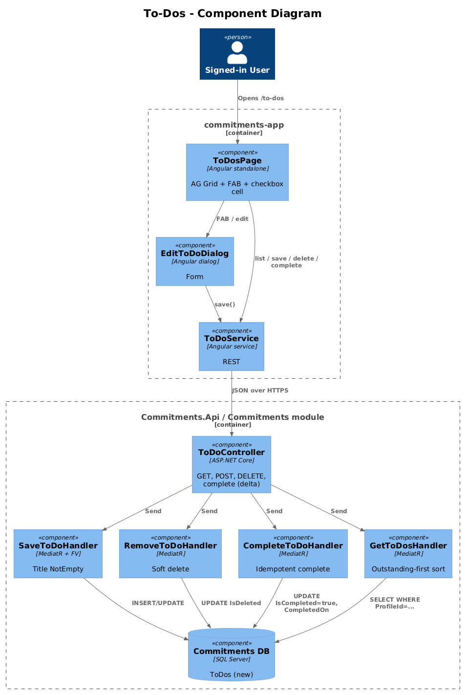
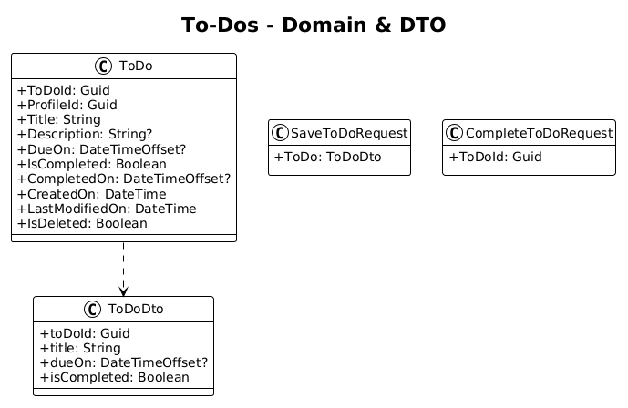
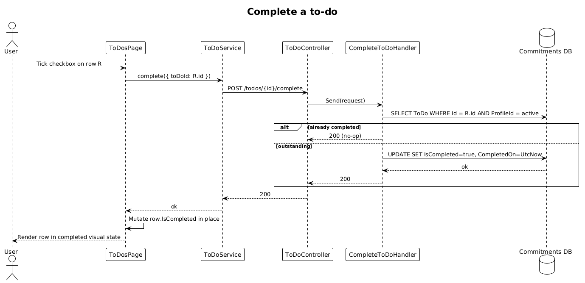

# To-Dos — Detailed Design

**Status:** Draft

**Traces to:** L1-008 · L2-016, L2-038

## 1. Overview

The To-Dos page (`pages/to-dos`, route `/to-dos`) is a list of personal action items the user has captured. The page lists outstanding and completed items, allows toggling completion via a checkbox cell, and supports add/edit/delete via `EditToDoDialog`.

The current backend has only `GetOutstandingToDoCount` (used by the dashboard tile) — the entire CRUD vertical slice for `ToDo` is missing and is the focus of this delta.

## 2. Architecture

### 2.1 C4 Component

## 3. Component Details

### 3.1 ToDosPageComponent (frontend, exists as placeholder)
- Replace placeholder route with this component.
- Columns: completed checkbox, title, due date, edit, delete. Sort: outstanding first, then by `DueOn` asc.
- FAB → `EditToDoDialog`.

### 3.2 EditToDoDialog (frontend, exists)
- Already present. **Delta:** none beyond surfacing through the new page.

### 3.3 ToDo backend (entirely **new** — but fits existing module)
- New domain entity in `Commitments.Domain.ToDo` with fields: `ToDoId : Guid`, `ProfileId : Guid`, `Title : string`, `Description : string?`, `DueOn : DateTimeOffset?`, `IsCompleted : bool`, `CompletedOn : DateTimeOffset?`. Inherits `BaseEntity` for soft-delete + audit.
- EF migration: new `ToDos` table in the Commitments schema with the standard `ProfileId` index used by the global query filter.
- New vertical slices in `Commitments.Features.ToDo`:
  - `SaveToDo` (insert or update) — validator: `Title.NotEmpty()`.
  - `RemoveToDo` (soft delete).
  - `CompleteToDo` (idempotent — sets `IsCompleted = true`, `CompletedOn = UtcNow`).
  - `GetToDos` (active profile, sort outstanding first then `DueOn` asc).
  - `GetOutstandingToDos` (existing dashboard tile expects `outstanding` endpoint per `to-do.service.ts`).

### 3.4 ToDoController (backend, exists — sparse)
- Currently only exposes `GET outstanding-count`. **Delta:** add `GET`, `GET {id}`, `POST`, `DELETE {id}`, `POST {id}/complete`, `GET outstanding`. Each delegates to the new MediatR handlers. Per L2-038 every action runs under `ProfileId` from header.

## 4. Data Model

### 4.1 Class Diagram

## 5. Key Workflows

### 5.1 Mark a to-do complete

## 6. API Contracts

| Method | Route | Body / Params | Response |
|--------|-------|----------------|----------|
| GET | `/api/v1.0/todos` | — | `200 { toDos }` |
| GET | `/api/v1.0/todos/outstanding` | — | `200 { toDos }` |
| GET | `/api/v1.0/todos/{toDoId}` | — | `200 { toDo }` |
| POST | `/api/v1.0/todos` | `{ toDo }` | `200 { toDoId }` |
| POST | `/api/v1.0/todos/{toDoId}/complete` | — | `200` |
| DELETE | `/api/v1.0/todos/{toDoId}` | — | `200` |

## 7. Security Considerations

- All endpoints `[Authorize]`. Handlers filter by `ProfileId` from the header (per L2-038).
- `Title` is HTML-escaped on render (per L2-041).
- `CompleteToDo` is idempotent — calling twice on the same item does not change `CompletedOn` after the first set, preventing tampering by repeated clicks.

## 8. ATDD Slices

1. **Slice A — domain + migration.** Add `ToDo` entity to `CommitmentsDbContext` and produce the EF migration.
2. **Slice B — list/save/delete vertical slices.** Spec: opening `/to-dos` lists items; submitting the dialog adds a row; deleting removes it.
3. **Slice C — complete toggle.** Spec: ticking the checkbox issues `POST /todos/{id}/complete` once and the row visually transitions to "completed". Outstanding-count tile decrements on next reload.
4. **Slice D — dashboard tile compatibility.** Spec: existing `outstanding-count` endpoint still works after the migration (no regression in the dashboard tile).

## 9. Open Questions

- Recurring to-dos? Out of scope. If needed later, model as a `Recurrence` value object.
- Should completing a to-do raise a SignalR event so the dashboard tile updates without reload? Defer to a follow-up tile design (mirror of L2-024).
