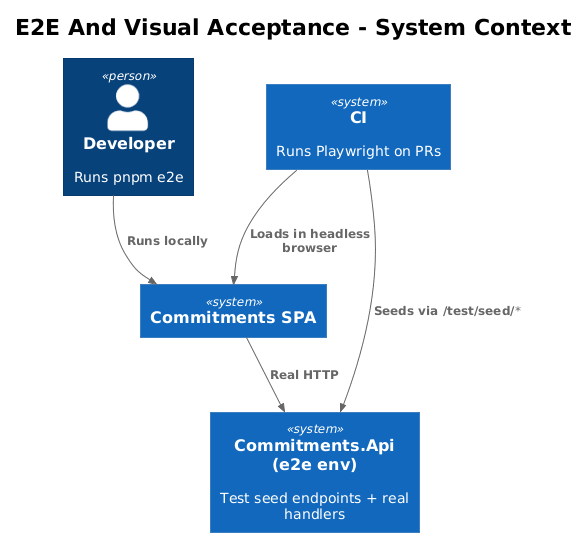
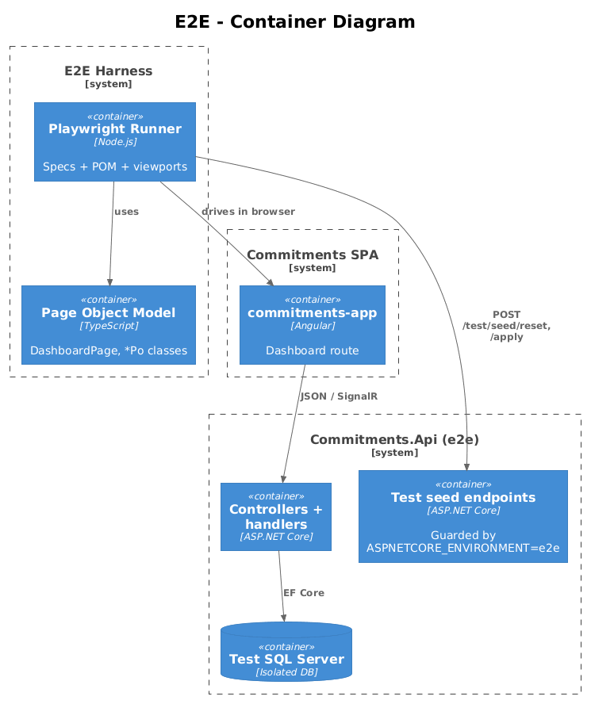
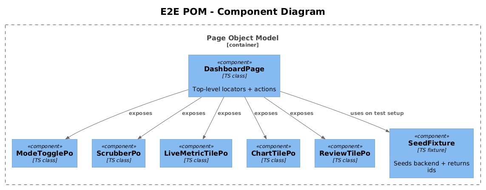
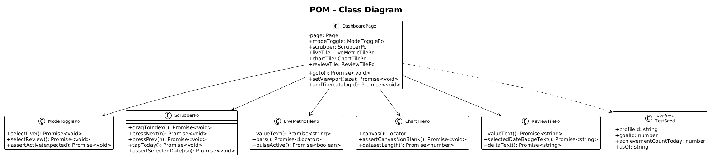
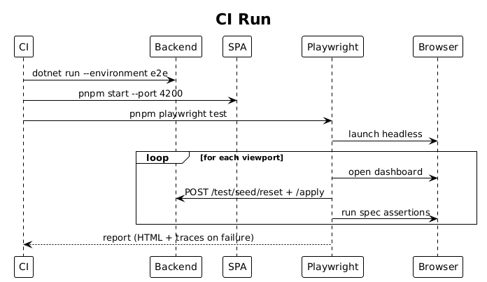
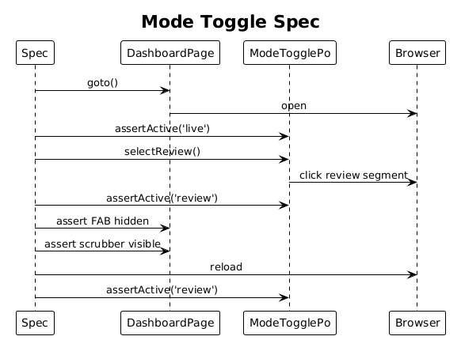
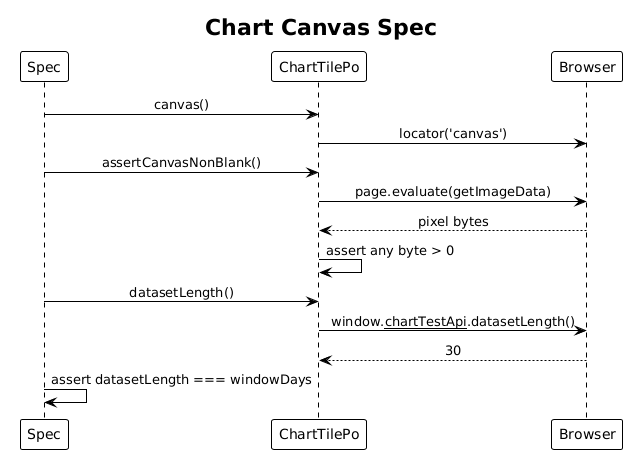

# 12 — End-To-End And Visual Acceptance — Detailed Design

## 1. Overview

Add Playwright Page Object Model (POM) coverage that proves Live and Review modes behave correctly in the running app: the toggle actually swaps modes, the scrubber actually moves the date, FAB visibility tracks mode, and the Chart.js tile actually renders to canvas. Coverage runs at three viewports — tablet, LG desktop, XL desktop.

This is the acceptance gate for Features 03–11. Every feature's user-visible promise gets one Playwright spec.

**Actors**

- **CI** — runs the suite on PR.
- **Developer** — runs `pnpm e2e` locally.

**Scope boundary**

- E2E tests only. Unit tests stay inside each feature's slice.
- Three viewports: tablet (768×1024), LG (1280×800), XL (1920×1080).
- Tests use seeded data (Playwright fixture spawning a fresh profile + a known goal with N achievements over 30 days).
- No visual snapshots that depend on dynamic chart pixels — see 3.5.

## 2. Architecture

### 2.1 C4 Context

### 2.2 C4 Container

### 2.3 C4 Component

`Playwright runner` ⟶ POM (`DashboardPage`, `ModeTogglePo`, `ScrubberPo`, `LiveMetricTilePo`, `ChartTilePo`, `ReviewTilePo`) ⟶ running SPA (`commitments-app`) + a backend in `e2e` mode (in-memory or test SQL Server).

## 3. Component Details

### 3.1 Page object: DashboardPage

- **Path**: `frontend/e2e/pages/dashboard.page.ts`
- **Locators**: `modeToggle`, `addTileFab`, `scrubber`, `tile(id)`.
- **Actions**: `goto()`, `setViewport(size)`, `assertMode(expected)`, `addTile(catalogId)`.

### 3.2 ModeTogglePo

- `liveSegment()`, `reviewSegment()`.
- `selectLive()`, `selectReview()`.
- `assertActive(expected)` — checks `aria-pressed` on the active segment.

### 3.3 ScrubberPo

- `track`, `prevButton`, `nextButton`, `playButton`, `todayButton`, `selectedDateLabel`.
- `dragToIndex(index: number)` — uses `boundingBox()` math to compute the x-coordinate of the target tick and runs `mouse.move + mouse.down/up`.
- `pressNext(times = 1)`, `pressPrev(times = 1)`.
- `assertSelectedDate(iso)` — reads the label text, normalises, compares.

### 3.4 Tile POMs

- `LiveMetricTilePo`: `valueText()`, `deltaText()`, `bars()` (returns 14 elements), `pulseActive()` (checks the `is-pulsing` class).
- `ChartTilePo`: `canvas()` (locator), `assertCanvasNonBlank()` — see 3.5.
- `ReviewTilePo`: `valueText()`, `selectedDateBadgeText()`, `deltaText()`.

### 3.5 Chart canvas verification

Snapshot pixel diffs are too brittle for a real chart with seeded data drift. Instead:

- Assert `<canvas>` exists and is visible.
- Read width / height — assert `clientWidth > 0 && clientHeight > 0`.
- Use `page.evaluate(canvas => { ctx = canvas.getContext('2d'); pixels = ctx.getImageData(0, 0, w, h).data; return pixels.some(byte => byte !== 0); })` to assert at least one non-zero pixel — i.e., something was drawn.
- Optionally, expose `(window as any).__chartTestApi__ = { datasetLength: () => chart.data.datasets[0].data.length }` from the chart adapter only when `NG_E2E === '1'` is set; the spec asserts `datasetLength() > 0`.

This gives a real "the chart drew something with data" check without flaky pixel diffs.

### 3.6 Specs

`frontend/e2e/specs/`:

- `mode-toggle.spec.ts`
  - Initial state is `live`.
  - Click review → mode becomes `review`, FAB hides, scrubber appears.
  - Reload → mode persists.
- `scrubber.spec.ts`
  - Drag track → review tile updates value and badge.
  - Press next → date advances by 1 day.
  - Press today → snaps to today; review tile delta becomes 0.
  - Keyboard: `ArrowRight` → date advances.
- `live-metric-tile.spec.ts`
  - Renders 14 bars; today is the highlighted bar.
  - On `goalProgressUpdated` (forced via test hook on the hub), value increments.
- `chart-tile.spec.ts`
  - Canvas exists and is visible.
  - At least one non-zero pixel.
  - Dataset length matches `windowDays` (via `__chartTestApi__`).
  - Mode toggle re-fetches; canvas remains the same DOM node (no re-create).
- `review-tile.spec.ts`
  - Selecting an old date shows the historical value and a non-zero delta vs today.
  - Empty day shows `0 / target` and the empty caption without changing tile height.
- `viewport.spec.ts`
  - Iterates over the three viewports; asserts mode toggle + scrubber render and Chart.js canvas remains responsive.

### 3.7 Test data fixtures

- **Path**: `frontend/e2e/fixtures/seed.ts`.
- Hits a backend test endpoint (or runs an EF Core seed) that creates:
  - Profile `e2e@test.local`.
  - One goal `id=42`, `target=30`.
  - Achievements distributed across 30 days, with today's count = 12.
- Returns `{ profileId, goalId }` for use in specs.

### 3.8 Backend test mode

Add an `e2e` ASP.NET environment under `backend/src/Commitments.Api/Program.cs` that:

- Uses an isolated database (LocalDB or test SQL Server instance).
- Exposes a `/test/seed/reset` endpoint guarded by `IHostEnvironment.IsEnvironment("e2e")` so tests can reset state between specs.

This already aligns with how the modular monolith composes; only one new endpoint is added, behind an environment guard.

### 3.9 CI wiring

- `pnpm --filter ./frontend e2e` runs Playwright headless with all three viewports as projects in `playwright.config.ts`.
- CI step starts the backend in `e2e` env, the SPA via `pnpm --filter commitments-app start --port 4200 --configuration e2e`, then runs Playwright.
- Artifacts: HTML report + `trace.zip` on failure.

## 4. Data Model

### 4.1 Class Diagram

### 4.2 Entity Descriptions

- **POM classes** — TypeScript classes wrapping Playwright `Locator`s. Stateless beyond their `page` reference.
- **TestSeed** — value object returned by the seed fixture: `{ profileId, goalId, achievementCountToday, asOf }`.

No persistent additions outside the test database.

## 5. Key Workflows

### 5.1 CI run

1. CI checks out, installs deps.
2. Starts backend in `e2e` mode.
3. Starts the SPA dev server.
4. Runs `playwright test` for all viewports.
5. Uploads artifacts on failure.

### 5.2 Mode toggle spec

1. Spec loads dashboard, asserts `live`.
2. Calls `modeTogglePo.selectReview()`.
3. Asserts `aria-pressed='true'` on review segment, FAB hidden, scrubber visible.
4. Reloads, asserts mode persisted to review.

### 5.3 Chart canvas spec

1. Spec loads dashboard with chart tile already configured for the seeded goal.
2. Reads canvas dimensions; asserts > 0.
3. Pulls pixel data via `page.evaluate`; asserts at least one non-zero byte.
4. Reads `window.__chartTestApi__.datasetLength()`; asserts equals `windowDays`.

## 6. API Contracts

The only new HTTP surface is the `e2e`-only `POST /test/seed/reset` (and `POST /test/seed/apply` body = JSON shape of seed). Both are 404 unless `ASPNETCORE_ENVIRONMENT=e2e`.

## 7. Security Considerations

- Seed endpoints are gated by environment and are not present in `Production`.
- `__chartTestApi__` window hook is feature-flagged by an environment variable so it is excluded from prod bundles.

## 8. Acceptance

- All specs pass locally on Chromium for tablet, LG, XL.
- Specs assert behavior (mode, value changes, canvas rendering), never just text presence.
- A failing chart tile (e.g. blank canvas) fails `chart-tile.spec.ts`.
- A regression that overwrites the live layout when toggling to review fails `mode-toggle.spec.ts`.
- HTML report artifact is produced and uploaded on CI failures.

## 9. Open Questions

- **Visual snapshot baselines** — defer until designs stabilise. If snapshots are added later, scope them to non-chart screens (e.g. mode toggle + scrubber bar only) using Playwright's `toHaveScreenshot()` with strict masking around the canvas.
- **Hub-event simulation** — easiest is to call the API endpoint that creates an achievement and let the hub pipeline run. Alternative: a test-only hub message endpoint. Lean on the real flow to keep tests representative.
- **Multi-browser coverage** — Chromium only for v1 to keep CI fast; add WebKit + Firefox once the suite is stable.
- **Seed mechanism** — single endpoint vs EF Core dev-time seeder. Endpoint is more flexible for parallel specs; defer the choice to when the e2e harness lands.
