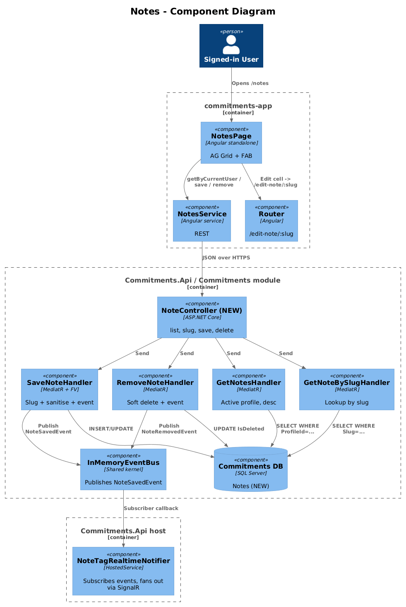
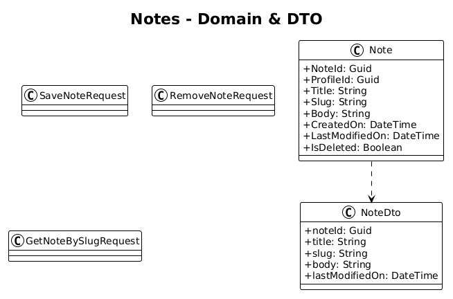
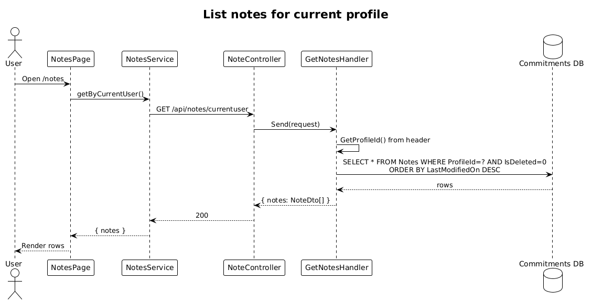

# Notes — Detailed Design

**Status:** Draft

**Traces to:** L1-007 · L2-014, L2-038, L2-041

## 1. Overview

The Notes page (`pages/notes`, route `/notes`) is the user's catalog of rich-text notes. It lists notes for the active profile (title + last-modified) and provides "New note" and edit-cell actions that navigate to `/edit-note/:slug` (design `13-edit-note`).

**The entire `Note` aggregate is missing on the backend.** This design adds the bounded context (entity + persistence + endpoints) inside the existing `Commitments` module — Notes are profile-scoped just like activities and to-dos, so a new module is unnecessary. The `NoteSavedEvent` integration event already exists in `Commitments.Shared/IntegrationEvents.cs` so the realtime notifier (`NoteTagRealtimeNotifier`) can wire up immediately once the handlers publish it.

## 2. Architecture

### 2.1 C4 Component

## 3. Component Details

### 3.1 NotesPageComponent (frontend, exists as placeholder)
- Replace placeholder route with this component.
- Columns: title, lastModifiedOn, edit, delete. FAB → navigates to `/edit-note/new` (no slug yet).
- Loads via `NotesService.getByCurrentUser()` (already calls `GET /api/notes/currentuser` in the service).

### 3.2 Note backend (entirely **new**)
- New domain entity `Commitments.Domain.Note { NoteId : Guid, ProfileId : Guid, Title : string, Slug : string, Body : string (HTML), CreatedOn, LastModifiedOn, IsDeleted }`.
- EF migration: `Notes` table with composite index `(ProfileId, Slug)` unique.
- `Slug` regenerated server-side from `Title` (kebab case, deduplicated by appending `-2`, `-3` if a row with the same `(ProfileId, Slug)` already exists).
- New vertical slices in `Commitments.Features.Note`:
  - `SaveNote` — sanitises `Body` HTML server-side (strip `
safe
` round-trips as `
safe
` only (L2-041 AC #1).
4. **Slice D — delete + soft-delete.** Spec: deleting removes from list, row remains in DB with `IsDeleted=true`.

## 9. Open Questions

- Is the slug user-editable? Recommendation: yes, but only as an optional override; if omitted, the server slugs the title. Out of this slice.
- Real-time updates: `NoteSavedEvent` is already published by the existing notifier — **delta:** publish the event from the new `SaveNoteHandler` so SignalR fans out to the `profile:{profileId}` group.
