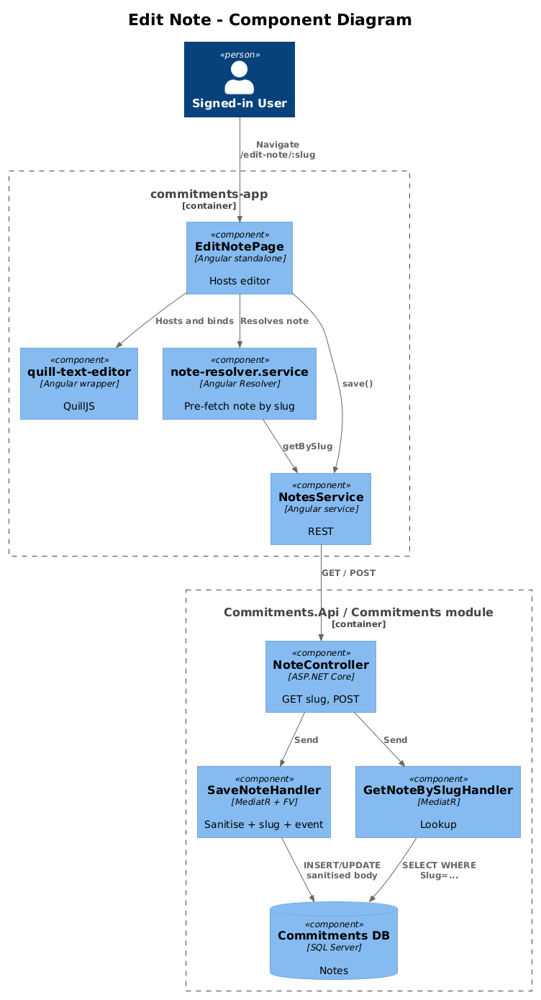
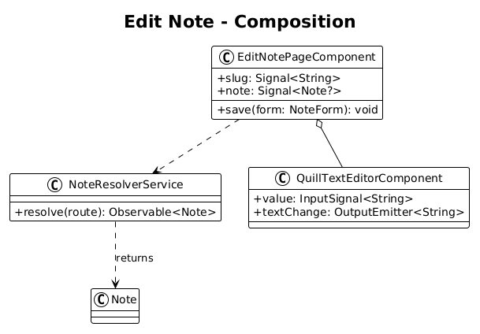
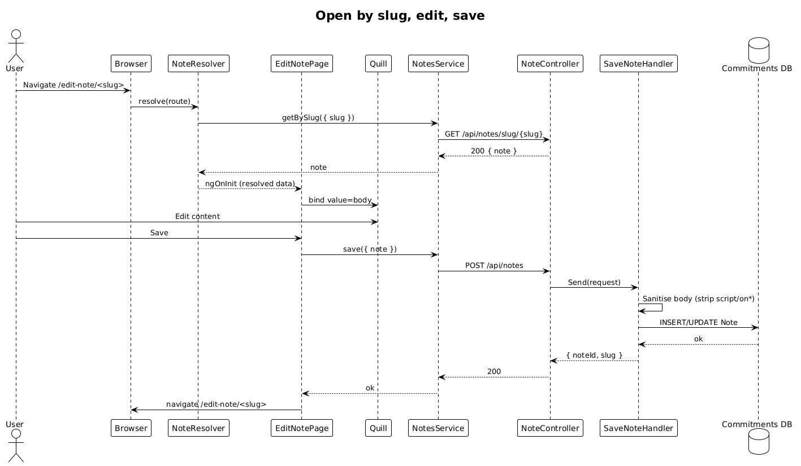

# Edit Note — Detailed Design

**Status:** Implemented

**Traces to:** L1-007 · L2-014, L2-041

## 1. Overview

The Edit Note page (`pages/edit-note`, route `/edit-note/:slug`) hosts the rich-text Quill editor for a single note. The slug is the deep-link surface — it allows the user (and search results / cross-linking from other notes) to bookmark a specific note. The page is also reached from the FAB on `/notes` with the literal slug `new`.

## 2. Architecture

### 2.1 C4 Component

## 3. Component Details

### 3.1 EditNotePageComponent (frontend, exists as placeholder)
- Replace placeholder route with this component (the route for `edit-note` is **not** in the placeholder list of `app.routes.ts` — add it as a child route under the `DashboardLayoutComponent`).
- Resolves the note via `note-resolver.service` (already exists) so the editor renders only after the note is fetched (per L2-014 AC #2).
- For `slug == 'new'` the resolver yields an empty in-memory `Note` (no HTTP).
- Save: builds a `Note` from form values, calls `NotesService.save(note)`. After save with a new note, navigate to `/edit-note/<returnedSlug>` so the URL stabilises.

### 3.2 quill-text-editor (frontend, exists)
- Already wraps QuillJS. Emits `(textChange)` events that the page binds to a reactive form control. **Delta:** none.

### 3.3 SaveNoteHandler — sanitisation (backend, see design `12-notes`)
- Same handler. Sanitises HTML server-side (strip `` must not survive a save/reload round-trip. Sanitisation runs server-side in `SaveNoteHandler` — never trust client-side sanitisation alone.
- The editor binds to a `FormControl<string>`; on render the body is bound via Angular's `[innerHTML]` only after sanitisation (the server's stored body is the source of truth).

## 8. ATDD Slices

1. **Slice A — resolver + render.** Spec: navigating to `/edit-note/<slug>` waits for the resolver, then renders the editor pre-populated. **Status: Implemented** — route mounts `EditNotePageComponent` with `resolve: { note: noteResolver }`; resolver fetches `GET /api/notes/slug/{slug}` and pushes to the Store before render.
2. **Slice B — save round-trip.** **Status: Implemented** — `EditNotePageComponent.handleSaveClick` calls `NotesService.save(note)` (POST `/api/notes`) which runs the existing handler from design 12.
3. **Slice C — XSS sanitisation.** **Status: Implemented** — server-side sanitisation by design 12's `SaveNoteCommandHandler` (regex pair stripping `<script>` and `on*` attributes); the page is purely a transport.
4. **Slice D — new-note flow.** **Status: Implemented** — `noteResolver` short-circuits when `slug === 'new'`: creates an empty `Note`, pushes to Store, returns `of(note)` without HTTP. Server stamps the slug on first save.

## 10. Implementation Notes

- The `'new'` shortcut is the only delta the resolver needed; the rest of the existing implementation (Quill binding, save submission) was already correct.
- Sanitisation lives server-side per the security spec (§7) — clients can never be fully trusted, so the page does not duplicate the regex on the way out.

## 9. Open Questions

- Is autosave wanted? Out of scope. Default to explicit save.
- Conflict resolution (two tabs editing the same note)? Out of scope; last-write-wins is acceptable for now.
