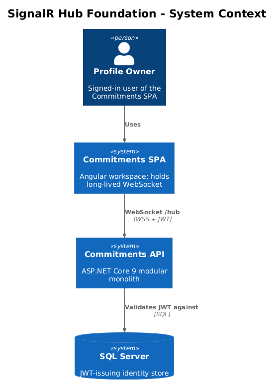
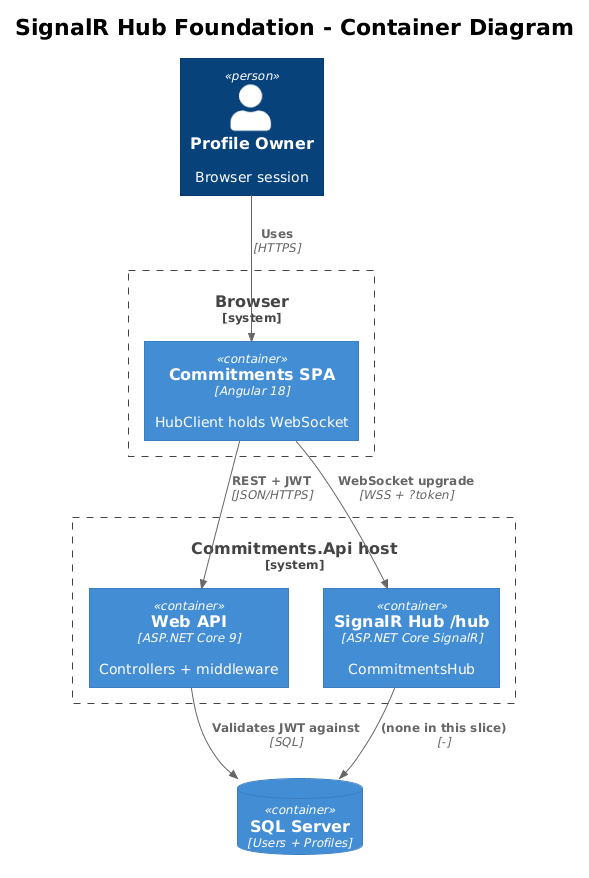
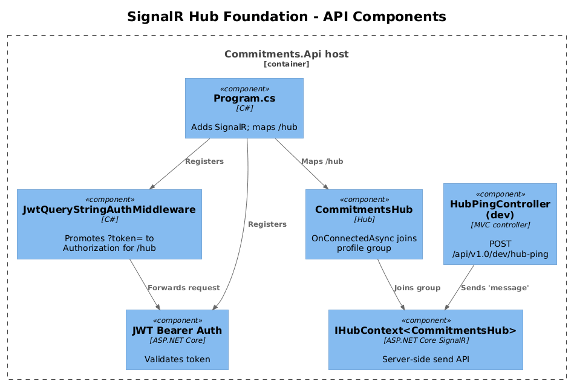
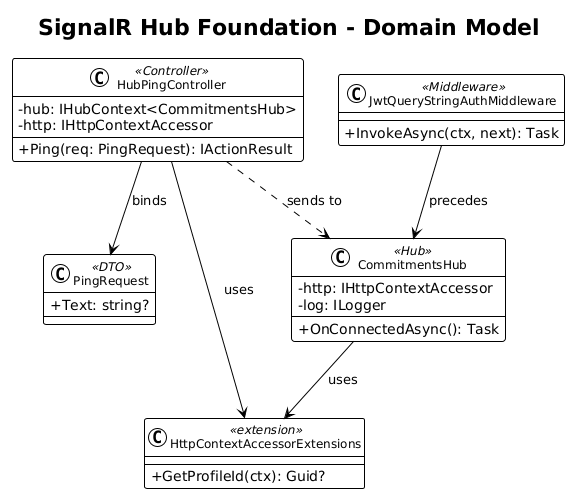
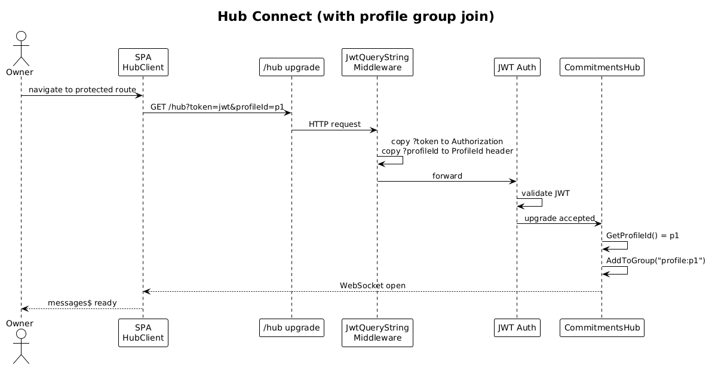
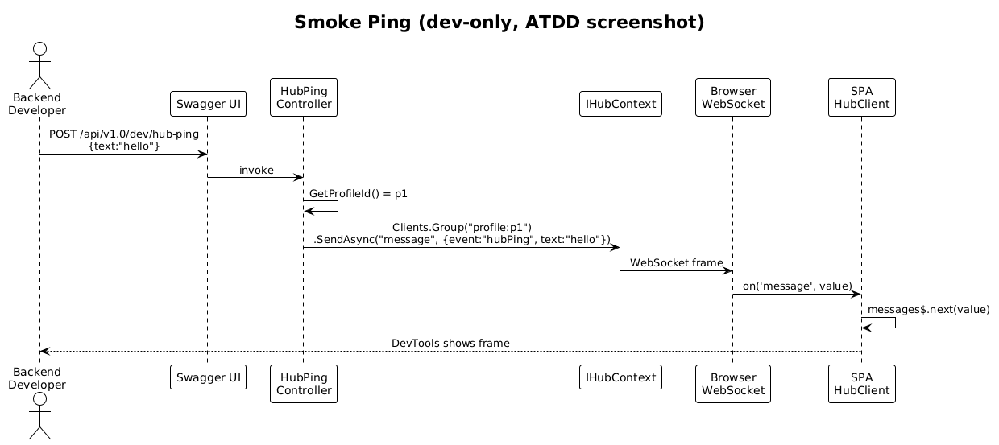

# 13 — SignalR Hub Foundation — Detailed Design

**Status:** Complete

## 1. Overview

The frontend already has a `HubClient` (`frontend/projects/commitments-app/src/app/core/hub-client.ts`) that connects to `/hub` and listens for a SignalR method called `message`. The backend (`Commitments.Api`) does **not** register SignalR services and does **not** map `/hub`. As a result, every existing tile that listens for live updates falls back to its initial REST snapshot and never refreshes.

This slice adds the smallest possible piece that closes the loop:

1. Register SignalR in the API host.
2. Add a `CommitmentsHub : Hub` that, on connect, joins the connection to a profile-scoped group.
3. Authenticate the connection from the same JWT the rest of the API uses.
4. Map `/hub`.
5. Add a tiny development-only debug endpoint, `POST /api/v1.0/dev/hub-ping`, that publishes one `message` to the caller's profile group so the wiring is verifiable end-to-end with one screenshot.

Nothing else changes. The envelope format (slice 14), the `goalProgressUpdated` event (slice 15), and the invalidation bus (slice 16) all build on top of this foundation.

**Actors**

- **Profile owner** — the signed-in user. Watches the browser DevTools WebSocket frame stream during the smoke test.
- **Backend developer** — calls the debug endpoint from Swagger.

**Scope boundary**

- Hub class only. No domain integration events are published from this slice.
- One SignalR method name is used: `message` (matches the existing client).
- Profile group naming convention is fixed: `profile:{profileId}`.
- The debug endpoint is wired behind `IHostEnvironment.IsDevelopment()` and is removed before any production deploy. Its only purpose is to give this slice an ATDD-friendly screenshot.

**Radically simple**: one Hub, one method name, one group convention, one debug endpoint. No envelope yet, no domain events yet, no per-event method names.

## 2. Architecture

### 2.1 C4 Context



The Profile Owner uses the Commitments SPA in their browser. The SPA holds a long-lived WebSocket connection to `Commitments.Api`. JWT auth comes from the existing Identity flow.

### 2.2 C4 Container



Two containers participate: the Angular SPA (already has `HubClient`) and `Commitments.Api` (gains `CommitmentsHub` and the `/hub` route). SQL Server is touched only because the JWT was issued against it; nothing in this slice writes to it.

### 2.3 C4 Component



Inside the API: `Program.cs` registers SignalR services, maps `/hub`, and registers a `JwtQueryStringAuthMiddleware` that promotes the `?token=` query parameter into the `Authorization` header before the auth middleware runs (matches the existing client URL shape). `CommitmentsHub` overrides `OnConnectedAsync` to add the connection to `profile:{profileId}`. `HubPingController` (dev-only) is a one-action MVC controller that resolves `IHubContext<CommitmentsHub>` and sends `"message"` with a literal payload to the caller's group.

## 3. Component Details

### 3.1 CommitmentsHub

- **Path**: `backend/src/Commitments.Api/Hubs/CommitmentsHub.cs` (new file; lives in the API host because it is composition glue, not a module concern).
- **Responsibility**: Add each authenticated connection to its profile group on connect. Remove it on disconnect (SignalR does this automatically when the connection drops; the override is for logging only).
- **Auth**: Inherits `[Authorize]`. The JWT is required; `OnConnectedAsync` rejects connections without a `ProfileId` claim/header by aborting via `Context.Abort()`.
- **Group naming**: `profile:{profileId:lowercase-guid}`. Lowercase is enforced server-side so two connections with different casing on the header end up in the same group.
- **Public surface**: none. The hub has no client-callable methods. All traffic is server-to-client via `IHubContext`.

```csharp
[Authorize]
public sealed class CommitmentsHub : Hub
{
    private readonly IHttpContextAccessor _http;
    private readonly ILogger<CommitmentsHub> _log;

    public CommitmentsHub(IHttpContextAccessor http, ILogger<CommitmentsHub> log)
    { _http = http; _log = log; }

    public override async Task OnConnectedAsync()
    {
        var profileId = _http.HttpContext?.GetProfileId();
        if (profileId is null || profileId == Guid.Empty)
        {
            _log.LogWarning("Hub connect rejected: missing ProfileId header for connection {ConnectionId}",
                Context.ConnectionId);
            Context.Abort();
            return;
        }

        var group = $"profile:{profileId.Value:D}".ToLowerInvariant();
        await Groups.AddToGroupAsync(Context.ConnectionId, group);
        _log.LogInformation("Hub connect: {ConnectionId} joined {Group}", Context.ConnectionId, group);

        await base.OnConnectedAsync();
    }
}
```

### 3.2 JwtQueryStringAuthMiddleware

- **Path**: `backend/src/Commitments.Api/Middleware/JwtQueryStringAuthMiddleware.cs` (new file).
- **Why**: The existing frontend connects with `?token=...`. ASP.NET Core's JWT bearer reads from `Authorization`. This middleware converts one to the other for `/hub` requests only, so the rest of the API keeps reading the header.
- **Behavior**: If `path` starts with `/hub` and `Authorization` is not set and `?token=` is present, set `Authorization: Bearer {token}`.
- **Registration order**: before `UseAuthentication()` in `Program.cs`.

```csharp
app.Use(async (context, next) =>
{
    var path = context.Request.Path;
    if (path.StartsWithSegments("/hub")
        && !context.Request.Headers.ContainsKey("Authorization")
        && context.Request.Query.TryGetValue("token", out var token))
    {
        context.Request.Headers["Authorization"] = $"Bearer {token}";
    }
    await next();
});
```

### 3.3 SignalR registration in `Program.cs`

Three additions to `backend/src/Commitments.Api/Program.cs`:

1. After `AddControllers(...)`:

   ```csharp
   builder.Services.AddSignalR();
   ```

2. After `app.UseCors(...)`, before `app.UseAuthorization()`, add the JWT-query-string middleware (3.2).

3. After `app.MapControllers()`:

   ```csharp
   app.MapHub<CommitmentsHub>("/hub");
   ```

The CORS policy already calls `AllowCredentials()` and `SetIsOriginAllowed(_ => true)`, which is what SignalR's WebSocket transport requires for cross-origin development.

### 3.4 HubPingController (dev-only smoke endpoint)

- **Path**: `backend/src/Commitments.Api/Controllers/HubPingController.cs`.
- **Route**: `POST /api/v1.0/dev/hub-ping`.
- **Auth**: `[Authorize]`. Requires the same JWT + `ProfileId` header as everything else.
- **Body**: `{ "text": "hello" }` (defaulted to "hello" if absent).
- **Behavior**: resolve `IHubContext<CommitmentsHub>`, look up `profile:{profileId}` group, send `"message"` with `{ event: "hubPing", text }`.
- **Visibility**: registered behind `if (app.Environment.IsDevelopment())` so it cannot ship to production.

```csharp
[ApiController]
[ApiVersion("1.0")]
[Route("api/v{version:apiVersion}/dev/hub-ping")]
[Authorize]
public sealed class HubPingController : ControllerBase
{
    private readonly IHubContext<CommitmentsHub> _hub;
    private readonly IHttpContextAccessor _http;

    public HubPingController(IHubContext<CommitmentsHub> hub, IHttpContextAccessor http)
    { _hub = hub; _http = http; }

    public sealed record PingRequest(string? Text);

    [HttpPost]
    public async Task<IActionResult> Ping([FromBody] PingRequest? body)
    {
        var profileId = _http.HttpContext!.GetProfileId();
        if (profileId is null) return BadRequest("Missing ProfileId");
        var group = $"profile:{profileId.Value:D}".ToLowerInvariant();
        await _hub.Clients.Group(group).SendAsync("message",
            new { @event = "hubPing", text = body?.Text ?? "hello" });
        return Accepted();
    }
}
```

### 3.5 Frontend (no code changes)

The existing `HubClient` already constructs `${baseUrl}hub?token=${jwt}` and listens to the `message` method. After this slice ships, the existing `HubClient` will receive the `hubPing` payload on `messages$` without any frontend code change. That is the screenshot for ATDD.

The `hubClientGuard` (`frontend/projects/commitments-app/src/app/core/hub-client-guard.ts`) is also untouched. It already starts the connection on first protected route, which is enough for this slice.

## 4. Data Model

### 4.1 Class Diagram



### 4.2 Entity Descriptions

- **CommitmentsHub** — server-side SignalR hub. No persistent state. Holds one connection-to-group mapping per `OnConnectedAsync` invocation.
- **HubPingRequest** — DTO containing only `text: string?`. Not persisted.
- **HubMessage (transport-only)** — anonymous object `{ event: string, text: string }` sent to clients. Slice 14 replaces this with the `RealtimeMessage<TEvent, TPayload>` envelope.

No database entities are created or modified.

## 5. Key Workflows

### 5.1 Connect



1. The user logs in (existing flow).
2. The router activates a protected route guarded by `hubClientGuard`.
3. The guard calls `HubClient.connect()`, which builds a `HubConnection` to `${baseUrl}hub?token=${jwt}`.
4. The browser opens a WebSocket to `/hub?token=...`.
5. `JwtQueryStringAuthMiddleware` sets `Authorization: Bearer {token}` for the request.
6. ASP.NET Core JWT auth validates and populates `HttpContext.User`.
7. The `ProfileId` header is missing on a WebSocket upgrade — this slice **requires the SignalR client to send it as a query string** (see Open Questions §8.1) and the middleware copies `?profileId=` into `Request.Headers["ProfileId"]` so `GetProfileId()` works inside the hub.
8. `CommitmentsHub.OnConnectedAsync` reads the profile id, joins `profile:{profileId}`, and returns.

### 5.2 Smoke ping



1. Developer opens Swagger UI in Development.
2. Developer calls `POST /api/v1.0/dev/hub-ping` with `Authorization` and `ProfileId` set, body `{ "text": "hello" }`.
3. `HubPingController` resolves `IHubContext<CommitmentsHub>`, computes the group name from `ProfileId`, and calls `Clients.Group(group).SendAsync("message", {event:"hubPing", text:"hello"})`.
4. The browser receives a WebSocket frame.
5. `HubClient.messages$` emits `{event:"hubPing", text:"hello"}`.
6. The screenshot for ATDD: **DevTools → Network → WS → frame stream showing the `hubPing` payload**, taken on the running app.

## 6. API Contracts

### 6.1 Hub

| Path | Auth | Server-to-client method | Server-to-client payload (this slice) |
|---|---|---|---|
| `GET/UPGRADE /hub?token={jwt}&profileId={guid}` | JWT (via query token) + ProfileId (via query) | `message` | `{ event: string, ...freeform }` |

Slice 14 narrows the payload shape to the `RealtimeMessage` envelope.

### 6.2 Dev endpoint

| Method | Route | Auth | Request | Response |
|---|---|---|---|---|
| `POST` | `/api/v1.0/dev/hub-ping` | JWT + `ProfileId` header | `{ text?: string }` | `202 Accepted` |

Returns `202` (not `200`) to communicate "queued for delivery, not awaiting client ack."

## 7. Security Considerations

- The query-string token is acceptable for the WebSocket upgrade because TLS encrypts the URL on the wire. Application-level logging must not log the raw query string. Add a Serilog filter that drops `token` from `/hub` request logs.
- The hub is `[Authorize]`. Anonymous WebSocket upgrades are rejected with HTTP `401` before `OnConnectedAsync` runs.
- Profile group naming uses the `ProfileId` header (the same value the rest of the API trusts). A user who forges a different `ProfileId` than their JWT permits is already rejected by the existing `403` rule (ICD §3.4, L2-038); that rule must be enforced at the JWT-to-profile gate before the hub join. This slice **does not** add that gate; it assumes it exists for protected REST and that the same gate runs on `/hub` requests.
- The dev `/hub-ping` endpoint must be removed from production builds. Wrapping its registration in `app.Environment.IsDevelopment()` is sufficient, but a CI guard test (HTTP `404` in the Production environment) belongs to slice 19.

## 8. Open Questions

1. **Profile id transport on the WebSocket upgrade.** The HTTP-based REST flow uses an `Authorization` header and a `ProfileId` header. WebSocket upgrades go through the browser, which does not let JS set arbitrary headers. The simplest fix is to have the frontend append `&profileId=...` to the hub URL and let the middleware copy the value into `Request.Headers["ProfileId"]`. The frontend `HubClient` change is one line. Confirm before implementing — it is a minor break of "headers are the only auth surface."
2. **Reject vs allow on missing ProfileId.** This slice aborts the connection. A friendlier path is to keep the connection but never join a group (silent dead end). Aborting is louder and easier to debug; accept unless QA disagrees.
3. **CORS on `/hub`.** SignalR negotiation requires `AllowCredentials`. The existing CORS policy already grants this. No change needed unless production tightens the policy.
4. **Logging volume.** `OnConnectedAsync` logs at `Information`. If reconnect storms become noisy in slice 19, demote to `Debug`.
