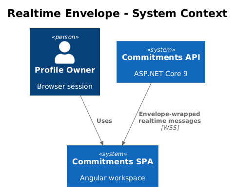
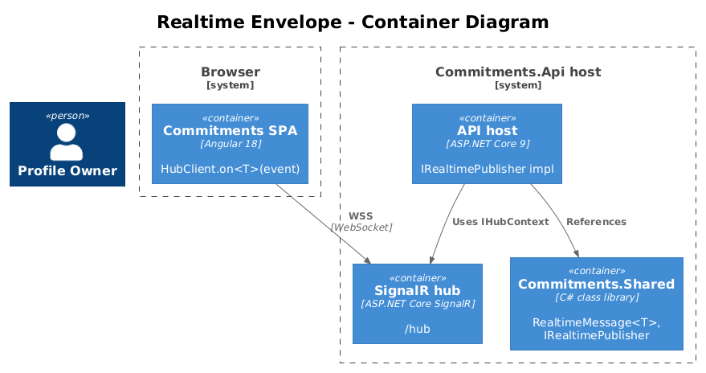
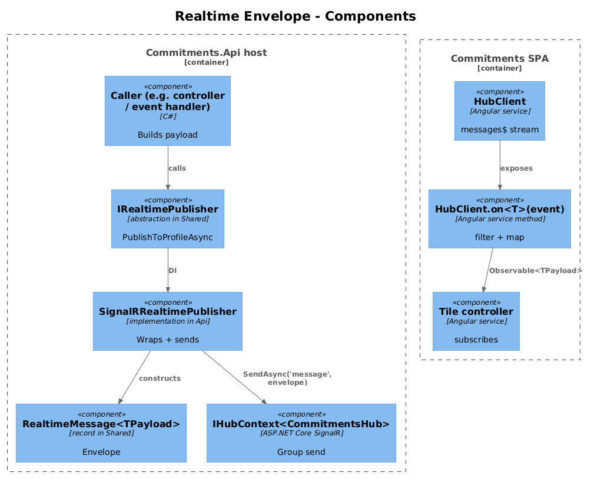
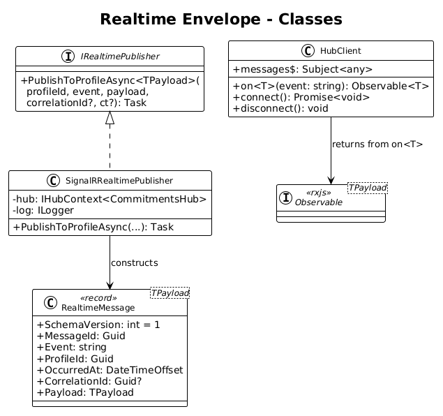
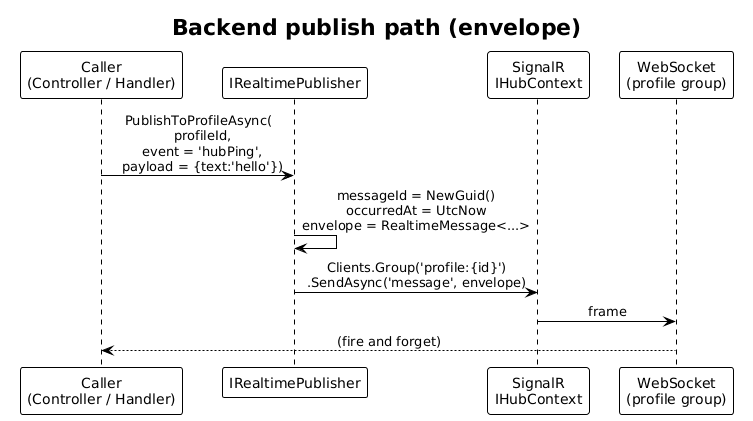
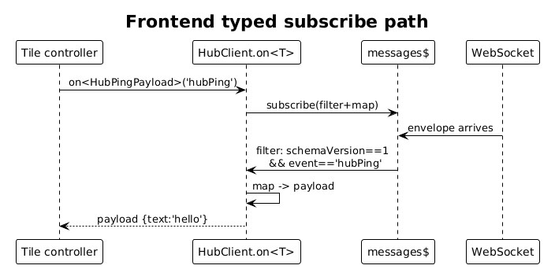

# 14 — Realtime Message Envelope — Detailed Design

**Status:** Accepted

## 1. Overview

Slice 13 wires up `/hub`, profile groups, and one untyped `message` SendAsync. Every later message — `goalProgressUpdated`, `dashboardTileDataInvalidated`, `dailyResultsUpdated`, etc. — needs a stable, versioned shape so the frontend can route it without if-by-string-key chains and so the backend can enforce a single publisher contract.

This slice introduces:

1. A backend `RealtimeMessage<TPayload>` envelope record with `schemaVersion`, `messageId`, `event`, `profileId`, `occurredAt`, `correlationId`, and `payload`.
2. A backend `IRealtimePublisher` service that takes one `event` name + one `payload`, wraps it in the envelope, and sends it to `profile:{profileId}` via `IHubContext<CommitmentsHub>`.
3. A frontend typed subscription helper, `HubClient.on<T>(event)`, that filters `messages$` by `event` and returns `Observable<T>` (the payload, not the envelope).
4. Migration of the dev `hub-ping` from slice 13 to use the new publisher so the slice has a clean ATDD screenshot: a typed `on<HubPingPayload>('hubPing')` subscription receiving the envelope-wrapped payload.

This slice is foundational for everything in slices 15–19. After it ships, **no domain code** should call `IHubContext<CommitmentsHub>.Clients.Group(...).SendAsync(...)` directly. Every backend publication goes through `IRealtimePublisher`.

**Actors**

- **Backend developer** — uses `IRealtimePublisher` from any module-level handler.
- **Frontend developer** — uses `hubClient.on<T>(event)` from any tile controller.
- **Profile owner** — indirect; the screenshot for ATDD is them seeing the envelope in DevTools after a manual `hub-ping` call.

**Scope boundary**

- One envelope shape, one publisher, one typed subscription helper. No new domain events in this slice.
- `messages$` stays as the raw stream so the legacy store filters in `frontend/projects/commitments-app/src/app/core/store.ts` (lines 30–44) still work. They are migrated in slice 18.
- `correlationId` plumbing is left as a parameter of `IRealtimePublisher`; default to `null`. Tracing wiring (e.g. `Activity.Current?.Id`) is out of scope here.
- `messageId` is generated server-side (`Guid.NewGuid()`); the frontend uses it for idempotence in slice 19.

**Radically simple**: one record on the backend, one service, one stream operator on the frontend. No sticky state. No reconnect handling (slice 19). No typed message contracts (those land per-event in slices 15–17).

## 2. Architecture

### 2.1 C4 Context



### 2.2 C4 Container



### 2.3 C4 Component



`IRealtimePublisher` is registered as a singleton in the API host and lives in `Commitments.Shared` so any module's MediatR handler can depend on it without referencing `Microsoft.AspNetCore.SignalR` directly. The implementation, `SignalRRealtimePublisher`, lives in the API host where SignalR is referenced.

## 3. Component Details

### 3.1 RealtimeMessage envelope (backend)

- **Path**: `backend/src/Commitments.Shared/Realtime/RealtimeMessage.cs` (new namespace `Commitments.Shared.Realtime`).
- **Shape**:

```csharp
namespace Commitments.Shared.Realtime;

public sealed record RealtimeMessage<TPayload>(
    int SchemaVersion,
    Guid MessageId,
    string Event,
    Guid ProfileId,
    DateTimeOffset OccurredAt,
    Guid? CorrelationId,
    TPayload Payload);
```

- **Why a generic record**: keeps `payload` strongly typed at the publish site (no `object`), serializes cleanly with the existing `AddNewtonsoftJson()` pipeline, and prevents accidental `ToString()` calls in logs from leaking PII because the payload is a typed value.
- **`SchemaVersion`**: hard-coded to `1` for now. Bumping is reserved for a real breaking change in field names, not for adding new event names.
- **JSON casing**: matches the existing camelCase contract via `AddNewtonsoftJson`'s default `CamelCasePropertyNamesContractResolver`. Verified by `IRealtimePublisherTests.Publishes_camelCase_envelope`.

### 3.2 IRealtimePublisher (backend, abstraction)

- **Path**: `backend/src/Commitments.Shared/Realtime/IRealtimePublisher.cs`.
- **Surface**:

```csharp
public interface IRealtimePublisher
{
    Task PublishToProfileAsync<TPayload>(
        Guid profileId,
        string @event,
        TPayload payload,
        Guid? correlationId = null,
        CancellationToken cancellationToken = default);
}
```

- **Why in `Shared`**: any module handler (e.g., `SaveActivityCommandHandler`) can depend on the interface without taking a reference on `Microsoft.AspNetCore.SignalR`. Only the API host implements it.

### 3.3 SignalRRealtimePublisher (backend, implementation)

- **Path**: `backend/src/Commitments.Api/Realtime/SignalRRealtimePublisher.cs`.
- **Behavior**:
  1. Generate `messageId = Guid.NewGuid()` and `occurredAt = DateTimeOffset.UtcNow`.
  2. Wrap the payload in `RealtimeMessage<TPayload>` with `schemaVersion = 1`.
  3. Compute group name `profile:{profileId:D}`.ToLowerInvariant().
  4. Call `_hub.Clients.Group(group).SendAsync("message", envelope, cancellationToken)`.
- **Registration**: `builder.Services.AddSingleton<IRealtimePublisher, SignalRRealtimePublisher>();` in `Program.cs`, after `AddSignalR()`.
- **Logging**: one `LogDebug` per publish with `event`, `profileId`, `messageId`. No payload logging by default (PII risk).

### 3.4 HubPingController (revised to use the publisher)

- **Path**: existing `backend/src/Commitments.Api/Controllers/HubPingController.cs` from slice 13.
- **Change**: replace direct `IHubContext` usage with `IRealtimePublisher`. The endpoint still returns `202 Accepted`. Now the body the SPA receives is a full envelope with `schemaVersion: 1`, `messageId: "..."`, `event: "hubPing"`, `payload: { text }`.

```csharp
public sealed record PingPayload(string Text);

[HttpPost]
public async Task<IActionResult> Ping([FromBody] PingRequest? body)
{
    var profileId = _http.HttpContext!.GetProfileId() ?? Guid.Empty;
    if (profileId == Guid.Empty) return BadRequest("Missing ProfileId");
    await _publisher.PublishToProfileAsync(
        profileId,
        @event: "hubPing",
        payload: new PingPayload(body?.Text ?? "hello"));
    return Accepted();
}
```

### 3.5 HubClient.on&lt;T&gt;(event) (frontend)

- **Path**: existing `frontend/projects/commitments-app/src/app/core/hub-client.ts`.
- **Change**: add one method that filters `messages$` by `event` and projects to `payload`.

```ts
import { Observable } from 'rxjs';
import { filter, map } from 'rxjs/operators';

export interface RealtimeMessage<TPayload> {
  schemaVersion: 1;
  messageId: string;
  event: string;
  profileId: string;
  occurredAt: string;
  correlationId: string | null;
  payload: TPayload;
}

// inside HubClient:
public on<TPayload>(event: string): Observable<TPayload> {
  return this.messages$.pipe(
    filter((m: RealtimeMessage<unknown>): m is RealtimeMessage<TPayload> =>
      !!m && (m as any).schemaVersion === 1 && (m as any).event === event),
    map(m => m.payload)
  );
}
```

- **Backwards-compat**: `messages$` keeps its current `Subject<any>` type. Legacy subscribers in `store.ts` continue to work because their messages are non-envelope (`{ type: '[Note] Saved' }`); the new `on()` filter rejects them on `schemaVersion !== 1`.
- **Why expose `payload`, not the envelope**: Tile controllers want the data, not the envelope. The envelope is plumbing. If a tile needs `messageId` for idempotence (slice 19), it can call a sibling `onEnvelope<T>(event)` that yields the full envelope.

### 3.6 LiveGoalMetricsController (frontend, no behaviour change)

`LiveGoalMetricsController` currently subscribes to `messages$` and inspects `msg.event`. After this slice, change one line so it consumes the typed stream:

```ts
// before:
this._hub.messages$.subscribe(message => {
  if (isGoalProgressUpdated(message) && message.goalId === this._goalId) { ... }
});

// after:
this._hub.on<GoalProgressUpdatedPayload>('goalProgressUpdated').subscribe(payload => {
  if (payload.goalId === this._goalId) { ... }
});
```

This is the only frontend code path touched by slice 14. Slice 15 will add the actual backend publication that fills the stream.

## 4. Data Model

### 4.1 Class Diagram



### 4.2 Entity Descriptions

- **RealtimeMessage&lt;TPayload&gt;** — pure data envelope. Generic over the payload to avoid `object` at the publish site.
- **IRealtimePublisher / SignalRRealtimePublisher** — publish-side abstraction; implementation handles envelope construction and group routing.
- **HubClient.on()** — RxJS operator returning `Observable<TPayload>` after filtering on `event` and `schemaVersion`.
- **PingPayload** — slice-13 dev payload, now a real DTO type instead of an anonymous object.

No database entities are added.

## 5. Key Workflows

### 5.1 Publish path



1. A controller (here, `HubPingController`) calls `IRealtimePublisher.PublishToProfileAsync(profileId, "hubPing", payload)`.
2. `SignalRRealtimePublisher` builds the envelope and calls `_hub.Clients.Group("profile:{id}").SendAsync("message", envelope)`.
3. SignalR fans out the WebSocket frame to every connection in the group.
4. The browser `HubClient.on('message', value)` callback receives the envelope and pushes it to `messages$`.

### 5.2 Typed subscribe path



1. A tile controller (or the dev console in this slice) calls `hubClient.on<HubPingPayload>('hubPing')`.
2. The returned Observable filters `messages$` by `schemaVersion === 1` and `event === 'hubPing'`.
3. The Observable maps to `payload`, so the subscriber sees `{ text: 'hello' }` directly.

## 6. API Contracts

### 6.1 Wire format on `message`

```json
{
  "schemaVersion": 1,
  "messageId": "f0f8b3a2-1c5b-4f5e-9b7a-9b9a0d0e1f2c",
  "event": "hubPing",
  "profileId": "11111111-2222-3333-4444-555555555555",
  "occurredAt": "2026-04-26T18:43:02Z",
  "correlationId": null,
  "payload": { "text": "hello" }
}
```

### 6.2 Backend publisher

```csharp
public interface IRealtimePublisher {
    Task PublishToProfileAsync<TPayload>(
        Guid profileId, string @event, TPayload payload,
        Guid? correlationId = null, CancellationToken ct = default);
}
```

### 6.3 Frontend subscriber

```ts
hubClient.on<TPayload>(event: string): Observable<TPayload>
```

## 7. Security Considerations

- The publisher always scopes to `profile:{profileId}`. There is no `PublishToAllAsync` or `PublishToConnectionAsync` overload, by design — broadcast leaks are impossible without first writing a new method.
- `messageId` is server-generated and never trusted from the wire on a publish path.
- `correlationId`, when present, must be the caller's distributed trace id, never PII.
- Payload typing prevents accidental object-graph traversal: if a developer hands a domain entity to `payload`, the JSON serializer surfaces every field, which review will catch. Recommendation: payloads are always purpose-built `record`s, never domain entities.

## 8. Open Questions

1. **Newtonsoft vs System.Text.Json for envelopes.** The host uses Newtonsoft (`AddNewtonsoftJson()`); SignalR ships with System.Text.Json. Either works as long as the property casing matches (camelCase). Recommendation: configure SignalR's hub protocol to use Newtonsoft via `AddNewtonsoftJsonProtocol()` so envelope serialization matches REST. Decide before implementation; if we keep STJ, document that envelope DTOs need `[JsonPropertyName]` only when names differ.
2. **`schemaVersion` evolution.** A `2` envelope would break every existing subscriber. The chosen migration story is *additive only*: add fields, never rename or remove. If a real break is needed, publish on a parallel `event` name (e.g. `goalProgressUpdated.v2`) and let subscribers pick up the new one.
3. **Should `on<T>` validate the payload shape?** Currently it casts. Adding runtime guards (e.g., zod) is a quality-of-life improvement that the project does not yet use. Defer.
4. **Envelope size.** Expected median payload is small (~200 bytes). If a future event carries a large snapshot (e.g., `dailyResultsUpdated` with hundreds of items), the WebSocket message may exceed default SignalR `MaximumReceiveMessageSize`. Configure `64 KB` on `AddSignalR(o => o.MaximumReceiveMessageSize = 65_536)` only if a slice 17 tile actually needs it.
