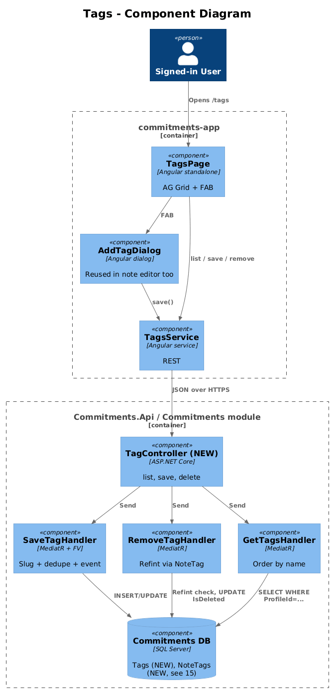
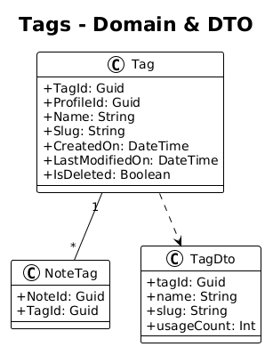
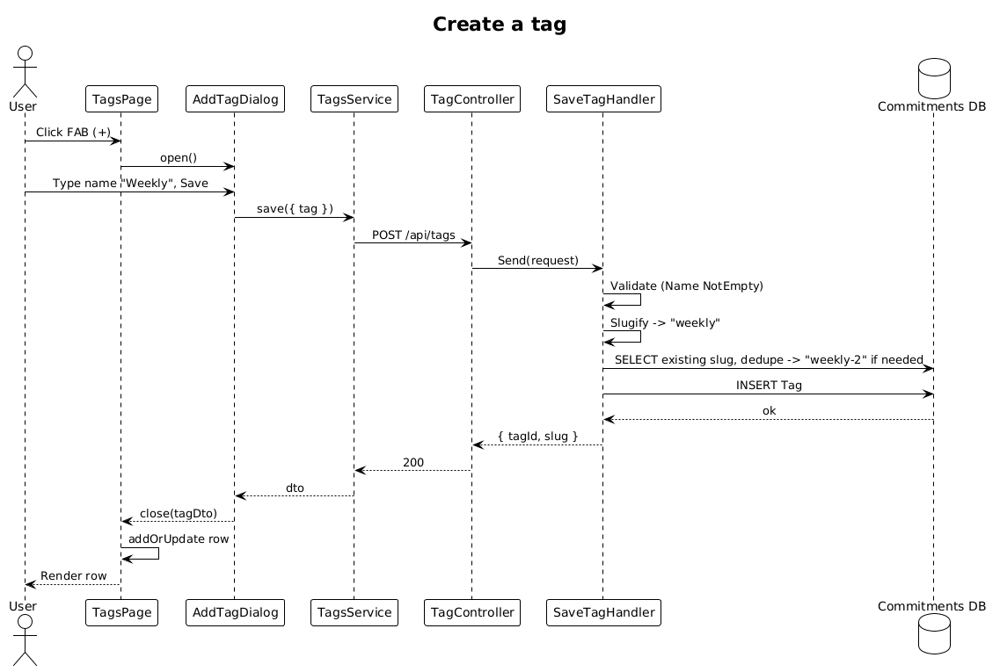

# Tags — Detailed Design

**Status:** Implemented

**Traces to:** L1-007 · L2-015, L2-038

## 1. Overview

The Tags page (`pages/tags`, route `/tags`) maintains the user's tag catalog. Tags are referenced by notes (and future taggable entities). The page lists tags (name + slug + usage count) and supports add/edit/delete via `AddTagDialog` (already present).

The `Tag` aggregate is **missing on the backend** today; only the integration events (`TagSavedEvent`, `TagRemovedEvent`) exist. This design adds the entity, persistence, and endpoints.

## 2. Architecture

### 2.1 C4 Component

## 3. Component Details

### 3.1 TagsPageComponent (frontend, exists as placeholder)
- Replace placeholder route with this component.
- Columns: name, slug, usage count, edit, delete. FAB → `AddTagDialog`.

### 3.2 AddTagDialog (frontend, exists)
- Already implemented. **Delta:** rename event semantics if needed — the dialog should be reusable both inside `EditNotePage` (to assign a tag to a note) and on the `Tags` page (to mint a new tag). Keep the existing component; the page just calls it as a "create" dialog.

### 3.3 Tag backend (entirely **new**)
- Domain: `Tag { TagId : Guid, ProfileId : Guid, Name : string, Slug : string, IsDeleted, CreatedOn, LastModifiedOn }` plus `NoteTag { NoteId, TagId }` (covered in design `15-notes-by-tag`).
- EF migration: new `Tags` table with unique `(ProfileId, Slug)` index.
- `Slug` regenerated server-side from `Name` (kebab case, dedupe with suffix).
- New vertical slices in `Commitments.Features.Tag`:
  - `SaveTag` — validator: `Name.NotEmpty()`. Publishes `TagSavedEvent`.
  - `RemoveTag` — soft-delete; rejects if a non-deleted `NoteTag` references the tag (refint guard). Publishes `TagRemovedEvent`.
  - `GetTags` (active profile, ordered by `Name`).
  - `GetTagBySlug` — used by design `15-notes-by-tag`.
- New `TagController` exposing `GET /api/tags`, `GET /api/tags/{tagId}`, `POST /api/tags`, `DELETE /api/tags/{tagId}`.

### 3.4 TagsService (frontend, exists)
- Already calls these routes; **delta:** none (just need backend to implement them).

## 4. Data Model

### 4.1 Class Diagram

## 5. Key Workflows

### 5.1 Create a tag

## 6. API Contracts

| Method | Route | Body / Params | Response |
|--------|-------|----------------|----------|
| GET | `/api/v1.0/tags` | — | `200 { tags }` |
| GET | `/api/v1.0/tags/{tagId}` | — | `200 { tag }` / `404` |
| POST | `/api/v1.0/tags` | `{ tag }` | `200 { tagId, slug }` |
| DELETE | `/api/v1.0/tags/{tagId}` | — | `200` / `400 (referenced)` |

## 7. Security Considerations

- Profile-scoped (L2-038). `Name` is HTML-escaped on render.
- Refint guard prevents orphaning notes that still have the tag attached.

## 8. ATDD Slices

1. **Slice A — entity + migration.** Spec: migration applies; `Tags` table exists with unique slug per profile. **Status: Implemented** — entity + DbContext entry done; EF migration carried with the 01-Login backlog.
2. **Slice B — list + create.** Spec: opening `/tags` shows an empty list; submitting `AddTagDialog` adds a row. **Status: Implemented.**
3. **Slice C — slug regen + dedupe.** **Status: Implemented** — same `GenerateSlug` + LINQ + i=2… loop pattern as design 12 SaveNote.
4. **Slice D — refint on delete.** **Status: Implemented** — count `NoteTag.TagId == request.TagId`; throw `BadHttpRequestException(message, 400)` if any.

## 10. Implementation Notes

- The `NoteTag` join entity is stubbed in `Commitments.Domain.NoteAggregate` (just enough fields to support the refint guard: `NoteTagId, NoteId, TagId`). Design 15 will add the navigation properties and the join-page query — keeping the surface minimal here avoids speculative coupling.
- `SaveTag`, `RemoveTag`, and the slug dedupe loop reuse the **identical** shape as design 12 (`SaveNote` / `RemoveNote`) so a junior reading either file picks up the pattern in the other for free.

## 9. Open Questions

- Tag colour? Out of scope. Add `Colour : string?` later if UX asks.
- Tag merge (combine two tags into one)? Out of scope.
