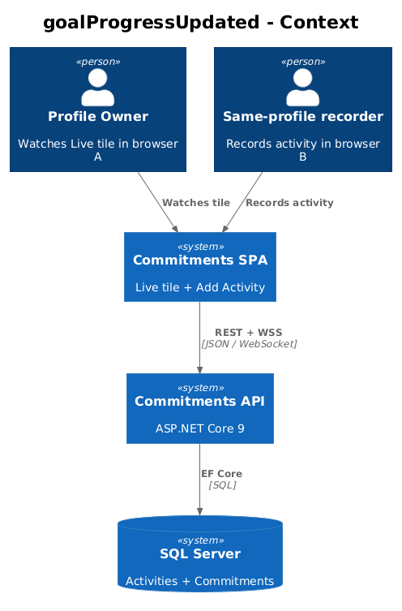
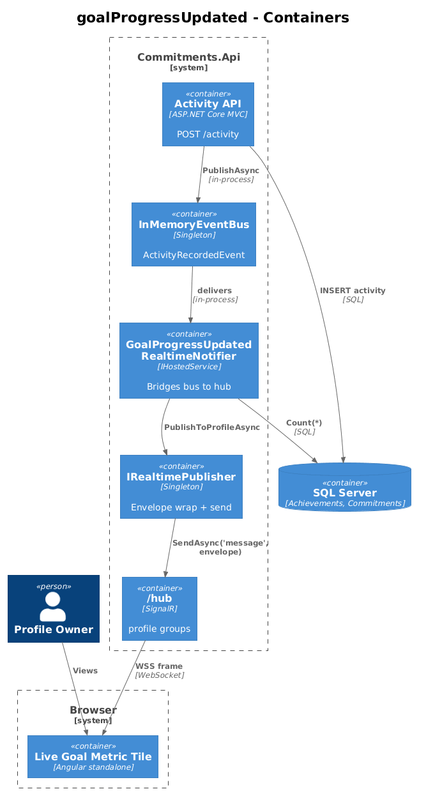
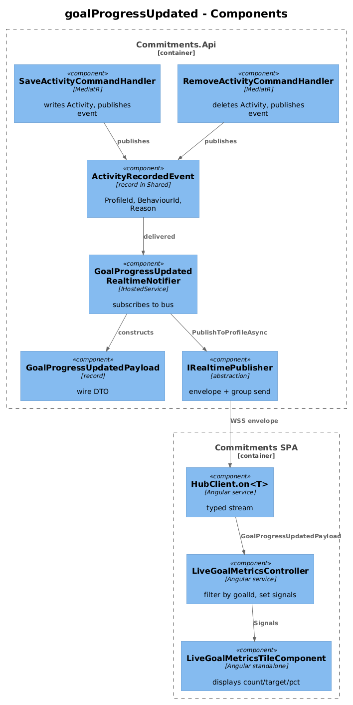
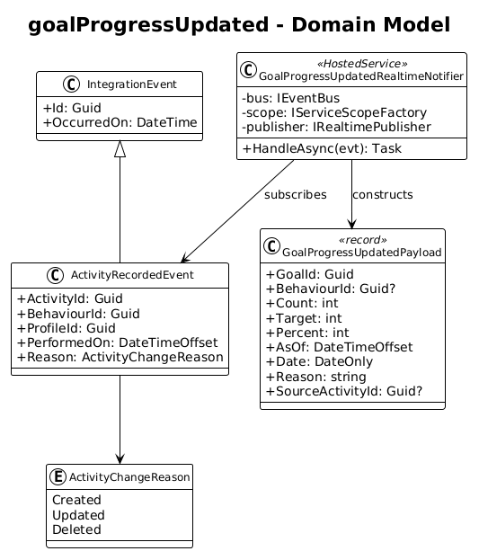
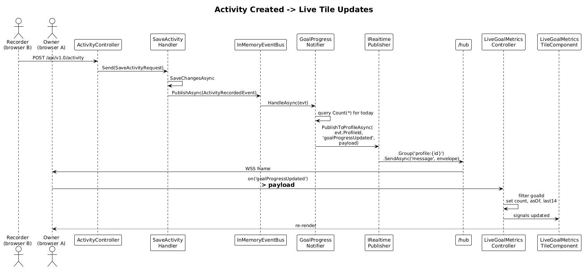
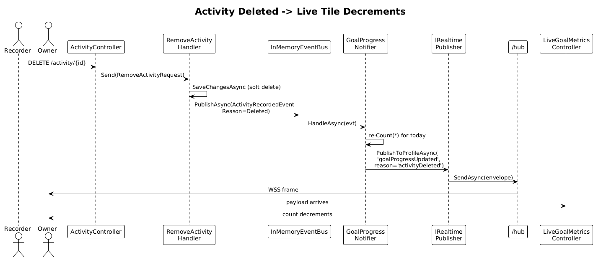

# 15 — `goalProgressUpdated` Message — Detailed Design

**Status:** Accepted

## 1. Overview

The Live Real-Time Metric tile (`07-live-real-time-metric-tile`) was shipped against a SignalR push that does not yet exist on the backend. After login, the tile fetches `/api/v1.0/goal-progress/current` once and then sits forever, waiting for an event that nobody publishes.

This slice closes that loop end-to-end:

1. The `Commitments` module raises an in-process integration event (`ActivityRecordedEvent`) when an activity is created or updated through `SaveActivityCommandHandler`.
2. A new in-host subscriber, `GoalProgressUpdatedRealtimeNotifier`, listens for `ActivityRecordedEvent` on the existing `IEventBus`, recomputes the affected goal's count, and publishes a `goalProgressUpdated` envelope to the profile group via `IRealtimePublisher` (slice 14).
3. The frontend `LiveGoalMetricsController` (already wired from slice 14) sees the typed `goalProgressUpdated` payload and updates `count`, `asOf`, and `last14` on the active goal.

This is the first real-data push event in the system. After this slice, the screenshot for ATDD is the live tile in browser **A** silently incrementing its counter when browser **B** records an activity for the same profile.

**Actors**

- **Profile owner** — the user with the live tile open.
- **Same-profile recorder** — could be the same user in another tab/device, or a teammate sharing the profile.

**Scope boundary**

- Activity create/update only. Delete is included because the ICD §6.3 `reason` enum lists `activityDeleted`.
- One push per committed activity transaction. Batched activity creation, if it is ever added, must publish one event per affected goal.
- The push carries `{ goalId, count, target, percent, asOf, date, reason, sourceActivityId, behaviourId }` exactly as ICD §6.3 specifies.
- Snapshot computation runs the same query as `GetGoalProgressCurrent` (one `Achievements.Count(...)` against `Goals.Target`) so the push value matches REST.

**Radically simple**: one event class in `Shared`, one publisher subscriber in the API host, one handler change in `SaveActivity`, no controller changes, no new DbContext, no new EF migration.

## 2. Architecture

### 2.1 C4 Context



### 2.2 C4 Container



### 2.3 C4 Component



`SaveActivityCommandHandler` calls `_eventBus.PublishAsync(new ActivityRecordedEvent(...))` after `SaveChangesAsync` returns. `GoalProgressUpdatedRealtimeNotifier`, registered as a hosted background subscriber in `Program.cs`, picks up the event, queries `CommitmentsDbContext` for the new count and target on the affected commitment/goal, and calls `IRealtimePublisher.PublishToProfileAsync(profileId, "goalProgressUpdated", payload)`. The frontend `LiveGoalMetricsController` (`frontend/projects/commitments-app/src/app/components/live-goal-metrics-tile/live-goal-metrics-controller.ts`) consumes via `hubClient.on<GoalProgressUpdatedPayload>('goalProgressUpdated')`.

## 3. Component Details

### 3.1 ActivityRecordedEvent (integration event)

- **Path**: `backend/src/Commitments.Shared/IntegrationEvents.cs` (append to existing file).
- **Shape**:

```csharp
public class ActivityRecordedEvent : IntegrationEvent
{
    public Guid ActivityId { get; set; }
    public Guid BehaviourId { get; set; }
    public Guid ProfileId { get; set; }
    public DateTimeOffset PerformedOn { get; set; }
    public ActivityChangeReason Reason { get; set; }
}

public enum ActivityChangeReason
{
    Created,
    Updated,
    Deleted
}
```

- **Why in `Shared`**: matches the existing `ProfileCreatedEvent` / `UserCreatedEvent` pattern (`backend/src/Commitments.Shared/IntegrationEvents.cs:6–20`). Subscribers in any module can take a dependency.

### 3.2 SaveActivityCommandHandler (modified)

- **Path**: existing `backend/src/Modules/Commitments/Features/Activity/Commands/SaveActivity.cs:33–53`.
- **Change**: inject `IEventBus`. After `SaveChangesAsync(cancellationToken)`, publish:

```csharp
public class SaveActivityCommandHandler : IRequestHandler<SaveActivityRequest, SaveActivityResponse>
{
    private readonly ICommitmentsDbContext _context;
    private readonly IEventBus _bus;

    public SaveActivityCommandHandler(ICommitmentsDbContext context, IEventBus bus)
    { _context = context; _bus = bus; }

    public async Task<SaveActivityResponse> Handle(SaveActivityRequest request, CancellationToken ct)
    {
        var existing = await _context.Activities.FindAsync(request.Activity.ActivityId);
        var reason = existing is null ? ActivityChangeReason.Created : ActivityChangeReason.Updated;

        if (existing is null)
            _context.Activities.Add(existing = new ActivityEntity { ActivityId = request.Activity.ActivityId });

        existing.BehaviourId = request.Activity.BehaviourId;
        existing.ProfileId = request.Activity.ProfileId;
        existing.PerformedOn = request.Activity.PerformedOn;
        existing.Description = request.Activity.Description;

        await _context.SaveChangesAsync(ct);

        await _bus.PublishAsync(new ActivityRecordedEvent
        {
            ActivityId = existing.ActivityId,
            BehaviourId = existing.BehaviourId,
            ProfileId = existing.ProfileId,
            PerformedOn = existing.PerformedOn,
            Reason = reason
        });

        return new SaveActivityResponse { ActivityId = existing.ActivityId };
    }
}
```

- **Transaction ordering**: publish strictly *after* `SaveChangesAsync`. Subscribers must observe a state in which the row already exists. The current `InMemoryEventBus.PublishAsync` runs in-process synchronously (see `backend/src/Commitments.Shared/InMemoryEventBus.cs`), so subscribers see the same UTC clock.

### 3.3 RemoveActivity (modified, parallel)

- **Path**: `backend/src/Modules/Commitments/Features/Activity/Commands/RemoveActivity.cs` (existing).
- **Change**: same pattern. Publish `ActivityRecordedEvent { Reason = Deleted }` after `SaveChangesAsync`. Carries the now-removed activity's snapshot of `BehaviourId`, `ProfileId`, `PerformedOn`.

### 3.4 GoalProgressUpdatedRealtimeNotifier (new subscriber)

- **Path**: `backend/src/Commitments.Api/Realtime/GoalProgressUpdatedRealtimeNotifier.cs`.
- **Lifetime**: `IHostedService`. Subscribes on `StartAsync`. Holds a scoped `IServiceScopeFactory` so each event handler can resolve a fresh `CommitmentsDbContext`.
- **Why in the API host, not the Commitments module**: the module does not reference SignalR. The subscriber is the bridge between `IEventBus` and `IRealtimePublisher` and has to live where both are visible. Same pattern the project already uses for `InMemoryEventBus` registration.
- **Behavior on `ActivityRecordedEvent`**:
  1. Open a scope; resolve `CommitmentsDbContext`.
  2. Look up the commitment whose `BehaviourId` matches `evt.BehaviourId` and whose `ProfileId` matches `evt.ProfileId`. Per the existing convention (ICD §4.2 + alignment item §9.5) `goalId` ≡ `commitmentId`.
  3. If no commitment matches, return — there is no goal to push (e.g., raw activity not tied to any committed behaviour). Log at `Debug`.
  4. Otherwise, run the same `Achievements.Count(...)` aggregation that `GetGoalProgressCurrent` uses, scoped to today (UTC date of `PerformedOn`).
  5. Build a `GoalProgressUpdatedPayload`:
     ```csharp
     var payload = new GoalProgressUpdatedPayload(
         GoalId: commitment.CommitmentId,
         BehaviourId: evt.BehaviourId,
         Count: count,
         Target: commitment.Target,
         Percent: ClampPercent(count, commitment.Target),
         AsOf: DateTimeOffset.UtcNow,
         Date: DateOnly.FromDateTime(evt.PerformedOn.UtcDateTime),
         Reason: evt.Reason switch {
             Created => "activityCreated",
             Updated => "activityUpdated",
             Deleted => "activityDeleted",
             _ => "commitmentUpdated"
         },
         SourceActivityId: evt.ActivityId);
     ```
  6. Call `_publisher.PublishToProfileAsync(evt.ProfileId, "goalProgressUpdated", payload)`.
- **Idempotence**: handler is non-idempotent on purpose (each event fires one push). De-duplication on the wire is the frontend's job using `messageId` (slice 19).

### 3.5 GoalProgressUpdatedPayload (DTO)

- **Path**: `backend/src/Commitments.Api/Realtime/GoalProgressUpdatedPayload.cs`. Mirrors ICD §6.3 exactly.

```csharp
public sealed record GoalProgressUpdatedPayload(
    Guid GoalId,
    Guid? BehaviourId,
    int Count,
    int Target,
    int Percent,
    DateTimeOffset AsOf,
    DateOnly Date,
    string Reason,
    Guid? SourceActivityId);
```

### 3.6 LiveGoalMetricsController (frontend, already partially wired)

- **Path**: `frontend/projects/commitments-app/src/app/components/live-goal-metrics-tile/live-goal-metrics-controller.ts`.
- **Change**: replace `messages$.subscribe(... isGoalProgressUpdated ...)` (lines 49–55) with `hubClient.on<GoalProgressUpdatedPayload>('goalProgressUpdated')` from slice 14.
- **Behavior on payload**:
  - Filter by `payload.goalId === this._goalId`.
  - `count.set(payload.count)`.
  - `target.set(payload.target)` (in case the user just edited the commitment target in another tab).
  - `asOf.set(new Date(payload.asOf))`.
  - `_patchTodayInLast14(payload.count)` — same private helper that already exists at line 68.
- **No new HTTP request** is fired on the push. The whole point is to avoid polling.
- **Filtering by goalId** is mandatory. The hub publishes one message per active goal on the profile; tiles configured for other goals must ignore.

### 3.7 GoalProgressUpdatedPayload (frontend type)

- **Path**: `frontend/projects/commitments-app/src/app/components/live-goal-metrics-tile/live-goal-metrics-controller.ts` (or extracted to a sibling `goal-progress-updated.payload.ts` if reused). Field-by-field mirror of the backend record using `string` for Guids and ISO strings for date/time.

```ts
export interface GoalProgressUpdatedPayload {
  goalId: string;
  behaviourId: string | null;
  count: number;
  target: number;
  percent: number;
  asOf: string;          // IsoDateTime
  date: string;          // IsoDate
  reason: 'activityCreated' | 'activityUpdated' | 'activityDeleted' | 'commitmentUpdated';
  sourceActivityId: string | null;
}
```

## 4. Data Model

### 4.1 Class Diagram



### 4.2 Entity Descriptions

- **ActivityRecordedEvent** — integration event. Carries identifiers needed by subscribers; never carries a navigation property.
- **GoalProgressUpdatedPayload** — the push payload (mirror on both ends).
- **GoalProgressUpdatedRealtimeNotifier** — hosted bridge from `IEventBus` to `IRealtimePublisher`. Owns the count query.
- **ICommitmentsDbContext** — already exists. Subscriber reads `Commitments` and `Activities` tables, no writes.

No DB migration. No new tables. No new indexes (the existing index added in slice 11 covers the count query).

## 5. Key Workflows

### 5.1 Activity recorded → tile updates



1. User in browser **B** opens the Add Activity dialog, picks the behaviour, hits Save.
2. SPA in **B** issues `POST /api/v1.0/activity` (existing).
3. `SaveActivityCommandHandler` saves the row, then `_bus.PublishAsync(new ActivityRecordedEvent(...))`.
4. `GoalProgressUpdatedRealtimeNotifier.HandleAsync(evt)` runs synchronously (in-memory bus). It looks up the commitment, counts achievements for today, and calls `_publisher.PublishToProfileAsync(...)`.
5. `SignalRRealtimePublisher` builds the envelope and calls `IHubContext<CommitmentsHub>.Clients.Group("profile:{id}").SendAsync("message", envelope)`.
6. SignalR fans out the WebSocket frame to every connection in `profile:{id}` — including browser **A**.
7. Browser **A**'s `HubClient.messages$` emits the envelope.
8. The typed `on<GoalProgressUpdatedPayload>('goalProgressUpdated')` filter routes it to `LiveGoalMetricsController`, which checks `payload.goalId === _goalId`, then sets the signals.
9. The Live tile in browser **A** re-renders with the new count.
10. **Screenshot for ATDD**: side-by-side browsers, **B** has just clicked Save, **A** shows the incremented count + a fresh `asOf` timestamp.

### 5.2 Activity deleted → tile decrements



Identical to 5.1 except `RemoveActivityCommandHandler` publishes `ActivityRecordedEvent { Reason = Deleted }`. The notifier recomputes today's count (one fewer row), publishes `goalProgressUpdated` with `reason: 'activityDeleted'`. Frontend tile updates.

## 6. API Contracts

Wire format (envelope wraps this payload — `event = "goalProgressUpdated"`):

```json
{
  "goalId": "aaaaaaaa-aaaa-aaaa-aaaa-aaaaaaaaaaaa",
  "behaviourId": "bbbbbbbb-bbbb-bbbb-bbbb-bbbbbbbbbbbb",
  "count": 13,
  "target": 30,
  "percent": 43,
  "asOf": "2026-04-26T18:43:02Z",
  "date": "2026-04-26",
  "reason": "activityCreated",
  "sourceActivityId": "cccccccc-cccc-cccc-cccc-cccccccccccc"
}
```

The full envelope (slice 14) wraps this in `schemaVersion`/`messageId`/`event`/`profileId`/`occurredAt`/`correlationId`/`payload`.

## 7. Security Considerations

- Subscriber publishes only to `profile:{evt.ProfileId}`. Cross-profile leakage is impossible without bypassing `IRealtimePublisher`.
- `evt.ProfileId` comes from the row that was just saved, not from the request. A user with profile A who somehow tricked the API into writing for profile B would still publish to profile B's group, which is the correct security posture (any leak is upstream of this slice).
- Payload contains `behaviourId` and `sourceActivityId`; these are non-sensitive identifiers already exposed in REST responses for the same profile.
- The notifier opens a scoped DbContext per event; no cross-event state is shared. EF Core change tracking is not enabled (read-only count query), so concurrent events can run in parallel without contention beyond SQL Server's row-level locking.

## 8. Open Questions

1. **`commitmentUpdated` reason.** The ICD lists this reason but no current handler emits it. Recommendation: add it in a follow-up slice (16 or later) when `SaveCommitmentCommandHandler` starts publishing a `CommitmentChangedEvent`. Until then, the notifier never produces `commitmentUpdated`.
2. **Per-day vs per-window count.** The current implementation counts achievements on *today* (UTC date of `evt.PerformedOn`). The live tile actually shows "current count" with no explicit date semantic — confirm with the live tile's controller (`live-goal-metrics-controller.ts:60`) that it expects today. If it expects an arbitrary period, we need to query the same window the REST endpoint uses; for now `getCurrent(goalId)` returns the same today-bound value, so the two stay consistent.
3. **High-frequency activity.** If a user records 30 activities in a minute, the notifier fires 30 SQL `COUNT` queries. Acceptable today, but a future optimization is to debounce within the notifier (e.g., 250 ms per `(profileId, goalId)`). Defer until profiling shows it matters.
4. **Multiple commitments share one behaviour.** A user could have two active commitments tied to the same behaviour. The current notifier publishes one message per matching commitment (loop on `Where(c => c.BehaviourId == evt.BehaviourId)`). Confirm the live tile handles two `goalProgressUpdated` arrivals correctly — it should, since each is filtered by `goalId`.
