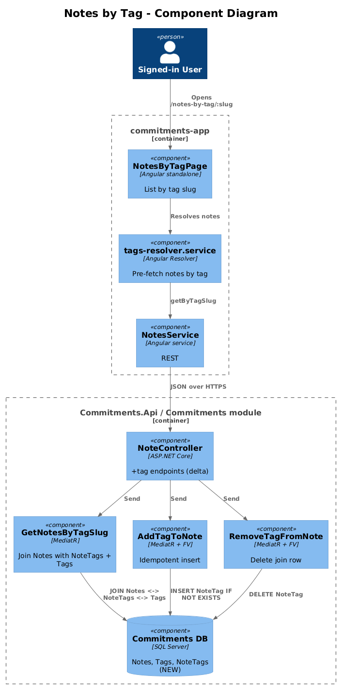
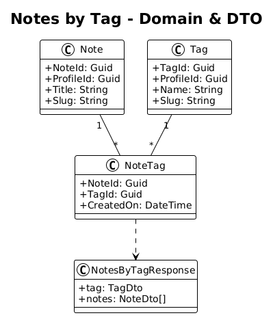
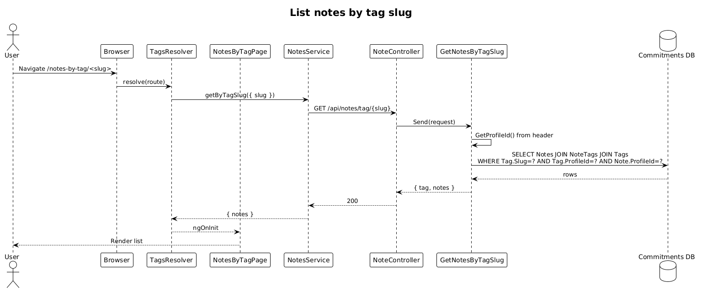

# Notes by Tag — Detailed Design

**Status:** Implemented

**Traces to:** L1-007 · L2-015, L2-038

## 1. Overview

The Notes-by-Tag page (`pages/notes-by-tag`, route `/notes-by-tag/:slug`) lists all notes that carry the tag identified by `:slug`. The page is the user-facing payoff for the tagging system: deep-linkable, shareable across profile devices, and the natural target for "notes tagged `weekly`" links from the dashboard or other notes.

This design adds the join table `NoteTag`, the assignment endpoints, and the by-slug list endpoint. It builds on:
- design `12-notes` (Note aggregate)
- design `14-tags` (Tag aggregate).

## 2. Architecture

### 2.1 C4 Component

## 3. Component Details

### 3.1 NotesByTagPageComponent (frontend, exists as placeholder)
- Add a child route `/notes-by-tag/:slug` under `DashboardLayoutComponent`. Replace placeholder with this component.
- Resolves notes via `tags-resolver.service` (already exists) which calls `NotesService.getByTagSlug({ slug })`.
- Columns: title + lastModifiedOn + edit (navigates to `/edit-note/<noteSlug>`).

### 3.2 NoteTag join (backend, **new**)
- Domain: `NoteTag { NoteId : Guid, TagId : Guid, CreatedOn }` — composite key.
- EF migration: new `NoteTags` table; FK to `Notes` and `Tags`. Indexed on both columns.
- Vertical slices:
  - `AddTagToNote` (`POST /api/notes/{noteId}/tag/{tagId}`) — idempotent INSERT IGNORE.
  - `RemoveTagFromNote` (`POST /api/notes/{noteId}/removeTag` with `{ tagId }`) — DELETE the join row (not a soft-delete; the join itself is the relationship, not a domain entity worth auditing).
  - `GetNotesByTagSlug` (`GET /api/notes/tag/{slug}`) — returns notes joined to the tag with `slug == :slug` and `ProfileId == active`.

### 3.3 NoteController + tag endpoints (backend, **delta**)
- The `NoteController` from design `12` adds:
  - `[HttpPost("{noteId}/tag/{tagId}")]` → `AddTagToNote`.
  - `[HttpPost("{noteId}/removeTag")]` → `RemoveTagFromNote` (matches the existing frontend method name).
  - `[HttpGet("tag/{slug}")]` → `GetNotesByTagSlug`.

## 4. Data Model

### 4.1 Class Diagram

## 5. Key Workflows

### 5.1 List notes by tag slug

## 6. API Contracts

| Method | Route | Body / Params | Response |
|--------|-------|----------------|----------|
| GET | `/api/v1.0/notes/tag/{slug}` | — | `200 { notes }` |
| POST | `/api/v1.0/notes/{noteId}/tag/{tagId}` | — | `200` (idempotent) |
| POST | `/api/v1.0/notes/{noteId}/removeTag` | `{ tagId }` | `200` |

## 7. Security Considerations

- The handlers MUST cross-check both `Note.ProfileId` and `Tag.ProfileId` against the active `ProfileId` header before mutating or reading. Without this, a user could tag another user's notes.
- `Tag` lookup by slug returns 404 if no row matches `(ProfileId, Slug)` — slugs are not globally enumerable.

## 8. ATDD Slices

1. **Slice A — join table + assignment endpoints.** **Status: Implemented** — `AddTagToNoteCommandHandler` is an idempotent insert (no-op if the `(NoteId, TagId)` pair already exists).
2. **Slice B — list-by-slug endpoint.** **Status: Implemented** — `GetNotesByTagSlugQueryHandler` resolves the tag by `(ProfileId, Slug)` first, then returns Notes via `noteIds.Contains(...)`. Cross-profile is impossible because the tag itself is profile-scoped.
3. **Slice C — page wiring.** **Status: Implemented** — `app.routes.ts` maps `/notes-by-tag/:slug → NotesByTagPageComponent` (page already wired to `NotesService.getByTagSlug`).
4. **Slice D — remove tag.** **Status: Implemented** — `RemoveTagFromNoteCommandHandler` deletes the join row; the join is intentionally hard-delete per design §3.2 ("not a domain entity worth auditing").

## 10. Implementation Notes

- The join is **hard-delete**. `BaseDbContext.OnSavingChanges` previously force-flipped every `Deleted` entry to `Modified` with `IsDeleted = true`. With this design's `NoteTag` (no `IsDeleted` column), that crashed at save time. The interceptor now opts out for entities that don't implement `ILoggable` — a one-line guard with broad benefit.
- Idempotency is `AnyAsync` + early-return — three lines. No upsert SQL, no synchronization primitives.
- The slug→tagId→noteIds pipeline is three small queries; with `.Contains` translated to SQL `IN`, this is one round-trip on a real database.

## 9. Open Questions

- Should `GET /api/notes/tag/{slug}` return the tag's metadata (e.g., colour) alongside the notes? Recommendation: include `{ tag, notes }` so the page can show a header chip without a second roundtrip.
- Multi-tag filter (`?tags=a,b`)? Out of scope.
