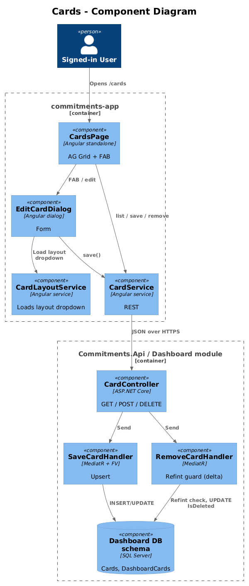
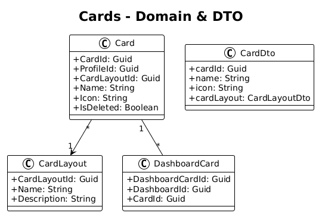
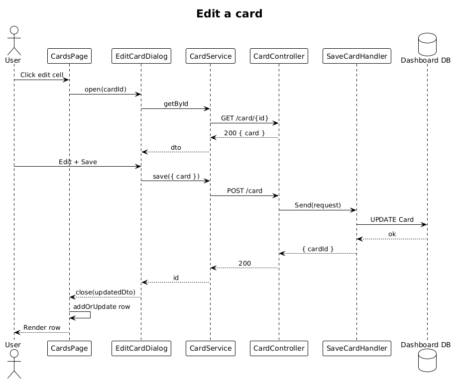

# Cards — Detailed Design

**Status:** Implemented

**Traces to:** L1-010 · L2-019, L2-022

## 1. Overview

The Cards page (`pages/cards`, route `/cards`) maintains the catalog of dashboard card definitions (the "tile types" referenced by `DashboardCard.CardId`). It lists cards (name, layout, icon) and supports CRUD via `EditCardDialog`.

The backend `CardController` already exposes Save/Get/GetById/Remove. The delta is purely frontend — wire the route, replace the placeholder, and surface the dialog.

## 2. Architecture

### 2.1 C4 Component

## 3. Component Details

### 3.1 CardsPageComponent (frontend, exists as placeholder)
- Replace placeholder route with this component.
- Columns: name, layout name, icon, edit, delete. FAB → `EditCardDialog`.

### 3.2 EditCardDialog (frontend, exists)
- Already implemented. **Delta:** none.

### 3.3 CardController (backend, exists)
- Save / Get / GetById / Remove all present. **Delta — refint:** `RemoveCardHandler` rejects when at least one non-deleted `DashboardCard.CardId == cardId` exists.

## 4. Data Model

### 4.1 Class Diagram

## 5. Key Workflows

### 5.1 Edit a card definition

## 6. API Contracts

| Method | Route | Body / Params | Response |
|--------|-------|----------------|----------|
| GET | `/api/v1.0/card` | — | `200 { cards }` |
| GET | `/api/v1.0/card/{cardId}` | — | `200 { card }` |
| POST | `/api/v1.0/card` | `{ card }` | `200 { cardId }` |
| DELETE | `/api/v1.0/card/{cardId}` | — | `200` / `400 (referenced)` |

## 7. Security Considerations

- The card catalog is **per profile** (each user defines their own catalog) — relies on the standard global query filter.
- Refint guard prevents leaving dashboards with dangling `DashboardCard.CardId` after a delete.

## 8. ATDD Slices

1. **Slice A — list/route + render.** Spec: `/cards` lists rows; FAB opens dialog; saving adds/updates a row. **Status: Implemented.**
2. **Slice B — refint on delete.** Spec: deleting a card referenced by ≥1 dashboard's tiles returns 400. **Status: Implemented.**

## 10. Implementation Notes

- The refint guard reuses the four-line "count + throw `BadHttpRequestException(message, 400)`" pattern from designs 05/06/07/14 — five catalogs now share the same shape.
- `Card` is intentionally not a `BaseEntity`; the unreferenced path stays a hard-delete since cards are catalog metadata, not user content worth auditing.

## 9. Open Questions

- Should the catalog be **global** (curated by an admin), not per profile? Per the L2-019 / L2-022 wording the catalog is per-user; revisit if a "shared catalog" use-case emerges.
