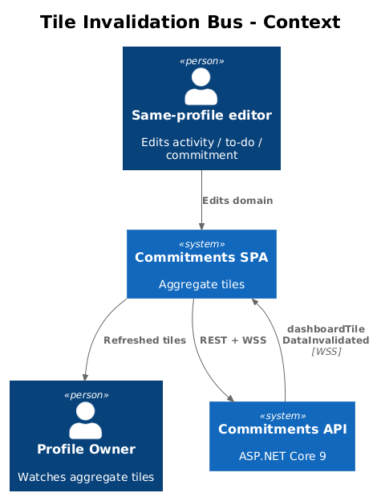
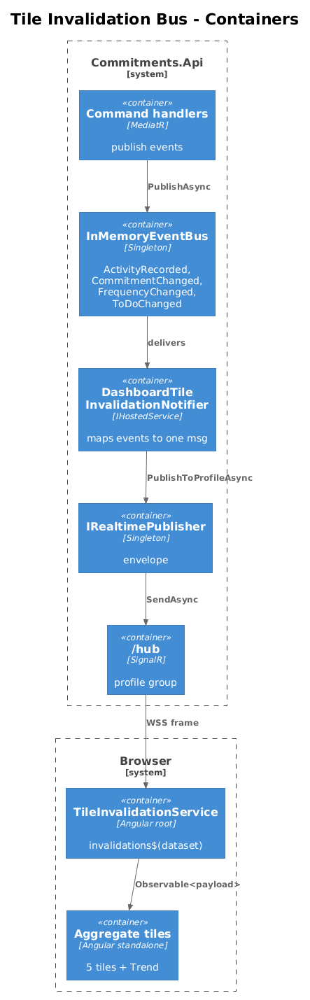
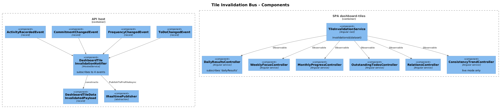
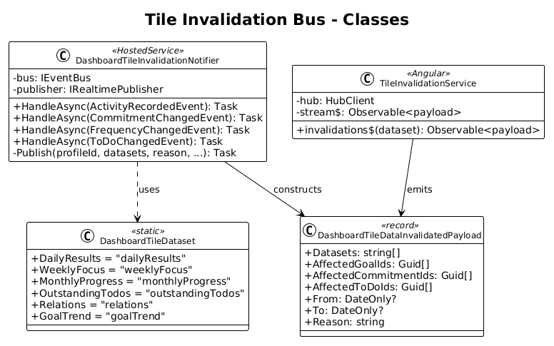
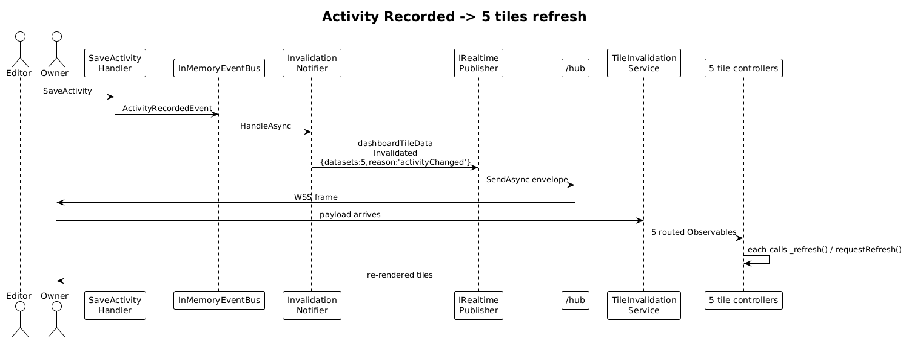
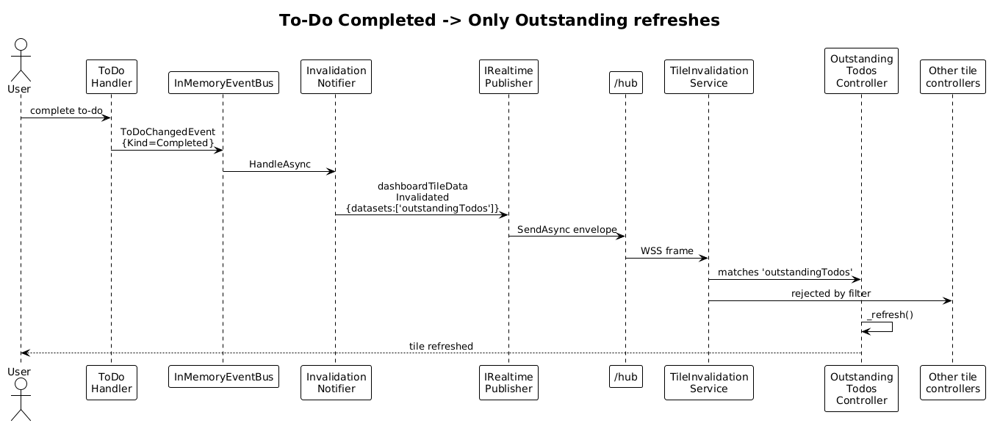

# 16 — Dashboard Tile Invalidation Bus — Detailed Design

## 1. Overview

The aggregate dashboard tiles (Daily Results, Weekly Focus, Monthly Progress, Outstanding To-Dos, Relations) and the Consistency Trend tile do **not** all warrant a full-snapshot push. Recomputing a 30-day series and shipping it on every activity edit is wasted bandwidth — most tiles can simply re-fetch their REST snapshot endpoint when something they depend on changes.

This slice introduces the lightweight invalidation message defined in ICD §6.3 (`WS-TILE-002 dashboardTileDataInvalidated`) plus the frontend plumbing tiles use to react to it:

1. Backend: a new `DashboardTileDataInvalidatedPayload` record + a `DashboardTileInvalidationNotifier` (hosted subscriber) that maps domain events to invalidation messages.
2. Frontend: a `TileInvalidationService` that exposes `invalidations$(dataset)` per `DashboardTileDataset` value. Tiles subscribe and call `tileContext.requestRefresh()` on match.
3. Wiring: each existing tile (Daily Results, Weekly Focus, Monthly Progress, Outstanding To-Dos, Relations, Consistency Trend) gets one extra subscription in its controller.

The push is **fire-and-tell-tiles-to-refetch**, not the snapshot push from slice 17. Tiles that opt into snapshot push (slice 17) will simply ignore matching invalidations to avoid double work.

**Actors**

- **Profile owner** — sees aggregate tiles refresh after they record an activity, complete a to-do, or change a commitment frequency.
- **Backend feature handlers** — every command handler that mutates state covered by an aggregate tile publishes an integration event the notifier subscribes to.

**Scope boundary**

- One invalidation event per committed transaction. Batched edits collapse to one push if they happen in the same DbContext save.
- The notifier publishes for these source events: `ActivityRecordedEvent` (slice 15), `CommitmentChangedEvent` (new), `FrequencyChangedEvent` (new), `ToDoChangedEvent` (new), `ProfileChangedEvent` (already exists as `ProfileCreatedEvent` / `ProfileDeletedEvent`).
- It does **not** compute snapshots. It only declares which datasets are stale.
- The frontend service does **not** keep state; it is a pure router from envelope → tile-friendly Observable.

**Radically simple**: one DTO on each side, one notifier on the backend, one Angular service on the frontend, one subscription per tile.

## 2. Architecture

### 2.1 C4 Context



### 2.2 C4 Container



### 2.3 C4 Component



`DashboardTileInvalidationNotifier` lives in the API host. It subscribes to four integration events on `IEventBus`. For each, it emits one `dashboardTileDataInvalidated` message via `IRealtimePublisher`, with the appropriate `datasets` array per the table in §3.2. On the frontend, `TileInvalidationService` (registered `providedIn: 'root'`) subscribes once to `hubClient.on<DashboardTileDataInvalidatedPayload>('dashboardTileDataInvalidated')` and routes by dataset.

## 3. Component Details

### 3.1 New integration events (backend)

Append to `backend/src/Commitments.Shared/IntegrationEvents.cs`:

```csharp
public class CommitmentChangedEvent : IntegrationEvent
{
    public Guid CommitmentId { get; set; }
    public Guid ProfileId { get; set; }
    public ChangeKind Kind { get; set; }   // Created, Updated, Removed
}

public class FrequencyChangedEvent : IntegrationEvent
{
    public Guid CommitmentId { get; set; }
    public Guid ProfileId { get; set; }
}

public class ToDoChangedEvent : IntegrationEvent
{
    public Guid ToDoId { get; set; }
    public Guid ProfileId { get; set; }
    public ChangeKind Kind { get; set; }   // Created, Completed, Removed
}

public enum ChangeKind { Created, Updated, Removed, Completed }
```

The corresponding `SaveCommitmentCommandHandler`, `RemoveCommitmentCommandHandler`, `SaveCommitmentFrequencyCommandHandler`, and `SaveToDoCommandHandler` get the same `_bus.PublishAsync(...)` call after `SaveChangesAsync`, mirroring the pattern from slice 15 §3.2.

### 3.2 DashboardTileInvalidationNotifier

- **Path**: `backend/src/Commitments.Api/Realtime/DashboardTileInvalidationNotifier.cs`.
- **Lifetime**: `IHostedService`. Subscribes on `StartAsync`.
- **Behavior** — one branch per source event, all calling the same private `Publish(profileId, datasets, reason, affectedXxxIds, from, to)`:

| Source event | datasets | reason | affected*Ids |
|---|---|---|---|
| `ActivityRecordedEvent` | `dailyResults, weeklyFocus, monthlyProgress, relations, goalTrend` | `activityChanged` | `affectedGoalIds = [matching commitments]`, `affectedCommitmentIds = same`, `affectedToDoIds = []` |
| `CommitmentChangedEvent` | `dailyResults, weeklyFocus, monthlyProgress, relations, goalTrend` | `commitmentChanged` | `affectedCommitmentIds = [evt.CommitmentId]` |
| `FrequencyChangedEvent` | `dailyResults, weeklyFocus, monthlyProgress, relations, goalTrend` | `frequencyChanged` | `affectedCommitmentIds = [evt.CommitmentId]` |
| `ToDoChangedEvent` | `outstandingTodos` | `toDoChanged` | `affectedToDoIds = [evt.ToDoId]` |
| `ProfileCreatedEvent` / `ProfileDeletedEvent` | all six | `profileChanged` | empty arrays |

`from`/`to` default to today (UTC). Activity-driven invalidations set `from = to = DateOnly.FromDateTime(evt.PerformedOn)` so a tile can decide whether the change matters for its current window.

### 3.3 DashboardTileDataInvalidatedPayload (DTO)

- **Path**: `backend/src/Commitments.Api/Realtime/DashboardTileDataInvalidatedPayload.cs`. Mirrors ICD §6.3.

```csharp
public sealed record DashboardTileDataInvalidatedPayload(
    IReadOnlyList<string> Datasets,
    IReadOnlyList<Guid> AffectedGoalIds,
    IReadOnlyList<Guid> AffectedCommitmentIds,
    IReadOnlyList<Guid> AffectedToDoIds,
    DateOnly? From,
    DateOnly? To,
    string Reason);
```

`datasets` values use `camelCase` strings to match the ICD's union type. A backend `DashboardTileDataset` static class holds the literal constants so the notifier never typos.

### 3.4 TileInvalidationService (frontend)

- **Path**: `frontend/projects/commitments-app/src/app/dashboard-tiles/tile-invalidation.service.ts`.
- **Surface**:

```ts
export type DashboardTileDataset =
  | 'dailyResults' | 'weeklyFocus' | 'monthlyProgress'
  | 'outstandingTodos' | 'relations' | 'goalTrend';

export interface DashboardTileDataInvalidatedPayload {
  datasets: DashboardTileDataset[];
  affectedGoalIds: string[];
  affectedCommitmentIds: string[];
  affectedToDoIds: string[];
  from: string | null;
  to: string | null;
  reason: 'activityChanged' | 'commitmentChanged' | 'frequencyChanged'
        | 'toDoChanged' | 'profileChanged';
}

@Injectable({ providedIn: 'root' })
export class TileInvalidationService {
  private readonly _hub = inject(HubClient);
  private readonly _stream = this._hub
    .on<DashboardTileDataInvalidatedPayload>('dashboardTileDataInvalidated');

  invalidations$(dataset: DashboardTileDataset)
    : Observable<DashboardTileDataInvalidatedPayload> {
    return this._stream.pipe(filter(p => p.datasets.includes(dataset)));
  }
}
```

- **Notes**:
  - The service is stateless. It builds a fresh filtered Observable per `invalidations$(dataset)` call. RxJS multicasts the upstream once via `share()` so each `on()` call shares the underlying subscription.
  - Tiles never inspect `affectedXxxIds` for a "do I care?" check at this layer — that's the tile's controller job because it knows its `goalId` / `toDoId` filter.

### 3.5 Tile wiring

Each tile controller adds one constructor injection and one subscription. Concrete files:

- **Daily Results** — `frontend/projects/commitments-app/src/app/dashboard-tiles/daily-results-tile/daily-results-controller.ts` (subscribes to `'dailyResults'`, calls `requestRefresh()`).
- **Weekly Focus** — `frontend/projects/commitments-app/src/app/dashboard-tiles/weekly-focus-tile/weekly-focus-controller.ts`.
- **Monthly Progress** — `frontend/projects/commitments-app/src/app/dashboard-tiles/monthly-progress-tile/monthly-progress-controller.ts`.
- **Outstanding To-Dos** — `frontend/projects/commitments-app/src/app/dashboard-tiles/outstanding-todos-tile/outstanding-todos-controller.ts`.
- **Relations** — `frontend/projects/commitments-app/src/app/dashboard-tiles/relations-tile/relations-controller.ts`.
- **Consistency Trend** (existing tile from slice 08) — `frontend/projects/commitments-app/src/app/components/consistency-trend-tile/consistency-trend-controller.ts`. In live mode only, subscribe to `'goalTrend'` and call `requestRefresh()`. In review mode, ignore (the trend with `asOf` is historical and stable).

Sample wiring (Outstanding To-Dos):

```ts
constructor(
  private readonly _ctx: TileContext,
  private readonly _service: OutstandingTodosService,
  private readonly _invalidations: TileInvalidationService
) {}

ngOnInit() {
  this._refresh();
  this._invalidations.invalidations$('outstandingTodos')
    .subscribe(() => this._refresh());
}
```

`_refresh()` uses the existing REST endpoint (`REST-TILE-004` from ICD §5.4) and overwrites the local snapshot signal.

### 3.6 `requestRefresh()` on tile context

- The tile context already exposes `requestRefresh()` (see `04-dashboard-mode-shell` and ICD §8). Tiles **may** call `tileContext.requestRefresh()` instead of hand-rolling a `_refresh()` method when the framework wires it. The shell repeats the same call on focus, so re-using the framework hook keeps the call site small.

## 4. Data Model

### 4.1 Class Diagram



### 4.2 Entity Descriptions

- **DashboardTileDataInvalidatedPayload** — pure data, exposed on both ends.
- **DashboardTileInvalidationNotifier** — IHostedService routing four integration event types to one outbound message family.
- **TileInvalidationService** — Angular root-scoped service exposing per-dataset Observables.
- **CommitmentChangedEvent / FrequencyChangedEvent / ToDoChangedEvent** — new shared integration events.

No DB migration. All affected tiles already have REST endpoints (slice 11 / ICD §5.4).

## 5. Key Workflows

### 5.1 Activity created → multiple aggregate tiles refresh



1. User creates an activity (slice 15 §5.1 path is the same).
2. `SaveActivityCommandHandler` publishes `ActivityRecordedEvent`.
3. **Both** subscribers handle it:
   - `GoalProgressUpdatedRealtimeNotifier` (slice 15) publishes `goalProgressUpdated`.
   - `DashboardTileInvalidationNotifier` (this slice) publishes `dashboardTileDataInvalidated` with `datasets = [dailyResults, weeklyFocus, monthlyProgress, relations, goalTrend]` and `reason = activityChanged`.
4. The frontend `TileInvalidationService` routes the second envelope to **five** subscribers — one per matching tile.
5. Each tile re-fetches its REST snapshot endpoint. Daily Results, Weekly Focus, Monthly Progress, Relations, and Consistency Trend (live mode only) all re-render.

### 5.2 To-Do completed → only Outstanding To-Dos refreshes



1. User toggles a to-do to complete in another tab.
2. `SaveToDoCommandHandler` (or `CompleteToDoCommandHandler`) publishes `ToDoChangedEvent { Kind = Completed }`.
3. `DashboardTileInvalidationNotifier` publishes `dashboardTileDataInvalidated` with `datasets = [outstandingTodos]`, `reason = toDoChanged`.
4. Only the Outstanding To-Dos tile's `invalidations$('outstandingTodos')` subscriber triggers; it re-fetches the snapshot.
5. The other four aggregate tiles' subscribers also receive the envelope but the `filter(p => p.datasets.includes('xxx'))` rejects it.

## 6. API Contracts

Wire format (envelope wraps this payload — `event = "dashboardTileDataInvalidated"`):

```json
{
  "datasets": ["dailyResults", "weeklyFocus", "monthlyProgress", "relations", "goalTrend"],
  "affectedGoalIds": [],
  "affectedCommitmentIds": ["aaaa..."],
  "affectedToDoIds": [],
  "from": "2026-04-26",
  "to": "2026-04-26",
  "reason": "activityChanged"
}
```

## 7. Security Considerations

- The notifier reads `evt.ProfileId` from the integration event and publishes only to that profile's group. No cross-profile fan-out.
- `affectedXxxIds` are the canonical entity ids the same profile can already read via REST. They reveal nothing new to the recipient.
- Empty `affectedXxxIds` plus `reason = profileChanged` is a coarse signal that the entire dashboard should refresh; it is intentional and matches the ICD's "profile changed" convention.

## 8. Open Questions

1. **Should a tile filter on `affectedXxxIds` to skip refetch when the change is irrelevant?** The current design says no — every receiving tile refetches whenever its dataset is listed. Cheaper than maintaining per-id awareness in five tile controllers, and the REST snapshot is already cheap. Revisit only if profiling shows the snapshot endpoints are hot.
2. **Coalescing.** A user editing five activities in a row triggers five invalidation messages. The frontend's `requestRefresh()` is naturally rate-limited by the REST round-trip, but two arrivals in 200 ms still trigger two HTTP calls. A `debounceTime(150)` per tile is a tiny addition; defer until UX shows it matters.
3. **What about `commitmentUpdated` reason in `goalProgressUpdated`?** The ICD lists it. After this slice ships `CommitmentChangedEvent`, slice 15's notifier could also subscribe and publish `goalProgressUpdated { reason: 'commitmentUpdated' }` for relevant goals. Add as a follow-up; it's a small, safe additive change.
4. **DateOnly serialization.** Newtonsoft does not handle `DateOnly` natively; install `Newtonsoft.Json` 13.x with the `DateOnly` converter or change the field to `string` in the DTO. The simpler fix is to serialize as `"yyyy-MM-dd"` strings, matching the ICD's `IsoDate` shape.
