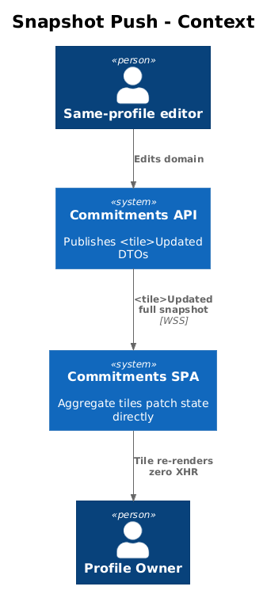
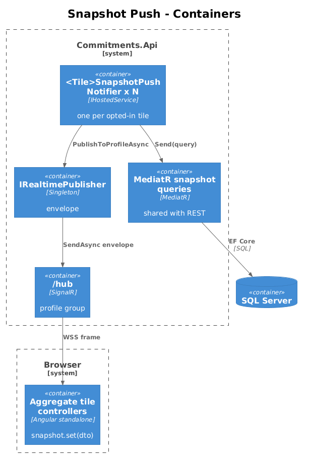
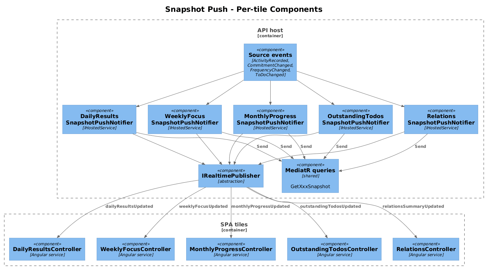
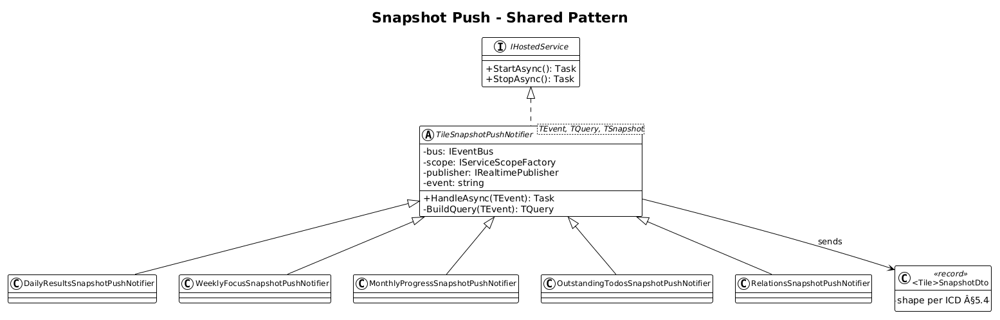
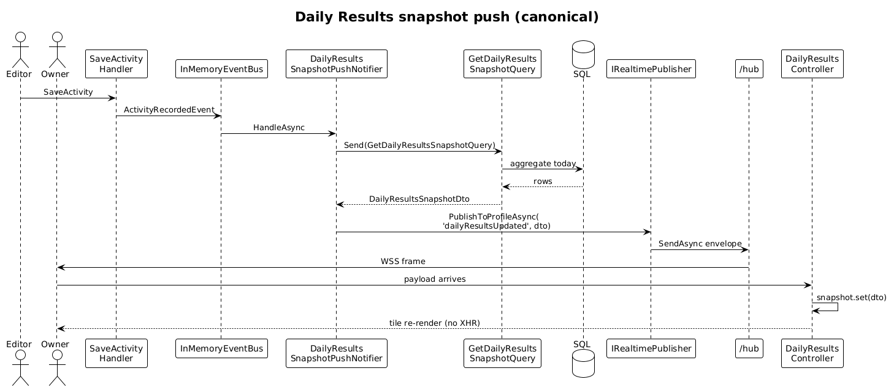
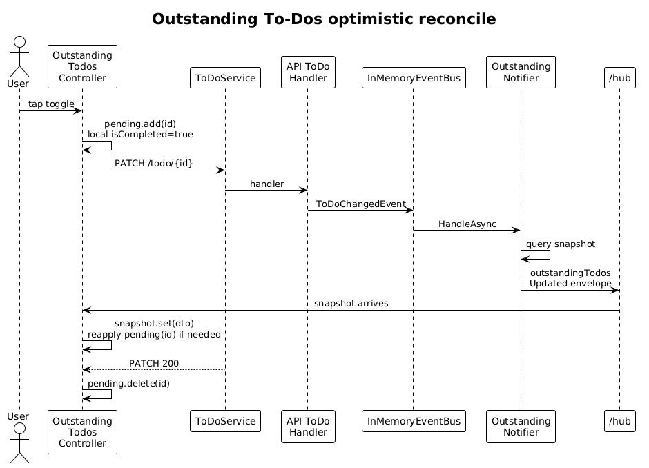

# 17 — Aggregate Tile Snapshot Push — Detailed Design

**Status:** Accepted

## 1. Overview

Slice 16 gives every aggregate tile a "your data is stale, refetch" signal. That works, but it costs one round-trip per change. For tiles that are visible during high-frequency editing — typically Daily Results during a workout, or Outstanding To-Dos during a planning session — the snapshot is small enough to push directly. ICD §6.3 lists five **optional** full-snapshot pushes (`WS-TILE-003` through `WS-TILE-007`):

| Wire event | Tile |
|---|---|
| `dailyResultsUpdated` | Daily Results |
| `weeklyFocusUpdated` | Weekly Focus |
| `monthlyProgressUpdated` | Monthly Progress |
| `outstandingTodosUpdated` | Outstanding To-Dos |
| `relationsSummaryUpdated` | Relations |

This slice describes the **shared pattern** that all five share, then lists the per-tile differences. Each tile is its own implementation PR (one screenshot per tile), but the design is one document because the pattern is mechanical — backend snapshot generator, hosted notifier, payload DTO, frontend tile patch. If only some tiles need the push pattern (e.g., Daily Results yes, Relations no), the others stay on slice 16's invalidation pattern.

**Actors**

- **Profile owner** — sees a tile update without a network round-trip.
- **Same-profile editor** — triggers the change.

**Scope boundary**

- Snapshot pushes are **complementary** to invalidation. A tile that opts in **must** ignore matching invalidation messages (slice 16) so it does not refetch redundantly.
- Snapshot generators reuse the existing REST snapshot endpoint handlers (ICD §5.4) by sharing one MediatR query handler per tile. No SQL is duplicated.
- "When to push" is identical to "when to invalidate" for the same dataset (the same source events trigger).
- Two-tab consistency: when browser **B** records an activity, browser **A** receives the snapshot in well under a second; if browser **A** had pending edits to the same tile (only Outstanding To-Dos has tile-local edit state today), the snapshot **wins** — local optimistic state is reconciled.

**Radically simple**: each tile is one new payload record + one new hosted notifier (or one new branch in an existing one) + one new frontend `on<T>('xxxUpdated')` subscription. No new REST endpoints. No DB migrations.

## 2. Architecture

### 2.1 C4 Context



### 2.2 C4 Container



### 2.3 C4 Component



For each opted-in tile, a `<Tile>SnapshotPushNotifier` (`IHostedService`) subscribes to the same source integration events as slice 16's invalidation notifier, but instead of declaring "go fetch", it runs the same MediatR query as the REST endpoint and publishes the rendered snapshot. The frontend tile controller subscribes to `on<TSnapshot>('<tile>Updated')` and overwrites its local snapshot signal. The same controller's slice-16 invalidation subscription becomes a no-op (or is removed) for this tile.

## 3. Component Details

### 3.1 Shared pattern — backend `<Tile>SnapshotPushNotifier`

- **Path**: `backend/src/Commitments.Api/Realtime/<Tile>SnapshotPushNotifier.cs` (one per tile).
- **Lifetime**: `IHostedService`, registered in `Program.cs` after `IRealtimePublisher`.
- **Behavior**:
  1. Subscribe to the source events relevant to the tile (see §3.2 table).
  2. On event delivery, open a scope, resolve `IMediator`, send the existing snapshot query (e.g. `new GetDailyResultsSnapshotQuery(profileId, today)`), receive the response DTO.
  3. Wrap the DTO via `IRealtimePublisher.PublishToProfileAsync(evt.ProfileId, "<tile>Updated", snapshotDto)`.
- **Why not in-handler**: keeping the publish out of the command handler preserves slice 15's design rule — handlers publish only domain events, never realtime payloads. The notifier is the bridge.

### 3.2 Per-tile contract table

| Tile | Event name | Source events | Snapshot DTO (REST + WS) | Frontend file |
|---|---|---|---|---|
| Daily Results | `dailyResultsUpdated` | `ActivityRecordedEvent`, `CommitmentChangedEvent`, `FrequencyChangedEvent` | `DailyResultsSnapshotDto` (ICD §5.4) | `frontend/projects/commitments-app/src/app/dashboard-tiles/daily-results-tile/daily-results-controller.ts` |
| Weekly Focus | `weeklyFocusUpdated` | `ActivityRecordedEvent`, `CommitmentChangedEvent`, `FrequencyChangedEvent` | `WeeklyFocusSnapshotDto` | `dashboard-tiles/weekly-focus-tile/weekly-focus-controller.ts` |
| Monthly Progress | `monthlyProgressUpdated` | same as above (filter to current month) | `MonthlyProgressSnapshotDto` | `dashboard-tiles/monthly-progress-tile/monthly-progress-controller.ts` |
| Outstanding To-Dos | `outstandingTodosUpdated` | `ToDoChangedEvent` | `OutstandingTodosSnapshotDto` | `dashboard-tiles/outstanding-todos-tile/outstanding-todos-controller.ts` |
| Relations | `relationsSummaryUpdated` | `ActivityRecordedEvent`, `CommitmentChangedEvent` | `RelationsSummarySnapshotDto` | `dashboard-tiles/relations-tile/relations-controller.ts` |

### 3.3 Snapshot DTO reuse

The REST endpoint and the WebSocket payload share the same DTO type, defined per the ICD §5.4 `*SnapshotDto` shapes. The DTO records live in `backend/src/Modules/Commitments/Features/DashboardTiles/<Tile>/<Tile>SnapshotDto.cs` (slice 11 lays the foundation for these to exist). They serialize identically over REST and over WS so the frontend has one shape to model.

### 3.4 Shared pattern — frontend tile controller

Each opted-in tile controller adds:

```ts
constructor(
  private readonly _ctx: TileContext,
  private readonly _service: <Tile>Service,
  private readonly _hub: HubClient
) {
  this._hub.on<<Tile>SnapshotDto>('<tile>Updated')
    .subscribe(snap => this.snapshot.set(snap));
}
```

and **removes** the slice-16 invalidation subscription for the same dataset. Why: when the snapshot push is wired, every change ships the new snapshot directly. A redundant invalidation would trigger a redundant REST call.

If the tile is configured to opt in/out at runtime (e.g., through a future feature flag), keep both subscriptions but `take(1)` from invalidation when a snapshot has not arrived within a 500 ms window. The simpler default is: if the backend opts the tile in (notifier registered), the frontend opts out of invalidation (subscription removed). Coordinated by the implementation slice that wires each tile.

### 3.5 Local snapshot reconciliation

The current Outstanding To-Dos tile (the only one with foreseeable local edit state) optimistically toggles a to-do's `isCompleted` flag in its UI before the API confirms. When the snapshot push arrives, it overwrites the local list with the server-authoritative state. Reconcile by:

- **Always** trusting the snapshot's `isCompleted`.
- Re-applying any local edit that has not yet round-tripped (tracked by `pendingToDoIds: Set<string>` on the controller). Trade-off: if the user toggles a to-do after the snapshot arrives, their toggle is briefly overwritten on the next snapshot push. Acceptable: the next REST round-trip re-converges.

For Daily Results, Weekly Focus, Monthly Progress, and Relations, there is no local edit state, so the snapshot is a straight `signal.set()`.

### 3.6 Snapshot size cap

Pushed snapshots are bounded:

- Daily Results: items count = today's commitments, expected ≤ 30. Each item ~150 bytes JSON. Total ≤ 5 KB.
- Weekly Focus: ≤ 30 items × 150 bytes = 5 KB.
- Monthly Progress: 5 weeks × 80 bytes = 400 bytes.
- Outstanding To-Dos: cap **100 items** in the snapshot. Tiles needing the long tail still re-fetch via REST. ~15 KB hard cap.
- Relations: ≤ 10 segments × 80 bytes = 800 bytes.

Total upper bound per WS frame is ~15 KB, comfortably below SignalR's default 32 KB receive cap. No need to raise `MaximumReceiveMessageSize`.

## 4. Data Model

### 4.1 Class Diagram



### 4.2 Entity Descriptions

- **`<Tile>SnapshotDto`** — same DTO returned by the REST endpoint and shipped on the WebSocket. Defined per ICD §5.4.
- **`<Tile>SnapshotPushNotifier`** — IHostedService bridging integration events to `IRealtimePublisher`.
- **`<Tile>Service` (frontend)** — existing service that calls the REST endpoint on initial mount; unchanged. The push only updates the local `signal`; it never bypasses the service for cache freshness.

No DB tables, no migrations.

## 5. Key Workflows

### 5.1 Daily Results snapshot push (canonical example)



1. User in browser **B** creates an activity for one of today's commitments.
2. `SaveActivityCommandHandler` publishes `ActivityRecordedEvent`.
3. `DailyResultsSnapshotPushNotifier.HandleAsync(evt)` runs:
   - Opens a scope, resolves `IMediator`.
   - Sends `new GetDailyResultsSnapshotQuery(evt.ProfileId, DateOnly.FromDateTime(evt.PerformedOn.UtcDateTime))`.
   - Receives `DailyResultsSnapshotDto`.
   - Calls `_publisher.PublishToProfileAsync(evt.ProfileId, "dailyResultsUpdated", dto)`.
4. Browser **A**'s `HubClient.on<DailyResultsSnapshotDto>('dailyResultsUpdated')` emits the DTO.
5. The Daily Results tile controller calls `this.snapshot.set(dto)`. The tile re-renders.
6. **Screenshot for ATDD**: DevTools network panel in **A** shows zero XHRs after the activity create in **B**, but the tile redraws with the new completed/expected counts.

### 5.2 Outstanding To-Dos with optimistic local edit



1. User in **A** ticks a to-do; the controller sets `_pendingIds.add(toDoId)` and toggles the local item to `isCompleted = true`.
2. `PATCH /api/v1.0/todo/{id}` issued.
3. Server commits, publishes `ToDoChangedEvent`.
4. `OutstandingTodosSnapshotPushNotifier` queries the snapshot, publishes `outstandingTodosUpdated`.
5. **A**'s subscription overwrites the local list. The reconcile step keeps `_pendingIds` items in their optimistic state if the snapshot still shows them as not-yet-completed (e.g., race condition).
6. The pending PATCH response arrives; the controller removes the id from `_pendingIds`. The next snapshot will be fully authoritative.

## 6. API Contracts

Wire format (envelope wraps each — `event = "<tile>Updated"`):

```json
// dailyResultsUpdated payload (ICD §5.4)
{
  "date": "2026-04-26",
  "completed": 7,
  "expected": 12,
  "percent": 58,
  "items": [
    { "commitmentId": "...", "behaviourId": "...", "name": "Drink 2L water",
      "completed": true, "completedCount": 8, "target": 8,
      "lastActivityAt": "2026-04-26T18:42:55Z" }
  ]
}
```

Other tiles' payloads match their `<Tile>SnapshotDto` shapes verbatim from ICD §5.4.

## 7. Security Considerations

- The snapshot the notifier ships is identical to the REST snapshot the same profile would receive. Nothing new is exposed.
- The notifier scopes via `IRealtimePublisher.PublishToProfileAsync(evt.ProfileId, ...)`. No cross-profile leakage.
- The MediatR query handler enforces profile scoping inside the same scope; the notifier passes `evt.ProfileId` to the query, so EF's profile filter applies. The notifier never bypasses the query handler with raw EF.
- Snapshot pushes happen post-commit, so a transaction rollback never publishes a stale view.

## 8. Open Questions

1. **Per-tile opt-in mechanism.** Today: implementation choice — register the notifier and remove the invalidation subscription, or skip both. Should this be config-driven? A `realtime:tilePush:<tile> = true|false` appsettings switch is one line; recommend adding when the second tile opts in, not before.
2. **Snapshot push for goalTrend?** The ICD's `WS-TILE-002` lists `goalTrend` in the invalidation datasets but there is no dedicated `goalTrendUpdated` snapshot push event. Trend payloads can be ~50 KB with a 365-day window — too big for a default WS frame. Stick with invalidation for trend; reconfirm if a "compact trend" payload appears later.
3. **Duplicate suppression.** When two activities are committed in close succession, two snapshot pushes arrive in close succession. The frontend subscription is `signal.set()`-only, which is idempotent — no harm beyond a wasted re-render. If profiling shows the re-render is hot, add `distinctUntilChanged((a, b) => a.percent === b.percent && ...)` per tile.
4. **Coupling between snapshot dto and REST handler.** Sharing one DTO between REST and WS means a REST contract change is also a wire format change. This is intentional to keep the two paths in sync, but reviewers should treat the DTO as a public contract.
