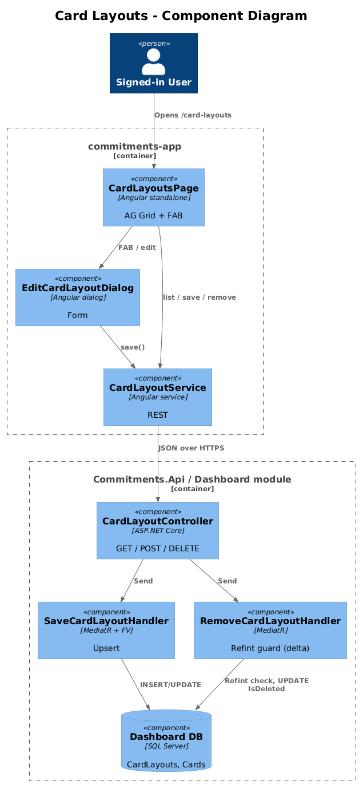
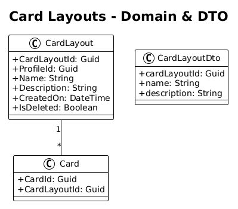
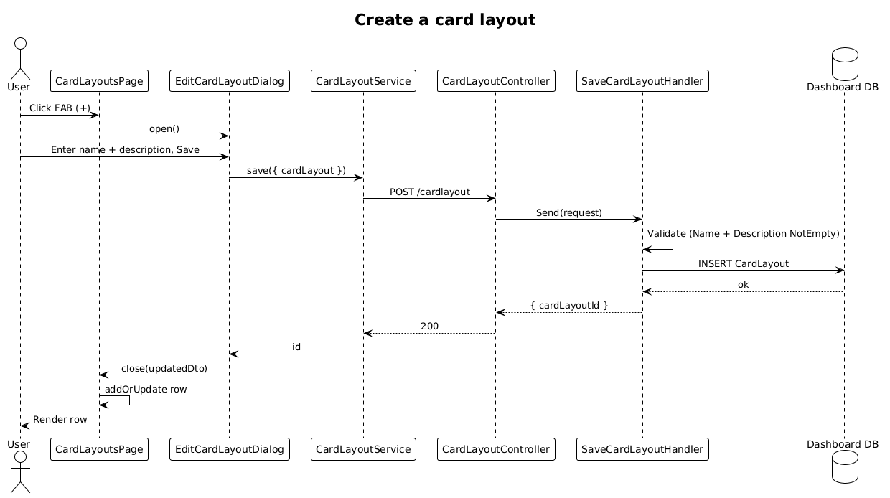

# Card Layouts — Detailed Design

**Status:** Draft

**Traces to:** L1-010 · L2-022

## 1. Overview

The Card Layouts page (`pages/card-layouts`, route `/card-layouts`) maintains the catalog of `CardLayout` records — the visual templates referenced by `Card.CardLayoutId`. The page lists layouts (name, description) and supports CRUD via `EditCardLayoutDialog`.

Backend `CardLayoutController` already exposes Save/Get/GetById/Remove. The delta is purely frontend wiring + ATDD specs + a small refint guard on delete.

## 2. Architecture

### 2.1 C4 Component

## 3. Component Details

### 3.1 CardLayoutsPageComponent (frontend, exists as placeholder)
- Replace placeholder route with this component.
- Columns: name, description, edit, delete.

### 3.2 EditCardLayoutDialog (frontend, exists)
- Reactive form `{ name, description }` already implemented. **Delta:** none.

### 3.3 CardLayoutController (backend, exists)
- All CRUD verbs present. **Delta — refint:** `RemoveCardLayoutHandler` rejects when at least one non-deleted `Card.CardLayoutId == cardLayoutId` exists.

## 4. Data Model

### 4.1 Class Diagram

## 5. Key Workflows

### 5.1 Create a card layout

## 6. API Contracts

| Method | Route | Body / Params | Response |
|--------|-------|----------------|----------|
| GET | `/api/v1.0/cardlayout` | — | `200 { cardLayouts }` |
| GET | `/api/v1.0/cardlayout/{id}` | — | `200 { cardLayout }` |
| POST | `/api/v1.0/cardlayout` | `{ cardLayout }` | `200 { cardLayoutId }` |
| DELETE | `/api/v1.0/cardlayout/{id}` | — | `200` / `400 (referenced)` |

## 7. Security Considerations

- Profile-scoped via the global query filter; the handler re-asserts via `GetProfileId()`.
- Refint guard prevents leaving cards with dangling `CardLayoutId`.

## 8. ATDD Slices

1. **Slice A — list/route + render.** Spec: `/card-layouts` lists rows; FAB opens dialog; saving with valid name + description adds/updates a row (L2-022 AC #1).
2. **Slice B — refint on delete.** Spec: deleting a layout referenced by ≥1 card returns 400.

## 9. Open Questions

- The .pen design implies CardLayout drives **grid sizing** (rows × columns). Verify what exactly `CardLayout.Description` carries — if it should hold structured layout JSON, that's a follow-up slice (`CardLayout.Spec` json column).
