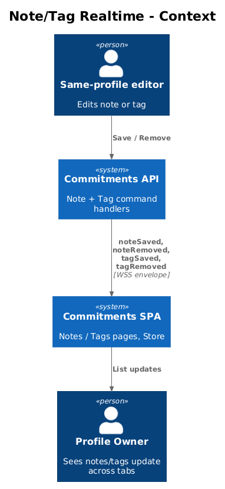
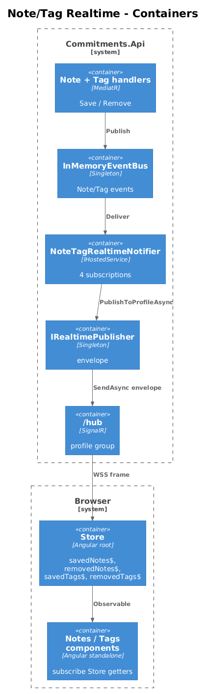
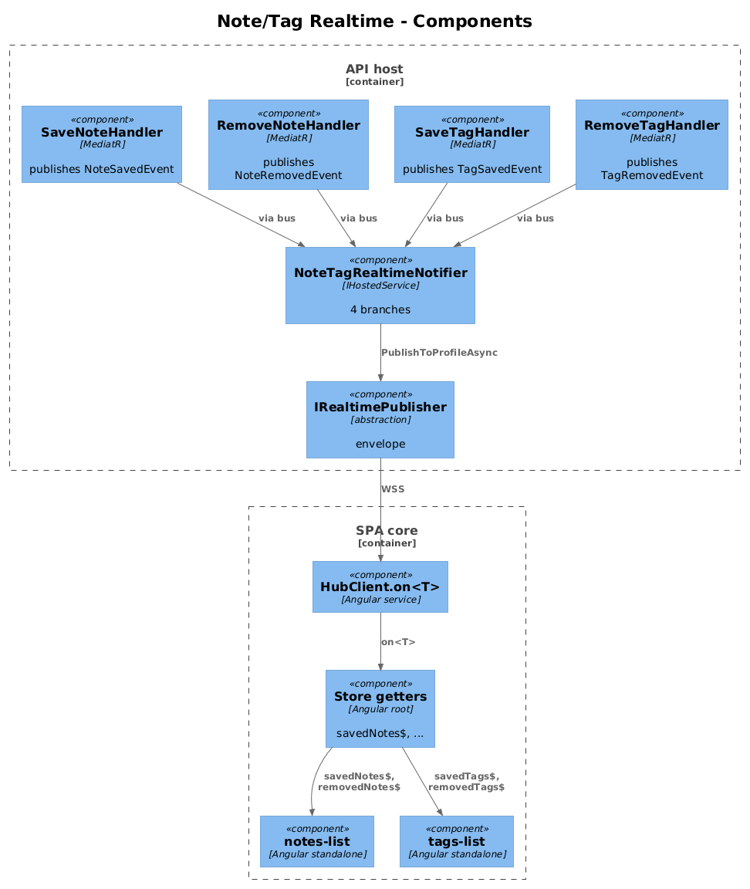
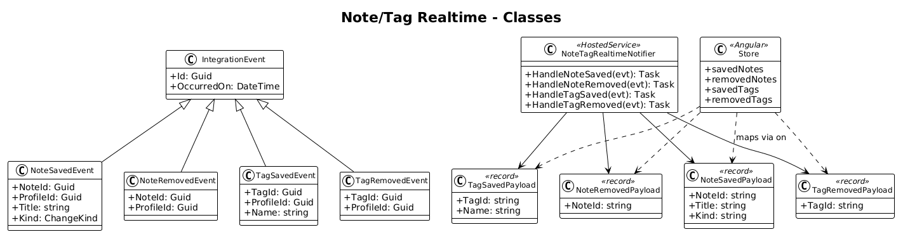
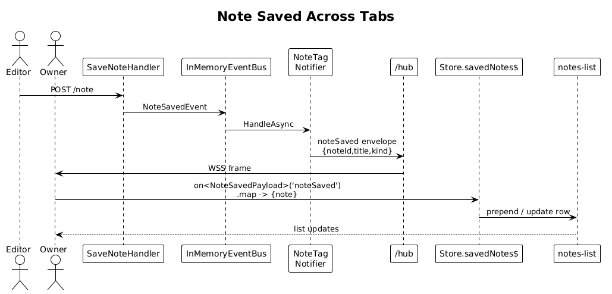
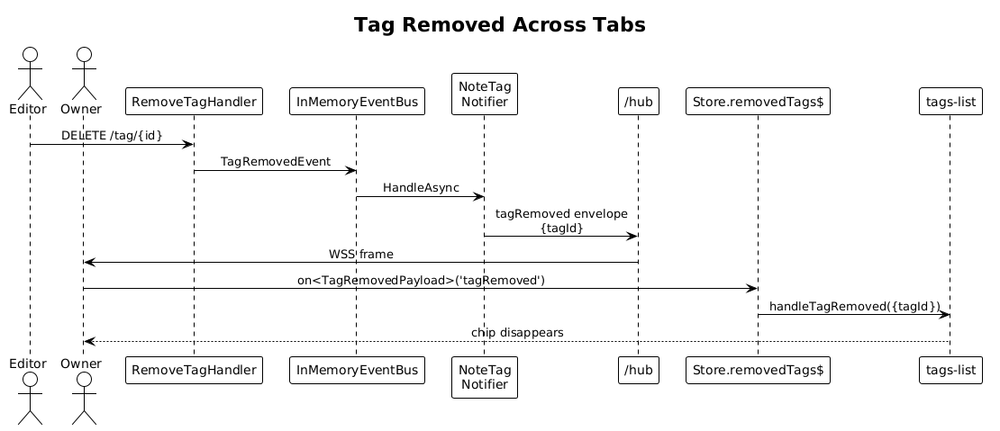

# 18 — Legacy Note/Tag Message Migration — Detailed Design

**Status:** Complete

## 1. Overview

`frontend/projects/commitments-app/src/app/core/store.ts` (lines 30–44) currently filters hub messages by four legacy `type` keys:

```ts
get savedNotes$()    { return this._hubClient.messages$.pipe(filter(x => x.type == '[Note] Saved')); }
get removedNotes$()  { return this._hubClient.messages$.pipe(filter(x => x.type == '[Note] Removed')); }
get savedTags$()     { return this._hubClient.messages$.pipe(filter(x => x.type == '[Tag] Saved')); }
get removedTags$()   { return this._hubClient.messages$.pipe(filter(x => x.type == '[Tag] Removed')); }
```

These streams have always been dead — the backend has no hub. After slices 13–14 land, they are still dead because nobody publishes them. This slice gives notes and tags real push behaviour using the envelope from slice 14, then deletes the legacy `type` filters once the new shape proves out.

The slice is small but covers four message types end-to-end:

1. Backend: integration events `NoteSavedEvent`, `NoteRemovedEvent`, `TagSavedEvent`, `TagRemovedEvent` published from existing note/tag command handlers.
2. Backend: `NoteTagRealtimeNotifier` (`IHostedService`) maps the four events to four envelope publications: `noteSaved`, `noteRemoved`, `tagSaved`, `tagRemoved`.
3. Frontend: `Store` exposes the same four Observables, but each is now built from `hubClient.on<TPayload>('xxx')` and re-shaped to match the legacy `{ payload }` contract its consumers expect.
4. Migration window: the legacy `type` filters stay for one release. After the team confirms no other subscribers reference them (a `git grep '\[Note\] Saved'` returns only `store.ts`), they are removed in a follow-up.

**Actors**

- **Profile owner** — sees notes and tags lists update across tabs without refresh.
- **Frontend developer** — gets a typed `Store.savedNotes$` API.

**Scope boundary**

- Notes and tags only. Other legacy stores (none currently exist) are out of scope.
- The migration changes only the source of `Store.savedNotes$` etc.; consumer components keep their existing subscriptions.
- The legacy `type` keys are not republished by the backend. The plan is "new shape only".

**Radically simple**: four record types, one notifier, four-line `Store.ts` rewrite.

## 2. Architecture

### 2.1 C4 Context



### 2.2 C4 Container



### 2.3 C4 Component



`SaveNoteCommandHandler`, `RemoveNoteCommandHandler`, `SaveTagCommandHandler`, `RemoveTagCommandHandler` (existing files in `backend/src/Modules/Commitments/Features/...`) each publish an `IIntegrationEvent` after `SaveChangesAsync`. `NoteTagRealtimeNotifier` (in the API host) subscribes to all four, maps them to envelope publications via `IRealtimePublisher`. The frontend `Store` rewrites its four getters to use `hubClient.on<T>('xxx')`.

## 3. Component Details

### 3.1 New integration events

Append to `backend/src/Commitments.Shared/IntegrationEvents.cs`:

```csharp
public class NoteSavedEvent : IntegrationEvent
{
    public Guid NoteId { get; set; }
    public Guid ProfileId { get; set; }
    public string Title { get; set; } = null!;
    public ChangeKind Kind { get; set; }   // Created or Updated
}

public class NoteRemovedEvent : IntegrationEvent
{
    public Guid NoteId { get; set; }
    public Guid ProfileId { get; set; }
}

public class TagSavedEvent : IntegrationEvent
{
    public Guid TagId { get; set; }
    public Guid ProfileId { get; set; }
    public string Name { get; set; } = null!;
}

public class TagRemovedEvent : IntegrationEvent
{
    public Guid TagId { get; set; }
    public Guid ProfileId { get; set; }
}
```

### 3.2 Command handler changes

The four existing handlers add the same `_bus.PublishAsync(...)` line after their existing `SaveChangesAsync(ct)`. Pattern:

```csharp
// SaveNoteCommandHandler
public async Task<SaveNoteResponse> Handle(SaveNoteRequest request, CancellationToken ct)
{
    // ...existing save...
    await _context.SaveChangesAsync(ct);
    await _bus.PublishAsync(new NoteSavedEvent {
        NoteId = note.NoteId,
        ProfileId = note.ProfileId,
        Title = note.Title,
        Kind = isNew ? ChangeKind.Created : ChangeKind.Updated
    });
    return new SaveNoteResponse { NoteId = note.NoteId };
}
```

### 3.3 NoteTagRealtimeNotifier

- **Path**: `backend/src/Commitments.Api/Realtime/NoteTagRealtimeNotifier.cs`.
- **Lifetime**: `IHostedService`. Subscribes to all four events on `StartAsync`.
- **Behavior**: One branch per event, all calling `_publisher.PublishToProfileAsync(evt.ProfileId, "xxx", payload)`:

| Source event | Outbound `event` | Payload shape |
|---|---|---|
| `NoteSavedEvent` | `noteSaved` | `{ noteId, title, kind }` |
| `NoteRemovedEvent` | `noteRemoved` | `{ noteId }` |
| `TagSavedEvent` | `tagSaved` | `{ tagId, name }` |
| `TagRemovedEvent` | `tagRemoved` | `{ tagId }` |

- **Why payloads do not include the full `Note` object**: the `Note` aggregate carries `ContentHtml` (potentially many KB after Quill formatting). Sending only the id + minimal fields keeps the WS frame small. The frontend re-fetches the full note via REST when the list item is clicked, which is the existing UX.

### 3.4 Store.ts rewrite (frontend)

- **Path**: existing `frontend/projects/commitments-app/src/app/core/store.ts`.
- **New typed payloads** (defined in the same file or a sibling `realtime-payloads.ts`):

```ts
export interface NoteSavedPayload   { noteId: string; title: string; kind: 'Created' | 'Updated'; }
export interface NoteRemovedPayload { noteId: string; }
export interface TagSavedPayload    { tagId: string; name: string; }
export interface TagRemovedPayload  { tagId: string; }
```

- **Rewritten getters**: keep the public stream type so existing consumers stay unchanged; only the source changes. The legacy stream emitted `{ type, payload }`; the new one emits the typed payload. Wrap with `map` to re-shape:

```ts
get savedNotes$()  {
  return this._hubClient.on<NoteSavedPayload>('noteSaved')
    .pipe(map(p => ({ note: { noteId: p.noteId, title: p.title } })));
}
get removedNotes$() {
  return this._hubClient.on<NoteRemovedPayload>('noteRemoved')
    .pipe(map(p => ({ noteId: p.noteId })));
}
get savedTags$()   {
  return this._hubClient.on<TagSavedPayload>('tagSaved')
    .pipe(map(p => ({ tag: { tagId: p.tagId, name: p.name } })));
}
get removedTags$() {
  return this._hubClient.on<TagRemovedPayload>('tagRemoved')
    .pipe(map(p => ({ tagId: p.tagId })));
}
```

- **Why preserve `{ note }` / `{ tag }` shape on `savedNotes$` / `savedTags$`**: existing components (notes-list, tags-list) consume `payload.note` / `payload.tag`. Preserving that in the wrapper means no consumer changes — single PR scope.

### 3.5 Legacy filter retirement plan

After this slice ships:

1. Run `git grep '\[Note\] Saved'` and `git grep '\[Tag\]'` across `frontend/`. Confirm only `store.ts` references them.
2. In a follow-up PR (not this slice), delete the four `x.type == '[...]'` filter lines and the legacy filter pipe imports.
3. Backend never publishes the legacy keys, so the streams have always been empty post-slice-13. No risk to other listeners.

The plan is documented in this design but the deletion is **not** part of this slice's screenshot; the screenshot shows the new shape working.

## 4. Data Model

### 4.1 Class Diagram



### 4.2 Entity Descriptions

- **NoteSavedEvent / NoteRemovedEvent / TagSavedEvent / TagRemovedEvent** — integration events in `Commitments.Shared`.
- **NoteTagRealtimeNotifier** — IHostedService bridging events to `IRealtimePublisher`.
- **NoteSavedPayload / NoteRemovedPayload / TagSavedPayload / TagRemovedPayload** — wire DTOs (records on backend, interfaces on frontend).
- **Store** — Angular root-scoped service; rewritten getters.

No DB migration. No new tables.

## 5. Key Workflows

### 5.1 Note saved across tabs



1. User in browser **B** edits a note and saves.
2. SPA in **B** issues `POST /api/v1.0/note`.
3. `SaveNoteCommandHandler` saves and publishes `NoteSavedEvent`.
4. `NoteTagRealtimeNotifier` publishes `noteSaved` envelope to `profile:{id}`.
5. Browser **A**'s `HubClient.on<NoteSavedPayload>('noteSaved')` emits.
6. `Store.savedNotes$` re-shapes to `{ note: {...} }` — existing notes-list subscriber prepends or updates the row.
7. **Screenshot for ATDD**: notes list in **A** reflects the new title within < 1 second of saving in **B**, no XHR fired.

### 5.2 Tag removed



1. User in **B** removes a tag.
2. `RemoveTagCommandHandler` publishes `TagRemovedEvent` after delete commits.
3. `NoteTagRealtimeNotifier` publishes `tagRemoved { tagId }`.
4. **A**'s `Store.removedTags$` emits `{ tagId }`.
5. The tags chip list in **A** removes the chip.

## 6. API Contracts

```json
// noteSaved
{ "noteId": "...", "title": "Weekly review", "kind": "Updated" }

// noteRemoved
{ "noteId": "..." }

// tagSaved
{ "tagId": "...", "name": "weekly" }

// tagRemoved
{ "tagId": "..." }
```

Each is wrapped in the standard envelope (`schemaVersion: 1`, `event`, `profileId`, `messageId`, ...).

## 7. Security Considerations

- Profile-scoped publication only. Notes and tags are profile-owned data.
- The wire payload deliberately omits `contentHtml` and any free-form rich-text content. Any consumer needing that content must call REST (where existing sanitisation runs).
- `title` is included; it is already user-supplied and rendered in the existing notes list. The title is not HTML-escaped on the wire — it is rendered through Angular's text interpolation (auto-escaping). Verified by inspecting `notes-list.component.html`.

## 8. Open Questions

1. **Should `noteSaved` carry full `Note` for tabs that already have it cached?** Trade-off: payload size vs. round-trip. Stick with id-only; UX latency on click-to-open is already snappy via REST.
2. **What about notes-by-tag views?** When a tag is added/removed on a note, the user's `notes-by-tag/{tag}` page may need to refresh. The simplest extension: publish a `noteTagsChanged { noteId, tagIds }` envelope from `AddTagToNote` / `RemoveTagFromNote` handlers. Defer; not needed for this slice's ATDD goal.
3. **Migration window length.** Legacy filters stay for one release. If no consumer ever existed, retire immediately in this slice. Confirm via grep before deletion.
4. **Concurrent edits.** If two tabs save the same note within 100 ms of each other, two `noteSaved` envelopes arrive in close succession. The list update is idempotent (same id replaces same item), so no harm.
