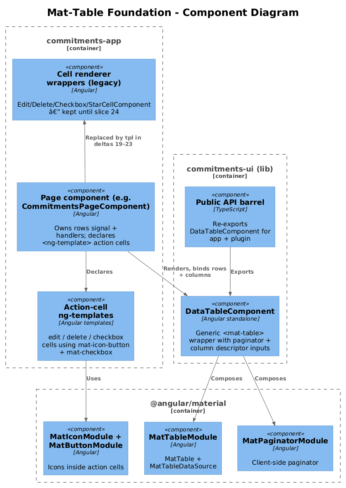
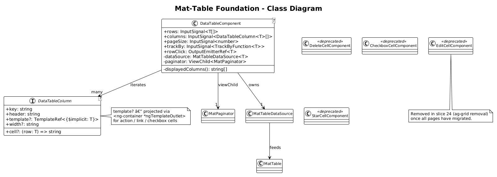
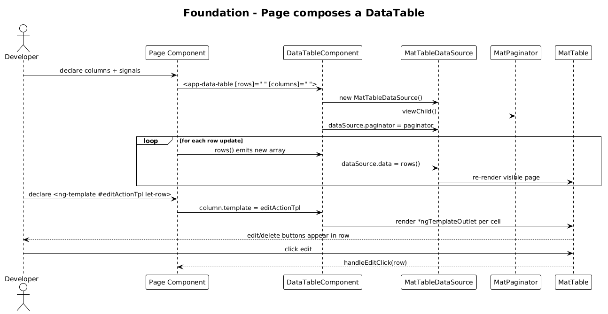

# Mat-Table Foundation — Detailed Design

**Status:** Draft

**Traces to:** Internal refactor — no L1/L2 surface change. Supports L2-005, L2-006, L2-007, L2-009, L2-012, L2-014, L2-015, L2-016, L2-019, L2-022 (every page that currently renders an `<ag-grid-angular>`).

## 1. Overview

This slice introduces a **single shared table primitive** for the `commitments-app` frontend so that every catalog and tracking page can be migrated off `ag-grid-angular` onto `@angular/material/table` (`MatTableModule`) without each page re-discovering its own column / action / pagination conventions.

It also retires the four ag-grid-specific cell-renderer wrappers (`EditCellComponent`, `DeleteCellComponent`, `CheckboxCellComponent`, `StarCellComponent`), which exist only to satisfy the `ICellRendererAngularComp` contract, and replaces them with three plain Angular templates that any `<mat-table>` cell can use directly.

**Actors:** all internal page authors. No end-user-visible flow on this slice — by itself it adds no route.

**Scope boundary:** introduces the shared component + retires the renderer wrappers + flips the global ag-grid CSS imports off behind a feature flag. The 11 page migrations and the package-removal step live in deltas 19 — 24.

## 2. Architecture

### 2.1 C4 Component


The new `DataTableComponent` lives in the existing `commitments-ui` library (alongside `PrimaryHeaderComponent`) so the dashboard plugin can also consume it. The action-cell templates stay in `commitments-app` because they couple to `MatIconModule` icons that are application-specific.

## 3. Component Details

### 3.1 DataTableComponent (commitments-ui, **new**)

Path: `frontend/projects/commitments-ui/src/lib/data-table/data-table.component.ts`

A thin generic wrapper around `MatTableModule + MatPaginatorModule + MatSortModule`. Owns nothing but presentation.

**Public API** (signal inputs):
- `rows = input<T[]>([])` — driven by the parent's signal.
- `columns = input.required<DataTableColumn<T>[]>()`
- `pageSize = input<number>(5)` — defaults to the existing ag-grid value.
- `trackBy = input<TrackByFunction<T>>(...defaultIdentity)`

**Outputs:**
- `rowClick = output<T>()` — for clickable cells (used by Notes navigation).

**Column descriptor:**

```ts
export interface DataTableColumn<T> {
  key: string;                              // column id (matchedDef matColumnDef)
  header: string;                           // already-translated header text
  cell?: (row: T) => string;                // text accessor (default: row[key])
  template?: TemplateRef<{ $implicit: T }>; // optional cell template
  width?: string;                           // CSS width (e.g. '50px')
}
```

**Internals:**
- Builds a `MatTableDataSource<T>` in an `effect()` whenever `rows()` changes.
- Wires `MatPaginator` via `viewChild()`.
- The template iterates `columns()`, emitting a `<ng-container matColumnDef>` per entry; `displayedColumns` is computed as `columns().map(c => c.key)`.
- For columns with a `template`, projects the template through `<ng-container *ngTemplateOutlet="col.template; context: { $implicit: row }">`. Otherwise renders `col.cell(row) ?? row[col.key]`.

**Why a wrapper rather than raw `<mat-table>` per page?**
- Eleven pages share the same shape: data signal → 1 — N text columns → optional edit + delete actions → 5-row paginator. A wrapper keeps the migration mechanical and the diff small.
- Keeps the door open for cross-cutting concerns (loading state, empty state, ARIA) in one file.

### 3.2 Action-cell templates (commitments-app, **new**)

Three plain `<ng-template>` blocks declared on the consuming page:

- `editActionTpl` — `<button mat-icon-button (click)="handleEditClick(row)"><mat-icon>edit</mat-icon></button>`
- `deleteActionTpl` — `<button mat-icon-button (click)="handleRemoveClick(row)"><mat-icon>close</mat-icon></button>`
- `checkboxCellTpl` — `<mat-checkbox [ngModel]="row.value" (ngModelChange)="...">`

Used pattern (rendered inside the page template):

```html
<app-data-table [rows]="commitments()" [columns]="columns" [pageSize]="5"></app-data-table>

<ng-template #editActionTpl let-row>
  <button mat-icon-button (click)="handleEditClick(row)"><mat-icon>edit</mat-icon></button>
</ng-template>
<ng-template #deleteActionTpl let-row>
  <button mat-icon-button (click)="handleRemoveClick(row)"><mat-icon>close</mat-icon></button>
</ng-template>
```

Templates are wired into the `DataTableColumn` descriptor via `viewChild()` references.

### 3.3 Renderer wrappers (commitments-app, **deleted in 24**)

`EditCellComponent`, `DeleteCellComponent`, `CheckboxCellComponent`, `StarCellComponent` are not deleted in this slice — they stay so partial migrations can co-exist with un-migrated pages. The package-removal slice (24) deletes them once every page has flipped to the new templates.

### 3.4 Global stylesheet (commitments-app)

`frontend/projects/commitments-app/src/styles.scss` currently imports:

```scss
@import 'ag-grid-community/styles/ag-grid.css';
@import 'ag-grid-community/styles/ag-theme-material.css';
```

These imports stay until slice 24 (so partially-migrated builds still render correctly). No new global stylesheet is needed — `MatTableModule` styling comes from the Material theme already imported via `@use './styles/theme.scss'`.

## 4. Data Model

### 4.1 Class Diagram


The class diagram shows the new `DataTableComponent` and the `DataTableColumn<T>` descriptor, alongside the existing renderer wrappers that it eventually replaces.

### 4.2 No domain entities

This slice introduces no domain entities or DB schema. It is a pure frontend primitive.

## 5. Key Workflows

### 5.1 Page composes a DataTable


1. A page component declares its `columns: DataTableColumn<T>[]` with text columns and optional `template:` references to in-page `<ng-template>` blocks.
2. `<app-data-table [rows]="signal()" [columns]="columns">` is rendered.
3. `DataTableComponent` builds a `MatTableDataSource`, registers the paginator, and emits column defs.
4. For each row, action templates fire `(click)` events that bubble up to the page's existing `handleEditClick` / `handleRemoveClick` handlers — the same handlers ag-grid currently calls. **No service / store changes.**

## 6. API Contracts

None — frontend-only slice.

## 7. Security Considerations

- The wrapper passes column accessors through Angular's text-binding pipeline (`{{ }}`), preserving the framework's automatic XSS escaping. Ag-grid's default cell rendering also escaped, so there is no regression.
- The Tags page currently uses `editable: true` on the name column, which lets the cell value mutate in place. The mat-table replacement (slice 22) uses `<input matInput>` inside an explicit edit cell — this is **more** restrictive than ag-grid's free-form editor and is preferable.

## 8. ATDD Slices

1. **Slice A — DataTableComponent skeleton:** ship `DataTableComponent` in `commitments-ui`, exported from the public API barrel, with a Storybook story that renders 3 hard-coded rows + edit + delete actions. Spec: stories render without console errors; clicking edit/delete fires the corresponding output.
2. **Slice B — wire one consumer:** integrate `DataTableComponent` into `ProfilesPageComponent` end-to-end as the proof-of-concept (this is also the first page slice — see design 19). Once this slice is green, the remaining ten pages follow the same pattern.

## 9. Open Questions

- **Sorting / filtering**: ag-grid currently exposes both implicitly. None of the 11 pages enable column-level sort UI today, so the wrapper does **not** include `MatSort` in v1. Add it later if a page needs it.
- **Server-side pagination**: every current page loads its full collection up-front. Stay with client-side pagination. Revisit when any single endpoint exceeds ~1k rows.
- **Virtualisation**: not needed at current row counts (typical page is < 100 rows). Defer.
