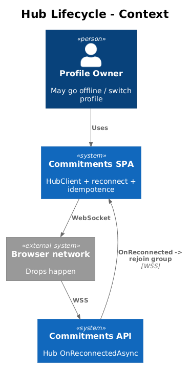
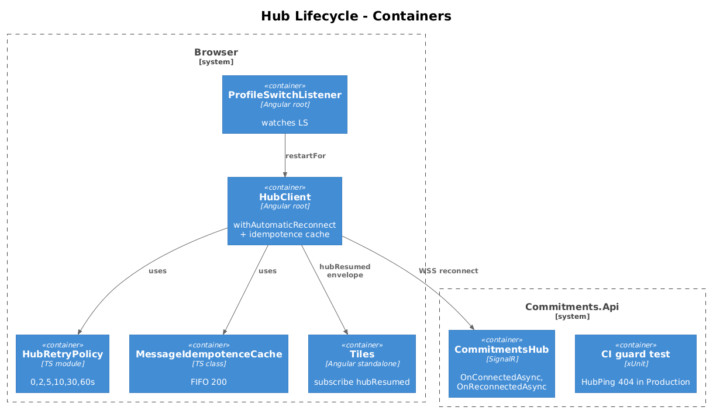
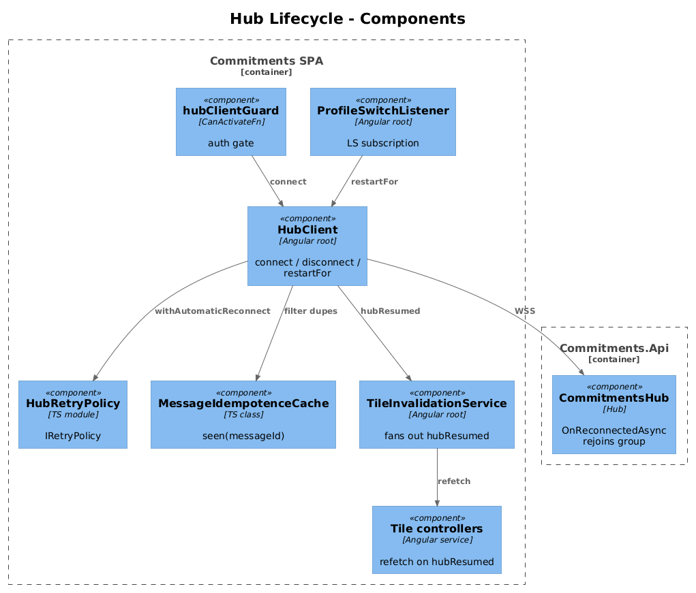
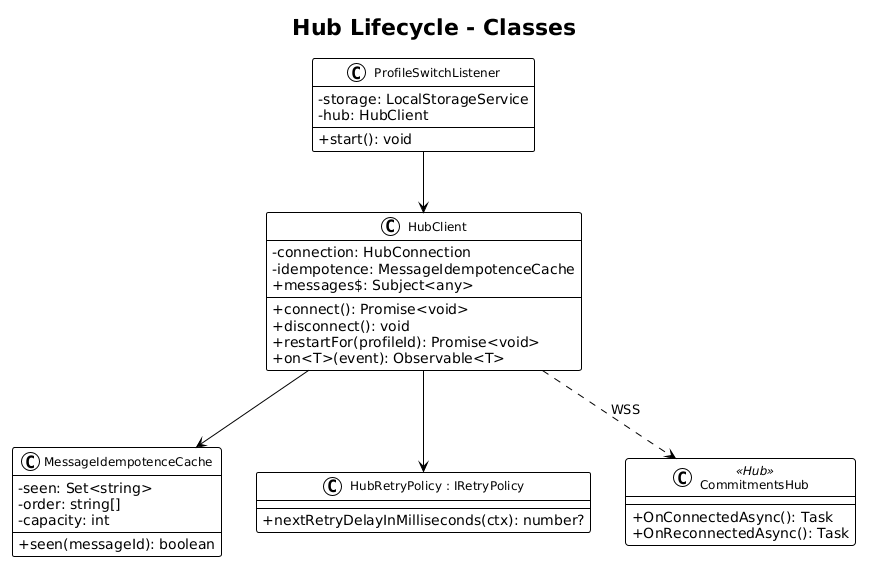
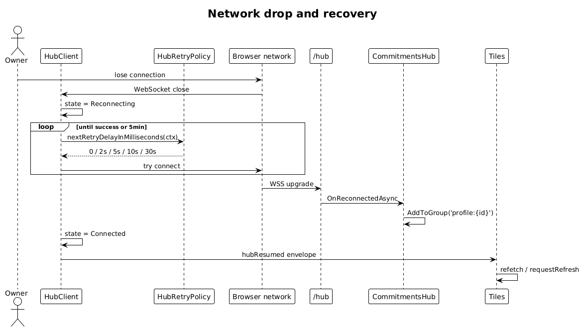
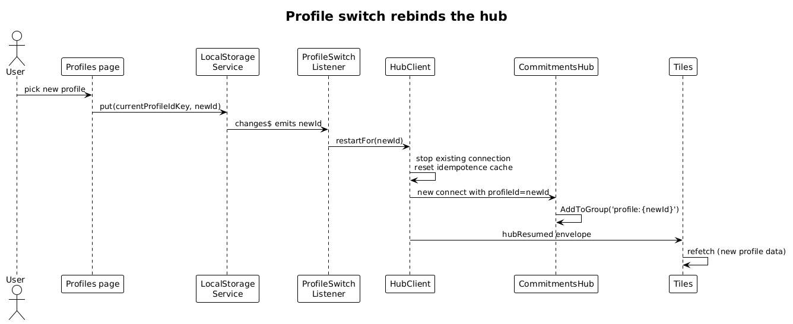
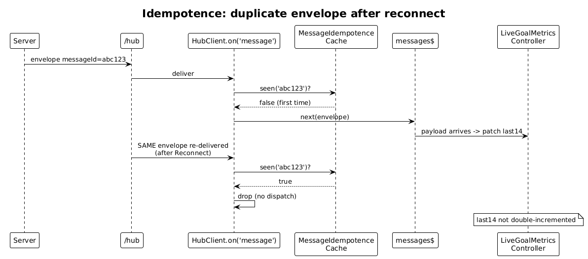

# 19 — Hub Lifecycle and Reconnect — Detailed Design

**Status:** Accepted

## 1. Overview

Slices 13–18 cover the happy path: the user logs in, the hub connects, messages flow. Real production sessions are messier. Networks drop. Users sleep their laptops. JWTs expire. A profile switch must rebind the connection to a new group. A reconnect after 30 seconds must not double-count progress because the same `goalProgressUpdated` envelope re-arrives.

This slice closes those operational gaps:

1. **Lifecycle** — connect on auth, stop on logout, rebuild the connection if the JWT or active profile changes.
2. **Reconnect** — let `@microsoft/signalr`'s built-in `withAutomaticReconnect()` handle drops, with a custom retry policy capped at 60 s. After reconnect, server-side group membership is **lost**; the hub's `OnReconnectedAsync` rejoins the profile group.
3. **Profile rebind** — when the active profile changes (already a UI flow), tear down the connection and rebuild it. Server group membership is keyed on the connection-id, so a rebuild is the simplest correct behaviour.
4. **Idempotence** — frontend tiles that mutate state from a push (today only `LiveGoalMetricsController._patchTodayInLast14`) deduplicate by `messageId`. A small `MessageIdempotenceCache` (size 200, FIFO) lives on `HubClient`.
5. **Production guardrail** — assert at startup that `HubPingController` (slice 13) is not registered when `IHostEnvironment.IsProduction()`, with a smoke test in CI.

**Actors**

- **Profile owner** — sees the LIVE badge survive a brief network drop; sees the tile resume updating without restart.
- **QA** — runs the reconnect scenario by toggling DevTools "Offline" and back online.

**Scope boundary**

- One reconnect retry policy, applied to all hub connections.
- One idempotence cache, scoped to the `HubClient` instance.
- Profile switch is a frontend trigger (Profiles page already calls `LocalStorageService.put({ name: currentProfileIdKey, value: id })`); this slice listens for the change.
- JWT expiry handling is **out of scope** for this slice's reconnect logic — slice would grow too large. It is mentioned in §8 Open Questions; for now the AuthInterceptor's existing 401 → re-login flow handles JWT expiry by routing the user to login, which already triggers `hubClient.disconnect()` via `pages/login`.

**Radically simple**: small additions in three frontend files (`hub-client.ts`, `hub-client-guard.ts`, `current-profile.service.ts` or equivalent), one override on `CommitmentsHub`, one CI guard test.

## 2. Architecture

### 2.1 C4 Context



### 2.2 C4 Container



### 2.3 C4 Component



`HubClient` keeps its current shape but gains: (1) a configured `withAutomaticReconnect(retryPolicy)`, (2) an `onreconnected` handler that re-emits a synthetic `'hubResumed'` event so tiles can request a refresh, (3) a `MessageIdempotenceCache`, (4) a `restartFor(profileId)` method that disconnects and reconnects when the active profile changes. `CommitmentsHub` (from slice 13) overrides `OnReconnectedAsync` to add the connection to the profile group again. A frontend `ProfileSwitchListener` (Angular service) watches `localStorage` for `currentProfileIdKey` changes and calls `hubClient.restartFor(newId)`.

## 3. Component Details

### 3.1 Reconnect retry policy

- **Path**: `frontend/projects/commitments-app/src/app/core/hub-retry-policy.ts` (new file).
- **Shape**: implements `IRetryPolicy` from `@microsoft/signalr`. Steps: 0 ms, 2 s, 5 s, 10 s, 30 s, then 60 s thereafter. Capped at 5 minutes total wall time before giving up — at which point `HubClient.connection.state` becomes `Disconnected` and the user sees a small banner ("realtime updates paused, refresh to reconnect").

```ts
export const HubRetryPolicy: IRetryPolicy = {
  nextRetryDelayInMilliseconds: ctx => {
    const seq = [0, 2_000, 5_000, 10_000, 30_000];
    if (ctx.previousRetryCount < seq.length) return seq[ctx.previousRetryCount];
    if (ctx.elapsedMilliseconds > 5 * 60_000) return null; // give up
    return 60_000;
  }
};
```

### 3.2 HubClient changes

- **Path**: existing `frontend/projects/commitments-app/src/app/core/hub-client.ts`.
- **Changes**:

```ts
// inside connect():
this._connection = new HubConnectionBuilder()
  .withUrl(`${baseUrl}hub?token=${jwt}&profileId=${profileId}`, options)
  .withAutomaticReconnect(HubRetryPolicy)
  .build();

this._connection.onreconnected(() => {
  this._ngZone.run(() => this.messages$.next({
    schemaVersion: 1,
    messageId: crypto.randomUUID(),
    event: 'hubResumed',
    profileId,
    occurredAt: new Date().toISOString(),
    correlationId: null,
    payload: {}
  } as RealtimeMessage<{}>));
});

this._connection.on('message', value => this._ngZone.run(() => {
  if (this._idempotence.seen(value?.messageId)) return;
  this.messages$.next(value);
}));
```

- **`restartFor(profileId)`**: a new public method. Disconnects (calls `connection.stop()` and clears `_connect` like the existing `disconnect()`), then reconnects with the new id. Tiles see the same lifecycle as a network reconnect; their `requestRefresh()` after `'hubResumed'` rebinds them.

### 3.3 MessageIdempotenceCache

- **Path**: `frontend/projects/commitments-app/src/app/core/message-idempotence-cache.ts`.
- **Shape**:

```ts
export class MessageIdempotenceCache {
  private readonly _seen = new Set<string>();
  private readonly _order: string[] = [];
  constructor(private readonly _capacity = 200) {}

  seen(messageId: string | null | undefined): boolean {
    if (!messageId) return false;
    if (this._seen.has(messageId)) return true;
    this._seen.add(messageId);
    this._order.push(messageId);
    if (this._order.length > this._capacity) {
      const drop = this._order.shift()!;
      this._seen.delete(drop);
    }
    return false;
  }
}
```

- **Why size 200**: cheap, covers a worst-case burst far longer than any realistic reconnect storm. FIFO eviction prevents unbounded growth.
- **Where to apply**: in `HubClient.on('message', ...)` *before* dispatch to `messages$`. Every consumer benefits without per-tile wiring.
- **Edge case**: legacy `[Note] Saved`-style messages have no `messageId`. The cache's `seen(undefined) === false` short-circuits, so legacy messages are always delivered (matches today's behaviour). After slice 18 retires the legacy keys, all messages carry `messageId`.

### 3.4 hubClientGuard changes

- **Path**: existing `frontend/projects/commitments-app/src/app/core/hub-client-guard.ts`.
- **Change**: read the active `profileId` from `LocalStorageService` and pass it through to `connect(profileId, jwt)`. Today the guard calls `connect()` with no args; the connect URL is constructed inside `HubClient` using `LocalStorageService` directly. Either keeps working; recommendation is to pass them in to make `HubClient` testable in isolation.

### 3.5 ProfileSwitchListener

- **Path**: `frontend/projects/commitments-app/src/app/core/profile-switch-listener.ts`.
- **Lifetime**: registered in `app.config.ts` providers, runs an `APP_INITIALIZER`-style subscription.
- **Behavior**: subscribes to a `LocalStorageService.changes$<string>(currentProfileIdKey)` observable (added in this slice if it does not exist). On change, calls `hubClient.restartFor(newProfileId)`.

```ts
@Injectable({ providedIn: 'root' })
export class ProfileSwitchListener {
  private readonly _storage = inject(LocalStorageService);
  private readonly _hub = inject(HubClient);

  start(): void {
    this._storage.changes$<string>(currentProfileIdKey)
      .pipe(distinctUntilChanged())
      .subscribe(id => { if (id) this._hub.restartFor(id); });
  }
}
```

If `LocalStorageService` does not yet expose a `changes$` Observable, add a small `Subject<KeyChange>` inside the service that fires on every `put({name})` call. Five lines.

### 3.6 CommitmentsHub.OnReconnectedAsync

- **Path**: existing `backend/src/Commitments.Api/Hubs/CommitmentsHub.cs` (slice 13).
- **Add**:

```csharp
public override async Task OnReconnectedAsync()
{
    var profileId = _http.HttpContext?.GetProfileId();
    if (profileId is { } pid && pid != Guid.Empty)
    {
        var group = $"profile:{pid:D}".ToLowerInvariant();
        await Groups.AddToGroupAsync(Context.ConnectionId, group);
        _log.LogInformation("Hub reconnect: {ConnectionId} re-joined {Group}",
            Context.ConnectionId, group);
    }
    await base.OnReconnectedAsync();
}
```

- **Why**: SignalR's automatic reconnect re-uses the same connection id when possible (KeepAlive), but on a fresh connection id the server has no group membership for it. Adding to the group on reconnect is required for the message stream to continue.

### 3.7 'hubResumed' synthetic event

- **Why on the frontend, not the backend**: the backend has no notion of "this client just reconnected" beyond `OnReconnectedAsync`. The synthetic envelope lets tiles uniformly handle "I may have missed messages, refresh me" without each tile knowing about reconnect mechanics.
- **Tile reaction**: any tile may subscribe via `hubClient.on('hubResumed')` and call `requestRefresh()` (or refetch its REST snapshot). Slice 16's `TileInvalidationService` can also expose a `resumed$` Observable that fans out to every dataset for a one-shot refetch.

### 3.8 Production guardrail for HubPingController

- **Path**: `backend/tests/Commitments.Api.Tests/HubPingControllerProductionTests.cs` (new test, follows the `WebApplicationFactory` pattern already used in the test project).
- **Shape**:

```csharp
[Fact]
public async Task HubPing_is_not_registered_in_Production()
{
    using var factory = new WebApplicationFactory<Program>()
        .WithWebHostBuilder(b => b.UseEnvironment("Production"));
    using var client = factory.CreateClient();
    var resp = await client.PostAsync("/api/v1.0/dev/hub-ping",
        new StringContent("{}", Encoding.UTF8, "application/json"));
    Assert.Equal(HttpStatusCode.NotFound, resp.StatusCode);
}
```

This passes only if slice 13's `HubPingController` registration is wrapped in `if (app.Environment.IsDevelopment())`.

## 4. Data Model

### 4.1 Class Diagram



### 4.2 Entity Descriptions

- **HubRetryPolicy** — implements `@microsoft/signalr.IRetryPolicy`. Pure function over retry context.
- **MessageIdempotenceCache** — bounded FIFO `Set<string>` of recent `messageId`s.
- **ProfileSwitchListener** — Angular service; subscribes to `LocalStorageService.changes$`.
- **HubResumedEnvelope** — synthetic `RealtimeMessage<{}>` with `event: 'hubResumed'`, generated client-side on reconnect.

No DB tables, no migrations.

## 5. Key Workflows

### 5.1 Network drop and recovery



1. The browser loses network (DevTools → Network → Offline, or real disconnect).
2. SignalR's heartbeat fails. `HubConnection.state → Reconnecting`. `withAutomaticReconnect(HubRetryPolicy)` schedules retries: 0 ms, 2 s, 5 s, 10 s, 30 s.
3. Network returns at second-7. Next retry succeeds; `HubConnection.state → Connected`. New connection id assigned by the server.
4. Server's `CommitmentsHub.OnReconnectedAsync` re-adds the new connection id to `profile:{id}`.
5. Frontend `onreconnected` handler emits the synthetic `hubResumed` envelope.
6. `LiveGoalMetricsController.subscribe('hubResumed')` (added in this slice) calls `_service.getCurrent(_goalId)` to refresh.
7. **Screenshot for ATDD**: DevTools showing the WebSocket reconnect → live tile updating again with no manual refresh.

### 5.2 Profile switch



1. User selects a new profile in the Profiles page.
2. `LocalStorageService.put({ name: currentProfileIdKey, value: newId })` fires.
3. `ProfileSwitchListener.start()` (subscribed at app init) sees the change.
4. `hubClient.restartFor(newId)`: stop current connection, build a new URL with the new profile id, reconnect.
5. New connection lands in `profile:{newId}` group.
6. Tiles refetch on `'hubResumed'` so they show the new profile's data.

### 5.3 Duplicate message arrives after reconnect



1. Server publishes `goalProgressUpdated` envelope `messageId = abc123` while the client is in `Reconnecting`.
2. SignalR may buffer the frame and re-deliver it after reconnect (depends on transport).
3. `HubClient.on('message')` calls `_idempotence.seen('abc123')`. First arrival → `false`, dispatched. Second arrival → `true`, dropped.
4. The Live tile's `_patchTodayInLast14(count)` runs once; the `last14` array is not double-incremented.

## 6. API Contracts

No REST changes. One new wire event:

```json
// hubResumed (client-synthetic, never published by the server)
{
  "schemaVersion": 1,
  "messageId": "...",
  "event": "hubResumed",
  "profileId": "...",
  "occurredAt": "...",
  "correlationId": null,
  "payload": {}
}
```

## 7. Security Considerations

- `restartFor(profileId)` builds a URL with the new profile id but keeps the existing JWT. The backend's existing JWT-to-profile gate (the `403` rule from L2-038) rejects connections where the JWT user does not own the requested profile. A malicious frontend that swaps `profileId=` in the URL hits the same gate.
- The idempotence cache is per-`HubClient` instance and lives in memory only. It cannot be poisoned across sessions; on `disconnect()`, the cache is **not** cleared (deliberate — a drop+restore must still dedupe). On `restartFor()` it is cleared, because the new connection is for a new profile context.
- The CI guard test prevents the dev-only `hub-ping` endpoint from accidentally shipping. A reviewer might still wrap registration in `IsDevelopment()` *and* register a route in production by mistake; the test catches both.

## 8. Open Questions

1. **JWT expiry mid-session.** When the JWT expires, the next REST call gets `401` and the AuthInterceptor routes to login (existing behaviour). The hub connection itself does not refresh tokens. After login, the user lands back on the dashboard, the guard runs `connect()` again, and the new JWT is in the URL. Acceptable; no work in this slice. Future improvement: subscribe to `connection.onclose` with reason "401" and trigger re-auth proactively.
2. **`hubResumed` granularity.** Right now every tile subscribed to `hubResumed` refetches. If 8 tiles fan out one round-trip each, the dashboard double-loads on a brief network blip. Acceptable; the events are user-rare and the snapshot endpoints are cheap. If profiling shows it is a problem, batch via `bufferTime(500ms)` at the `TileInvalidationService` layer.
3. **Idempotence cache size.** 200 is a guess. Validate with a probe: log a counter of "message dropped by cache" once per minute in dev for one week. If 200 ever evicts a still-needed id, raise it.
4. **Lost messages during reconnect.** If the user is offline for 60 seconds and 30 events fired, those events are not delivered after reconnect (SignalR does not buffer for absent clients). The `hubResumed` refetch covers this. The trade-off vs. server-side per-client message buffering: complexity of buffering is much greater; the refetch path is correct and simple. Stick with refetch.
