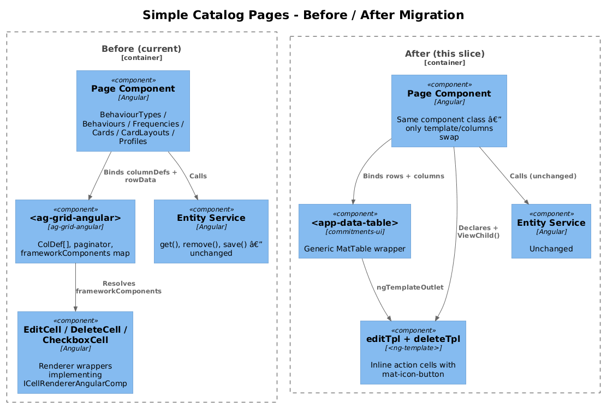
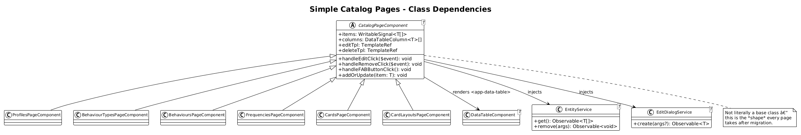
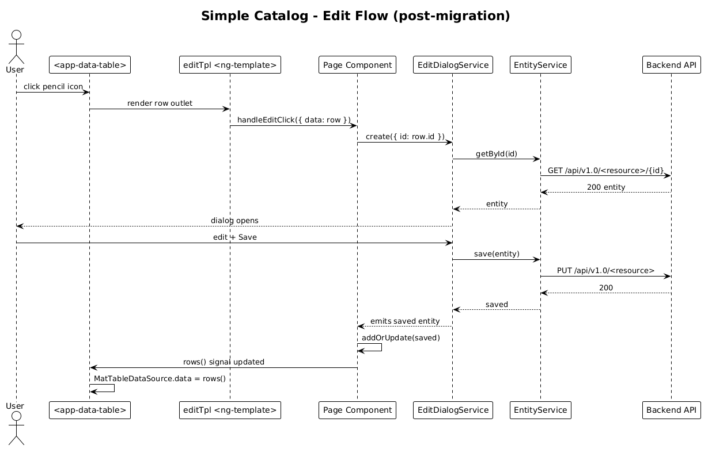

# Simple Catalog Mat-Tables — Detailed Design

**Status:** Draft

**Traces to:** L2-005 (Behaviours), L2-006 (Behaviour Types), L2-007 (Frequencies), L2-019 (Cards), L2-022 (Card Layouts), L2-003 (Profiles).

## 1. Overview

Six pages share an identical shape: one `Name` column, an `edit` icon-cell, a `delete` icon-cell, a 5-row paginator, and a floating Add button. They all use ag-grid today and they all migrate to `<app-data-table>` (delta 18) in this slice with mechanically identical diffs.

| Page | Component | Service | Edit dialog | Delete handler |
|---|---|---|---|---|
| Profiles | `ProfilesPageComponent` | `ProfileService` | `CreateProfileDialogService` | `handleRemove` |
| Behaviour Types | `BehaviourTypesPageComponent` | `BehaviourTypeService` | `EditBehaviourTypeDialogService` | `handleRemoveClick` |
| Behaviours | `BehavioursPageComponent` | `BehaviourService` | `EditBehaviourDialogService` | `handleRemoveClick` |
| Frequencies | `FrequenciesPageComponent` | `FrequencyService` | `EditFrequencyDialogService` | `handleRemoveClick` |
| Cards | `CardsPageComponent` | `CardService` | `EditCardDialogService` | `handleRemove` |
| Card Layouts | `CardLayoutsPageComponent` | `CardLayoutService` | `EditCardLayoutDialogService` | `handleRemoveClick` |

> **Profiles** is the only one without an edit action — its column list omits the edit cell template and shrinks to `[name, delete]`.

**Actors:** authenticated end user managing their catalogs.

**Scope boundary:** template + component refactor only. Services, dialog services, and route configuration are untouched. The embedded `<app-frequency-editor>` inside `frequencies-editor.component.html` is a separate ag-grid surface — see delta 23.

## 2. Architecture

### 2.1 C4 Component


The before/after picture is identical for all six pages: the `<ag-grid-angular>` instance is replaced 1:1 by `<app-data-table>` from `commitments-ui`, and the `frameworkComponents` registry of renderer wrappers collapses to in-template `<ng-template>` blocks.

## 3. Component Details

### 3.1 Common page diff

For every page in the table above:

**Imports:**
- Remove: `AgGridModule`, `ColDef`, `GridApi` from `ag-grid-community`, the renderer wrappers (`EditCellComponent`, `DeleteCellComponent`, `CheckboxCellComponent`).
- Add: `DataTableComponent` from `@commitments/ui`, plus `DataTableColumn` type.

**Template (`*.component.html`)**:

Replace:
```html
<ag-grid-angular class="ag-theme-material"
                 [columnDefs]="columnDefs"
                 [rowData]="items()"
                 [pagination]="true"
                 [paginationPageSize]="5"
                 [frameworkComponents]="frameworkComponents"
                 (gridReady)="onGridReady($event)">
</ag-grid-angular>
```

With:
```html
<app-data-table [rows]="items()" [columns]="columns" [pageSize]="5"></app-data-table>

<ng-template #editTpl let-row>
  <button mat-icon-button (click)="handleEditClick({ data: row })">
    <mat-icon>edit</mat-icon>
  </button>
</ng-template>
<ng-template #deleteTpl let-row>
  <button mat-icon-button (click)="handleRemoveClick({ data: row })">
    <mat-icon>close</mat-icon>
  </button>
</ng-template>
```

The `{ data: row }` envelope keeps the existing handler signatures (`$event.data`) untouched, which keeps the diff small and the existing unit-test expectations valid.

**Component class (`*.component.ts`)**:

Replace `columnDefs: ColDef[]` and `frameworkComponents: any` with:

```ts
@ViewChild('editTpl', { static: true }) editTpl!: TemplateRef<{ $implicit: BehaviourType }>;
@ViewChild('deleteTpl', { static: true }) deleteTpl!: TemplateRef<{ $implicit: BehaviourType }>;

public columns: DataTableColumn<BehaviourType>[] = [
  { key: 'name', header: 'Name', cell: row => row.name },
  { key: 'edit', header: '', template: this.editTpl, width: '50px' },
  { key: 'delete', header: '', template: this.deleteTpl, width: '50px' },
];
```

Drop `_gridApi`, `onGridReady`, `localeText`. The signal still owns the data; `addOrUpdate` and `remove*` handlers still exist verbatim.

### 3.2 Profiles edge-case

`ProfilesPageComponent` has no edit action and no `EditCellComponent` import today. Apply the diff above with the edit cell omitted:

```ts
public columns: DataTableColumn<Profile>[] = [
  { key: 'name', header: 'Name', cell: r => r.name },
  { key: 'delete', header: '', template: this.deleteTpl, width: '40px' },
];
```

## 4. Data Model

### 4.1 Class Diagram


No domain entities change. The class diagram shows the new dependency graph: each page now depends on `DataTableComponent` instead of `AgGridModule` + four renderer wrappers.

## 5. Key Workflows

### 5.1 Edit flow (representative)


Identical to the existing flow — only the rendering layer changes.

1. User clicks the pencil icon in a row.
2. `editTpl` fires `(click)`, calls `handleEditClick({ data: row })`.
3. The handler opens the existing `Edit*DialogService.create({ id })`, which already returns an Observable of the saved entity.
4. `addOrUpdate` patches the page signal in place.
5. The `MatTableDataSource` re-renders the affected row.

### 5.2 Delete flow
- Click the close icon → optimistic `signal.update(filter)` → service `remove(...)` HTTP call → no UI change on success.

## 6. API Contracts

None — pure rendering refactor.

## 7. Security Considerations

- Mat-table cell content is rendered through Angular text-binding, preserving XSS escaping. No regression vs ag-grid default cell rendering.

## 8. ATDD Slices

One page per PR, in this order (so the riskiest pattern lands first while reviewers have the most context):

1. **Profiles** — simplest (no edit, single delete column). Acts as the integration smoke test for `DataTableComponent`.
2. **Behaviour Types** — second simplest (name + edit + delete with empty `handleEditClick`).
3. **Frequencies** — same shape as Behaviour Types.
4. **Behaviours** — same shape; verifies that the edit-dialog round-trip still patches the signal.
5. **Cards** — same shape with a working edit dialog; first page that exercises both add-and-update through the table.
6. **Card Layouts** — last; verifies that the empty `handleEditClick` placeholder does not regress.

Each PR runs the existing Jest spec for that page (no test additions in this slice) plus a new spec asserting that the page renders 5 rows + paginator after the migration.

## 9. Open Questions

- **Translation of headers** — ag-grid received `localeText` (mostly empty). The mat-table headers used today are hard-coded English literals (`'Name'`, etc.). Hard-code-then-translate is consistent with the existing pages; revisit if/when an i18n requirement surfaces (none in current L2 set).
- **Width values** — ag-grid used pixel widths (30, 50). The mat-table descriptor accepts CSS strings; we keep the same numeric values for parity.
