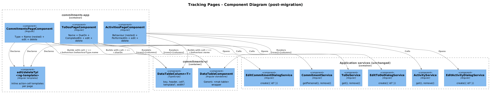
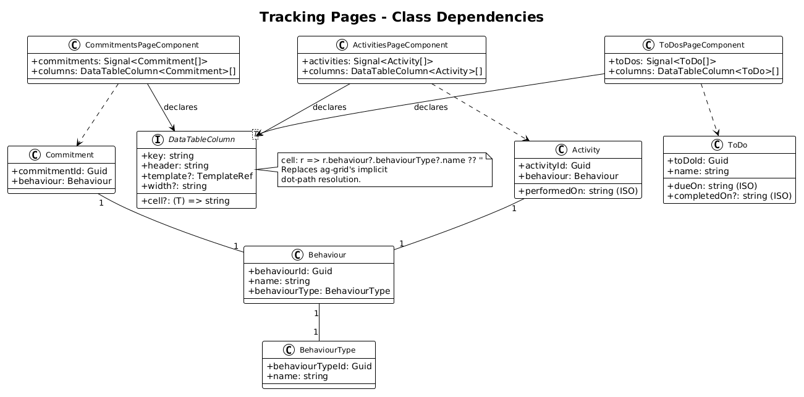
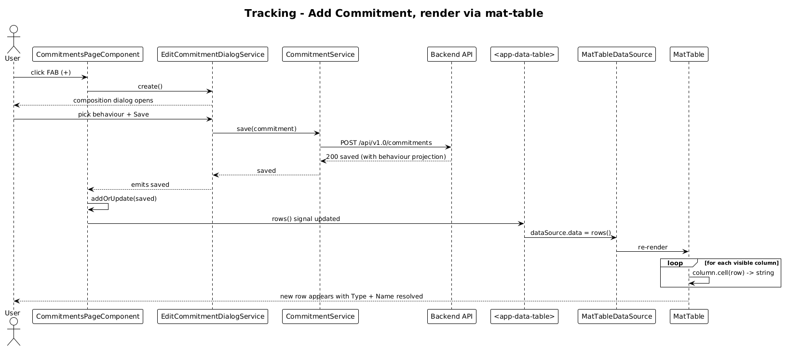

# Tracking Mat-Tables — Detailed Design

**Status:** Draft

**Traces to:** L2-009 — L2-011 (Commitments), L2-016 (To-Dos), L2-012 (Activities).

## 1. Overview

Three pages display **tracking data** with multiple text columns including nested-path accessors and date fields. They differ from the simple catalog tables (delta 19) in two ways:

1. They project **2 — 3 data columns**, not just `Name`.
2. At least one column reads a **nested path** (`behaviour.behaviourType.name`, `behaviour.name`) or a **date field** (`dueOn`, `completedOn`, `performedOn`).

| Page | Component | Columns (today, ag-grid) |
|---|---|---|
| Commitments | `CommitmentsPageComponent` | Type → `behaviour.behaviourType.name` · Name → `behaviour.name` · Edit · Delete |
| To-Dos | `ToDosPageComponent` | Name · Due On · Completed On · Edit · Delete |
| Activities | `ActivitiesPageComponent` | Behaviour → `behaviour.name` · Performed On · Edit · Delete |

**Actors:** authenticated end user.

**Scope boundary:** template + component refactor only. The composition / add dialogs (`EditCommitmentDialogService`, `EditToDoDialogService`, `EditActivityDialogService`) and the underlying services are unchanged.

## 2. Architecture

### 2.1 C4 Component


Same shape as the simple-catalog migration but with column descriptors that carry a **`cell` accessor function** instead of relying on `field` for nested paths.

## 3. Component Details

### 3.1 Nested-path accessor

Ag-grid resolves dot-paths (`field: 'behaviour.behaviourType.name'`) automatically. `MatTable` does not. The shared `DataTableColumn` descriptor (delta 18) supports a `cell?: (row: T) => string` accessor — every nested column declares one explicitly:

```ts
public columns: DataTableColumn<Commitment>[] = [
  { key: 'type', header: 'Type', cell: r => r.behaviour?.behaviourType?.name ?? '' },
  { key: 'name', header: 'Name', cell: r => r.behaviour?.name ?? '' },
  { key: 'edit',   header: '', template: this.editTpl,   width: '50px' },
  { key: 'delete', header: '', template: this.deleteTpl, width: '50px' },
];
```

The optional-chain + `?? ''` guard preserves ag-grid's behaviour of rendering an empty cell when an intermediate object is missing — important when a commitment is created via the dialog and the `behaviour` projection has not yet been re-fetched.

### 3.2 Date-column rendering

Ag-grid renders `Date | string` values via `String(value)`. Today the To-Dos and Activities columns simply bind `field: 'dueOn'` etc. and the API returns ISO strings, so cells display unformatted ISO timestamps.

This slice **preserves the current ISO display** — applying a `DatePipe` is a UX change that belongs in a future delta. The accessor stays trivial:

```ts
{ key: 'dueOn', header: 'Due On', cell: r => r.dueOn ?? '' }
```

A follow-up ticket (out of scope here) can add `cell: r => this.dateFmt.transform(r.dueOn, 'mediumDate') ?? ''` once the desired format is agreed.

### 3.3 Per-page deltas

#### CommitmentsPageComponent
- Drop: `AgGridModule`, `ColDef`, `GridApi`, `frameworkComponents`, `_gridApi`, `onGridReady`.
- Add: `DataTableComponent`, `editTpl`, `deleteTpl` view children, `columns: DataTableColumn<Commitment>[]`.
- Template: replace `<ag-grid-angular>` with `<app-data-table [rows]="commitments()" [columns]="columns" [pageSize]="5">`.
- L2-011 AC #4 ("FAB opens new commitment dialog"): the `<button mat-fab>` element stays exactly where it is, outside the table.

#### ToDosPageComponent
- Same structural diff as Commitments.
- Three text columns instead of two (`name`, `dueOn`, `completedOn`).
- The constructor's `this.handleRemoveToDoCellClick = this.handleRemoveToDoCellClick.bind(this)` line is no longer required because the new template binding closes over `this` lexically — drop it.

#### ActivitiesPageComponent
- Same structural diff.
- Two text columns (`behaviour.name`, `performedOn`).

## 4. Data Model

### 4.1 Class Diagram


The class diagram highlights the `DataTableColumn` descriptor's `cell` accessor as the migration's load-bearing addition for these three pages.

## 5. Key Workflows

### 5.1 Add a Commitment (representative)


The user-visible flow is identical to today; only the row-rendering hop changes.

1. User clicks the FAB → `handleFABButtonClick()` → `EditCommitmentDialogService.create()` → existing dialog opens.
2. On Save, the dialog returns the new `Commitment`. The page's `addOrUpdate` patches the signal.
3. `<app-data-table>` resolves the new row's `Type` and `Name` columns via the new `cell` accessors.

### 5.2 Delete

Identical to delta 19. `handleRemoveClick({ data: row })` → optimistic signal filter → service `remove(...)`.

## 6. API Contracts

None — pure rendering refactor.

## 7. Security Considerations

- Optional-chaining the nested accessors prevents a missing-`behaviour` reference from throwing during table render — important during the brief window after a dialog returns a partial entity. No security implication, but worth calling out for code reviewers.
- No raw HTML is injected. Cells go through `{{ }}` text-binding.

## 8. ATDD Slices

1. **Activities** (smallest column count among the three, single nested path) — a clean smoke test for the `cell:` accessor pattern.
2. **To-Dos** — three flat text columns + the binding-cleanup tweak.
3. **Commitments** — two nested paths (`behaviour.behaviourType.name`, `behaviour.name`); validates the optional-chain pattern under the deepest path.

Each PR re-runs the existing page-level Jest spec and adds one assertion that the nested column renders the expected text for a row whose `behaviour` is fully populated.

## 9. Open Questions

- **Date formatting**: the tracking pages currently show ISO strings in `dueOn` / `completedOn` / `performedOn`. Carrying that forward is a deliberate non-change here. A separate slice should apply `DatePipe` once a format is chosen — recommend `'mediumDate'` for date-only fields (`dueOn`, `completedOn`) and `'short'` for `performedOn`.
- **Sortability**: ag-grid implicitly allowed click-to-sort on column headers. None of these three pages enabled it explicitly today (default behaviour) and the L2 specs do not require it — defer.
