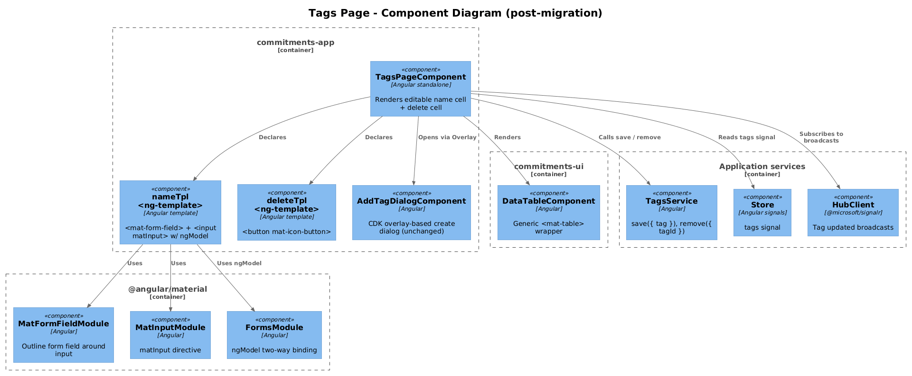
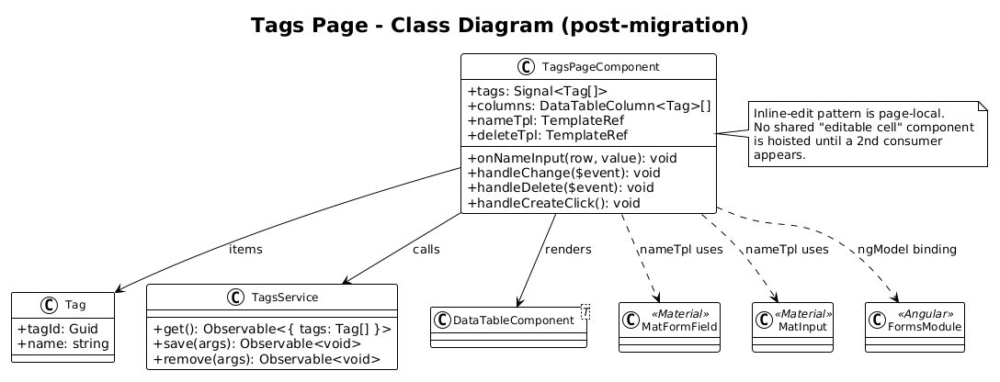
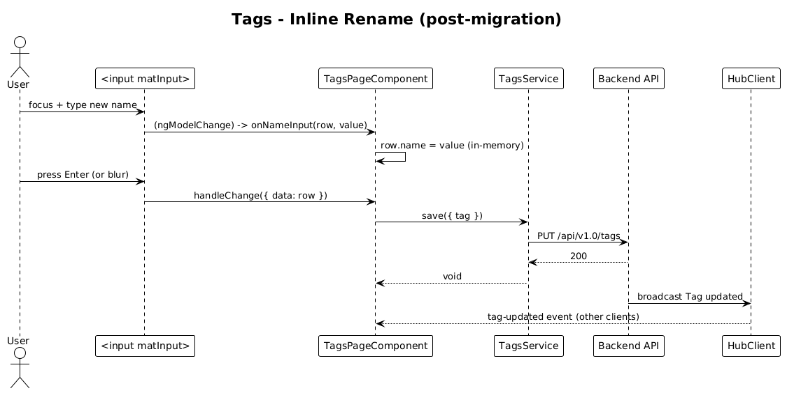

# Tags Mat-Table — Detailed Design

**Status:** Draft

**Traces to:** L2-015 (Tags catalog).

## 1. Overview

The Tags page (`pages/tags`, route `/tags`) is the **only** ag-grid surface that uses **inline cell editing**. The current `name` column declares `editable: true` and reacts to ag-grid's `onCellValueChanged` to persist the rename via `TagsService.save({ tag })`.

`<mat-table>` has no built-in inline-edit primitive comparable to ag-grid's. This slice replaces it with an explicit pattern: the cell renders a Material **`<input matInput>`** that two-way-binds to `row.name` and dispatches the save on blur (or Enter).

**Actors:** authenticated end user managing tag names.

**Scope boundary:** template + component + new edit cell. Service (`TagsService`), Add Tag overlay (`AddTagDialogComponent`), and routing are unchanged.

## 2. Architecture

### 2.1 C4 Component


The Tags page becomes the only catalog page that hosts an `<input>` inside a table cell. The pattern is page-local — no shared "editable cell" abstraction is introduced; if a second page ever needs the same behaviour, hoist then.

## 3. Component Details

### 3.1 TagsPageComponent diff

**Imports** — drop `AgGridModule`, `ColDef`; add `DataTableComponent`, `MatFormFieldModule`, `MatInputModule`, `FormsModule`.

**Template** — replace `<ag-grid-angular>` with:

```html
<app-data-table [rows]="tags()" [columns]="columns" [pageSize]="5"></app-data-table>

<ng-template #nameTpl let-row>
  <mat-form-field appearance="outline" class="tag-name-input">
    <input matInput
           [ngModel]="row.name"
           (ngModelChange)="onNameInput(row, $event)"
           (blur)="handleChange({ data: row })"
           (keyup.enter)="handleChange({ data: row })" />
  </mat-form-field>
</ng-template>

<ng-template #deleteTpl let-row>
  <button mat-icon-button (click)="handleDelete({ data: row })">
    <mat-icon>close</mat-icon>
  </button>
</ng-template>
```

**Component class** — replace `columnDefs` with:

```ts
@ViewChild('nameTpl',   { static: true }) nameTpl!:   TemplateRef<{ $implicit: Tag }>;
@ViewChild('deleteTpl', { static: true }) deleteTpl!: TemplateRef<{ $implicit: Tag }>;

public columns: DataTableColumn<Tag>[] = [
  { key: 'name',   header: 'Name', template: this.nameTpl },
  { key: 'delete', header: '',     template: this.deleteTpl, width: '40px' },
];

public onNameInput(row: Tag, value: string): void {
  row.name = value;             // mutates the in-memory tag — preserves the existing
                                // signal-update semantics (the array reference is unchanged
                                // but MatTableDataSource re-renders on its own row diff)
}

public handleChange($event: { data: Tag }) {
  this._tagsService.save({ tag: $event.data })
    .pipe(takeUntilDestroyed(this._destroyRef))
    .subscribe();
}
```

**Why blur/Enter, not every keystroke?**
Ag-grid fired `onCellValueChanged` only when the cell was committed (focus left or Enter pressed). Matching that timing avoids per-keystroke API spam — important because the Tags collection is small but every save is a network round-trip.

### 3.2 What is removed

- `editable: true` ag-grid column option.
- `onCellValueChanged` ag-grid hook.
- The translated-headers `_translateService.get([...])` block can stay or go: the post-migration table only needs the static `'Name'` literal that the existing `columnDefs` already declares as a fallback. **Recommend dropping** the translateService block entirely in this PR — the literal `'Name'` was already what shipped, since the translation block fired *after* the initial column setup.

### 3.3 What is kept verbatim

- `handleCreateClick()` and the CDK overlay setup for the Add Tag dialog.
- `_store.tags` signal binding.
- `HubClient` integration (untouched — outside the table surface).

## 4. Data Model

### 4.1 Class Diagram


No domain or schema change. Diagram shows the new dependency graph: the page now depends on `MatFormField` + `MatInput` + `FormsModule` for the editable cell.

## 5. Key Workflows

### 5.1 Inline rename


1. User clicks the name input → focus enters the cell.
2. User types a new name. `(ngModelChange)` mutates `row.name` in memory.
3. User presses Enter or tabs/clicks away. `(keyup.enter)` or `(blur)` fires `handleChange({ data: row })`.
4. `TagsService.save({ tag })` issues `PUT /api/v1.0/tags`.
5. Backend `HubClient` may broadcast a tag-updated event; the existing store subscription updates other clients.

### 5.2 Delete

Identical to delta 19 — close icon → optimistic store update → service call.

## 6. API Contracts

None new — relies on existing `TagsService.save(...)`.

## 7. Security Considerations

- **Unbounded input length**: today the cell relied on ag-grid's text editor with no max-length. Recommend adding `maxlength="120"` to the `<input matInput>` (consistent with other Material text inputs in the app and with the `Tag.Name` column constraint on the backend).
- **Optimistic mutation**: the implementation mutates `row.name` in place before the save resolves. If the save fails, the on-screen value drifts from the server. For v1, surface a snackbar on save error (see Open Questions).

## 8. ATDD Slices

1. **Slice A — table swap**: replace `<ag-grid-angular>` with `<app-data-table>` and the editable cell template; verify the existing rename flow still POSTs the same payload (Jest spec asserting `tagsService.save` is called with the mutated tag on blur).
2. **Slice B — error path**: add a snackbar on save failure (`This.snackBar.open('Tag rename failed', null, { panelClass: 'snackbar--error' })`). Optional — could land in a follow-up.

## 9. Open Questions

- **Translation re-introduction**: the historical `_translateService.get([...])` rebuilt `columnDefs` after translation resolved. If translations of `Name` are required, the cleanest replacement is `header: this.translate.instant('Name')` evaluated in `ngOnInit` after `_translateService.use(...)` settles. None of the active locales appear to translate `Name`, so leaving it as a literal is acceptable.
- **Inline validation**: should empty rename revert silently or show an error? Today ag-grid silently committed empty names. Recommend adding `[required]` + a snackbar on 400, but defer to a follow-up.
