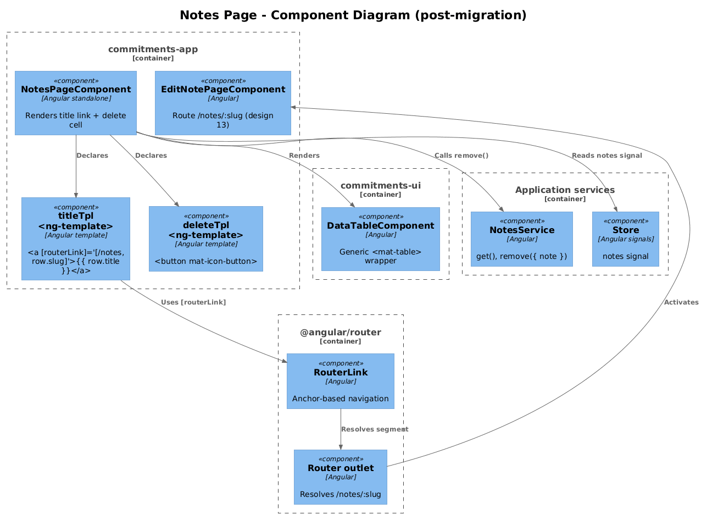
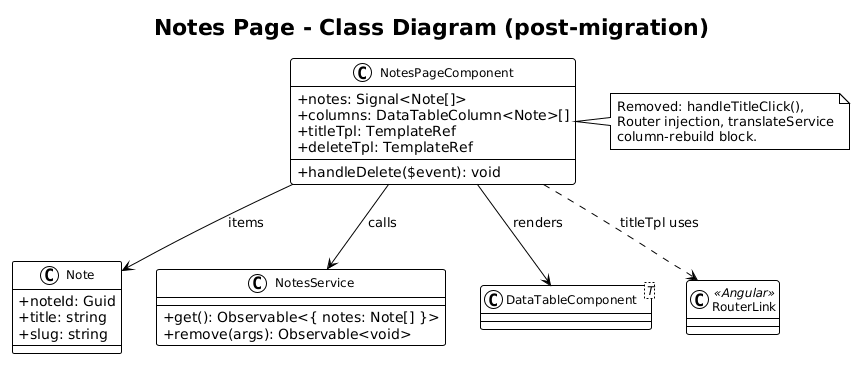
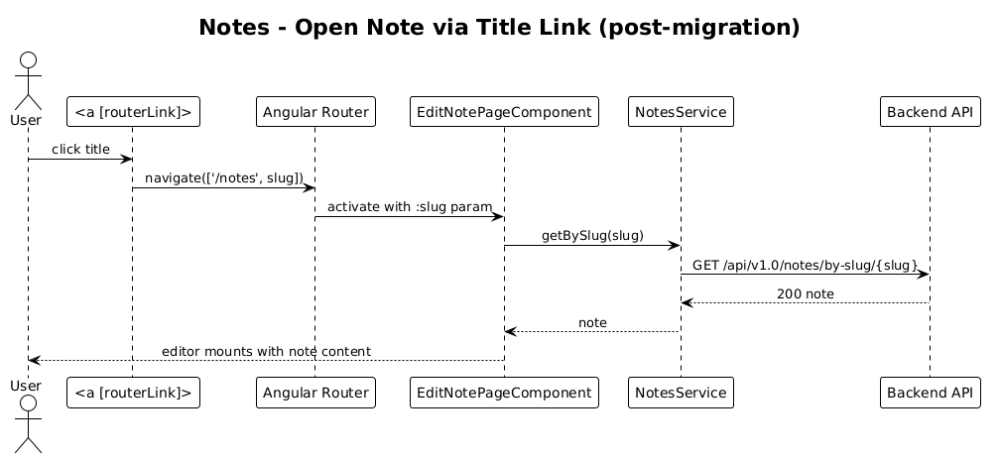

# Notes Mat-Table — Detailed Design

**Status:** Draft

**Traces to:** L2-014 (Notes catalog), L2-041 (note slug navigation).

## 1. Overview

The Notes page (`pages/notes`, route `/notes`) renders a single text column (`title`) that is **click-to-navigate**. Clicking a title routes to `/notes/<slug>` (the Edit Note feature, design 13). A delete cell finishes the row.

This slice migrates the surface from `<ag-grid-angular>` to `<app-data-table>` and replaces ag-grid's `onCellClicked` hook on the title cell with a router-link cell template.

**Actors:** authenticated end user.

**Scope boundary:** template + component refactor only. The `NotesService`, `Store.notes` signal, and the Edit Note route are unchanged.

## 2. Architecture

### 2.1 C4 Component


The notable difference from delta 19 is the **link cell** for the `title` column — a plain anchor with `[routerLink]` rather than an icon button.

## 3. Component Details

### 3.1 NotesPageComponent diff

**Imports** — drop `AgGridModule`, `ColDef`; add `DataTableComponent`, `RouterLink`.

**Template**:

```html
<app-primary-header>{{ "Notes" | translate }}</app-primary-header>

<section class="page-content-container">
  <app-data-table [rows]="notes()" [columns]="columns" [pageSize]="5"></app-data-table>
</section>

<ng-template #titleTpl let-row>
  <a class="note-title-link" [routerLink]="['/notes', row.slug]">{{ row.title }}</a>
</ng-template>

<ng-template #deleteTpl let-row>
  <button mat-icon-button (click)="handleDelete({ data: row })">
    <mat-icon>close</mat-icon>
  </button>
</ng-template>
```

**Component class**:

```ts
@ViewChild('titleTpl',  { static: true }) titleTpl!:  TemplateRef<{ $implicit: Note }>;
@ViewChild('deleteTpl', { static: true }) deleteTpl!: TemplateRef<{ $implicit: Note }>;

public columns: DataTableColumn<Note>[] = [
  { key: 'title',  header: 'Title', template: this.titleTpl },
  { key: 'delete', header: '',      template: this.deleteTpl, width: '20px' },
];
```

`handleTitleClick($event)` is **deleted** — `[routerLink]` replaces the imperative `_router.navigateByUrl(...)` call. This removes one `Router` injection from the page.

`_translateService.get(['Title','Page','of','to'])` is no longer needed (the `'Title'` literal is fine; `'Page','of','to'` were paginator labels that the mat-paginator handles via its own `MatPaginatorIntl` provider). The whole translate block is deleted.

### 3.2 Why `[routerLink]` over `(click)`

- Native `<a>` with `[routerLink]` gives users **right-click → "Open in new tab"** for free — a long-standing usability gap with ag-grid's `onCellClicked` approach.
- Removes the `Router` injection.
- Keeps keyboard navigation (Tab + Enter) working without any custom handling.

## 4. Data Model

### 4.1 Class Diagram


No domain change. Diagram shows the page swapping its `Router` dependency for an `<a>` template.

## 5. Key Workflows

### 5.1 Open a note


1. User clicks (or activates with keyboard) the title link.
2. Angular router resolves `/notes/<slug>` → `EditNotePageComponent` (design 13).
3. The page resolver loads the note and the editor mounts.

### 5.2 Delete a note

Identical to delta 19 — close icon → optimistic store update → `NotesService.remove(...)`.

## 6. API Contracts

None new.

## 7. Security Considerations

- The slug is interpolated into a `[routerLink]` array element, which the router treats as a path segment (URL-encoded by Angular). No XSS risk from a slug containing special characters.
- The title is rendered through `{{ row.title }}` text-binding — no `[innerHTML]`. Existing XSS posture preserved.

## 8. ATDD Slices

1. **Single PR** — the diff is small enough not to warrant splitting:
   - Replace `<ag-grid-angular>` with `<app-data-table>` and the title + delete templates.
   - Delete `handleTitleClick`, the `Router` injection, and the `_translateService.get([...])` block.
   - Update the existing Jest spec to assert that the title cell renders an `<a>` with `routerLink="/notes/<slug>"` rather than asserting the old `(click)` handler.

## 9. Open Questions

- **Spec-side router test**: the existing spec uses `RouterTestingHarness` (or equivalent) — verify the assertion path. If absent, add one.
- **Empty-state UX**: ag-grid showed an empty body. `MatTable` likewise renders empty — fine for v1. A "No notes yet" empty-state is a UX improvement worth tracking, but not in this slice.
