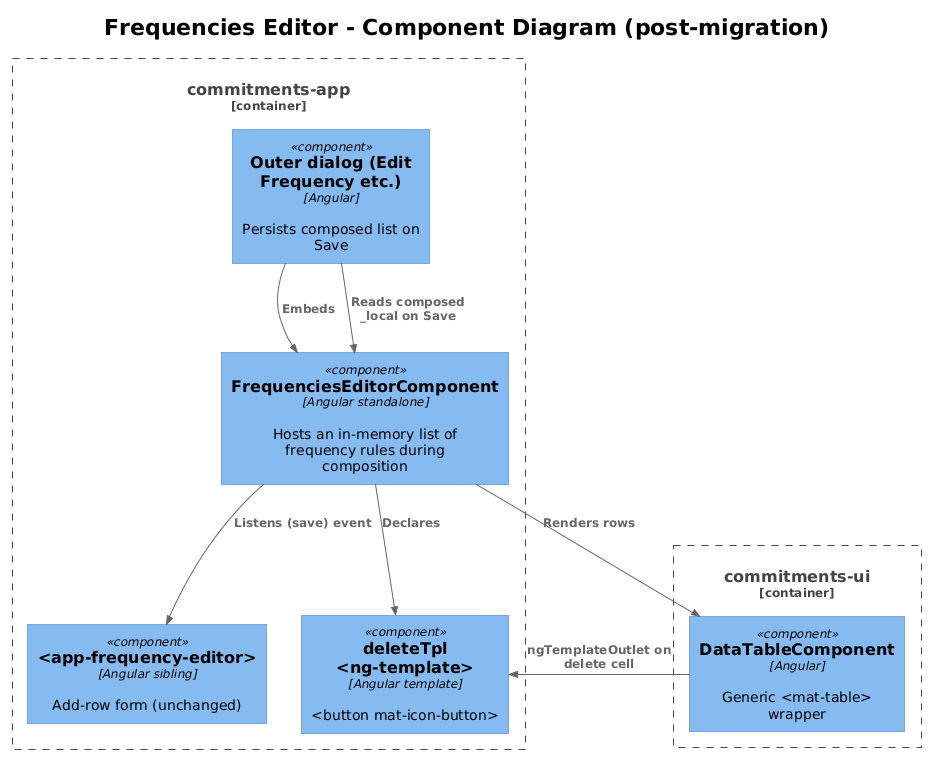
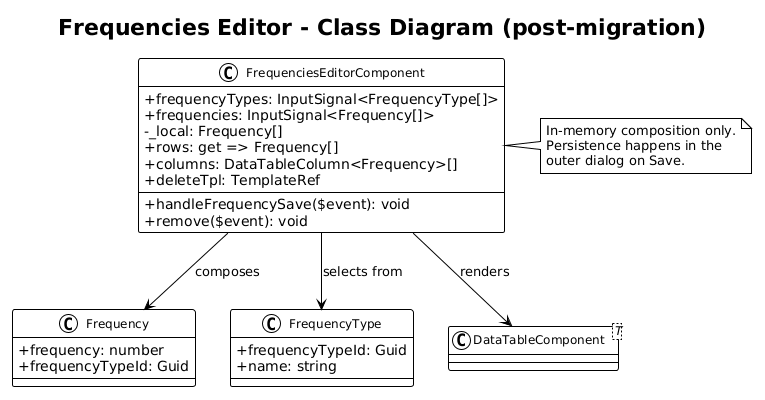
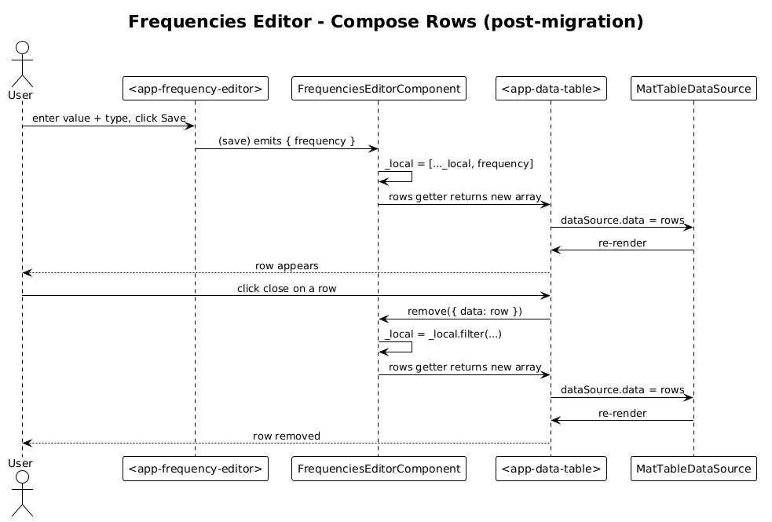

# Frequencies Editor Mat-Table — Detailed Design

**Status:** Draft

**Traces to:** L2-007 (Frequencies — embedded editor inside the Edit Frequency dialog flow), L2-008.

## 1. Overview

`FrequenciesEditorComponent` is **not a page** — it is an embedded editor used inside the Edit Frequency / Edit Behaviour Type composition surfaces. It hosts a small `<ag-grid-angular>` that lists in-memory frequency rows (a value the user is composing locally before save), with a delete cell, and pairs with a sibling `<app-frequency-editor>` that adds new rows.

Because this grid is **not** a paginated catalog — it is a transient list under composition — it gets a slightly different treatment from the catalog pages. It still flips to `<app-data-table>` for consistency (and so it deletes the same `DeleteCellComponent` reference), but with `pageSize` larger than the typical row count.

**Actors:** authenticated end user, mid-composition.

**Scope boundary:** the embedded grid only. The sibling `<app-frequency-editor>` (which adds rows) is unchanged.

## 2. Architecture

### 2.1 C4 Component


The `FrequenciesEditorComponent` is a leaf consumer of `DataTableComponent` from delta 18. It holds an in-memory `_local: Array<Frequency>` rather than a signal — the migration does **not** change that, to keep the diff minimal.

## 3. Component Details

### 3.1 FrequenciesEditorComponent diff

**Imports** — drop `ColDef` from `ag-grid-community` and `DeleteCellComponent`; add `DataTableComponent`.

**Template (`frequencies-editor.component.html`)**:

```html
<app-frequency-editor [frequencyTypes]="frequencyTypes()"
                      (save)="handleFrequencySave($event)">
</app-frequency-editor>

<app-data-table [rows]="rows" [columns]="columns" [pageSize]="20"></app-data-table>

<ng-template #deleteTpl let-row>
  <button mat-icon-button (click)="remove({ data: row })">
    <mat-icon>close</mat-icon>
  </button>
</ng-template>
```

**Component class**:

```ts
@ViewChild('deleteTpl', { static: true }) deleteTpl!: TemplateRef<{ $implicit: Frequency }>;

public columns: DataTableColumn<Frequency>[] = [
  { key: 'frequency',     header: 'Frequency',      cell: r => `${r.frequency}` },
  { key: 'frequencyTypeId', header: 'Frequency Type', cell: r => r.frequencyTypeId },
  { key: 'delete',        header: '',                template: this.deleteTpl, width: '40px' },
];
```

`onGridReady`, `localeText`, and the `cellRenderer: DeleteCellComponent` ag-grid descriptor are dropped.

### 3.2 Why `pageSize: 20` instead of `5`

A frequency rule typically has < 7 rows (one per frequency type). The catalog default of 5 would expose an unnecessary paginator. Setting it to 20 effectively hides the paginator while still using the same wrapper. Open Question #1 below proposes a `[hidePaginator]` input as a follow-up if more consumers want this.

### 3.3 In-memory row mutation

The component still mutates `_local` via `[..._local, $event.frequency]` (immutable add) and `_local.filter(...)` (immutable remove). Both produce a new array, which `MatTableDataSource.data = rows` re-binds correctly. **No semantic change** — the existing `get rows()` accessor is fine because `DataTableComponent` reads via `input<T[]>` and re-evaluates on every change-detection cycle.

> The component currently uses a plain getter, not a signal. `input()` will compare the array reference each cycle and only re-render when it changes — which is exactly the behaviour we want, given the immutable mutation pattern above.

## 4. Data Model

### 4.1 Class Diagram


No domain change. Diagram shows the editor's relationship with the surrounding `<app-frequency-editor>` save event.

## 5. Key Workflows

### 5.1 Add then remove a frequency row


1. User picks a value + type in the inner `<app-frequency-editor>` and presses Save.
2. `handleFrequencySave($event)` appends to `_local`.
3. `<app-data-table>` re-renders with the new row.
4. User clicks close → `remove({ data: row })` filters `_local`.
5. Re-render. The outer dialog's Save button persists `_local` to the backend (existing flow).

## 6. API Contracts

None — composition is local until the parent dialog saves.

## 7. Security Considerations

- `Frequency.frequency` is a number; `frequencyTypeId` is a Guid. Both render through `{{ }}` text-binding. No XSS surface.

## 8. ATDD Slices

1. **Single PR** — replace `<ag-grid-angular>` with `<app-data-table>`, drop `ColDef` + `DeleteCellComponent` import, add `deleteTpl`. Update the component's existing Jest spec to assert `<app-data-table>` is present.

## 9. Open Questions

- **`[hidePaginator]` input**: this consumer wants a tiny pagination-free table. Currently we paper over this with `pageSize: 20`. If a second consumer needs the same, add `hidePaginator: input<boolean>(false)` to `DataTableComponent`. Defer until then.
- **Type-name lookup**: the current grid renders `frequencyTypeId` (a Guid) directly, which is hostile UX. The migration **does not fix this** — the same Guid appeared in the ag-grid implementation. Recommend a follow-up that joins with `frequencyTypes()` to render the type name.
